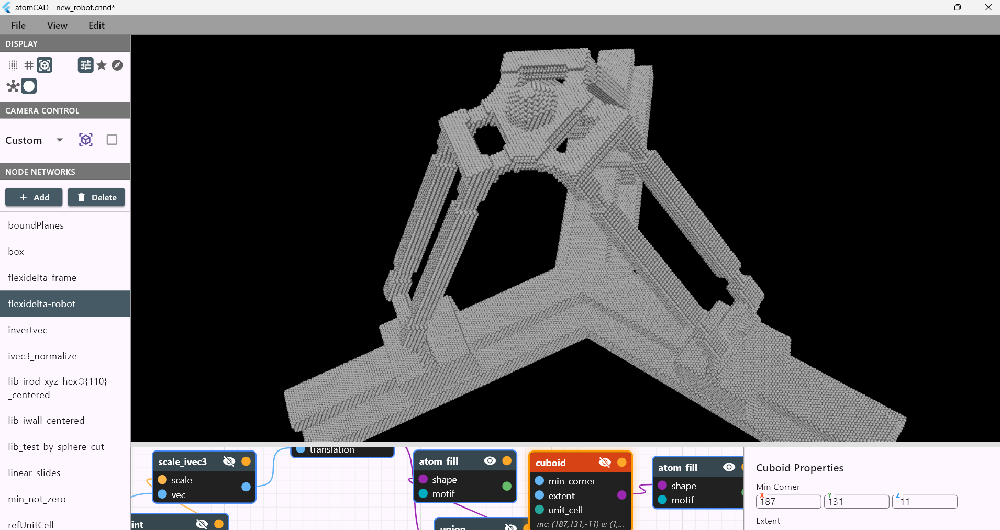
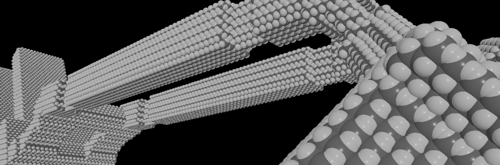

# atomCAD

atomCAD is a CAD application for Atomically Precise Manufacturing (APM).
With atomCAD you can design arbitrary covalently bonded atomic structures that are constrained to a crystal lattice and suitable for physical (and, in the future, manufacturable) workflows.

## Download

**Latest Release: [v0.0.3](https://github.com/atomCAD/atomCAD/releases/tag/v0.0.3)**

## Features

- **Arbitrary unit cells.** Any unit cell defined by the lattice parameters `(a, b, c, α, β, γ)` is supported. The implied crystal system (*cubic, tetragonal, orthorhombic, hexagonal, trigonal, monoclinic, triclinic*) and its symmetries are automatically determined.
- **Lattice-constrained geometry.** Geometries are created relative to the unit cell lattice, and operations on those geometries preserve lattice constraints. This makes it easier to design atomic crystal structures that are aligned, physically accurate, and manufacturable.
- **User-definable motifs.** Geometries can be filled with motifs to create atomic structures. Motifs are user-definable: any covalently bonded crystal structure can be specified. The default motif is cubic diamond.
- **Parametric, composable designs.** atomCAD designs are parametric and composed as visual node networks, enabling non-destructive editing. Custom node types can be created by defining subnetworks. The node network includes functional-programming primitives for complex programmatic designs.

Planned features include:

- Surface reconstruction support
- Defect editing and placement tools
- Atomically Precise Manufacturing (APM) integration
- A streaming level-of-detail system to support larger structures that currently do not fit in memory
- Geometry optimization and dynamics simulation support

We’d love to hear about your use case: what are you using — or planning to use — atomCAD for?

## Tutorials and Reference Guide

If you are new to atomCAD check out the [atomCAD Basic Tutorial](./doc/atomCAD_basic_tutorial.md) and the [atomCAD Part Design Tutorial](./doc/part_design_tutorial.md) (in this order).

For more details see [atomCAD Reference Guide](./doc/atomCAD_reference_guide.md).

## Demos

Check out the [atomCAD Demo Files](./samples/demo_description.md) to see some examples of what you can do with atomCAD.

### Demolib

The `demolib` folder contains three things:   
★ (1) An example library of reusable geometries.  
– Particularly useful: Infinitely long rods ("irods") of ehaustive types.  
– For infos to that library see page: [library overview and design decisions](./demolib/example-lib_design-decisions.md)  
★ (2) Some demos showcasing library usage for structures of varying complexity  
… including some simple composite geometries and   
… interlocking racks potentially relevant for future atomically precise manufacturing   
– The page [demo descriptions](./demolib/example-lib_demo-descriptions.md) holds explanations to the motivations and decisions behind these demos. It covers some possible (vdW force employing) design principles for achieving some things like:  
– V and W shapes for self-centering to equilibrium distance   
– incommensurate alignment for superlubric sliding  
– setup for crystal structure transitions (early)  
★ (3) [Orientation help info for finding the desired miller indieces](./demolib/miller-index_helpers-for-orientation.md).  

Above is a collage of the demos descibed in [(demo descriptions)](./demolib/example-lib_demo-descriptions.md)  
Demos based on the on the demo lib [(library overview and design decisions)](./demolib/example-lib_design-decisions.md)

## Conribute

**Interested in contributing?**  
See our [developer documentation](./doc/for_developers.mid) to get started.
