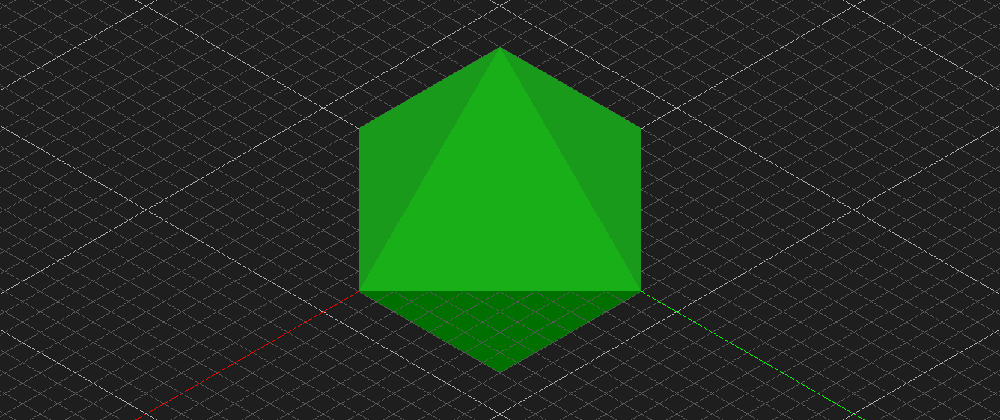
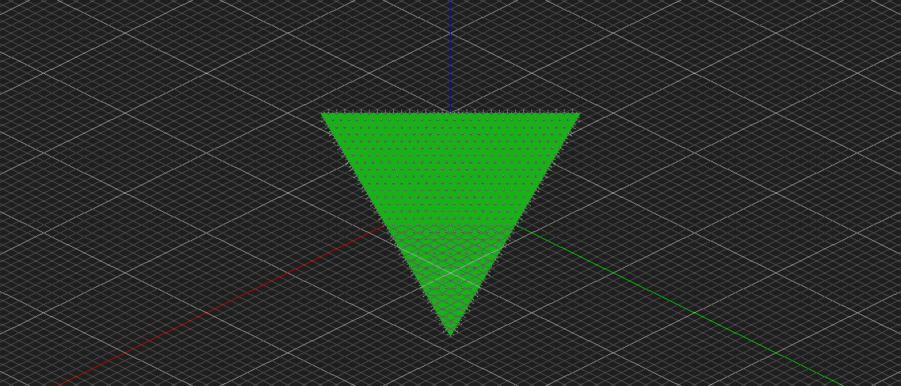
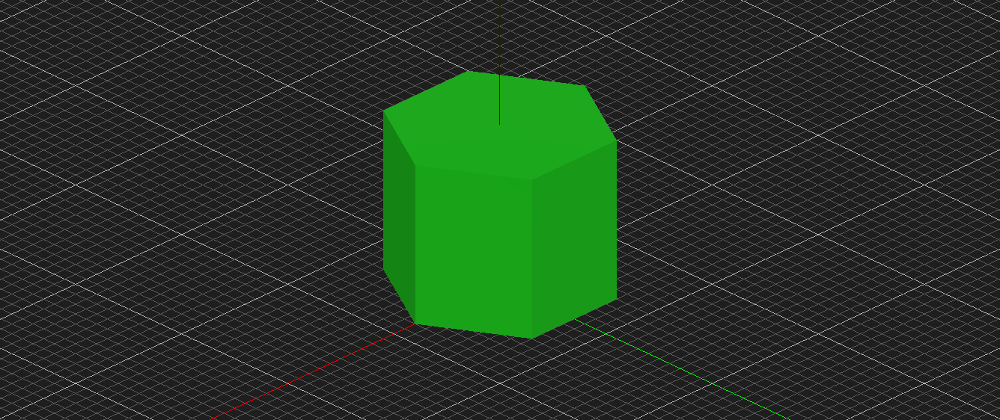
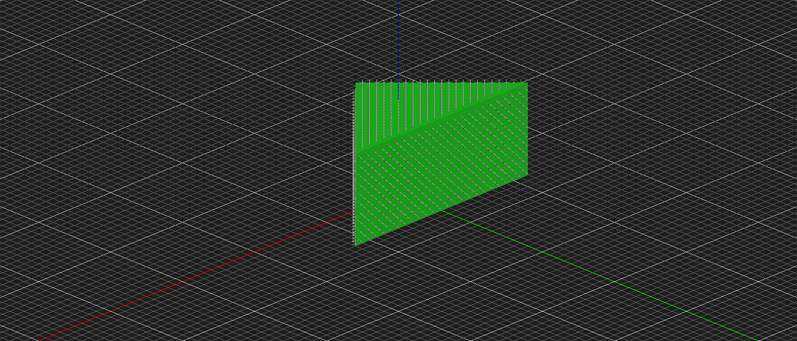
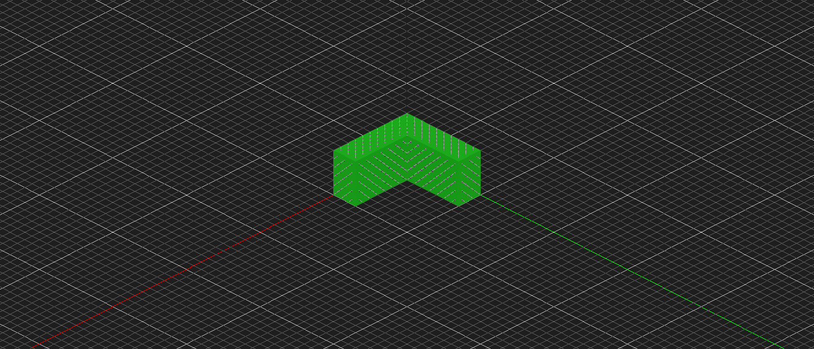
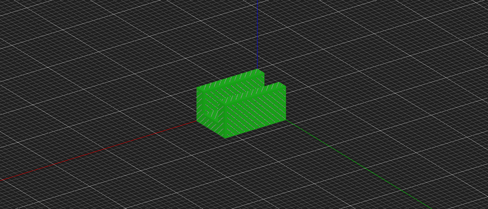
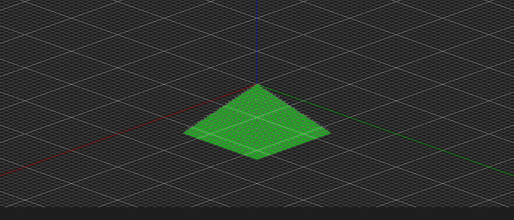
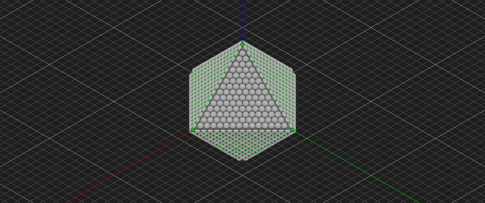

# atomCAD Custom Node Library Showcase

A collection of parametric building blocks for designing diamond nanostructures. These custom nodes are reusable primitives that can be composed to create complex atomic structures.

All geometries are designed to respect the cubic diamond crystal lattice, using crystallographic planes ({111}, {100}, {110} families) for clean, stable surfaces.

---

## Platonic Solids

### Octahedron

Eight-faced solid bounded by {111} crystal planes - a natural form for diamond.



**Parameters:**
| Parameter | Type | Description |
|-----------|------|-------------|
| `size` | Int | Distance from center to each face |

**Usage:**
```
shape = octahedron { size: 8 }
```

**Construction:** Intersection of 8 half-spaces with Miller indices covering all {111} permutations: (1,1,1), (-1,-1,-1), (1,1,-1), (-1,-1,1), (1,-1,1), (-1,1,-1), (-1,1,1), (1,-1,-1).

---

### Tetrahedron

Four-faced solid from {111} planes - the simplest Platonic solid, with natural diamond symmetry.



**Parameters:**
| Parameter | Type | Description |
|-----------|------|-------------|
| `size` | Int | Distance from center to each face |

**Usage:**
```
shape = tetrahedron { size: 8 }
```

**Construction:** Intersection of 4 half-spaces: (1,1,1), (-1,-1,1), (-1,1,-1), (1,-1,-1).

---

## Prisms

### Hexagonal Prism

Six-sided column - useful for shafts and structural elements.



**Parameters:**
| Parameter | Type | Description |
|-----------|------|-------------|
| `radius` | Int | Distance from center to edge |
| `height` | Int | Vertical extent |

**Usage:**
```
shape = hexprism { radius: 8, height: 12 }
```

**Construction:** Regular 6-sided polygon extruded along the z-axis.

---

### Wedge

Triangular prism - a fundamental structural shape.



**Parameters:**
| Parameter | Type | Description |
|-----------|------|-------------|
| `size` | Int | Triangle size (shift distance for half-planes) |
| `height` | Int | Extrusion height |

**Usage:**
```
shape = wedge { size: 6, height: 10 }
```

**Construction:** Three `half_plane` nodes intersected to form a triangle, then extruded. Uses wireable `m_index` parameters for full parametric control.

---

## Structural Elements

### L-Bracket

Corner structural element for joining perpendicular members.



**Parameters:**
| Parameter | Type | Description |
|-----------|------|-------------|
| `length` | Int | Length of each arm |
| `width` | Int | Depth (z-extent) |
| `thickness` | Int | Wall thickness of arms |

**Usage:**
```
shape = l_bracket { length: 10, width: 5, thickness: 3 }
```

**Construction:** Union of two overlapping cuboids. Uses `ivec3` nodes to wire parameters into cuboid extents.

---

### Channel

U-shaped trough for guides, tracks, or structural channels.



**Parameters:**
| Parameter | Type | Description |
|-----------|------|-------------|
| `length` | Int | Length along the channel |
| `width` | Int | Total width |
| `height` | Int | Total height |
| `wall` | Int | Wall and floor thickness |

**Usage:**
```
shape = channel { length: 12, width: 8, height: 6, wall: 2 }
```

**Construction:** Boolean difference of outer and inner cuboids. Uses `expr` nodes to compute inner dimensions: `inner_width = width - 2*wall`, `inner_height = height - wall`.

---

### Pyramid Tip

Four-sided pyramid with sharp apex - useful for probes, tips, or decorative elements.



**Parameters:**
| Parameter | Type | Description |
|-----------|------|-------------|
| `size` | Int | Base depth (distance from apex to base plane) |

**Usage:**
```
shape = pyramid_tip { size: 8 }
```

**Construction:** Four {101}-family half-spaces meeting at apex (origin): (1,0,1), (-1,0,1), (0,1,1), (0,-1,1), plus a base plane at z = -size.

---

## Visualization Styles

atomCAD supports multiple visualization modes. Here's the octahedron shown in different styles:

| Ball-and-Stick | Space-Filling |
|----------------|---------------|
|  |  |

**Ball-and-stick** shows individual atoms as small spheres with bonds as cylinders - good for seeing atomic structure.

**Space-filling** uses van der Waals radii - shows the actual volume occupied by atoms.

---

## Technical Notes

- **Coordinates are in lattice units** - cubic diamond has ~3.567 angstroms per lattice unit
- **All nodes output `Geometry`** - use `atom_fill` to convert to atomic structures
- **Recommended atom_fill settings:** `passivate: true` (hydrogen termination), `rm_single: true` (remove unstable atoms)

---

## Future Directions

**Short-term:** Complete the structural primitives library with dovetail joints (male and female), stepped shafts, and slot/keyway features. These interlocking elements will enable designing assemblies where parts fit together with atomic precision.

**Medium-term:** Explore Archimedean solids like the cuboctahedron (combining {100} and {111} facets) and create hollow variants of existing shapes - tetrahedral frames, bearing races, and tubes. This will test the limits of minimum wall thickness and help establish design rules for mechanically robust nanostructures.

**Long-term:** Design functional nanomachine components - gears with atomically precise teeth, ratchet mechanisms, and sliding interfaces. The ultimate goal is a library of parts that could theoretically be manufactured via mechanosynthesis and assembled into working molecular machines. Key research questions include: How do different crystal facets affect friction and wear? Can we design interlocking parts that self-align during assembly? What are the practical limits of feature size in diamond nanostructures?

---

*Generated from the atomCAD AI Playground research project, 2026-01-26*
