# Demo descriptions

For details on the underlying demo lib see [here](example-lib_design-decisions.md).  

## demo_irods_all

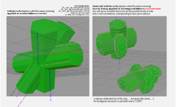

This demo node network is meant to demonstrate all the irod types in one single place.  
For testing infinit reach is culled finite by a sphere cut for better viewability.     
**```lib_test-by-sphere-cut```**  
The same is done in the individual lib_irod_… definitions.  
 
A **design decision** for the irods was to **always intersect just two walls**.  
– intersecting more could lead to cases where one wall has surfaces so far out  
that they do not contribute to the intersection and are thus invisible.  
– this is a minimal gradual buildup from halfspaces and lib_iwall_…s  
  
An exception is the equilateral hexagon,  
where the equilaterality makes sure all intersections lead to surfaces.  
 
There is also the left and right facing tiangles     
– lib_irod_xyz_triangleleft◁{110}   
– lib_irod_xyz_triangleright▷{110}  
that are not included in this demo.  
And their composite   
– lib_irod_xyz_triangintersect▷◁{110}  
which is violating the rule of  
averting possibly varnishing surfaces depending on parameter choice.  
This type of irod seems useful thus the tradeoff.    

What happens if one applies the lib that is meant for cubic   
to hexagonal instead is shown in:  
**demo_wurtzite&lonsdaleite_lib-(ab)use**

## demo_rackgear_x & related

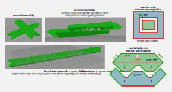

### Motivation

This demo features an actual "crystolecule" (crystal like molecule) nanopart  
that could perhaps be useful for signal and/or power transmission  
once it can be built (mechanosynthesized) eventually.

A for macroscale machinery unusual direct  
linear-rack to linear-rack gear meshing allows to do many of the same things  
that one can do when meshing with classical rotational gears together.  
(Teaser: Even differentials can be done using a "2D-floating" element.)  
An obvious constraint is that there can't be unidirectional motions. Only …  
– linear reciprocative rather than  
– rotaive unidirectional (or rotative reciprocative) action.  
Electric analogy only AC no DC.  

The advantage of sticking to racks only as gears:  
They can be modeled in the framework of  
small basic unstrained crystal structures (unstrained "crystolecules")  
And these could be expected to be experimantally accessible earlier  
than strained (and more or less permanently stressed) rotative gear structures.  
Using atom rows  as teeth or approximating curved gear teeth.  

### Used library functions  

The base body is made using  
**```lib_irod_x_rect◇{110}_centered```**  
intersected with **```lib_iwall_positive```**  
  
The bottom-groove-cut to make the W-shape is made using  
**```lib_irod_x_rect◇{110}_centered```**  
intersected with **```lib_iwall_positive```**  
albeit more minimalistically ```lib_iedge_x_z_‹{110}```  
rotated appropriately would work too.  
   
The teeth are cut using   
**```lib_irod_xy_rhombic♢{111}_centered```**  
intersected with **```lib_iwall_positive```**  
    
The ends are made using  
**```lib_iedge_x_z_‹{110}```**  

The arrow tip is truncated a bit using a halfspace.  
(TODO update screencap)  

Using these base base lib functions rathe than just basic halfspaces  
– cuts the number of needed nodes roughly in half and  
– adds a bit of self documentation   

Side-note: One idea to get other transmissions ratios than 1:1  
while mainaining smooth tooth surfaces would be by  
insetting the teeth into slighty slanted lots on a holey sliding rod.  

### Empolyed design principles

Several design principles get employed in this demo.  

The bottom has a W-shape in its cross sectional profile  
This removes the problem of perfectly matching the width of  
the gear-rack into the width of an eventually added housing channel (TODO design such channels)  
A perfect match is otherwise impossible in a basic unstrained crystal structure due to atomistic granularity.  
The idea is that vdW forces pull the W rack in to the W guide  
selfcenteringly to equilibrium distance.  

It is not just one V-shape but two (a W-shape) as  
this makes it more stable against sideways loads  
Such loads can be expected when two racks cross-mesh.  
See: **```demo_rack_x_cross-assembly```**  

The meshing teeth have V shape too for the same reason. Self-centering.  
Note that the top lands of the teeth are culled shorter than the bottom lands  
such that only the sidewalls are what is contacting  
(contributing by far the most to the interaction).

For the **lengthwise assembly**  
See node network: **```demo_rack_x_linear-assembly```**  
There's a good chance that no dovetail interlocking is needed at all.  
That is the attractive vdW forces may suffice to hold them together.  

Again a self centering V-shape is used for sideways self-centering.  
No sideways loads are to expect here so no need for a W-shape.  
The vertical centering would be established by the rail (TODO not yet included).  
Hopefully overpowering these interfaces jumping into commensurate interdigitation vertically  
which would make for an undesired small vertical displacement  
in the elongating connections of the rack-segments.  

For intuition vdW forces may be about ~100x less energetic  than covalent bonds  
but since we are dealing with areas here that makes a mere patch of  
about 10x10 atoms already act like a single covalent bond in terms of binding energy.  
Care must be taken when looking at energy, force, and stifness of a vdW contact.   
These may behave differently in theri relative sizes. 

There are **more design principles that employ vdW forces for benefits.**  
At these small scales VdW forces become very strong and ideally should be   
used as a friendly tool use rather than a foe to fight i.e. design around.  
These will be discussed in other examples.  

**A note on related physics:**

Small size (relative to the here alreay small nanoscale) is a double edged sword.  
A certain minimum size is needed to adhere well to the here presented design principles. This …  
– CON raises the atom count (more demanding on mechanosynthesis) but also   
– PRO makes the structures more stiff against larger scale excitations.  
Particularly thermal excitations. Which could be "squeezed out"  by much slower mechanical motion.  
Potentially leading to an undesired "accidental heatpump" effect.   
That may become relevant in the farther future. 

At operation speeds of 1…10mm/s  
as has been proposed for densely packed systems of higher volumes  
mechanical deformations from motions become invisibly small and highly masked by  
the thermal excitations matching the temperature of the system.  
Most molecular dynamics simulations floating around are  
at run vastly higher speeds of several 10m/s to 100m/s or above.  
Thus high-energy high-frequency ringing seen in slow-motion  
makes these nanostructures deceptively looking like the'd behave like jelly,  
which is very much not the case for proposed operation speeds.   

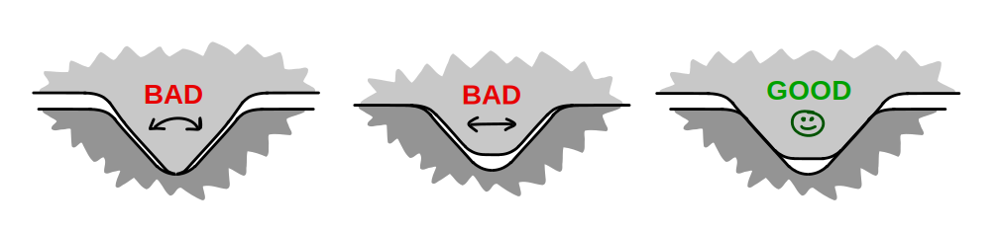   
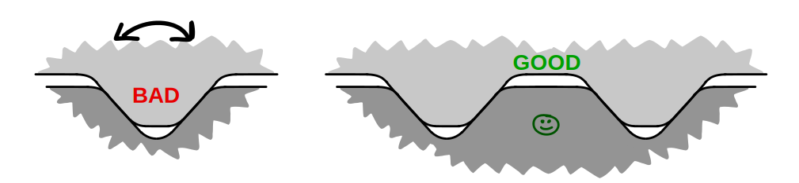     

## demo_crossintersect_method

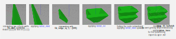   

Suitable infinite rods (irods) here in this example explicitly made  
by cross intersecting two infinite walls (iwalls) (**```lib_iwall_centered```**)  
are shifted and then cross-intersectied with quarter spaces (**```lib_iedge_xy_z_∟{100}```**)  
to make a cone like shape.  

This is a generally applicable method.  
It can be seen a bit like in the title image in the cover of  
the Gödel Escher Bach book ([GEB](Godel,_Escher,_Bach_(first_edition)--CC0-wikimedia.jpg)/[ambigram](3d-ambigram_CC-BY-SA-cmglee-(wikimedia).svg.png))

By branching the nodenetwork lines/noodles a copy of the cone is made and   
it is shifted up by (built in node) **lattice_move**.   
After transitioning out of the lattice space by applying (built in node) **atom_fill**   
or better the derived **atom_fill_halfshift** in order to   
avert getting CH<sub>3</sub> methyl termination at the (111) surfaces   
The distance can be further fine adjusted outside the lattice spacing by **atom_trans**.   

## demo_cube-from-three-iwalls

A very minimalistic demonstration of the crossintersect method   
intersecting three iwalls (**lib_iwall_positive**) to make a cube.   
There are sevral further alternatives to make a cube:   
* **lib_basepoly_cube**   
* the inbuilt **cuboid** node and    
* the inbuilt **facet** node that can all be used to make a cube via different pathways    
 
Side-node: The surface of the {100} cube faces of diamond need surface reconstruction   
to avoid hydrogen overcrowding. This is planned to be implemented.  

## demo_ioctettruss_node
  
  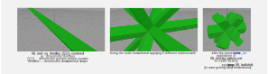
The octet truss is special in that it is unique as the the simplest space filling space-truss.  
space-truss as opposed to space-frame means that all nodes experience only tensile or compressive forces.  
There are no bending or torsion loads on the nodes.  
Using tetrahedra and octahedra to fill space the edges of these form the struts of the octet-truss.  
Octahedra and tetrahedra are both deltoidal polyhera which already act like a truss.  

This demo is just one node with infinitely long struts.  
It could be placed at lattice points of a large meta-lattice.  
Such a demo may be included later.  

```lib_irod_xy_rhombic♢{111}_centered```  
has been used as opposed to  
```lib_irod_xy_rect▭▯(00±1)(±1∓10)_centered```  
which goes the same xy direction  
but it avoids the {100} faces which need   
surface recnstrction for diamond as mentioned earlier.

## demo_motifs_wurtzite
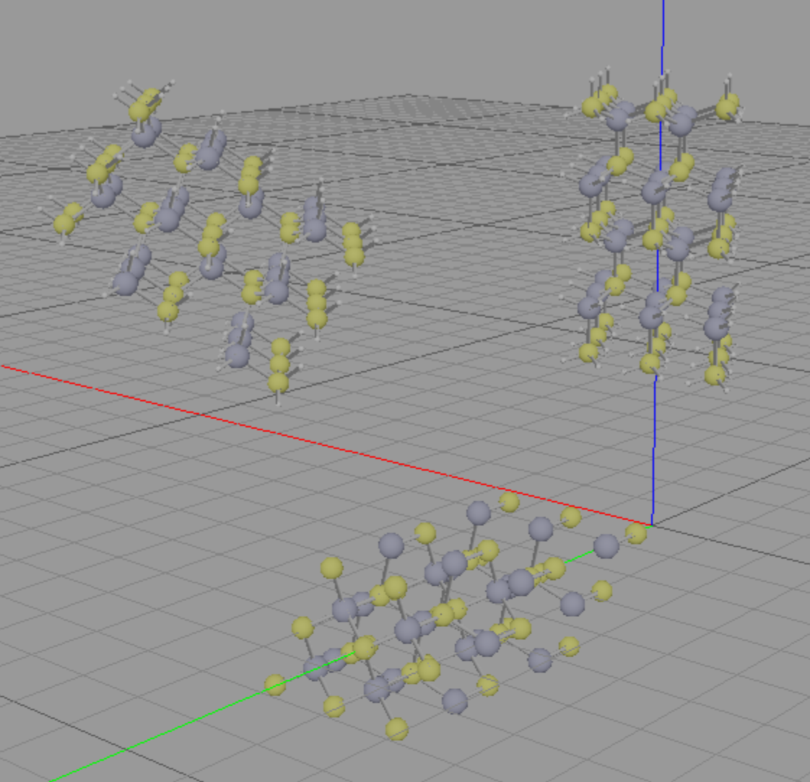


Cubic diamond and silicon and many III-V semiconductors have zinkblende (cubic ZnS) structure.  
ABCABC stacking in the ```[111]``` direction.

There is also the ABAB stacking variant making for a hexagonal unit cell.  
Lonsdaleite (hexagonal diamond) and wurtzite (hehaconal ZnS) have this structure.  

This demo demonstrates the wurtzite motif  
(i.e. where the atoms are in the unit cell in fractional coordinates)  
in the unit cell of wurtzite.    
With different placements in Cartesian base-space.  

Two embeddings in the underlying cartesian system are given.  
* c unit cell axis in Cartesian z axis  
* c unit cell axis in Cartesian y axis  
* c unit cell axis in Cartesian [111] direction  

The motivation for the last one being that   
ABAB and ABCABC satcking are properly aligned in space and  
cutting planes can eventually be migrated between   
– a cubic system and   
– a matching hexagonal system  
preserving the geometry rather than preserving their miller indices.  
**"plane migration"** (using conversion matrices).  

Side note: Moissanite   
(gem grade optically transparent silicon cabide) as synthesized today  
has more complex  stacking orders leading to lower rhombohedral symmety  
that could be woven in similarly.

## demo_zincblende-to-wurtzite-transition

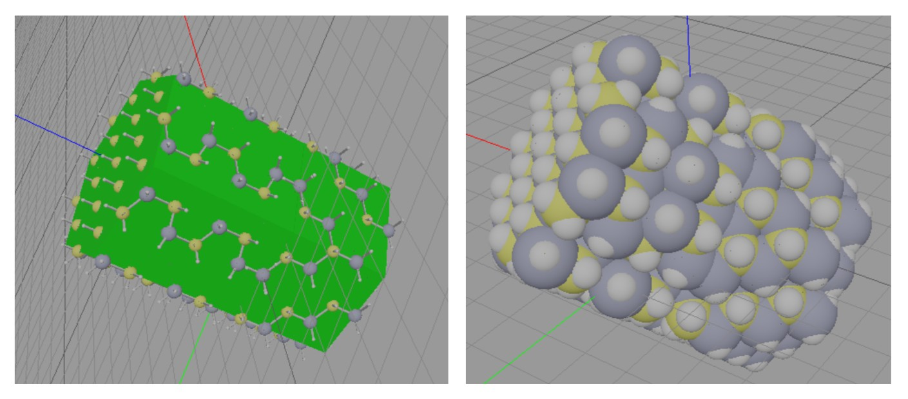
  
As suggested in the preceding section  
this demo combines two crystal lattices spaces matchingly.

Unit cells are paired with their matching motifs.  
Proper orientation if unit cells are picked.  
      
– unit-cell_wurtzite_triple-hex-R1-obverse  
– unit-cell_wurtzite_c-in-z  

– motif_zinkbkende_point-origin (the default)
– unit-cell_diamond_conventional (the default)
  
Avoid overlapping volumes. This in not checked for.   
An (upcoming) **atom_union** node will remove overlapping atoms.  
 
## demo_rhombicuboctahedron

See the dedicated page on miller indices [here](miller-index_helpers-for-orientation.md).  
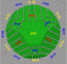  

Just a geometry for illustrating all the low miller index faces at once.

Also a helper tool to **find a miller index of a specific face**.  
One can find the index as such:  
– look isometrically down the [111] direction onto the triangular (111) octahedral face  
– imagine a normal vector on the desired face  
– check if that normal vectors x component is positive(+1) or negative(-1) or zero(0)  
… using the red x axis as reference  
– then do the same for green y axis  
– then the blue z axis  
– you got your miller index  

Side-note: This geometry   
(or any other including the lib_basepoly ones)  
could be used as a fancy point marker inead of a sphere.  

<!---orthogonal-directions.svg)  -->
<!---orthogonal-directions.svg)  -->
<!--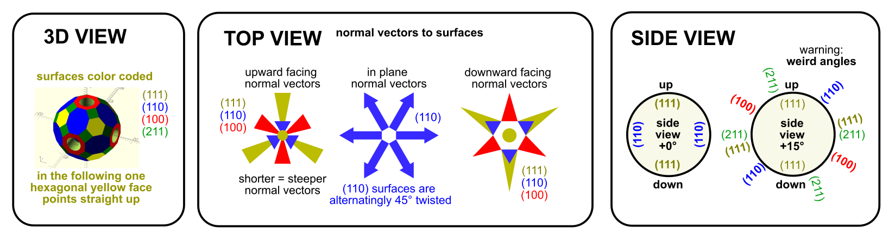  -->

## demo_selfcentercross

Same self centering principle used as in the other demo examples:  
* demo_crossintersect_method
* demo_rack_x  
See there for details.  

This one stacks into one of the the <110> directions.  
Which is the direction for struts of an octet truss.  
Struct dirrections in the **demo_ioctettruss_node** demo.  

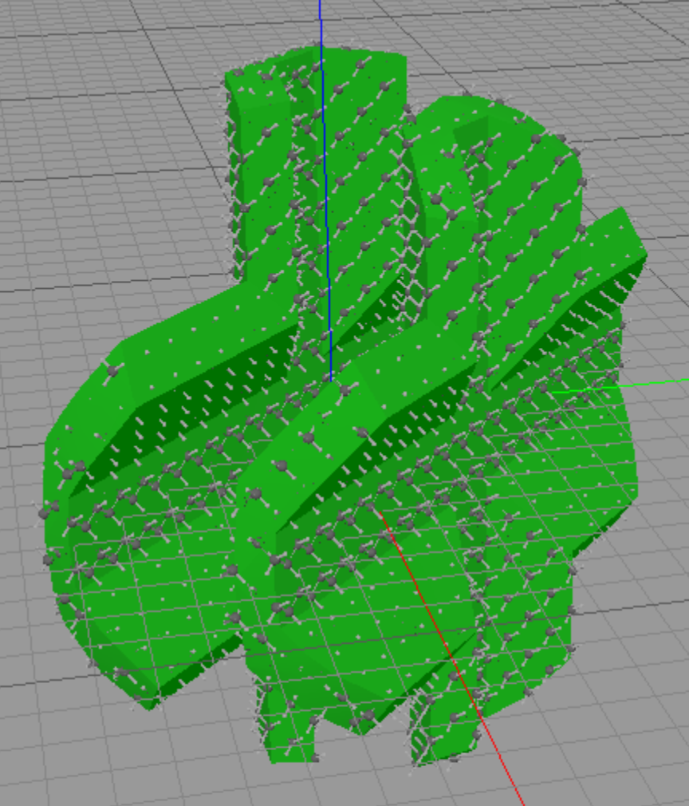

## demo_vdw_oscillator_closed

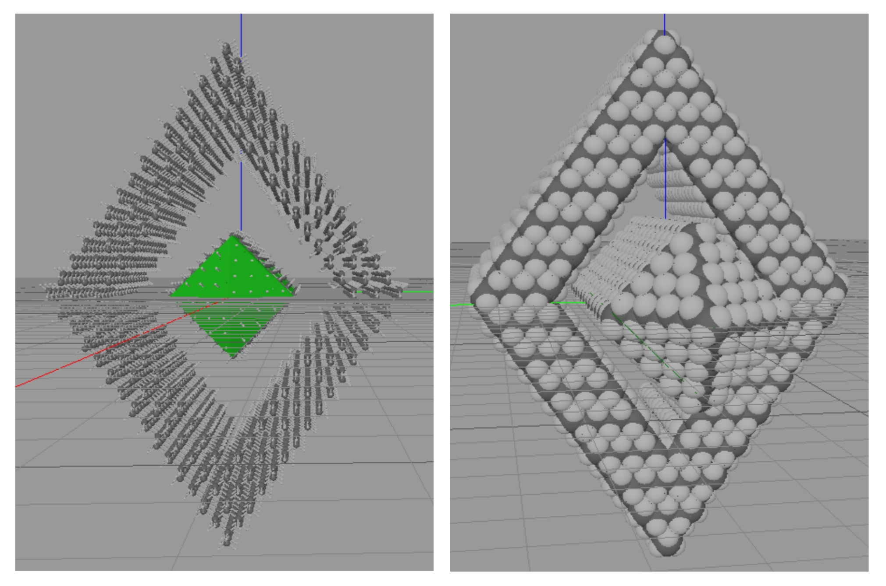


**TODO add screenshots**

The intent of this demo is to show design rules for attaining superlubricity.  
I.e. situations where static friction becomes zero (at operation temperature).   
or at least vdW forces suffice to slide sufaces to maximal contact area.  
Which is the important part.  

In case of designed superlubric interfaces  
the vdW forces can likely  be employed to act as decently strong springs.  
The force of these springs depends on  
the rate of change of contact area over the rate of change in sliding distance.  
Constant force springs are easiest and demonstrated here.  
Linear springs can be emulated by wedges.  
This is not demonstrated here. (TODO)  

There is a very close analogy to surface tension minimizing surface area. Just solid state.  
Just like soap-bubble surface-area is minimized pulling in a string closing a loop  
Here the not yet contacting surface is minimized by pulling towards bigger contact area.  

**To get superlubricity** one needs to break/escape commensural interdigitation   
and to do that one needs to break out of the crystal structure and  
intentionally misalign crystallographic axes.   
(Matching different faces may not be enough.)  

## demo_vdw_oscillator_open

same principle as the closed one  
We get a nice incommensurate sqrt(2) mismatch in lattice spacing.    
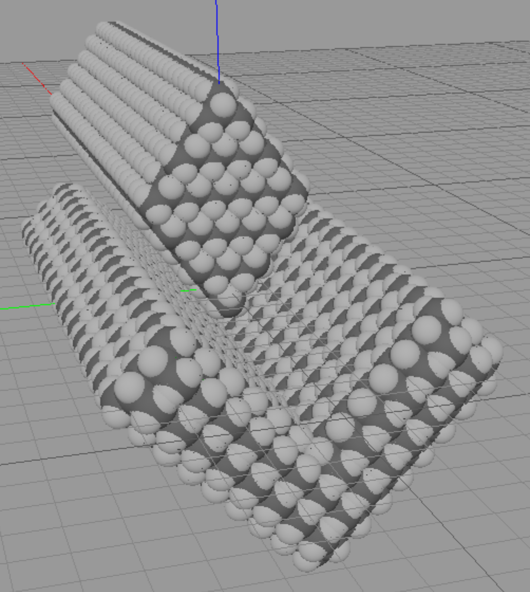  

In the example here alternatively could be placed  
a 90° cuboid (sliding direction [110])  
into the 90° V-groove shape (sliding direction [100]).  
  
**Some notes:**  
★ Unfortunately we can't have a perfect square for the sliding blocks cross section.  
… Note the missing square symbol (□) in first line which is intentional.  
**```lib_irod_xy_rect▭▯(00±1)(±1∓10)_centered```**  
**```lib_irod_x_rect▭□▯{100}_centered```**  
**```lib_irod_x_rect◇{110}_centered```**  

★ A lib_irod_xy_rhombic♢{111}_centered rod (as currently used)  
or a lib_irod_xyz_hex⬡{110}_centered rod  
are not ideal as there are no right angles (no orthogonal faces)  
Generally no reight angles in <111> directions  
unless une goes higher with he miller indices to {112}  
which may not be advisable.

★⚠️ It is likely not enough to just make different faces touch each other to get superlubricity.  
While the surfaces will mesh less well, the interdigitation in the sliding axis direction is still commensurate   
and the the interdigitation energy will quickly add up beyond the thermal excitation energy.  
So non-zero static friction appears that …   
– is blocking thermal diffusion. And more importantly   
– may block VdW "surface tension" pulling in parts along surfaces  
Higher threshold for the latter.  

★ ℹ️ An alternative way to get superlubric sliding (or close to it)  
that does not come with the problem of losing square cross sections is   
segmenting the guiding rail in short segments and then assembling it non-covalently.  
As planned for **```demo_rack_x_linear-assembly```**  
The idea there is that (on longer ranges) the non-bonded contacts break the crystal spacing.  
Requirement being that the pistons/racks/… need to cross several interfaces in the sliding rail.
  
## demo_proxy(111)  

Just a small hexagonal piece for surface simulations.

## 💡 Ideas for upcoming demos

★ gear-racks but  
… in other crystallographic orientations and sliding directions  

★ demo of a lib tool that acts a bit like a convex hull but  
… adheres to the low miller index crystal faces  

★ improvements on the free-space-processing after the **atom_fill** node    

★ Usage of vdW forces in various ways:  
– linear vdW springs by widening-wedge contact-area   
– using vdW forces for connection mechanisms  
– using vdW forces to pull parts together to equilibrium contact    
… with force redirections  
– superlubric example cases  