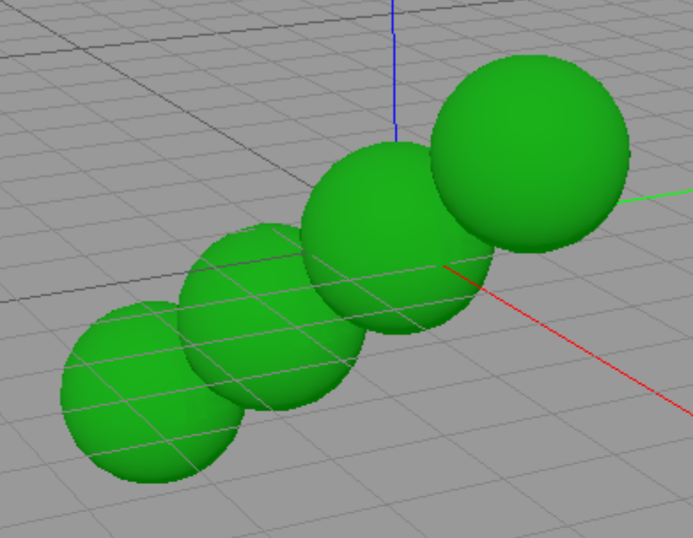
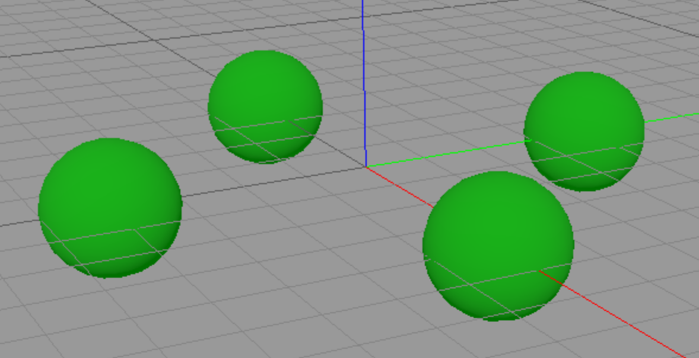

# Example library notes

## Nomenclature:

**Prefix lib_…:** Highly reusable base geometries.  
– These are all kept infinite for minimal composing buildup.  
– These are meant mainly for intersection cutting.  
– All lines marked with a pencil symbol (✏️)  
… signify a part of the nomenclature.  
– These have a main focus on cubic unit cell symmetry  
… hexagonal will work too but one plane-set missing  

**★ irod:** A rod.  
✏️ x, xy, xyz … direction of the rod  
… all other directions can be achieved by rotations (lattice_symop soon lattice_trans and lattice_rot)  
… the other directions are not pre-provided to keep the number of base primitives reasonable  
✏️ shapename☆ … name of the cross section of the shape and visual guide indicator  
✏️ {100} or {110} or {111} … faces of the rod; different faces have different atomistic surface structure  
– centered … symmetric around the center (comes at the cost of increasing size by units of two)  

**★ iedge:** An edge,  (as demoed in …)  
✏️ x,xy, xyz  … direction of bisecting vector 

**★ icorner:** A corner space.  
✏️  x, xy, xyz direction of bisecting vector  
– an (TODO) idea is to use them to approximate convex hulls  
– using higher order functions (map) and feeding in corners (not supported yet)  
– there are cube, octahedron, and rhombic dodecahedron edges for now  

**★ iwall:**  
– a wall with given miller plane index (=normal vector only for the cubic case)  
– can be used to cut irods to length   
– positive and centered versions (latter takes half thickness as argument)

★ **basepoly:** polyhedrons matching the low miller index planes (mostly)  
– cube, octahedron, and rhombic cuboctahedron (for now)  
– just because why not  

★ **demo:** Some demos     
… [For extensive detains on the intent of each of the demo examples see here](example-lib_demo-descriptions.md)  
– irods_all … just demonstrating usage of all the irods in one node network  
– rhombicuboctahedron … can be useful getting oriented with the plane directions  
– cross-intersect method … demonstration of a general construction method using crossing intersections … demonstration of self centering  
– ioctettruss node … (no support of infinite geometry placement)  
– wiggler … demo of superlubric interface by intentional lattice-spacing mismatching   
– selfcentercross   
– rack  

**★ distribute:**   
✏️ z,… … rotation axis (more to implement)  
– abstract placer node filling a picked rotational symmetry  
– **★ shifts:** repeated placement along a direction vector  
– use it in conjunction with map to distribute identical geometries along a line  
– can serve as a template to build more general ones (index dependent geometries and such)  

**★ motif:**  
– defines positions of atoms in the unit cell but in fractional coordinates  
– this is abstracted from the unit cell base vectors  
– currently available are:  
… cubic zinkblende,   
… hexagonal wurtzite (crystal c axis in Cartesian z axis)   
… hexagonal wurtzite (crystal c axis in Cartesian y axis)  
– note that base geometries will distort in a different unit cell  

## Special tools

**atom_fill_halfshift**  
… just a wrapper for the built in **atom_fill** to apply a half-unit-cell-shift and  
thereby avoid getting methyls on every secons of the {111} surfaces.  

 
**lib_map_multimove**   
… place several identical copies of any geometry along a vector  

**lib_multirot90°[001]**  
… fourfold rotation around the z axis  
**lib_multirot180°[110]**  
… twofold rotation around the xy axis  
**lib_multirot120°[111]**  
… threefold rotation around the xyz axis  

**lib_test-by-sphere-cut**
… meant for demoing semi infinite structures that otherwise would get invisible 
… if one happens to have the camera inside the volume
… meant to be used after the return node

**test_wurtzite&lonsdaleite_structure**
… showing the **lib_irod…** part of the lib applied to hexagonal crystal structure.
… while **not intended as such** ist still gives sensible surfaces

**lib_hexirod_(0001)**   
… beginning of rods for hexagonal systems    

lib_unit-cell-maker_triple-hex-R1-obverse  
lib_unit-cell-maker_triple-hex-R1-reverse  

## motifs and unit cells

motif_zinkblende  
… (point-origin at atom, not conventional origin between)
motif_wurtzite_c-in-y_a-in-x  
motif_wurtzite_c-in-z_a-in-x    
motif_lonsdaleite_c-in-z_a-in-x
  
unit_cell_diamond (just a wrapper of the default for completeness)
unit-cell_zinkblende_point-origin   
unit-cell_diamond_rotated+90°z  
        
**Hexagonal unit cells in-[111] direction:**  
unit-cell_wurtzite_triple-hex-R1-obverse  
unit-cell_wurtzite_triple-hex-R1-reverse  
unit-cell_lonsdaleite_triple-hex-R1-obverse  
unit-cell_lonsdaleite_triple-hex-R1-reverse  
TODO add R2 & R3 conventions  

unit-cell_lonsdaleite_c-in-z
unit-cell_lonsdaleite_c-in-y  
unit-cell_wurtzite_c-in-z  
unit-cell_wurtzite_c-in-y  

unit-cell_Si-silicium  
unit-cell_Ge-germanium  
unit-cell_αSn-grey-tin  
 
# For eventual later implementation "plane conversions":

The idea here: Migrating planes to other compatible crystal structures 
without distortion of the geometries by the different base vectors. 
This means the planes stay the same but the miller indices actually change.  
Sometimes some faces get high miller indices  
which might be undesired and might need fixing.  
Prerequisite for "plane migration" is picking an aligned   
unit cells orientation that gives a common sub symmetry group 
of the two lattices to be combined. 
I.e. the c axis of wurtzite structure needs to be facing in  
the [111] direction of the zinkblende structure.  
**This is not yet supported.**  