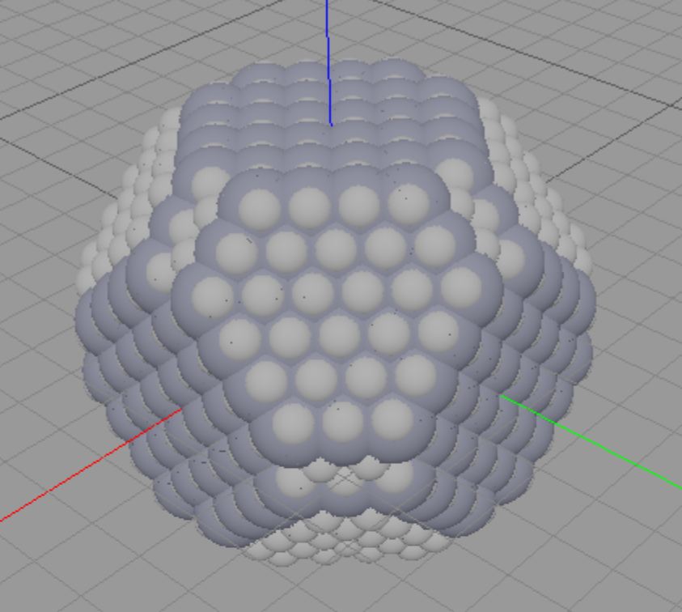

# Graphics for finding the righ miller indices 
 
The rhombicuboctahedron features all the lowest miller index faces  
it can help in finding a desird face:  
  
 
This is just for all the faces that are  
normal to the (111) face in cubic system:   
-orthogonal-directions.svg)  
Same for the faces normal to the (110):   
-orthogonal-directions.svg)    

An older graphic that,   
beside the ortogonal faces (blue),   
also is showing the normals of faces   
that are not orthogonal to the (111) face (red and yellow).  
with their sland indicated by the length of the trianges:

## demo_rhombicuboctahedron

See the dedicated page on miller indices   
[here](miller-index_helpers-for-orientation.md)  

Just a geometry for illustrating all the low miller index faces at once.

Also a helper tool to find a miller index of a specific face.  
One can find the index as such:  
– look isometrically down the [111] direction onto the triangular (111) octahedral face  
– imagine a normal vector on the desired face  
– check if that normal vectors x component is positive(+1) or negative(-1) or zero(0)  
… using the red x axis as reference  
– then do the same for green y axis  
– then the blue z axis  
– you got your miller index  
 
The holes are added just to mark the cube faces and cartesian axes  
And as a hint that this is not a demo for the facet_shell node  
(which could be used too to make this)   

This geometry (or any otherincluding the lib_basepoly ones)  
could be used as a fancy point marker inead of a sphere.  

<!---orthogonal-directions.svg)  -->
<!---orthogonal-directions.svg)  -->
<!--  -->

## Related pages

* [example-lib_design-decisions.md](example-lib_design-decisions.md) 
* [example-lib_demo-descriptions.md](example-lib_demo-descriptions.md) 