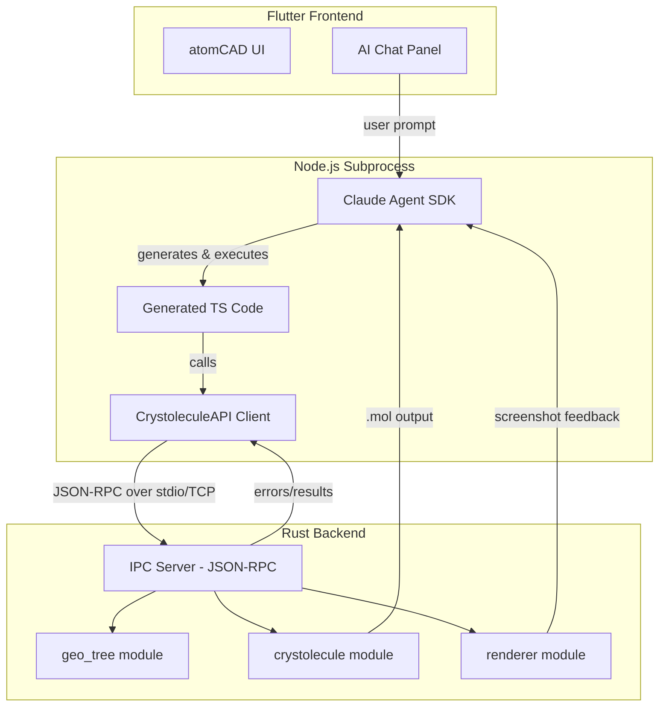

# AI Support in atomCAD

This document explores how AI can be integrated into atomCAD to improve the design process.
As the extent to which AI can be useful and accurate in this context is unknown, it
would be beneficial to find an initial solution that we can use to validate this idea
without huge development effort.

## Current trends in AI agent development

Recently coding agents like Claude Code have been gaining popularity in the field of software development. Increasingly Claude Code is also used for non-coding tasks as it can generate custom code to perform tasks. Recently Anthropic released  the Claude Agent SDK which enables Claude Code being integrated into applications.

The Claude Agent SDK has Python and Typescript APIs.

Question: how can we integrate the Claude Agent SDK into atomCAD?

## Node network textual projection vs. using a maintream language and its ecosystem.

The ideal way to provide AI assitance into atomCAD would be to create a textual representation of the node network, and use Claude Code to generate and modify node networks based on the user's instructions.

This approach has two main disadvantages though:

- AI models are not proficient with understanding custom languages. This can be mitigated to some extent by making the node network textual representation as close to a known programming language as possible. Such a language can be Elm.
- Developing the node network and its textual projection to a sufficient level requires significant effort.

Another way to add AI support to atomCAD is to just use a mainstraim language and its ecosystem as executable programs that generate cystolecule outputs. In this case we would just provide a low-level API for these programs to interact with atomCAD. This low level API would be just a thin layer upon the geo-tree and crystolecule modules. So basically these ai-created programs would be able to create geometry trees directly (without nodes) and calling the atom fill fnction to create crystolecules.

Advantages: 
- AI models are proficient with understanding mainstream languages.
- No need to develop a custom language

Disadvantage:
- The node network concept is a self-contained representation of a crystolecule that is not dpeendent on external programming languages and is designed to have graphical representation. IT is also integrated with the atomCAD editor. This means that the AI-generated programs cannot be manually edited in the atomCAD editor.

Dispite the disadvantage I would still prefer to go with a mainstream language and low-level API
as a start. This will allow us to quickly asses the AI model's intuition and capbility to generate and modify crystal geometries.

## Feedback loop

To create a good agentic coding expericence we need to give feedback to the model.
The following feedback needs to be provided:
- Compilations errors
- Runtime errors
- Runtime logs
- Textual representation of (resulting) geo-trees.
- Textual representation of (resulting) polygon representation of geo-trees.
- Answers to other queries on (resulting) geo-trees.
- Textual representation of (resulting) atomic structures. (e.g. .mol format)
- Rendered image of (resulting) atomic structures or geometries.

## Recommended Approach: TypeScript + Claude Agent SDK

TypeScript is the recommended language for AI integration for the following reasons:

1. **First-class SDK support** - Anthropic provides a native TypeScript SDK for the Claude Agent SDK
2. **AI proficiency** - Claude models are highly proficient with TypeScript, resulting in more reliable code generation
3. **Type safety** - TypeScript's type system helps catch errors early, improving the feedback loop
4. **Ecosystem** - Access to npm packages for math, geometry, and scientific computing if needed

### Architecture

### Implementation Components

1. **Rust IPC Server** - JSON-RPC endpoint exposing geo-tree and crystolecule operations
2. **TypeScript API Client** - Thin wrapper calling the Rust backend
3. **Agent Loop** - Claude Agent SDK orchestrating code generation and execution
4. **Process Management** - Flutter spawns Bun subprocess for AI sessions

### Performance Considerations

#### IPC Latency

The communication between the TypeScript process and Rust backend uses JSON-RPC over stdio (pipes). This is a well-understood IPC mechanism with excellent performance characteristics:

- **Latency**: Pipe-based IPC achieves ~1-10 μs per message for typical payloads on the same machine
- **Throughput**: Pipes can sustain ~3000 MB/s for larger data transfers

Critically, the AI model's "thinking time" dominates the overall latency. A typical Claude API response takes 1-30+ seconds depending on complexity. The IPC overhead of microseconds is **completely negligible** in comparison. The bottleneck is always the AI inference, never the local communication.

#### Hot Reload During Development

Fast iteration is essential for agentic workflows. When the AI generates new TypeScript code, we need to execute it quickly. Bun provides excellent hot-reload capabilities:

- **`bun --watch` mode**: Hard restarts the process when source files change. Uses native OS filesystem watchers (kqueue on macOS, inotify on Linux) for near-instant detection (~10-50ms).
- **`bun --hot` mode**: Soft reloads code without restarting the process—updates the internal module cache with new code while preserving global state.
- **No compilation step**: Bun executes TypeScript directly, eliminating the transpilation delay that Node.js + tsc would incur.

This means the cycle of "AI generates code → execute → get feedback" is bottlenecked only by Claude API latency, not by local execution overhead.

### Distribution: Bun and the Claude Agent SDK

**Key discovery:** Anthropic acquired Bun (the JavaScript/TypeScript runtime) in December 2025. This fundamentally changes the distribution story.

#### How the SDK is Distributed

- **Python SDK:** `pip install claude-agent-sdk` - The Claude Code CLI is **automatically bundled** with the package.
- **TypeScript/JavaScript:** Claude Code ships as a **Bun single-file executable** - a self-contained binary that runs anywhere without requiring Node.js or Bun to be pre-installed.

#### What This Means for atomCAD

This simplifies integration significantly:

1. **No Node.js dependency** - Bun executables are self-contained
2. **MIT licensed** - Bun remains open-source and freely redistributable
3. **Smaller footprint** - Bun binaries are smaller and faster than Node.js
4. **Native TypeScript** - Bun runs TypeScript directly without compilation step

#### Recommended Distribution Approach

1. Write the AI agent in TypeScript using the Claude Agent SDK
2. Compile to a Bun single-file executable: `bun build --compile agent.ts --outfile atomcad-ai`
3. Bundle the resulting binary (~50-100MB) with atomCAD releases
4. Flutter spawns this executable and communicates via stdin/stdout JSON-RPC

#### Licensing Considerations

| Component | License | Redistribution |
|-----------|---------|----------------|
| Bun runtime | MIT | Freely redistributable |
| Claude Agent SDK | Anthropic Commercial ToS | Allowed for powering products |
| Claude API usage | Per-token billing | User provides API key or atomCAD subscription |

#### AtomCAD Development vs Distribution

- **Development:** AtomCAD Developers install Bun to iterate on the agent code (`bun run agent.ts`)
- **Distribution:** The compiled single-file executable ships with atomCAD - **users need nothing installed**

## Alternatives Considered

Before settling on TypeScript + Bun, several alternative approaches were evaluated:

### Direct Rust Code Generation

The AI could generate Rust code that directly uses the geo_tree and crystolecule modules.

**Pros:**
- No IPC overhead—direct function calls
- Full type safety at compile time
- No additional runtime dependencies

**Cons:**
- **No hot reload**: Each iteration requires a full `cargo build` (~10-60 seconds). This makes agentic workflows impractical—the feedback loop becomes too slow.
- Compilation errors are harder for AI to interpret than runtime errors
- Requires Rust toolchain for execution

**Verdict:** The compilation latency makes this approach unsuitable for iterative AI-driven development.

### Rhai Embedded Scripting

[Rhai](https://rhai.rs/) is a lightweight scripting language designed specifically for embedding in Rust applications.

**Pros:**
- Tight Rust integration with minimal overhead
- No separate process or IPC needed
- Instant script reload
- Small footprint, easy to bundle

**Cons:**
- **Poor AI code quality**: Rhai is a niche language. AI models have limited training data for it, resulting in significantly worse code generation compared to mainstream languages.
- **Slower execution**: Benchmarks show Rhai is approximately 2x slower than Python and ~30x slower than V8/Bun for typical workloads.
- Limited ecosystem—no access to npm packages

**Verdict:** The AI proficiency gap is a dealbreaker. The whole point of this integration is to leverage Claude's coding abilities, which are strongest in mainstream languages.

### Python + Claude Agent SDK

Python is well-supported by the Claude Agent SDK and AI models excel at Python.

**Pros:**
- Excellent AI code generation quality
- First-class SDK support
- Rich scientific computing ecosystem (NumPy, etc.)

**Cons:**
- **Distribution burden**: Requires users to have Python installed, or bundling a Python runtime (~100MB+)
- Virtual environment complexity
- Slower startup than Bun

**Verdict:** A viable option, but TypeScript + Bun offers cleaner distribution without sacrificing AI code quality.

### Summary Comparison

| Approach | Hot Reload | AI Code Quality | Distribution |
|----------|------------|-----------------|--------------|
| TypeScript + Bun | ✅ Instant | ✅ Excellent | ✅ Self-contained binary |
| Direct Rust | ❌ 10-60s compile | ✅ Good | ✅ Built-in |
| Rhai | ✅ Instant | ❌ Poor | ✅ Built-in |
| Python | ✅ Good | ✅ Excellent | ⚠️ Requires Python |

TypeScript + Bun provides the best balance of rapid iteration, AI code quality, and distribution simplicity.

## Smart Editor Integration

A key disadvantage of the TypeScript approach is that AI-generated programs cannot be manually edited in the atomCAD editor like node networks can. We can bridge this gap using **editable bindings**—explicit `editable*()` helper functions that mark values as gadget-controllable. When the user drags a viewport handle, the TypeScript source is patched and the script re-executes automatically.

See [Smart Editor Integration](./smart_editor_integration.md) for the full design.
