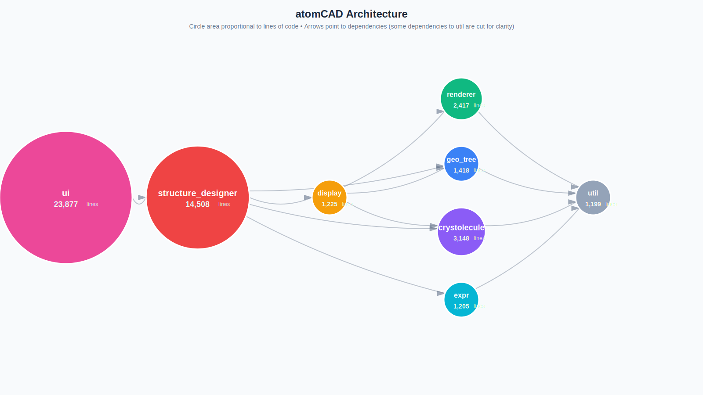

# atomCAD architecture overview

## Overview

- **Backend**: Rust (computational geometry, CAD operations, file I/O)
- **Frontend**: Flutter (cross-platform UI)
- **Supported Platforms**: Windows, Linux, macOS

## Rust Backend

We aim to create as independent modules as possible. Dependencies should be as few as possible and should form a DAG (Directed Acyclic Graph): no circular dependencies.

Currently there are the following top-level Rust modules:

- structure_designer
- crystolecule
- renderer
- display
- expr
- geo_tree

## Architecture Diagram

Visual representation of the module architecture with dependencies:

[View full diagram](architecture_diagram.svg)

## structure_designer

This is the bulk of atomCAD's Rust backend code. Contains the node network system, the code for the built-in nodes and the structure designer application logic. Contains the API of the Rust backend towards the UI too. If anything big-enough can be factored out into an independent module from this, it should be done. (The principle of 'push code down the dependency graph' applies here. (Or related principle: SDP: **Stable Dependencies Principle**: Depend in the direction of stability)). 

## crystolecule

High-performance library for creating and editing atomic structures in general and crystolecules in particular.

- Core data structures: `AtomicStructure`, `Atom`, bonds, unit cells
- Atomic property database (Van der Waals radii, covalent radii, element info)
- Lattice operations (filling, hydrogen passivation, surface reconstruction)
- Independent of rendering concerns

## renderer

Small purpose-built renderer built for atomCAD needs. Capable of displaying mesh geometries, gadgets and most importantly lots of atoms and bonds efficiently.

- Contains GPU rendering infrastructure (pipelines, shaders, GPU mesh management)
- Provides mesh data structures (`Mesh`, `LineMesh`, impostor meshes)
- Includes generic tessellation utilities (sphere, cylinder, cuboid primitives)
- Fully independent of domain types (atomic structures, geo_tree)

## display

Adapter layer that converts domain objects into renderer-displayable meshes. Depends on both domain modules (`crystolecule`, `geo_tree`) and `renderer`, keeping them independent of each other.

- Tessellates atomic structures (atoms, bonds, surfaces) into meshes
- Converts geo_tree geometries into renderable representations
- Uses renderer's generic primitives to build domain-specific visualizations

## expr

An expression language library. This is used under the hood in the `expr` node.

## geo_tree

A high-performance 3D geometry library designed for crystolecule geometry.

- Representation: tree of geometric operations (GeoNode)
- Capability to convert the tree to a polygon mesh (the csgrs dependency is used under the hood)
- Capability for optimized SDF (Signed Distance Field) evaluation
