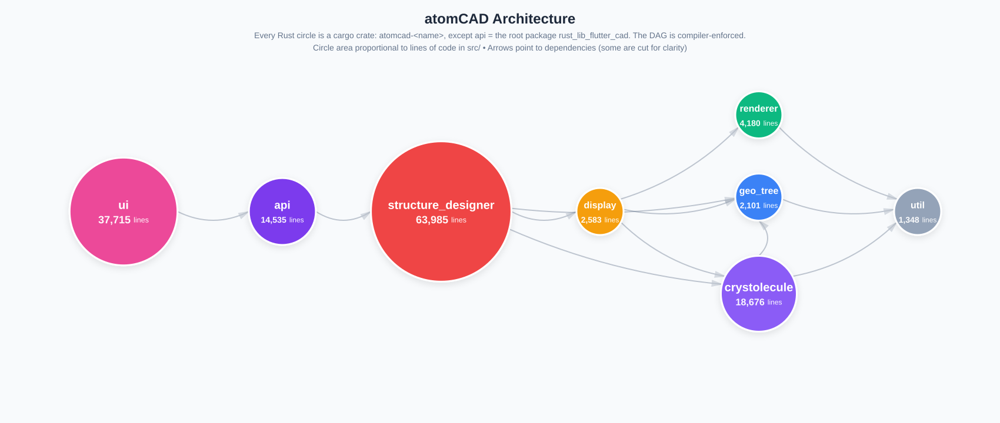

# atomCAD architecture overview

## Overview

- **Backend**: Rust (computational geometry, CAD operations, file I/O)
- **Frontend**: Flutter (cross-platform UI)
- **Supported Platforms**: Windows, Linux, macOS

## Rust Backend

We aim to create as independent modules as possible. Dependencies should be as few as possible and should form a DAG (Directed Acyclic Graph): no circular dependencies.

**That DAG is compiler-enforced.** `rust/` is a cargo workspace: each layer is
its own crate under `rust/crates/`, and the root package
(`rust_lib_flutter_cad`, i.e. `rust/src/api/` plus the generated
`frb_generated.rs`) sits on top of them. A back-edge is a build failure now, not
a review comment. See `doc/design_rust_crate_split.md` for how the split was
done and why each boundary sits where it does.

The crates, from the top of the graph down:

| Crate | Was | Depends on |
|---|---|---|
| `rust_lib_flutter_cad` (`rust/src/api/`) | unchanged | everything below |
| `atomcad-structure-designer` | `structure_designer` + `expr` | display, crystolecule, geo-tree, renderer, util |
| `atomcad-display` | `display` | crystolecule, geo-tree, renderer, util |
| `atomcad-crystolecule` | `crystolecule` | geo-tree, util |
| `atomcad-renderer` | `renderer` | util |
| `atomcad-geo-tree` | `geo_tree` | util |
| `atomcad-util` | `util` | — |

A crate directory is named `atomcad-<module>` and imported as
`atomcad_<module>::…`. `atomcad-test-support` is the one exception to the
table: it is a dev-only helper crate (shared test assertions and the
`rust/tests/fixtures/` resolver), never a runtime dependency.

### Crate sizes

Non-empty, non-comment lines; each crate's `src/` beside its own `tests/`.
Regenerate with `python scripts/architecture_diagram/crate_size_table.py`.

| Crate | Source | Files | Test code | Tests |
|---|---:|---:|---:|---:|
| `atomcad-structure-designer` | 62,835 | 242 | 81,815 | 3,330 |
| `atomcad-crystolecule` | 19,239 | 52 | 22,372 | 1,217 |
| `atomcad-renderer` | 4,180 | 17 | 652 | 38 |
| `atomcad-display` | 3,173 | 14 | 642 | 28 |
| `atomcad-geo-tree` | 2,101 | 8 | 1,216 | 66 |
| `atomcad-util` | 1,348 | 15 | 118 | 15 |
| `atomcad-test-support` | 121 | 3 | — | — |
| `rust_lib_flutter_cad (api)` | 14,534 | 22 | 9,142 | 359 |
| Flutter UI (lib/, Dart) | 37,715 | 166 | 2,467 | — |
| **Total (hand-written)** | **145,246** | **539** | **118,424** | **5,053** |

Generated code is excluded throughout: `rust/src/frb_generated.rs` (26,200
lines) and `lib/src/rust/` (40,222 lines) are flutter_rust_bridge output.
Measured at commit `0b22183d` (2026-08-17).

Three things the table cannot say for itself:

- **Test code is attributed by location, not by subject.** The root package's
  9,142 test lines are the cross-layer `tests/integration/` corpus (4,391)
  *plus* the two api-side harnesses that exercise lower crates —
  `structure_designer_api/` (4,664 lines, 242 tests) and `renderer_api/` (65
  lines, 4 tests). Those exist because a member crate cannot depend on the root
  crate, not because the subject lives up there.
- **`expr` is inside `atomcad-structure-designer`** (D8): 2,407 of its source
  lines and 5,972 of its test lines.
- **`atomcad-structure-designer` is 58 % of the backend**, and 31,042 of its
  62,835 lines are the 129 node implementations under `nodes/`. Splitting those
  out is the largest remaining structural prize and needs its own design — see
  Deferred / follow-ups in `doc/design_rust_crate_split.md`. It shed ~1,150
  lines to `crystolecule` and `display` in
  `doc/design_push_domain_code_down.md`, which also records why that only moved
  the share by a point: roughly half of `nodes/` is `impl NodeData` +
  `get_node_type()` boilerplate with nowhere lower to go.

The suite reports ~5,058 tests against the 5,053 `#[test]` functions counted
here; the difference is doc-tests plus a handful of inline `#[cfg(test)]`
modules that predate the "tests go in `tests/`" convention.

Two rules follow from the layering and are worth knowing before adding code:

- **Which side of the boundary a type belongs on.** A *domain concept* belongs
  down in a crate; a *transport shape* (a DTO the Dart side sees) belongs up in
  `api/`, together with the code that builds it. A Dart-facing type that lives
  down keeps a same-named twin in `api/` with `From` impls both ways — a
  `pub use` re-export does **not** make it visible to flutter_rust_bridge.
- **flutter_rust_bridge stays confined to the root crate.** No `#[frb(...)]`
  attribute exists outside `rust/src/api/`.

`rust/AGENTS.md` carries the working detail for both.

## Architecture Diagram

Visual representation of the crate architecture with dependencies:

[View full diagram](architecture_diagram.svg)

Generated by `scripts/architecture_diagram/` — re-run it after a structural
change rather than hand-editing the SVG.

## api (root crate)

The Flutter Rust Bridge boundary: the functions Dart calls, the DTOs it sees,
and the view-builders that turn domain state into those DTOs. Everything else
lives in a crate below it. Presentation logic that takes domain types
(`view_builders.rs`, `tool_adapters.rs`) is deliberately kept out of
`flutter_rust_bridge.yaml`'s `rust_input`, because every `pub fn` in a scanned
namespace becomes a Dart API.

## structure_designer

This is the bulk of atomCAD's Rust backend code. Contains the node network system, the code for the built-in nodes and the structure designer application logic. If anything big-enough can be factored out into an independent crate from this, it should be done. (The principle of 'push code down the dependency graph' applies here. (Or related principle: SDP: **Stable Dependencies Principle**: Depend in the direction of stability)).

**`expr` is a component of this crate, not a peer.** The expression language
needs `NetworkResult`, which needs `NodeTypeRegistry`, which needs
`node_network` and the whole `nodes/` tree — there is no thin seam to cut, so
`expr` lives inside `atomcad-structure-designer` and the old
`expr → structure_designer` back-edge simply dissolves. Making it independent
would mean generalising it over a value trait, which is a redesign rather than
a move (design doc D8).

It also owns `scene_tessellator.rs`, which used to sit in `display`: it adapts
the *scene graph* — a structure_designer concept — to the renderer, not a
domain object.

## crystolecule

High-performance library for creating and editing atomic structures in general and crystolecules in particular.

- Core data structures: `AtomicStructure`, `Atom`, bonds, unit cells
- Atomic property database (Van der Waals radii, covalent radii, element info)
- Lattice operations (filling, hydrogen passivation, surface reconstruction)
- Independent of rendering concerns
- Depends on `geo_tree` (a `GeoNode` SDF is the input to `fill_lattice()`) and
  on nothing above it — after the split it is a genuinely standalone
  atomic-structure library

## renderer

Small purpose-built renderer built for atomCAD needs. Capable of displaying mesh geometries, gadgets and most importantly lots of atoms and bonds efficiently.

- Contains GPU rendering infrastructure (pipelines, shaders, GPU mesh management)
- Provides mesh data structures (`Mesh`, `LineMesh`, impostor meshes)
- Includes generic tessellation utilities (sphere, cylinder, cuboid primitives)
- Fully independent of domain types (atomic structures, geo_tree)
- Owns the GPU stack (`wgpu`, `bytemuck`) and the committed SDF font atlas

## display

Adapter layer that converts domain objects into renderer-displayable meshes. Depends on both domain crates (`crystolecule`, `geo_tree`) and `renderer`, keeping them independent of each other — being the only crate that depends on both sides is exactly what makes it the adapter.

- Tessellates atomic structures (atoms, bonds, surfaces) into meshes
- Converts geo_tree geometries into renderable representations
- Uses renderer's generic primitives to build domain-specific visualizations

## geo_tree

A high-performance 3D geometry library designed for crystolecule geometry.

- Representation: tree of geometric operations (GeoNode)
- Capability to convert the tree to a polygon mesh (the csgrs dependency is used under the hood)
- Capability for optimized SDF (Signed Distance Field) evaluation

## util

The bottom of the graph: math helpers, the DAA box, the LRU cache. Depends on
nothing in the tree.
