# atomCAD Basic Tutorial

This tutorial assumes you have downloaded atomCAD on one of the supported platforms (Windows, macOS, Linux). If not, you can download it from the [project's GitHub page](../README.md).

## Navigating the viewport

When you open atomCAD you will see something like this:

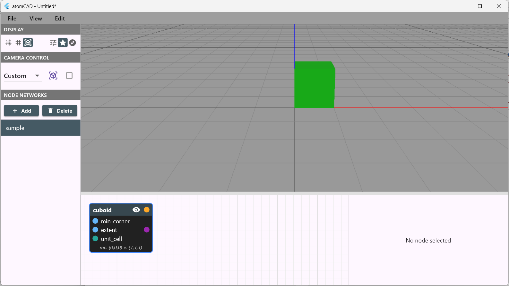

The upper part of the screen with the trusty cube in it is called the **viewport**, while the lower part of the screen is called the **node network editor**.

When using the application, you will navigate the viewport frequently. Practice these controls to ensure you can use them effortlessly:

- Hover over the cube with the mouse, press and hold the right mouse button **(RMB)** and drag: this is how you **orbit** the camera.
- If you drag with the middle mouse button (**MMB**) instead, you will **pan** the camera.
- You can **zoom** in and out using the middle mouse wheel (**MMW**). 

>**TIP:** The mouse pointer location when starting these operations determines your **pivot point**. A new pivot point is registered when you hover over an atomic structure, geometry, or the horizontal (XY) plane before starting these operations. You can enable pivot point visualization in **Edit > Preferences > Other Settings > Display camera pivot point**. (A small red cube will be displayed at the pivot point.)

## Working with the node network

Besides navigating the viewport another thing that you will do frequently is editing the node network.

Why a node network?

- If you have used other CAD software, you know there are two main approaches to CAD modeling: direct modeling and **parametric modeling**. Direct modeling is good for rapid prototyping, while parametric modeling is ideal for products that undergo many iterations and require automated updates. The node network in atomCAD makes it not only fully parametric but also programmable. It has a steeper learning curve than direct modeling, but its power makes it worthwhile.
- If you are a programmer, you will likely appreciate the node network in atomCAD, as it contains nodes that make it a functional programming language. Each node is a function, and since functions are **composable**, so are node networks: you can define custom reusable nodes by implementing them as node networks. However, you do not need programming experience to create node networks: using programming-related nodes is optional.

Let's look at our current node network which displays our cube!

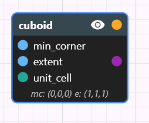

We have a single cuboid node. You can select it by left-clicking on it. The node's properties appear in the bottom-right corner of the application window.

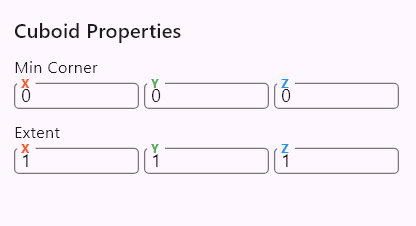

> **TIP:** You can drag a node by dragging it with the left mouse button. You can pan the node network canvas by dragging any empty space with the middle mouse button.

## Node properties and the lattice 

Hover the mouse over the x-coordinate of the *Extent* property and use the mouse wheel to increase it. The cuboid size changes in real-time. You can click the field, type an integer number, and the value will be submitted when you click outside the field or press Enter. Try creating something like this:

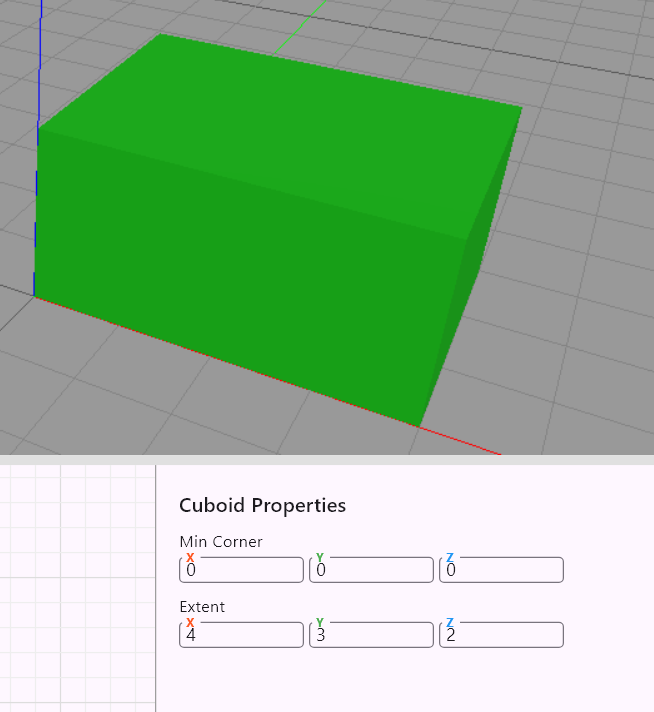

Now experiment with the *Min Corner* property as well—the cuboid will move around. Try positioning it like this:

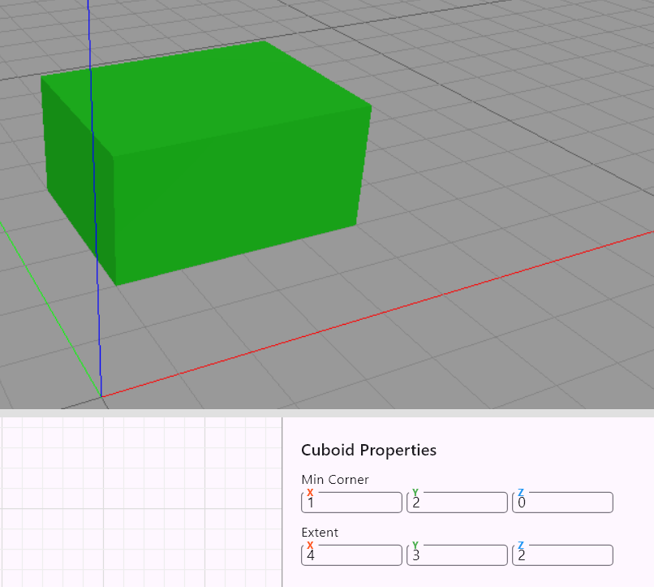

Wait, aren't we supposed to edit crystal structures? And why integer numbers only?

In atomCAD, you create crystal structures by cutting out parts of an infinite crystal. You have tools to create intricate geometries, and then you can use the `atom_fill` node to convert them to atomic structures through crystal cutting. Constraining these geometries to the lattice makes it easier to create atomic structures that are physical and, in the future, suitable for manufacturable workflows.

> By default you are working in the cubic diamond lattice. The grid of the XY plane always reflects the active lattice. See the documentation of the `unit_cell` node in the Reference Guide to learn about working with arbitrary unit cells. Please note that the cuboid node outputs a parallelepiped in a generic unit cell. 

## Constructive Solid Geometry (CSG) operations

We will fill our geometry with atoms soon, but first let's make our geometry more interesting.

Right-clicking anywhere on the node network canvas opens the **Add Node** dialog.

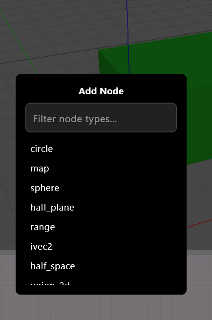

Start typing `cuboid` in the filter field. Select `cuboid` from the filtered list and a new cuboid will be placed. Select it and adjust its properties so that it overlaps with the other cuboid, but neither fully covers the other.

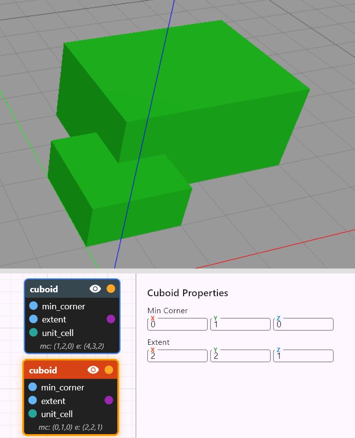

Since the cuboids are overlapping, you may not clearly see where your individual cuboids are located. There are multiple ways to better understand this situation:

- Left-click the eye icon on individual cuboid nodes. This toggles the visibility of the node's output. When visibility is enabled, the node contributes to the viewport scene; otherwise, it doesn't.
- Choose the wireframe geometry visualization at the geometry visualization panel at the upper left part of the window.

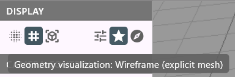

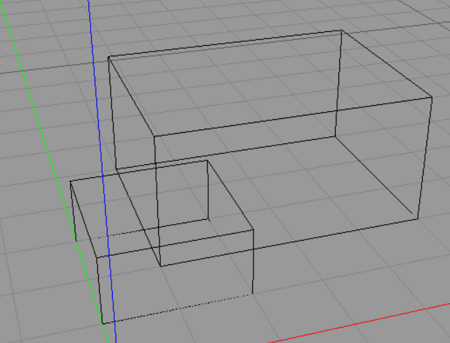

Restore the visibility of the nodes and return to solid geometry visualization.
Right-click on the node network again and add a `diff` node.

Left-click and drag the output pin of the first `cuboid`: drag out a wire from it and release the left mouse button at the `base` input of the `diff` node. This connects the first `cuboid`'s output pin to the `base` input pin of the `diff` node.

Connect the output pin of the second `cuboid` to the `sub` input pin of the `diff` node.

You should see something like this:

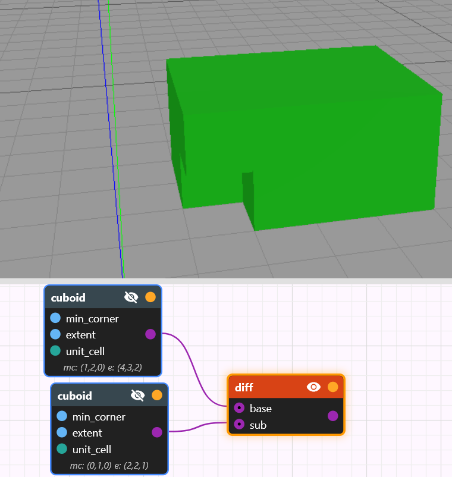

## About node visibility

You may have noticed that when you select a node, it automatically becomes visible and other nodes that provide their inputs become invisible. This is the desired behavior most of the time, but not always. In the upper-left part of the window, there are buttons to set the **node display policy**. The default mode is called 'Prefer Selected Nodes'. Another mode you often want is 'Manual' mode: in this case, regardless of what is selected, a node will be visible or invisible only if you explicitly toggle its eye icon. You can read about the exact behavior of node display policies in the Reference Guide.

## atom_fill node

Add an `atom_fill` node to your node network. Connect the output of the `diff` node to the `shape` input pin of the `atom_fill` node. When you select the `atom_fill` node, you will see something like this:

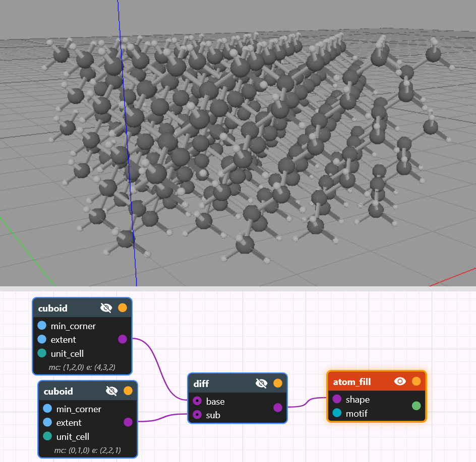

## Saving your design and exporting atomic structures

In the File menu, you will find options to save your design or load it back. atomCAD's native file format is .cnnd (abbreviation for Crystal Node Network Design). A .cnnd file contains one design that may consist of multiple node networks.

You can also export the currently visible atomic structures into .xyz or .mol formats.

## Where to go next

- Search for the `polygon` and `extrude` nodes in the [Reference Guide](./atomCAD_reference_guide.md): with these nodes you can create interesting geometries quickly. Also check out the `rect`, `union_2d`, `intersect_2d`, `diff_2d`, and `half_plane` nodes—these are helpful when creating 2D shapes. Always model as much as possible in 2D and use the extrude node: working in 2D is almost always easier and faster than working in 3D.
- For most geometries, working in 2D and extruding will not be sufficient to reach the final shape. Besides the CSG operations (`union`, `intersect`, `diff`), you will need to learn to use the `half_space` node. It has a steep learning curve but is immensely powerful. As its name suggests, it represents an infinite half-space defined by the bounding plane and a direction (which side of the plane is filled). You could create any crystal geometry using only `half_space` nodes and CSG nodes. For example, it is easy to see that intersecting any geometry with a half-space is equivalent to using the boundary plane of the half-space as a cutter plane on the given geometry.
- Learn about the `lattice_move` and `lattice_rot` nodes to transform your geometries with respect to lattice symmetries. 
- To work with crystals other than cubic diamond, learn about the `unit_cell` and `motif` nodes. atomCAD is flexible enough that you can define your own unit cells and even your own motifs.
- Eventually, it is worth browsing through all the information in the [Reference Guide](./atomCAD_reference_guide.md). There are capabilities we did not cover here at all, such as programming, creating subnetworks, etc.
- atomCAD is evolving rapidly. Check back frequently and review the release notes for new capabilities.
