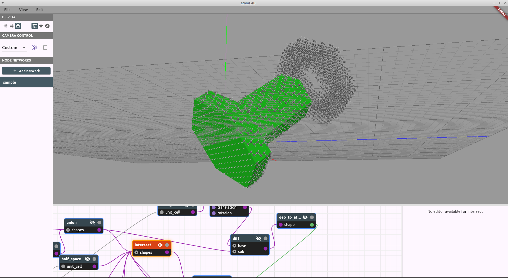
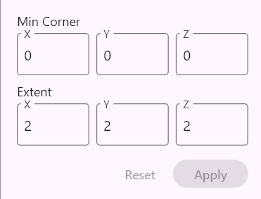
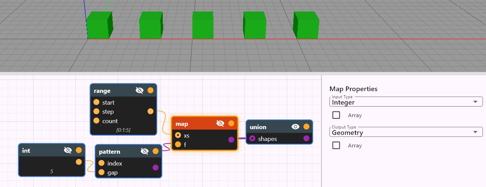
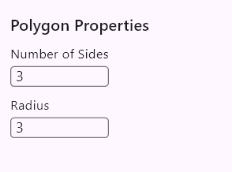
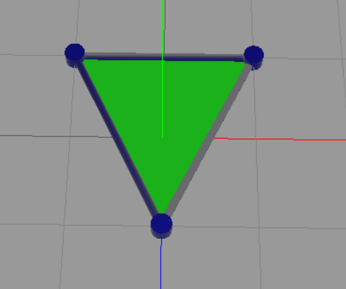
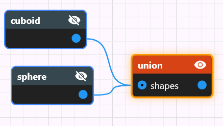
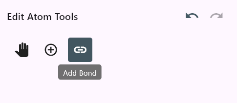
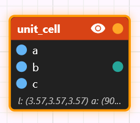

# atomCAD Reference Guide

*A comprehensive guide to atomCAD, including a complete reference for all built-in nodes.*

## Introduction

atomCAD is a CAD application for Atomically Precise Manufacturing (APM).
With atomCAD you can design arbitrary covalently bonded atomic structures that are constrained to a crystal lattice and suitable for physical (and, in the future, manufacturable) workflows.



If you are new to atomCAD check out the [atomCAD Basic Tutorial](./atomCAD_basic_tutorial.md) and the [atomCAD Part Design Tutorial](./part_design_tutorial.md) first.

Basic features:
- **Arbitrary unit cells.** Any unit cell defined by the lattice parameters `(a, b, c, α, β, γ)` is supported. The implied crystal system (*cubic, tetragonal, orthorhombic, hexagonal, trigonal, monoclinic, triclinic*) and its symmetries are automatically determined.
- **Lattice-constrained geometry.** Geometries are created relative to the unit cell lattice, and operations on those geometries preserve lattice constraints. This makes it easier to design atomic crystal structures that are aligned, physically accurate, and manufacturable.
- **User-definable motifs.** Geometries can be filled with motifs to create atomic structures. Motifs are user-definable: any covalently bonded crystal structure can be specified. The default motif is cubic diamond.
- **Parametric, composable designs.** atomCAD designs are parametric and composed as visual node networks, enabling non-destructive editing. Custom node types can be created by defining subnetworks. The node network includes functional-programming elements and is Turing-complete.
- **Surface reconstructions.** Currently only (100) 2×1 dimer reconstruction is supported (for cubic diamond) but more reconstructions will be supported in the future.

Planned features include:

- Defect editing and placement tools
- Atomically Precise Manufacturing (APM) integration
- A streaming level-of-detail system to support larger structures that currently do not fit in memory
- Geometry optimization and dynamics simulation support

We’d love to hear about your use case: what are you using — or planning to use — atomCAD for?

## Parts of the UI

This is how the full window looks like:


---

We will discuss the different parts of the UI in detail. The parts are:

- 3D Viewport
- Node Networks List Panel
- Node Network Editor Panel
- Node Properties Panel
- Display Preferences Panel
- Camera Control Panel
- Preferences Dialog (Edit > Preferences)

### 3D Viewport

The node network results are displayed here.


You can navigate the viewport with the mouse or touchpad. Although it is possible to use atomCAD with a touchpad we **strongly recommend using it with a mouse**. You can choose between multiple control mechanisms depending on your preference and constraints. (For example some mice do not have a middle mouse button or a mouse wheel).

- **Pan (move camera):**
  - Option 1: **Middle mouse button drag**
  - Option 2: SHIFT right mouse button drag
  - Option 3: SHIFT *touch-pan*  (for Magic Mouse or touchpad)

- **Orbit:** **Right mouse button drag**
- **Zoom:** 
  - Option 1: **Mouse scroll wheel**
  - Option 2: Vertical component of *touch-pan* (for Magic Mouse and touchpad)
  - Option 3: Pinch zoom (for touchpad)


All three operations use a *pivot point*. The pivot is the point where you click when you start dragging: if you click an object, the pivot is the hit point on that object; otherwise the pivot is the point on the XY plane under the cursor. You can visualize the pivot as a small red cube in **Edit → Preferences** (`Display camera pivot point`). For example, orbiting rotates the camera around the pivot point, and zooming moves the camera toward (or away from) the pivot point.

Orbiting is constrained so the camera never rolls (no tilt). This prevents users from getting disoriented. If you need complete freedom, a 6-degree-of-freedom (6DoF) camera mode will be developed soon. 

### Node network composability and Node Networks list panel

A structure design consists of node networks. The list of node networks in the current design is shown in the **Node Networks** panel. Select a network in the panel to open it in the node network editor. To create a new network, click the **Add Network** button.


Node networks in a design can be browsed in the **List** tab or in the **Tree** tab. Especially in larger designs or in reusable part libraries it is beneficial to organize your node networks in a namespace hierarchy. The hierarchy can be created by simply naming your node networks using the '.' character as a separator.


> Terminology: a name like `dl.lib.basepoly.cube_centered` is the qualified name of the given node network, while the name `cube_centered` is the simple name of that same node network.

In the node network editor panel: Node titles show only the simple name, with the full qualified name available on hover.

#### Navigating between node networks

When working with custom nodes (nodes defined by subnetworks), you can quickly navigate to their definitions:

- **Go to Definition:** Right-click a custom node and select *Go to Definition* to open the subnetwork that implements it.

The **Node Networks** panel includes browser-like navigation buttons at the top:

- **Back (←):** Returns to the previously viewed node network.
- **Forward (→):** Moves forward in the navigation history after going back.

These buttons are grayed out when navigation in that direction is unavailable.

### Node network editor panel


#### Navigating in the node network editor panel

There will be a separate longer chapter in this document about node networks. Here we just discuss how to use the node network editor panel in general. If this UI chapter does not make sense yet to you, come back to it after reading the node networks chapter.

The node network editor canvas can be panned the following way:

- Option1: **Middle mouse button drag**
- Option 2: SHIFT right mouse button drag
- Option 3: SHIFT *touch-pan* (for Magic Mouse or touchpad)

If you get lost you can use the *View > Reset node network view* menu item.

The node network can be zoomed using the mouse scroll wheel.

#### Manipulating nodes and wires

**Add nodes**
Right-click in the node editor to open the **Add Node** window and add a new node.


**Move nodes**
Left-click a node and drag to move it.

**Connect pins**
Left-click and drag from an output pin to an input pin to create a wire. To disconnect a wire, select it and press `Del` (see Selection below).

**Quick-add node from wire**
If you drag a wire from a pin and release it in empty space, the **Add Node** window opens filtered to show only nodes with compatible pins. After selecting a node type, the new node is created at the drop location and the wire is automatically connected. If multiple pins are compatible, a dialog lets you choose which one.

**Selection**
Multiple nodes and wires can be selected. Selection is used for:

- Deleting selected nodes or wires with the `Del` key.
- Editing the *active* node’s properties in the **Node Properties** panel.
- Enabling viewport interactions for the *active* node: many node types expose interactive *gadgets* in the viewport; the exact interactions depend on the node type (see the Nodes Reference section).

*Single selection:*
- Left-click a node or wire to select it (clears previous selection).

*Multi-selection:*
- **Ctrl+click** a node or wire to toggle it in/out of the current selection.
- **Shift+click** a node or wire to add it to the current selection.
- **Rectangle selection:** Left-click and drag on empty space to draw a selection rectangle. Any node or wire that overlaps the rectangle is selected. Modifier keys work with rectangle selection too: Ctrl toggles, Shift adds.

*Active vs selected:*
When multiple nodes are selected, the most recently selected/added node becomes the *active* node. The active node is shown with a different color and is the one whose properties appear in the Node Properties panel and whose gadget is shown in the viewport.

*Moving multiple nodes:*
When you drag any selected node, all selected nodes move together.

**Visibility vs selection**
Selecting a node does *not* make its output visible. Node visibility is controlled independently by the eye icon in the node’s upper-right corner. The **Geometry Visualization** preferences panel also contains node display policies that may automatically change node visibility when selections change (see **Geometry Visualization** preferences).

### Node Properties Panel

The properties of the active node can be edited here.



This is different for each node, we will discuss this in depth at the specific nodes. There are some general features though:

- When dragging the mouse on integer number editor fields the number can be
incremented or decremented using the moue wheel. Shift + mouse wheel works in 10 increments.

In case no node is selected the description of the active node network can be edited in the node properties panel:


This description will be displayed beside the custom node in the *Add Node* window. 

### Display Preferences Panel

This panel contains common settings for how geometry and atomic structures are visualized.


#### Geometry Visualization mode

Choose how geometry node outputs are rendered:

- **Surface Splatting** — The surface is represented by many small discs sampled from the object’s Signed Distance Field (SDF). This mode renders true implicit geometry (no polygonal mesh is produced).
- **Wireframe (Explicit Mesh)** — The geometry is evaluated to a polygonal mesh and displayed as a wireframe (edges only). Use this mode when you need to inspect mesh topology or see precise polygon edges.
- **Solid (Explicit Mesh)** — The geometry is evaluated to a polygonal mesh and rendered as a solid. This is the default mode.

In **Surface Splatting** and **Solid** modes the outer surface is shown in green and the inner surface in red (inner = surface facing inward).

#### Node display policy

Choose how node output visibility is managed:

- **Manual (User Selection)** — Visibility is controlled entirely by the eye icon on each node; selection changes do not affect visibility.
- **Prefer Selected Nodes** *(default)* — Visibility is resolved per *node island* (a node island is a connected component of the network):
  - If an island contains the currently selected node, that selected node's output is made visible.
  - If there is no selected node in the island, the output of the island’s frontier nodes are made visible.
- **Prefer Frontier Nodes** — In every island, the output of the frontier nodes are made visible. Frontier nodes are nodes whose output is not connected to any other node’s input — i.e., they represent the current “results” or outputs of that island.

Even when a non-Manual policy is active, you can still toggle a node’s visibility manually using the eye icon; that manual visibility will persist until the selection or policy changes it.

#### Atomic visualization

- Ball and stick: atoms are represented with small balls (their radius is half the covalent radius) and bonds are represented as sticks.
- Space-filling: atoms are represented as big balls: their radius is exactly the van der Waals radius (we use data published by Santiago Alvarez in 2014)

### Camera Control Panel

Contains common settings for the camera.


### Menu Bar

Used for loading and saving a design, exporting a design to .xyz or .mol, and for opening the preferences panel.


- *File > Load Design*, *File > Save Design*, *File > Save Design As*: The native file format of an atomCAD design is the .cnnd file format. CNND stands for Crystal Node Network Design. It is a json based format. It contains a list of node networks. Can be used as a design file or as a design library file intended for reusing node networks from it as custom nodes in other designs.
- *File > Export visible*: You can export visible atomic structures into `.xyz` or `.mol` format. `.mol` is a better choice because in this case bonds are saved too. `.xyz` do not support bond information so when saving into `.xyz` bond information is lost. In case of `.mol` the newer `V3000` flavor is used instead of the old `V2000` flavor because `V3000` supports more than 999 atoms.

### Preferences Dialog

The *Edit > Preferences* menu item opens the Preferences dialog, which contains advanced settings organized into categories.

#### Geometry Visualization

| Setting | Description |
|---------|-------------|
| Samples Per Unit Cell | Resolution for surface splatting tessellation. Higher values produce smoother surfaces. |
| Sharpness Angle Threshold | Angle (in degrees) used to detect sharp edges during mesh generation. |
| Mesh Smoothing | Normal calculation method: *Smooth* (interpolated normals), *Sharp* (flat shading), or *Smoothing Group Based* (smooth within groups, sharp at edges). |
| Display Camera Target | Shows or hides the camera pivot point as a small red cube. |

#### Atomic Structure Visualization

| Setting | Description |
|---------|-------------|
| Rendering Method | *Impostors* (default, high-performance) or *Triangle Mesh* (traditional geometry). |
| Ball and Stick Cull Depth | Distance (in Ångströms) beyond which atoms are hidden in Ball and Stick mode. Set to 0 to disable culling. |
| Space Filling Cull Depth | Distance (in Ångströms) beyond which atoms are hidden in Space Filling mode. Set to 0 to disable culling. |

#### Background

| Setting | Description |
|---------|-------------|
| Background Color | The scene background color. |
| Show Grid | Toggles visibility of the Cartesian grid and axes. |
| Grid Size | Spacing between grid lines. |
| Grid Color / Grid Strong Color | Colors for regular and primary (axis-aligned) grid lines. |
| Show Lattice Axes | Toggles dotted lines showing non-Cartesian lattice directions. |
| Show Lattice Grid | Toggles a secondary grid aligned to the lattice (useful for non-cubic unit cells). |
| Lattice Grid Color / Lattice Grid Strong Color | Colors for the lattice grid lines. |
| Drawing Plane Grid Color / Drawing Plane Grid Strong Color | Colors for the 2D drawing plane grid. |

### Import from library .cnnd files

The *File > Import from .cnnd library* menu item allows you import selected node networks from a library .cnnd file.

A library .cnnd file is just a regular .cnnd file containing node networks created to be reused in other files.


- It is possible to select any number of node networks to import from a library .cnnd file
- Always imports with transitive dependencies
- It is possible to select (preview) those dependencies
- You can specify a prefix which will be prepended to all the network names to avoid naming conflicts or to be able to load a parallel version of networks under a different 'namespace' to be able to compare them.
- From time to time you might want to import a new version of the node networks with the same new from a file with a new version. It is possible to overwrite node network with the same name when importing but a proper 'Overwrite warning' message is displayed.

## Node Networks

A **node network** is a collection of nodes. A node may be either a built-in node or a custom node.

### Anatomy of a node


A **node** may have zero or more *named input pins* (also called the node’s *parameters*). Each node has exactly one *regular output pin*, located at the right-center of the node, and one *function pin*, located at the upper-right corner (the function pin is described in the functional programming section).

Each pin has a data type. Hovering over a pin shows its type; the pin color also indicates the type. A wire may only connect an output pin to an input pin, and the two pins must either have the same data type or the output type must be implicitly convertible to the input type. (We will discuss implicit conversion soon.)

### Data types

Supported basic data types include:

- `Bool`
- `String`
- `Int`
- `Float`
- `Vec2` — 2D vector
- `Vec3` — 3D vector
- `IVec2` — 2D integer vector
- `IVec3` — 3D integer vector
- `UnitCell`
- `Geometry2D`
- `Geometry` — 3D geometry
- `Atomic` — atomic structure
- `Motif`

Array types are supported. The type `[Int]` means an array of `Int` values.

Function types are written `A -> B`: a function that takes a parameter of type `A` and returns a value of type `B` has type `A -> B`.

Input pins can be array-typed. An array input pin is visually indicated with a small dot. Node networks provide a convenience that you can connect multiple wires into an array-typed input pin: the connected values will be concatenated into a single array. Also, a value of type `T` is implicitly convertible to an array of `T` (`T` → `[T]`).

#### Implicit type conversion rules

- `Int` and `Float` can be implicitly converted to each other in both directions. When converting a `Float` to an `Int` it is rounded to the nearest integer.
- Similarly there is implicit conversion between `IVec2` and `Vec2`, and also between `IVec3` and `Vec3`.
- If `T` is implicitly convertible to `S` then `T` is also implicitly convertible to `[S]`.
- An essential feature for higher order functions is this: Function type `F` can be converted to function type `G` if:
  - `F` and `G` have the same return type
  - `F` contains all parameters of `G` as its first parameters. (`F` can have additional parameters)

### Node properties vs. input pins

- Most placed node is the node network has associated data. This data consists of properties of the node which are editable in the node properties panel.
- Often a node has both a property and input pin for the same concept. For example the cuboid node has a Min corner property and also has a min_corner input pin. In these cases you can both manually (property) and programmatically (input pin) control this aspect. The input pin always takes precedence.

As an example see the input pins and the properties of the `cuboid` node:


### Subnetworks

You create a custom node by adding a node network whose name matches the custom node’s name — that node network becomes the implementation of the custom node. In other words, node networks act like functions: when node `B` is used inside node network `A`, the network `B` serves as a subnetwork of `A`.

As built-in nodes, custom nodes also can have input pins (a.k.a parameters) and an output pin.

To set up an input pin (parameter) of your custom node you need to use a `parameter` node in your subnetwork.


The above image shows a subnetwork named `cube` which has an integer parameter defined name `size`.

The *sort order* property of a parameter determines the order of the parameters in the resulting custom node.

To make a subnetwork 'return a value' you need to set its *output node*. The output node will supply the output value of the custom node we are defining with our subnetwork. It is similar to a return statement in a programming language. You can set a node as an output node of its node network by right clicking on it and selecting the *Set as return node* menu item. 


Now that we created the `cube` subnetwork when adding a node in a different node network the `cube` custom node will be available: 


The cube node will have the `Int` typed `size` input pin and a `Geometry` typed output pin:


### Functional programming in atomCAD

One of the key nodes to make an atomCAD node network more dynamic is the `expr` node. And `expr` node can represent arbitrary mathematical operations and even supports branching with the `if then else` construct. (See the description of the `expr` node in the nodes reference below.)

To create complex programming logic in atomCAD the expr node is not enough: you need to use nodes which represent higher order functions. Currently only the `map` higher order function node is supported, but we plan to add more (e.g. filter, reduce).

To use a higher order function in any language effectively a language feature to be able to dynamically create a *function value* depending on parameters is needed: in some languages these are *closures*, in other languages it is *partial function application*. In an atomCAD node network is it achieved in a very simple way: as we mentioned at the implicit conversion rules: you can supply a function into a function typed input pin that has extra parameters. These extra parameters are bound at the time the function's real time value is created, and this dynamic function value is supplied to the higher order function. (See the description of the `map` node below where we discuss this with a concrete example.)

Another important node for functional programming is the `range` node which creates an array of integers that can be supplied to nodes like the `map` node.

To see functional programming in atomCAD in action please check out the *Pattern* demo [in the demos document](../samples/demo_description.md).

## Nodes reference

We categorize nodes by their functionality and/or output pin data type. There are the following categories of nodes:

- Annotation nodes
- Math nodes and programming nodes
- 2D Geometry nodes
- 3D Geometry nodes
- Atomic structure nodes
- Other nodes

You create 2D geometry to eventually use the **extrude** node to create 3D geometry from it. You create 3D geometry to eventually use the **atom_fill** node to create an atomic structure from it.

### Annotation nodes

#### comment

Adds text annotations to document your node network. Comment nodes do not have input or output pins and do not affect the evaluation of the network.

**Properties**

- `Label` — An optional title displayed in a yellow header bar.
- `Text` — The main comment text.

Comment nodes can be resized by dragging the handle in the bottom-right corner.

### Math and programming nodes

#### int

Outputs an integer value.


#### float

Outputs a float value. 


#### ivec2

Outputs an IVec2 value.


#### ivec3

Outputs an IVec3 value.


#### vec2

Outputs a Vec2 value.


#### vec3

Outputs a Vec3 value.


#### string

Outputs a String value.


#### expr


You can type in a mathematical expression and it will be evaluated on its output pin.
The input pins can be dynamically added on the node editor panel, you can select the name and data type of the input parameters.

The expr node supports scalar arithmetic, vector operations, conditional expressions, and a comprehensive set of built-in mathematical functions.

**Expression Language Features:**

**Literals**

- integer literals (e.g., `42`, `-10`)
- floating point literals (e.g., `3.14`, `1.5e-3`, `.5`)
- boolean values (`true`, `false`)

**Arithmetic Operators:**

- `+` - Addition
- `-` - Subtraction  
- `*` - Multiplication
- `/` - Division
- `%` - Modulo (integer remainder, only works on integers)
- `^` - Exponentiation
- `+x`, `-x` - Unary plus/minus

**Comparison Operators:**
- `==` - Equality
- `!=` - Inequality
- `<` - Less than
- `<=` - Less than or equal
- `>` - Greater than
- `>=` - Greater than or equal

**Logical Operators:**
- `&&` - Logical AND
- `||` - Logical OR
- `!` - Logical NOT

**Conditional Expressions:**

```
if condition then value1 else value2
```
Example: `if x > 0 then 1 else -1`

**Vector Operations:**

*Vector Constructors:*

- `vec2(x, y)` - Create 2D float vector
- `vec3(x, y, z)` - Create 3D float vector
- `ivec2(x, y)` - Create 2D integer vector
- `ivec3(x, y, z)` - Create 3D integer vector

*Member Access:*
- `vector.x`, `vector.y`, `vector.z` - Access vector components

*Vector Arithmetic:*
- Vector + Vector (component-wise)
- Vector - Vector (component-wise)
- Vector * Vector (component-wise)
- Vector * Scalar (scaling)
- Scalar * Vector (scaling)
- Vector / Scalar (scaling)

*Type Promotion:*

Integers and integer vectors automatically promote to floats and float vectors when mixed with floats.

**Vector Math Functions:**
- `length2(vec2)` - Calculate 2D vector magnitude
- `length3(vec3)` - Calculate 3D vector magnitude
- `normalize2(vec2)` - Normalize 2D vector to unit length
- `normalize3(vec3)` - Normalize 3D vector to unit length
- `dot2(vec2, vec2)` - 2D dot product
- `dot3(vec3, vec3)` - 3D dot product
- `cross(vec3, vec3)` - 3D cross product
- `distance2(vec2, vec2)` - Distance between 2D points
- `distance3(vec3, vec3)` - Distance between 3D points

**Integer Vector Math Functions:**

- `idot2(ivec2, ivec2)` - 2D integer dot product (returns int)
- `idot3(ivec3, ivec3)` - 3D integer dot product (returns int)
- `icross(ivec3, ivec3)` - 3D integer cross product (returns ivec3)

**Mathematical Functions:**

- `sin(x)`, `cos(x)`, `tan(x)` - Trigonometric functions
- `sqrt(x)` - Square root
- `abs(x)` - Absolute value (float)
- `abs_int(x)` - Absolute value (integer)
- `floor(x)`, `ceil(x)`, `round(x)` - Rounding functions

**Operator Precedence (highest to lowest):**
1. Function calls, member access, parentheses
2. Unary operators (`+`, `-`, `!`)
3. Exponentiation (`^`) - right associative
4. Multiplication, division, modulo (`*`, `/`, `%`)
5. Addition, subtraction (`+`, `-`)
6. Comparison operators (`<`, `<=`, `>`, `>=`)
7. Equality operators (`==`, `!=`)
8. Logical AND (`&&`)
9. Logical OR (`||`)
10. Conditional expressions (`if-then-else`)

**Example Expressions:**
```
2 * x + 1                           // Simple arithmetic
x % 2 == 0                          // Check if x is even (modulo)
if x % 2 > 0 then -1 else 1         // Conditional with modulo
vec3(1, 2, 3) * 2.0                // Vector scaling  
length3(vec3(3, 4, 0))              // Vector length (returns 5.0)
if x > 0 then sqrt(x) else 0       // Conditional with function
dot3(normalize3(a), normalize3(b))  // Normalized dot product
sin(3.14159 / 4) * 2               // Trigonometry
vec2(x, y).x + vec2(z, w).y        // Member access
distance3(vec3(0,0,0), vec3(1,1,1)) // 3D distance
```

#### range

Creates an array of integers starting from an integer value and having a specified step between them. The number of integers in the array can also be specified (count).


#### map

Takes an array of values (`xs`), applies the supplied `f` function on all of them and produces an array of the output values.



To see the map node in action please check out the *Pattern* demo [in the demos document](../samples/demo_description.md).

The above image shows the node network used in the Pattern demo. You can see that the input type chosen for the map node is `Int` and the output type is `Geoemtry`. The data type of the `f` input pin is therefore `Int -> Geometry`. You can see this if you hover over the `f` input pin with the mouse:


You can see that the `pattern` custom node in this case has an additional input pin in addition to the required one `Int` input pin: the `gap` pin. As discussed in the functional programming chapter, additional inputs are bound when the function value is supplied to the `map` node (this can be seen as a partial function application): this is the case with the `gap` input pin in this case and so this way the gap of the pattern can be parameterized.

### 2D Geometry nodes

These nodes output a 2D geometry which can be used later as an input to an extrude node to create 3d geometry.
Similarly to the 3D geometry nodes, positions and sizes are usually discrete integer numbers meant in crystal lattice coordinates.

#### drawing_plane

2D geometry nodes are on the XY plane by default. However you can draw on any arbitrary plane by using a `drawing_plane` node and plugging its output into a 2D geometry node's `d_plane` input pin.


2D binary operations can be executed only on 2D shapes on the same drawing plane.

#### rect

Outputs a rectangle with integer minimum corner coordinates and integer width and height.


#### circle

Outputs a circle with integer center coordinates and integer radius.


#### reg_poly

Outputs a regular polygon with integer radius. The number of sides is a property too.
Now that we have general polygon node this node is less used.





#### polygon

Outputs a general polygon with integer coordinate vertices. Both convex and concave polygons can be created with this node.
The vertices can be freely dragged.
You can create a new vertex by dragging an edge.
Delete a vertex by dragging it onto one of its neighbour.




#### half_plane

Outputs a half plane.
You can manipulate the two integer coordinate vertices which define the boundary line of the half plane.
Both vertices are displayed as a triangle-based prism. The direction of the half plane is indicated by the direction of the triangle.


#### union_2d

Computes the Boolean union of any number of 2D geometries. The `shapes` input accepts an array of `Geometry2D` values (array-typed input; you can connect multiple wires and they will be concatenated).


#### intersect_2d

Computes the Boolean intersection of any number of 2D geometries. The `shapes` input pin accepts an array of `Geometry2D` values.


#### diff_2d

Computes the Boolean difference of two 2D geometries.


We could have designed this node to have two single geometry inputs but for convenience reasons (to avoid needing to use too many nodes) both of its input pins accept geometry arrays and first a union operation is done on the individual input pins before the diff operation.
The node expression is the following:

```
diff_2d(base, sub) = diff_2d(union_2d(...each base input...), union_2d(...each sub input...))
```

### 3D Geometry nodes

These nodes output a 3D geometry which can be used later as an input to an `atom_fill` node to create an atomic structure.
Positions and sizes are usually discrete integer numbers meant in crystal lattice coordinates.


#### extrude

Extrudes a 2D geometry to a 3D geometry.


You can create a finite or infinite extrusion. Infinite extrusion is unbounded both in the positive and negative extrusion direction. Finite extrusions start from the plane and is also finite in the (positive) extrusion direction.

The extrusion direction can be specified as miller indices. The *'Set dir from plane'* button makes the extrusion direction the miller direction of the drawing plane.


#### cuboid

Outputs a cuboid with integer minimum corner coordinates and integer extent coordinates. Please note that if the unit cell is not cubic, the shape will not necessarily be a cuboid: in the most general case it will be a parallelepiped. 


#### sphere

Outputs a sphere with integer center coordinates and integer radius.


#### half_space

Outputs a half-space (the region on one side of an infinite plane).


**Properties**

- `Center` — 3D integer vector; shown as a red sphere in the gadget.
- `Miller Index` — 3D integer vector that defines the plane normal. Enter it manually or pick it from the *earth-like* map. The number of selectable indices on the map is controlled by `Max Miller Index`.
- `Shift` — integer offset along the Miller Index direction. Measured in the smallest lattice increments (each step moves the plane through lattice points).

**Visualization**
The half-space boundary is an infinite plane. In the editor it is shown as a striped grid (even in Solid mode) so you can see its placement; otherwise the whole view would be uniformly filled. After any Boolean operation involving a half-space, the result is rendered normally.

**Gadget controls**

- Drag the light-blue cylinder to change `Shift`.
- Click the red `Center` sphere to show circular discs (one per Miller index) on a selection sphere; drag to a disc and release to choose that Miller index. The number of discs depends on `Max Miller Index`.


**Notes**
Striped rendering is only a visualization aid; it does not affect Boolean results.

#### facet_shell

Builds a finite polyhedral **shell** by clipping an infinite lattice with a user‑supplied set of half‑spaces.

> WARNING: **facet_shell** currently only works correctly with cubic unit cells. We intend to add proper generic unit cell support to the **facet_shell** node in the future.

Internally it is implemented as the intersection of a set of half spaces: the reason for having this as a separate
built-in node is a set of convenience features.
Ideal for generating octahedra, dodecahedra, truncated polyhedra, Wulff shapes.


This node generally offers the same features as the half_space node, but some additional features are also available:

- clicking on a facet selects it.
- when a facet is selected you can manipulate it the same way as a half space.
- if you turn on the **symmetrize** boolean property for a facet, the facet will be symmetrized using the natural point group symmetry according to the miller index family. Basically a symmetrized facet is replaced with a set of facets according to the following table:

```
Miller family | Num. of planes | Equivalents generated
{100}         | 6              | (±1, 0, 0), (0, ±1, 0), (0, 0, ±1) — the six cube faces
{110}         | 12             | All permutations of (±1, ±1, 0) — normals pointing to the mid‑edges of the cube
{111}         | 8              | All sign combinations of (±1, ±1, ±1) — normals pointing to the eight corners of the cube
{hhl} (h≠l)   | 24             | All permutations of (±h, ±h, ±l) — “mixed” families where two indices are equal, one distinct
General (hkl) | 48             | All permutations of (±h, ±k, ±l) — the full 48‑member orbit under O<sub>h</sub>
```

- The 'Split symmetry members' button creates individual facets from the symmetry variants of a facet.

#### union

Computes the Boolean union of any number of 3D geometries. The `shapes` input accepts an array of `Geometry` values (array-typed input; you can connect multiple wires and they will be concatenated).





#### intersect

Computes the Boolean intersection of any number of 3D geometries. The `shapes` input accepts an array of `Geometry` values.


#### diff

Computes the Boolean difference of two 3D geometries.


We could have designed this node to have two single `Geometry` inputs but for convenience reasons (to avoid needing to use too many nodes) both of its input pins accept an array of `Geometry` values and first a union operation is done on the individual input pins before the diff operation.
The node expression is the following:

```
diff(base, sub) = diff(union(...each base input...), union(...each sub input...))
```

#### lattice_move

**Moves** the geometry in the **discrete lattice space** with a relative vector.


*Continuous* transformation in the lattice space is not allowed (for continuous transformations use the `atom_move` and `atom_rot` nodes which are only available for atomic structures).

You can directly enter the translation vector or drag the axes of the gadget.

#### lattice_rot

**Rotates** geometry in lattice space.


Only rotations that are symmetries of the currently selected unit cell are allowed — the node exposes only those valid lattice-symmetry rotations.
You may provide a pivot point for the rotation; by default the pivot is the origin `(0,0,0)`.

### Atomic structure nodes

#### import_xyz

Imports an atomic structure from an xyz file.


It converts file paths to relative paths whenever possible (if the file is in the same directory as the node or in a subdirectory) so that when you copy your whole project to another location or machine the XYZ file references will remain valid.

#### export_xyz

Exports atomic structure on its `molecule` input into an XYZ file.


The XYZ file will be exported when the node is evaluated. You can re-export by making the node invisible and visible again.

This node will be most useful once we will support node network evaluation from the command line so that you will be able to create automated workflows ending in XYZ files. Just to export something manually you can use the *File > Export visible* menu item.

#### atom_fill

Converts a 3D geometry into an atomic structure by carving out a crystal from an infinite crystal lattice using the geometry on its `shape` input.


The motif passed into the `motif` input pin is the motif used to fill the geometry. If no motif is passed in the cubic zincblende motif is used. (See also: `motif` node).

In the Parameter *Element Value Definition* text area you can specify (override) the values of the parameter elements defined in the motif. If for the default (cubic zincblende motif) you specify the following:

```
PRIMARY Si
SECONDARY C
```

The primary element changes from carbon to silicon:


You can also change the fractional motif offset vector. (Each component should be between 0 and 1). This can be useful to finetune where the cuts should be made on the crystal to avoid unwanted features like the methyl groups.

If the geometry cut is done such a way that an atom has no bonds that is removed automatically. (Lone atom removal.)

You can switch on or off the following checkboxes:

- *Remove single-bond atoms:* If turned on, atoms which only have one bond after the cut are removed. This is done recursively until there is no such atom in the atomic structure.
- *Surface reconstruction:* Real crystalline surfaces are rarely ideal bulk terminations; instead, they typically undergo *surface reconstructions* that lower their surface energy. atomCAD will support several reconstruction types depending on the crystal structure. At present, reconstruction is implemented only for **cubic diamond** crystals (carbon and silicon) and only for the most important one: the **(100) 2×1 dimer reconstruction**.
  If reconstruction is enabled for any other crystal type, the setting has no effect.
  The (100) 2×1 reconstruction automatically removes single-bond (dangling) atoms even if the *Remove single-bond atoms* option is not enabled. Surface reconstruction can be used together with hydrogen passivation or on its own.
- *Invert phase*: Determines whether the phase of the dimer pattern should be inverted. 
- *Hydrogen passivation:* Hydrogen atoms are added to passivate dangling bonds created by the cut.

#### atom_move

Translates an atomic structure by a vector in world space. Unlike `lattice_move` which operates in discrete lattice coordinates, `atom_move` works in continuous Cartesian coordinates where one unit is one angstrom.


**Properties**

- `Translation` — 3D vector specifying the translation in angstroms.

**Gadget controls**

Drag the gadget axes to adjust the translation vector interactively.

#### atom_rot

Rotates an atomic structure around an axis in world space by a specified angle.


**Properties**

- `Angle` — Rotation angle in radians.
- `Rotation Axis` — 3D vector defining the axis of rotation (will be normalized).
- `Pivot Point` — The point around which the rotation occurs, in angstroms.

**Gadget controls**

The gadget displays the pivot point and rotation axis. Drag the rotation axis to adjust the angle interactively.

#### atom_union

Merges multiple atomic structures into one. The `structures` input accepts an array of `Atomic` values (array-typed input; you can connect multiple wires and they will be concatenated).


#### edit_atom

Note: The `edit_atom` node will be more usable when we will support atomic structure relaxations.

This node enables the manual editing of atomic structures. In a node network every single atomic modification could be placed into a separate node but this would usually lead to a very complex node network. In atomCAD we made a compromise: an edit_atom_node is a set of atomic editing commands. The user can freely group atomic editing commands into edit_atom_nodes at their will. 


The edit atom node is probably the most complex node in atomCAD. When you select this node you can feel like you are in a separate sub-application inside atomCAD. The node properties section of this node contains the user interface of this 'atom editor sub-application'. 

The UI contains undo and redo buttons which are controlling only the commands inside the node (this is not a global undo redo functionality of the application).

The atom editor UI is based on 'tools': one tool can be active at a time. The active tool determines how you can interact with the
atomic structure on the viewport.

##### Default tool


Features:
- Select atoms and bonds using the left mouse button. Simple click replaces the selection, shift click adds to the selection and control click inverts the selection of the clicked object.
- Delete selected
- Replace all selected atom with a specific element
- Transform (move and rotate) selected atoms

##### Add atom tool


- Add a specific atom by left-clicking in the viewport

##### Add bond tool



- Add bonds by left-clicking on two atoms in the viewport

### Other nodes

#### unit_cell

Produces a `UnitCell` value representing the three lattice basis vectors defined by the lattice parameters `(a, b, c, α, β, γ)`.

**Usage**

- `UnitCell` values are carried by `Geometry2D` and `Geometry` objects and determine how geometry nodes interpret coordinates.
- Primitive geometry nodes (e.g., `polygon`, `cuboid`, `half_space`) expose a `unit_cell` input pin so you can supply a `UnitCell`.
- Boolean and other topology operations inherit the unit cell from their input geometries. A Boolean operation will error if its input geometries have different unit cells.

**Behavior / examples**

- When a non-orthogonal unit cell is used, primitives adapt accordingly — e.g., `cuboid` produces a parallelepiped rather than an axis-aligned box.
- If no unit cell is supplied, the default unit cell (cubic diamond) is used.

**Notes**

- The node automatically detects and displays the crystal system (cubic, tetragonal, orthorhombic, hexagonal, trigonal, monoclinic, triclinic) based on the provided parameters.





#### motif

The `motif` node produces a `Motif` value which can be an input to an `atom_fill` node and determines the content which fills the provided geometry.


The motif is defined textually using atomCAD's motif definition language.

The features of the language are basically parameterized fractional atom sites, explicit & periodic bond definitions.

There are 3 commands in the language for now: `param`, `site` and `bond`

**param**

The `param` command simply defines a *parameter element*. The name of the parameter element needs to be specified followed optionally by the default element name. (If the default element is not provided, it is carbon.) As an example, these are the parameter elements in the cubic zincblende motif:

```
PARAM PRIMARY C
PARAM SECONDARY C
```

Parameter elements are the ones that are replaced by concrete elements which the user chooses in the `atom_fill` node.

**site**

The `site` command defines an atomic site. You need to specify the site id, an element name, (which can be a regular element name like `C` or a parameter element). Then the 3 fractional lattice coordinates need to be specified. (Fractional coordinates are always 0 to 1. The unit cell basis vectors will be used to convert these to real cartesian coordinates.)
These are the sites in the cubic zincblende motif:

```
SITE CORNER PRIMARY 0 0 0

SITE FACE_Z PRIMARY 0.5 0.5 0
SITE FACE_Y PRIMARY 0.5 0 0.5
SITE FACE_X PRIMARY 0 0.5 0.5

SITE INTERIOR1 SECONDARY 0.25 0.25 0.25
SITE INTERIOR2 SECONDARY 0.25 0.75 0.75
SITE INTERIOR3 SECONDARY 0.75 0.25 0.75
SITE INTERIOR4 SECONDARY 0.75 0.75 0.25
```


**bond**

Finally the bond command defines a bond. Its two parameters are *site specifiers*. A site specifier is a site id optionally prefixed by a 3 character relative cell specifier. The relative cell specifier's three characters are for the three lattice directions: '-' means shift backwards in the specific direction, '+' means shift forward, '.' means no shift in the given direction.

It is important that the first site specifier in the bond must always have to have the … (meaning 0,0,0) relative cell specifier (which is the default, so it need not be specified)

These are the bonds in the cubic zincblende motif:

```
BOND INTERIOR1 ...CORNER
BOND INTERIOR1 ...FACE_Z
BOND INTERIOR1 ...FACE_Y
BOND INTERIOR1 ...FACE_X

BOND INTERIOR2 .++CORNER
BOND INTERIOR2 ..+FACE_Z
BOND INTERIOR2 .+.FACE_Y
BOND INTERIOR2 ...FACE_X

BOND INTERIOR3 +.+CORNER
BOND INTERIOR3 ..+FACE_Z
BOND INTERIOR3 ...FACE_Y
BOND INTERIOR3 +..FACE_X

BOND INTERIOR4 ++.CORNER
BOND INTERIOR4 ...FACE_Z
BOND INTERIOR4 .+.FACE_Y
BOND INTERIOR4 +..FACE_X
```

Please note that the format allows empty lines and lines started with the `#` character are treated as comment.

Here is the complete cubic zincblende motif:

```
# cubic zincblende motif

PARAM PRIMARY C
PARAM SECONDARY C

SITE CORNER PRIMARY 0 0 0

SITE FACE_Z PRIMARY 0.5 0.5 0
SITE FACE_Y PRIMARY 0.5 0 0.5
SITE FACE_X PRIMARY 0 0.5 0.5

SITE INTERIOR1 SECONDARY 0.25 0.25 0.25
SITE INTERIOR2 SECONDARY 0.25 0.75 0.75
SITE INTERIOR3 SECONDARY 0.75 0.25 0.75
SITE INTERIOR4 SECONDARY 0.75 0.75 0.25

BOND INTERIOR1 ...CORNER
BOND INTERIOR1 ...FACE_Z
BOND INTERIOR1 ...FACE_Y
BOND INTERIOR1 ...FACE_X

BOND INTERIOR2 .++CORNER
BOND INTERIOR2 ..+FACE_Z
BOND INTERIOR2 .+.FACE_Y
BOND INTERIOR2 ...FACE_X

BOND INTERIOR3 +.+CORNER
BOND INTERIOR3 ..+FACE_Z
BOND INTERIOR3 ...FACE_Y
BOND INTERIOR3 +..FACE_X

BOND INTERIOR4 ++.CORNER
BOND INTERIOR4 ...FACE_Z
BOND INTERIOR4 .+.FACE_Y
BOND INTERIOR4 +..FACE_X
```

## Headless Mode (CLI)

atomCAD can run in headless mode for batch processing and automation workflows. The CLI supports both single-run and batch-mode evaluation of node networks with parameterized inputs, exporting results to `.mol` or `.xyz` files.

For detailed usage instructions, see [CLI Usage Guide](./cli_usage.md).

## Using with Claude Code

atomCAD integrates with [Claude Code](https://claude.ai/claude-code), Anthropic's AI coding assistant, enabling AI-assisted atomic structure design through natural language conversations. The CLI tool and skill file also work with other coding agent frameworks that support agent skills.

### What This Enables

- **Conversational Design:** Describe what you want to build in plain English, and Claude can create node networks, position cameras, and capture screenshots to verify results.
- **Iterative Refinement:** Ask Claude to modify existing designs—adjust parameters, add features, or fix issues—without manually editing nodes.
- **Learning Aid:** Claude can explain what each node does and suggest approaches for achieving specific geometries.

### How It Works

The integration consists of two parts:

1. **atomcad-cli:** A command-line tool that connects to a running atomCAD instance via a local server. It can query the current node network, edit nodes, control the camera, adjust display settings, and capture screenshots.

2. **Claude Code Skill:** A skill file (`.claude/skills/atomcad/skill.md`) that teaches Claude how to use the CLI effectively, including the text format for node definitions and best practices for atomic structure design.

### Setup

After installing atomCAD, run the setup script from your installation directory:

- **Windows:** `.\setup\setup-skill.bat`
- **Linux/macOS:** `bash setup/setup-skill.sh`

This installs the CLI to your PATH and copies the skill file to Claude Code's global skills directory.

### Usage

1. **Start atomCAD** (the CLI requires a running instance to connect to).
2. **Open Claude Code** in your terminal or IDE.
3. **Use the `/atomcad` command** or simply ask Claude to create atomic structures.

**Example prompts:**
- "Create a diamond sphere with radius 8 and fill it with atoms"
- "Add a cylindrical hole through the center of the current shape"
- "Take a screenshot from a 45-degree angle"

To explore atomcad-cli features, run `atomcad-cli --help`. For the complete CLI reference and text format specification, see the skill file at `.claude/skills/atomcad/skill.md` in your atomCAD installation.
