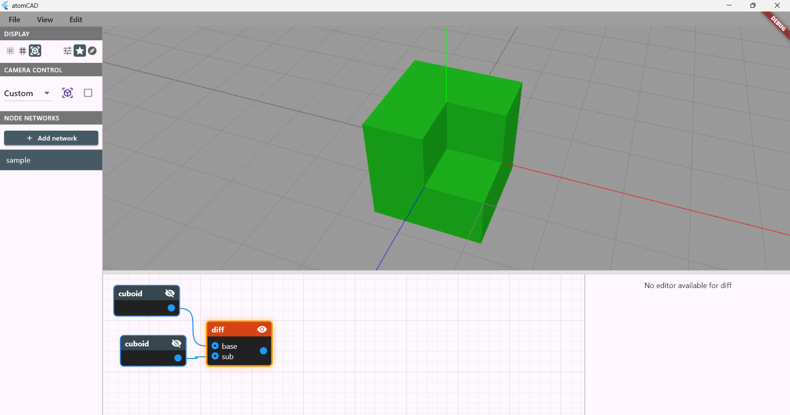
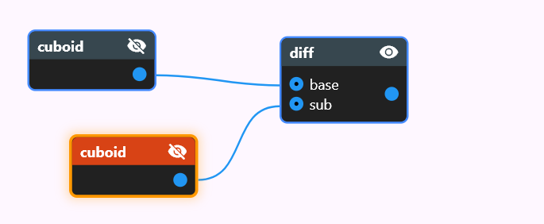
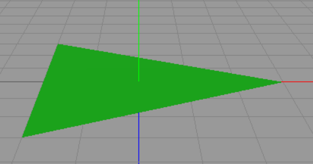
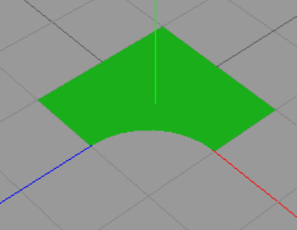
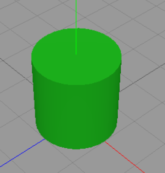
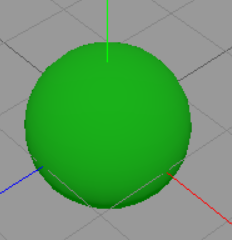
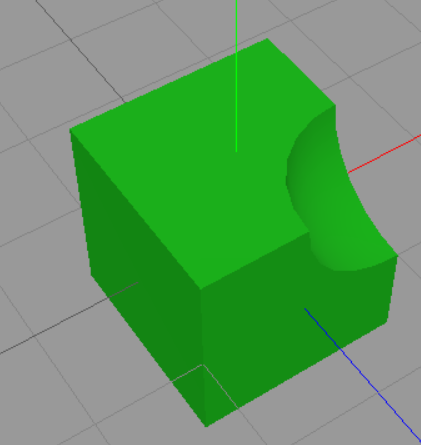

# atomCAD User Guide & Reference

*Comprehensive user guide and a complete reference for built-in nodes.*

## Introduction

atomCAD is a CAD application for Atomically Precise Manufacturing (APM).
With atomCAD you can design arbitrary covalently bonded atomic structures that are constrained to a crystal lattice and suitable for physical (and, in the future, manufacturable) workflows.


Basic features:
- **Arbitrary unit cells.** Any unit cell defined by the lattice parameters `(a, b, c, α, β, γ)` is supported. The implied crystal system (*cubic, tetragonal, orthorhombic, hexagonal, trigonal, monoclinic, triclinic*) and its symmetries are automatically determined.
- **Lattice-constrained geometry.** Geometries are created relative to the unit cell lattice, and operations on those geometries preserve lattice constraints. This makes it easier to design atomic crystal structures that are aligned, physically accurate, and manufacturable.
- **User-definable motifs.** Geometries can be filled with motifs to create atomic structures. Motifs are user-definable: any covalently bonded crystal structure can be specified. The default motif is cubic diamond.
- **Parametric, composable designs.** atomCAD designs are parametric and composed as visual node networks, enabling non-destructive editing. Custom node types can be created by defining subnetworks. The node network includes functional-programming elements and is Turing-complete.

Planned features include:

- Surface reconstruction support
- Defect editing and placement tools
- Atomically Precise Manufacturing (APM) integration
- A streaming level-of-detail system to support larger structures that currently do not fit in memory
- Relaxation and simulation support

We’d love to hear about your use case: what are you using — or planning to use — atomCAD for?


## Notations in this document

Instead of the usual TODO notation we use TODOC and TODEV notation in this document:

- TODEV: means that the feature mentioned needs to be developed and documented
- TODOC: means that something needs to be documented but is already developed in atomCAD

## Parts of the UI

This is how the full window looks like:


---

We will discuss the different parts of the UI in detail. The parts are:

- 3D Viewport
- Node Networks List Panel
- Node Network Editor Panel
- Node Properties Panel
- Geometry Visualization Preferences Panel
- Camera Control Panel

## 3D Viewport

The node network results are displayed here.


You can navigate the viewport with the mouse as follows:

- **Pan (move camera):** Middle mouse button + drag
- **Orbit:** Right mouse button + drag
- **Zoom:** Mouse scroll wheel

All three operations use a *pivot point*. The pivot is the point where you click when you start dragging: if you click an object, the pivot is the hit point on that object; otherwise the pivot is the point on the XY plane under the cursor. You can visualize the pivot as a small red cube in **Edit → Preferences** (`Display camera pivot point`). For example, orbiting rotates the camera around the pivot point, and zooming moves the camera toward (or away from) the pivot point.

Orbiting is constrained so the camera never rolls (no tilt). This prevents users from getting disoriented. If you need complete freedom, a 6-degree-of-freedom (6DoF) camera mode will be available soon. 

## Node network composability and Node Networks list panel

A **node network** is a collection of nodes. A node may be either a built-in node or a custom node.
 You create a custom node by adding a node network whose name matches the custom node’s name — that node network becomes the implementation of the custom node. In other words, node networks act like functions: when node `B` is used inside node network `A`, the network `B` serves as a subnetwork of `A`.

Because nodes can have parameters and outputs, subnetworks can expose inputs and outputs that map to the outer node’s parameters — you will see how to set these up in the subnetworks section later in this document.

A structure design consists of node networks. The list of node networks in the current design is shown in the **Node Networks** panel. Select a network in the panel to open it in the node network editor. To create a new network, click the **Add Network** button..


## Node network editor panel



### Anatomy of a node


### Anatomy of a node

A **node** may have zero or more *named input pins* (also called the node’s *parameters*). Each node has exactly one *regular output pin*, located at the right-center of the node, and one *function pin*, located at the upper-right corner (the function pin is described in the functional programming section).

Each pin has a data type. Hovering over a pin shows its type; the pin color also indicates the type. A wire may only connect an output pin to an input pin, and the two pins must either have the same data type or the output type must be implicitly convertible to the input type. TODOC: type conversion rules.

Supported basic data types include:

- `Bool`
- `String`
- `Int`
- `Float`
- `Vec2` — 2D vector
- `Vec3` — 3D vector
- `IVec2` — 2D integer vector
- `IVec3` — 3D integer vector
- `UnitCell`
- `Geometry2D`
- `Geometry` — 3D geometry
- `Atomic` — atomic structure
- `Motif`

Array types are supported. The type `[Int]` means an array of `Int` values.

Function types are written `A -> B`: a function that takes a parameter of type `A` and returns a value of type `B` has type `A -> B`.

Input pins can be array-typed. An array input pin is visually indicated with a small dot. Node networks provide a convenience where you can connect multiple wires into an array-typed input pin; the connected values are concatenated into a single array. Also, a value of type `T` is implicitly convertible to an array of `T` (`T` → `[T]`).

### Navigating in the node network editor panel

The node network canvas can be panned by dragging the middle mouse button.
If you get lost you can use the 'View/Reset node network view' menu item.

### Manipulating nodes and wires

**Add nodes**
Right-click in the node editor to open the **Add Node** menu and add a new node.

**Move nodes**
Left-click a node and drag to move it.

**Connect pins**
Left-click and drag from an output pin to an input pin to create a wire. To disconnect a wire, select it and press `Del` (see Selection below).

**Selection**
Currently, only one node or one wire may be selected at a time by left-clicking it. Selection is used for:

- Deleting the selected node or wire with the `Del` key.
- Editing the selected node’s properties in the **Node Properties** panel.
- Enabling viewport interactions for the selected node: many node types expose interactive *gadgets* in the viewport; the exact interactions depend on the node type (see the Nodes Reference section).

**Visibility vs selection**
Selecting a node does *not* make its output visible. Node visibility is controlled independently by the eye icon in the node’s upper-right corner. The **Geometry Visualization** preferences panel also contains node display policies that may automatically change node visibility when selections change (see **Geometry Visualization** preferences).

TODEV: being able to select and drag multiple nodes should be possible.

## Node Properties Panel

The properties of the active node can be edited here.


This is different for each node, we will discuss this in depth at the specific nodes. There are some general features though:

- When dragging the mouse on integer number editor fields the number can be
incremented or decremented using the moue wheel. Shift + mouse wheel works in 10 increments.

## Geometry Visualization Preferences Panel

There are common settings for geometry visualization here.


At the left of the panel the **visualization mode** of geometry nodes can be selected. The possible options are:

- Surface Splatting: Little discs are regularly placed on the surface of the geometry. Internally uses the implicit evaluation of the node network geoemtry to determine where the surfaces are. (For example a sphere is actually a sphere in this representation.)
- Wireframe (Explicit mesh): The geometry is rendered as a wireframe. Internally uses polygon meshes to evaluate the node network: we call this explicit evaluation. In this case for example a sphere is approximated by a polygon mesh.
- Solid (Explicit Mesh): The geometry is rendered as a solid. Internally uses the explicit evaluation of the node network geoemtry. This is the default visualization mode.

Both in case of 'surface splatting' and 'solid' visualization modes the outer surface of a geometry is rendered green and the inner surface is rendered red.

At the right side the **node display policy** can be selected. These are the following:

- Manual (User Selection) In this case whether the output of a node is visible or not should be set manually by the user and it has nothing to do with which node is selected.
- Prefer Selected Nodes. This is the default policy. In this case in each connected node island if the selected node is in that island the selected node is vmade isible, if there is no selected node in that island the frontier nodes are visible.
- Prefer Frontier Nodes. In this case the frontier nodes are visible. Frontier nodes are the ones whose output is not connected to any input, so these can be thought of the current 'results' of the network.

Even in non Manual modes you can use the eye icon to toggle the visibility of a node, and this will stay intact until you change the current selection.

## Camera Control Panel

Contains common settings for the camera.


## Menu Bar

For loading and saving a design and for opening the preferences panel:


## Nodes reference

We categorize nodes by their functionality and/or output pin data type. There are the following categories of nodes:

- Math nodes and programming nodes
- 2D Geometry nodes
- 3D Geometry nodes
- Atomic structure nodes
- Other nodes

You create 2D geometry to eventually use the *extrude* node to create 3D geometry from it. You create 3D geometry to eventually use the *geo_to_atom* node to create an atomic structure from it.

### Math and programming nodes

#### int

Outputs an integer value. 

#### float

Outputs a float value. 

#### ivec2

Outputs an IVec2 value.

#### ivec3

Outputs an IVec3 value.

#### vec2

Outputs a Vec2 value.

#### vec3

Outputs a Vec3 value.

#### expr

You can type in a mathematical expression and it will be evaluated on its output node.
The input pins can be dynamically added on the node editor panel, you can select the name and data type of the input parameters.

The expr node supports scalar arithmetic, vector operations, conditional expressions, and a comprehensive set of built-in mathematical functions.

**Expression Language Features:**

**Literals**
- integer literals (e.g., `42`, `-10`)
- floating point literals (e.g., `3.14`, `1.5e-3`, `.5`)
- boolean values (`true`, `false`)

**Arithmetic Operators:**
- `+` - Addition
- `-` - Subtraction  
- `*` - Multiplication
- `/` - Division
- `%` - Modulo (integer remainder, only works on integers)
- `^` - Exponentiation
- `+x`, `-x` - Unary plus/minus

**Comparison Operators:**
- `==` - Equality
- `!=` - Inequality
- `<` - Less than
- `<=` - Less than or equal
- `>` - Greater than
- `>=` - Greater than or equal

**Logical Operators:**
- `&&` - Logical AND
- `||` - Logical OR
- `!` - Logical NOT

**Conditional Expressions:**

```
if condition then value1 else value2
```
Example: `if x > 0 then 1 else -1`

**Vector Operations:**

*Vector Constructors:*
- `vec2(x, y)` - Create 2D float vector
- `vec3(x, y, z)` - Create 3D float vector
- `ivec2(x, y)` - Create 2D integer vector
- `ivec3(x, y, z)` - Create 3D integer vector

*Member Access:*
- `vector.x`, `vector.y`, `vector.z` - Access vector components

*Vector Arithmetic:*
- Vector + Vector (component-wise)
- Vector - Vector (component-wise)
- Vector * Vector (component-wise)
- Vector * Scalar (scaling)
- Scalar * Vector (scaling)
- Vector / Scalar (scaling)

*Type Promotion:*

Integers and integer vectors automatically promote to floats and float vectors when mixed with floats.

**Vector Math Functions:**
- `length2(vec2)` - Calculate 2D vector magnitude
- `length3(vec3)` - Calculate 3D vector magnitude
- `normalize2(vec2)` - Normalize 2D vector to unit length
- `normalize3(vec3)` - Normalize 3D vector to unit length
- `dot2(vec2, vec2)` - 2D dot product
- `dot3(vec3, vec3)` - 3D dot product
- `cross(vec3, vec3)` - 3D cross product
- `distance2(vec2, vec2)` - Distance between 2D points
- `distance3(vec3, vec3)` - Distance between 3D points

**Integer Vector Math Functions:**
- `idot2(ivec2, ivec2)` - 2D integer dot product (returns int)
- `idot3(ivec3, ivec3)` - 3D integer dot product (returns int)
- `icross(ivec3, ivec3)` - 3D integer cross product (returns ivec3)

**Mathematical Functions:**
- `sin(x)`, `cos(x)`, `tan(x)` - Trigonometric functions
- `sqrt(x)` - Square root
- `abs(x)` - Absolute value (float)
- `abs_int(x)` - Absolute value (integer)
- `floor(x)`, `ceil(x)`, `round(x)` - Rounding functions

**Operator Precedence (highest to lowest):**
1. Function calls, member access, parentheses
2. Unary operators (`+`, `-`, `!`)
3. Exponentiation (`^`) - right associative
4. Multiplication, division, modulo (`*`, `/`, `%`)
5. Addition, subtraction (`+`, `-`)
6. Comparison operators (`<`, `<=`, `>`, `>=`)
7. Equality operators (`==`, `!=`)
8. Logical AND (`&&`)
9. Logical OR (`||`)
10. Conditional expressions (`if-then-else`)

**Example Expressions:**
```
2 * x + 1                           // Simple arithmetic
x % 2 == 0                          // Check if x is even (modulo)
if x % 2 > 0 then -1 else 1         // Conditional with modulo
vec3(1, 2, 3) * 2.0                // Vector scaling  
length3(vec3(3, 4, 0))              // Vector length (returns 5.0)
if x > 0 then sqrt(x) else 0       // Conditional with function
dot3(normalize3(a), normalize3(b))  // Normalized dot product
sin(3.14159 / 4) * 2               // Trigonometry
vec2(x, y).x + vec2(z, w).y        // Member access
distance3(vec3(0,0,0), vec3(1,1,1)) // 3D distance
```

#### range

TODOC

#### map

TODOC

### 2D Geometry nodes

These nodes output a 2D geometry which can be used later as an input to an extrude node to create 3d geoemtry.
2D geometry nodes are on the XY plane.
Similarly to the 3D geometry nodes, positions and sizes are usually discrete integer numbers meant in crystal lattice coordinates.

#### rect

Outputs a rectangle with integer minimum corner coordinates and integer width and height.


#### circle

Outputs a circle with integer center coordinates and integer radius.


#### reg_poly

Outputs a regular polygon with integer radius. The number of sides is a property too.
Now that we have general polygon node this node is less used.




#### polygon

Outputs a general polygon with integer coordinate vertices. Both convex and concave polygons can be created with this node.
The vertices can be freely dragged.
You can create a new vertex by dragging an edge.
Delete a vertex by dragging it onto one of its neighbour.


#### half_plane

Outputs a half plane.
You can manipulate the two integer coordinate vertices which define the boundary line of the half plane.
Both vertices are displayed as a ritnalge based prism. The direction of the half plane is indicated by the direction of the triangle.


#### union_2d

Outputs the boolean union of any number of 2D geometries. The 'shapes' input pin is a multi pin.


#### intersect_2d

Outputs the boolean intersection of two 2D geometries. The 'shapes' input pin is a multi pin.


#### diff_2d

Outputs the boolean difference of two 2D geometries.




We could have designed this node to have two 'single pin' inputs but for convenience reasons (to avoid needing to use too many nodes)
both of its input pins are multi pins and first a union operation is done on the individual input pins before the diff operation.
The node expression is the following:

```
diff_2d(base, sub) = diff_2d(union_2d(...each base input...), union_2d(...each sub input...))
```

### 3D Geometry nodes

These nodes output a 3D geometry which can be used later as an input to an atom_to_geo node to create an atomic structure.
Positions and sizes are usually discrete integer numbers meant in crystal lattice coordinates.

#### A note on the scaling of geometry in the viewport

When displaying geometry, crystal lattice coordinates are converted to amstrongs by multiplying them with the diamond crystal structure unit cell size (**3.567 Ångströms**). The grid displayed in the viewport is also scaled by this factor. If you use an geo_to_atom node to convert a geometry to diamond, its size will be the same. But if you convert the geometry to another crystal structure the size will be different: it will be scaled instead by the unit cell size of that crystal structure.


#### extrude

Extrudes a 2D geometry to a 3D geometry.





#### cuboid

Outputs a cuboid with integer minimum corner coordinates and integer extent coordinates.


#### sphere

Outputs a sphere with integer center coordinates and integer radius.




#### half_space

Outputs a half space.


It is possible to manually edit properties of the half space or use the gadget which appears
when the node is selected.

- The `Center` property is a 3d integer vector. It is displayed as a red sphere in the gadget.
- The `Miller Index` property is also a 3d integer vector which determines the normal of the half space. You need not enter it manually: one way to enter it is selecting it on the 'earth-like' map. The amount of points appearing on the map depends on the `Max Miller Index` property which you can also select. 
- `Shift` is an integer property and it defines the shift from the center in the direction of the Miller Index.
Its integer number is meant in the smallest possbile increments where at each shift value the plane goes through
crystal lattice points.

The boundary of a half space is an **infinite plane**. In atomCAD a half space is rendered specially compared to other geometry.
Even in solid rendering mode it is rendered as a **grid of stripes**.
The reason is that normal solid rendering would not give enough information about its spatial placement. (We would just see that the whole screen is covered in green, which would not be very helpful.)
Once a half space participates in boolean operations we no longer render it as a grid of stripes: results of boolean operations are rendered normally as any other geometry.

##### Manipulating the half space gadget

The half space can be manipulatedby interacting with the gadget.
- First, you can **drag the light blue cylinder** to modify the **shift** value of the plane.
- Second, you can **click on the red sphere** at the center: when you do this circular discs appear on a sphere surface,
each corresponding to a **miller index**. You can select one of the disks by dragging the mouse to one of them while you
hold the mouse left button and release the left button on the appripriate one.
The amount of circular discs appearing depends on the 'Max Miller Index' property you selected.


#### facet_shell

Builds a finite polyhedral **shell** by clipping an infinite lattice with a user‑supplied set of half‑spaces.
Internally it is implemented as the intersection of a set of half spaces: the reason for having this as a separate
built-in node is a set of convenience features.
Ideal for generating octahedra, dodecahedra, truncated polyhedra, Wulff shapes.


This node generally offers the same features as the half_space node, but some additional features are also available:

- clicking on a facet selectes it.
- when a facet is selected you can manipulate it the same way as a half space.
- if you turn on the **symmetrize** boolean property for a facet, the facet will be symmetrized using the natural point group symmetry according to the miller index family. Basically a symmetrized facet is replaced with a set of facets according to the following table:

```
Miller family | Num. of planes | Equivalents generated
{100}         | 6              | (±1, 0, 0), (0, ±1, 0), (0, 0, ±1) — the six cube faces
{110}         | 12             | All permutations of (±1, ±1, 0) — normals pointing to the mid‑edges of the cube
{111}         | 8              | All sign combinations of (±1, ±1, ±1) — normals pointing to the eight corners of the cube
{hhl} (h≠l)   | 24             | All permutations of (±h, ±h, ±l) — “mixed” families where two indices are equal, one distinct
General (hkl) | 48             | All permutations of (±h, ±k, ±l) — the full 48‑member orbit under O<sub>h</sub>
```

- The 'Split symmetry members' button creates individual facets from the symmetry variants of a facet.

#### union

Outputs the boolean union of any number of 3D geometries. The 'shapes' input pin is a multi pin.


#### intersect

Outputs the boolean intersection of two 3D geometries. The 'shapes' input pin is a multi pin.


#### diff

Outputs the boolean difference of two 3D geometries.




We could have designed this node to have two 'single pin' inputs but for convenience reasons (to avoid needing to use too many nodes)
both of its input pins are multi pins and first a union operation is done on the individual input pins before the diff operation.
The node expression is the following:

```
diff(base, sub) = diff(union(...each base input...), union(...each sub input...))
```

#### geo_trans

Transforms a geometry in the discrete lattice space.
'Continuous' transformation in the lattice space is not allowed (for continuous transformations use the atom_trans node which is only available for atomic structures).


The integer coordinates for translation are of course meant in crystal lattice coordinates.
The integer cooridinates for rotation are meant in multiples of 90 degrees.

The gadget for the node is draggable and allows translations.

##### Nuances of the geometry transformations in atomCAD

When designing the geometry transformation system in atomCAD we had to make some choices. In all cases our aim was to make the system as intuitive as possbile. The choices are the following:

- in an atomCAD node network every geometry output contains not only the geometry itself but also a transformation gizmo orientation and position (6 degree of freedom). We also call this the **local coordinate system** or **local transform** of the geometry output but we often just casually refer to it as the placement of **the transformation gizmo**. 
- The translation vector of the geo_trans node is meant in world space irrespective of the orientation of the transformation gizmo.
- The rotation angles are meant as euler angles applied in the order xyx on the local gadget axes. 
- For geometry we have a simple guiding axiom: **geometry** is always **rigidly attached to the transformation
gizmo**. (Geometry never moves in the transformation gizmo's local coordinate system.)
- All non-transformation nodes have a default placement for the transformation gizmo: For example in case of a cuboid or sphere the position is the center of mass, the orientation is the identity rotation. For unions and intersection the position is the average of the positions of the inputs and the rotation is the identity rotation. 

The reason for our choices:
- rotation is simple to reason about if interpreted as local rotations
- translation is more easy to reason about as world space translation

Disadvantages:
- In case of rotated axes when dragging a gizmo axis (e.g. dragging the x axis)
actually a different axis coordinate is changed in the node data (e.g. y coordinate is changed, as the local x axis is the global y axis)

Ultimately the main question is: what was the user's intent with that node? While it is hard to capture intent we think that
these choices are the best we can do for most cases.

### Atomic structure nodes

#### import_xyz

Imports an atomic structure from an xyz file.
It converts file paths to relative paths whenever possible (if the file is in the same directory as the node or in a subdirectory) so that when you copy your whole
project to another location or machine the XYZ file references will remain valid.

#### geo_to_atom

Converts a 3D geometry into an atomic structure by carving out a crystal from an infinite crystal lattice using the geometry on its input.


#### atom_trans

The atom_trans node is similar to the geo_trans node but it is available for atomic structures instead of geometry
and the transformation happens not in integer lattice space but in continuous space where one unit is one angstrom.


We repeat here the main design decisions which are common with the geo_trans node:

- similarly to geometry output every atomic structure output also contains a transformation gizmo orientation and position. 
- The translation vector of the atom_trans node is meant in world space irrespective of the orientation of the transformation gizmo.
- The rotation angles are meant as euler angles in degrees applied in the order xyx on the local gadget axes. 
- atomic structures are always **rigidly attached to the transformation
gizmo**. (atomic structures never moves in the transformation gizmo's local coordinate system.)

The gadget for the node is draggable and allows translations.

TODEV: The gadget should also support rotations.

#### edit_atom

This node enables the manual editing of atomic structures. In a node network every single atomic modification could be placed into a separate node but this would usually lead to a very complex node network. In atomCAD we made a compromise: an edit_atom_node is a set of atomic editing commands. There user can freely group atomic editing commands into edit_atom_nodes at their will. 


The edit atom node is probably the most complex node in atomCAD. When you select this node you can feel like you are in a separate sub-application inside atomCAD. The node properties section of this node contains the user interface of this 'atom editor sub-application'. 

The UI contains undo and redo buttons which are controlling only the commands inside the node (this is not a global undo redo functionality of the application).

The atom editor UI is based on 'tools': one tool can be active at a time. The active tool determines how you can interact with the
atomic structure on the viewport.

##### Default tool


Features:
- Select atoms and bonds using the left mouse button. Simple click replaces the selection, shift click adds to the selection and control click inverts the selection of the clicked object.
- Delete selected
- Replace all selected atom with a specific element
- Transform (move and rotate) selected atoms

TODEV: gadget for the transformation of the selected atoms

##### Add atom tool


- Add a specific atom by left-clicking in the viewport

##### Add bond tool


- Add bonds by left-clicking on two atoms in the viewport

### Other nodes

#### unit_cell

TODOC

#### motif

TODOC
