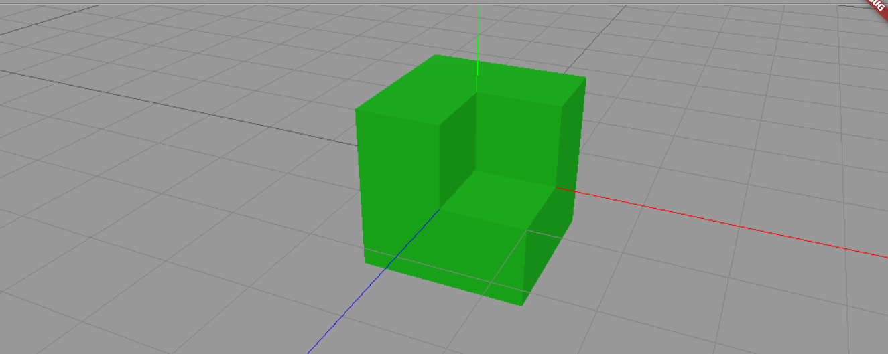
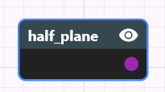
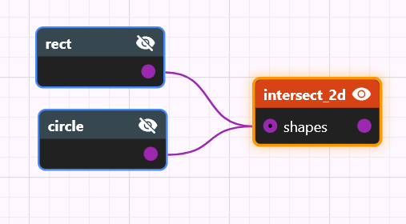
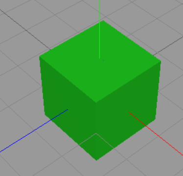

# atomCAD User Guide & Reference

*Comprehensive user guide and a complete reference for built-in nodes.*

## Introduction

atomCAD is a CAD application for Atomically Precise Manufacturing (APM).
With atomCAD you can design arbitrary covalently bonded atomic structures that are constrained to a crystal lattice and suitable for physical (and, in the future, manufacturable) workflows.


Basic features:
- **Arbitrary unit cells.** Any unit cell defined by the lattice parameters `(a, b, c, α, β, γ)` is supported. The implied crystal system (*cubic, tetragonal, orthorhombic, hexagonal, trigonal, monoclinic, triclinic*) and its symmetries are automatically determined.
- **Lattice-constrained geometry.** Geometries are created relative to the unit cell lattice, and operations on those geometries preserve lattice constraints. This makes it easier to design atomic crystal structures that are aligned, physically accurate, and manufacturable.
- **User-definable motifs.** Geometries can be filled with motifs to create atomic structures. Motifs are user-definable: any covalently bonded crystal structure can be specified. The default motif is cubic diamond.
- **Parametric, composable designs.** atomCAD designs are parametric and composed as visual node networks, enabling non-destructive editing. Custom node types can be created by defining subnetworks. The node network includes functional-programming elements and is Turing-complete.

Planned features include:

- Surface reconstruction support
- Defect editing and placement tools
- Atomically Precise Manufacturing (APM) integration
- A streaming level-of-detail system to support larger structures that currently do not fit in memory
- Relaxation and simulation support

We’d love to hear about your use case: what are you using — or planning to use — atomCAD for?

## Notations in this document

Instead of the usual TODO notation we use TODOC and TODEV notation in this document:

- TODEV: means that the feature mentioned needs to be developed and documented
- TODOC: means that something needs to be documented but is already developed in atomCAD

## Parts of the UI

This is how the full window looks like:


---

We will discuss the different parts of the UI in detail. The parts are:

- 3D Viewport
- Node Networks List Panel
- Node Network Editor Panel
- Node Properties Panel
- Geometry Visualization Preferences Panel
- Camera Control Panel

## 3D Viewport

The node network results are displayed here.



You can navigate the viewport with the mouse as follows:

- **Pan (move camera):** Middle mouse button + drag
- **Orbit:** Right mouse button + drag
- **Zoom:** Mouse scroll wheel

All three operations use a *pivot point*. The pivot is the point where you click when you start dragging: if you click an object, the pivot is the hit point on that object; otherwise the pivot is the point on the XY plane under the cursor. You can visualize the pivot as a small red cube in **Edit → Preferences** (`Display camera pivot point`). For example, orbiting rotates the camera around the pivot point, and zooming moves the camera toward (or away from) the pivot point.

Orbiting is constrained so the camera never rolls (no tilt). This prevents users from getting disoriented. If you need complete freedom, a 6-degree-of-freedom (6DoF) camera mode will be available soon. 

## Node network composability and Node Networks list panel

A **node network** is a collection of nodes. A node may be either a built-in node or a custom node.
 You create a custom node by adding a node network whose name matches the custom node’s name — that node network becomes the implementation of the custom node. In other words, node networks act like functions: when node `B` is used inside node network `A`, the network `B` serves as a subnetwork of `A`.

Because nodes can have parameters and outputs, subnetworks can expose inputs and outputs that map to the outer node’s parameters — you will see how to set these up in the subnetworks section later in this document.

A structure design consists of node networks. The list of node networks in the current design is shown in the **Node Networks** panel. Select a network in the panel to open it in the node network editor. To create a new network, click the **Add Network** button..


## Node network editor panel


### Anatomy of a node


### Anatomy of a node

A **node** may have zero or more *named input pins* (also called the node’s *parameters*). Each node has exactly one *regular output pin*, located at the right-center of the node, and one *function pin*, located at the upper-right corner (the function pin is described in the functional programming section).

Each pin has a data type. Hovering over a pin shows its type; the pin color also indicates the type. A wire may only connect an output pin to an input pin, and the two pins must either have the same data type or the output type must be implicitly convertible to the input type. TODOC: type conversion rules.

Supported basic data types include:

- `Bool`
- `String`
- `Int`
- `Float`
- `Vec2` — 2D vector
- `Vec3` — 3D vector
- `IVec2` — 2D integer vector
- `IVec3` — 3D integer vector
- `UnitCell`
- `Geometry2D`
- `Geometry` — 3D geometry
- `Atomic` — atomic structure
- `Motif`

Array types are supported. The type `[Int]` means an array of `Int` values.

Function types are written `A -> B`: a function that takes a parameter of type `A` and returns a value of type `B` has type `A -> B`.

Input pins can be array-typed. An array input pin is visually indicated with a small dot. Node networks provide a convenience where you can connect multiple wires into an array-typed input pin; the connected values are concatenated into a single array. Also, a value of type `T` is implicitly convertible to an array of `T` (`T` → `[T]`).

### Navigating in the node network editor panel

The node network canvas can be panned by dragging the middle mouse button.
If you get lost you can use the 'View/Reset node network view' menu item.

### Manipulating nodes and wires

**Add nodes**
Right-click in the node editor to open the **Add Node** menu and add a new node.

**Move nodes**
Left-click a node and drag to move it.

**Connect pins**
Left-click and drag from an output pin to an input pin to create a wire. To disconnect a wire, select it and press `Del` (see Selection below).

**Selection**
Currently, only one node or one wire may be selected at a time by left-clicking it. Selection is used for:

- Deleting the selected node or wire with the `Del` key.
- Editing the selected node’s properties in the **Node Properties** panel.
- Enabling viewport interactions for the selected node: many node types expose interactive *gadgets* in the viewport; the exact interactions depend on the node type (see the Nodes Reference section).

**Visibility vs selection**
Selecting a node does *not* make its output visible. Node visibility is controlled independently by the eye icon in the node’s upper-right corner. The **Geometry Visualization** preferences panel also contains node display policies that may automatically change node visibility when selections change (see **Geometry Visualization** preferences).

TODEV: being able to select and drag multiple nodes should be possible.

### Node properties vs. input pins

- Most placed node is the node network has associated data. This data consists of properties of the node which are editable in the node properties panel.
- Often a node has both a property and input pin for the same concept. For example the cuboid node has a Min corner property and also has a min_corner input pin. In these cases you can both manually (property) and programmatically (input pin) control this aspect. The input pin always takes precedence.

As an example see the input pins and the properties of the `cuboid` node:


## Node Properties Panel

The properties of the active node can be edited here.


This is different for each node, we will discuss this in depth at the specific nodes. There are some general features though:

- When dragging the mouse on integer number editor fields the number can be
incremented or decremented using the moue wheel. Shift + mouse wheel works in 10 increments.

## Geometry Visualization Preferences Panel

.This panel contains common settings for how geometry nodes are visualized.


### Visualization mode

Choose how geometry node outputs are rendered:

- **Surface Splatting** — The surface is represented by many small discs sampled from the object’s Signed Distance Field (SDF). This mode renders true implicit geometry (no polygonal mesh is produced).
- **Wireframe (Explicit Mesh)** — The geometry is evaluated to a polygonal mesh and displayed as a wireframe (edges only). Use this mode when you need to inspect mesh topology or see precise polygon edges.
- **Solid (Explicit Mesh)** — The geometry is evaluated to a polygonal mesh and rendered as a solid. This is the default mode.

In **Surface Splatting** and **Solid** modes the outer surface is shown in green and the inner surface in red (inner = surface facing inward).

### Node display policy

Choose how node output visibility is managed:

- **Manual (User Selection)** — Visibility is controlled entirely by the eye icon on each node; selection changes do not affect visibility.
- **Prefer Selected Nodes** *(default)* — Visibility is resolved per *node island* (a node island is a connected component of the network):
  - If an island contains the currently selected node, that selected node's output is made visible.
  - If there is no selected node in the island, the output of the island’s frontier nodes are made visible.
- **Prefer Frontier Nodes** — In every island, the output of the frontier nodes are made visible. Frontier nodes are nodes whose output is not connected to any other node’s input — i.e., they represent the current “results” or outputs of that island.

Even when a non-Manual policy is active, you can still toggle a node’s visibility manually using the eye icon; that manual visibility will persist until the selection or policy changes it.

## Camera Control Panel

Contains common settings for the camera.


## Menu Bar

Used for loading and saving a design, exporting a design to .xyz or .mol, and for opening the preferences panel.


## Subnetworks

TODOC: parameter nodes and output nodes

## Nodes reference

We categorize nodes by their functionality and/or output pin data type. There are the following categories of nodes:

- Math nodes and programming nodes
- 2D Geometry nodes
- 3D Geometry nodes
- Atomic structure nodes
- Other nodes

You create 2D geometry to eventually use the **extrude** node to create 3D geometry from it. You create 3D geometry to eventually use the **atom_fill** node to create an atomic structure from it.

### Math and programming nodes

#### int

Outputs an integer value. 

#### float

Outputs a float value. 

#### ivec2

Outputs an IVec2 value.

#### ivec3

Outputs an IVec3 value.

#### vec2

Outputs a Vec2 value.

#### vec3

Outputs a Vec3 value.

#### expr


You can type in a mathematical expression and it will be evaluated on its output pin.
The input pins can be dynamically added on the node editor panel, you can select the name and data type of the input parameters.

The expr node supports scalar arithmetic, vector operations, conditional expressions, and a comprehensive set of built-in mathematical functions.

**Expression Language Features:**

**Literals**

- integer literals (e.g., `42`, `-10`)
- floating point literals (e.g., `3.14`, `1.5e-3`, `.5`)
- boolean values (`true`, `false`)

**Arithmetic Operators:**

- `+` - Addition
- `-` - Subtraction  
- `*` - Multiplication
- `/` - Division
- `%` - Modulo (integer remainder, only works on integers)
- `^` - Exponentiation
- `+x`, `-x` - Unary plus/minus

**Comparison Operators:**
- `==` - Equality
- `!=` - Inequality
- `<` - Less than
- `<=` - Less than or equal
- `>` - Greater than
- `>=` - Greater than or equal

**Logical Operators:**
- `&&` - Logical AND
- `||` - Logical OR
- `!` - Logical NOT

**Conditional Expressions:**

```
if condition then value1 else value2
```
Example: `if x > 0 then 1 else -1`

**Vector Operations:**

*Vector Constructors:*

- `vec2(x, y)` - Create 2D float vector
- `vec3(x, y, z)` - Create 3D float vector
- `ivec2(x, y)` - Create 2D integer vector
- `ivec3(x, y, z)` - Create 3D integer vector

*Member Access:*
- `vector.x`, `vector.y`, `vector.z` - Access vector components

*Vector Arithmetic:*
- Vector + Vector (component-wise)
- Vector - Vector (component-wise)
- Vector * Vector (component-wise)
- Vector * Scalar (scaling)
- Scalar * Vector (scaling)
- Vector / Scalar (scaling)

*Type Promotion:*

Integers and integer vectors automatically promote to floats and float vectors when mixed with floats.

**Vector Math Functions:**
- `length2(vec2)` - Calculate 2D vector magnitude
- `length3(vec3)` - Calculate 3D vector magnitude
- `normalize2(vec2)` - Normalize 2D vector to unit length
- `normalize3(vec3)` - Normalize 3D vector to unit length
- `dot2(vec2, vec2)` - 2D dot product
- `dot3(vec3, vec3)` - 3D dot product
- `cross(vec3, vec3)` - 3D cross product
- `distance2(vec2, vec2)` - Distance between 2D points
- `distance3(vec3, vec3)` - Distance between 3D points

**Integer Vector Math Functions:**

- `idot2(ivec2, ivec2)` - 2D integer dot product (returns int)
- `idot3(ivec3, ivec3)` - 3D integer dot product (returns int)
- `icross(ivec3, ivec3)` - 3D integer cross product (returns ivec3)

**Mathematical Functions:**
- `sin(x)`, `cos(x)`, `tan(x)` - Trigonometric functions
- `sqrt(x)` - Square root
- `abs(x)` - Absolute value (float)
- `abs_int(x)` - Absolute value (integer)
- `floor(x)`, `ceil(x)`, `round(x)` - Rounding functions

**Operator Precedence (highest to lowest):**
1. Function calls, member access, parentheses
2. Unary operators (`+`, `-`, `!`)
3. Exponentiation (`^`) - right associative
4. Multiplication, division, modulo (`*`, `/`, `%`)
5. Addition, subtraction (`+`, `-`)
6. Comparison operators (`<`, `<=`, `>`, `>=`)
7. Equality operators (`==`, `!=`)
8. Logical AND (`&&`)
9. Logical OR (`||`)
10. Conditional expressions (`if-then-else`)

**Example Expressions:**
```
2 * x + 1                           // Simple arithmetic
x % 2 == 0                          // Check if x is even (modulo)
if x % 2 > 0 then -1 else 1         // Conditional with modulo
vec3(1, 2, 3) * 2.0                // Vector scaling  
length3(vec3(3, 4, 0))              // Vector length (returns 5.0)
if x > 0 then sqrt(x) else 0       // Conditional with function
dot3(normalize3(a), normalize3(b))  // Normalized dot product
sin(3.14159 / 4) * 2               // Trigonometry
vec2(x, y).x + vec2(z, w).y        // Member access
distance3(vec3(0,0,0), vec3(1,1,1)) // 3D distance
```

#### range


#### map

TODOC


### 2D Geometry nodes

These nodes output a 2D geometry which can be used later as an input to an extrude node to create 3d geoemtry.
2D geometry nodes are on the XY plane.
Similarly to the 3D geometry nodes, positions and sizes are usually discrete integer numbers meant in crystal lattice coordinates.

#### rect

Outputs a rectangle with integer minimum corner coordinates and integer width and height.


#### circle

Outputs a circle with integer center coordinates and integer radius.


#### reg_poly

Outputs a regular polygon with integer radius. The number of sides is a property too.
Now that we have general polygon node this node is less used.


#### polygon

Outputs a general polygon with integer coordinate vertices. Both convex and concave polygons can be created with this node.
The vertices can be freely dragged.
You can create a new vertex by dragging an edge.
Delete a vertex by dragging it onto one of its neighbour.


#### half_plane

Outputs a half plane.
You can manipulate the two integer coordinate vertices which define the boundary line of the half plane.
Both vertices are displayed as a ritnalge based prism. The direction of the half plane is indicated by the direction of the triangle.




#### union_2d

Computes the Boolean union of any number of 2D geometries. The `shapes` input accepts an array of `Geometry2D` values (array-typed input; you can connect multiple wires and they will be concatenated).


#### intersect_2d

Computes the Boolean intersection of any number of 2D geometries. The `shapes` input pin accepts an array of `Geometry2D` values.




#### diff_2d

Computes the Boolean difference of two 2D geometries.


We could have designed this node to have two single geometry inputs but for convenience reasons (to avoid needing to use too many nodes) both of its input pins accept geometry arrays and first a union operation is done on the individual input pins before the diff operation.
The node expression is the following:

```
diff_2d(base, sub) = diff_2d(union_2d(...each base input...), union_2d(...each sub input...))
```

### 3D Geometry nodes

These nodes output a 3D geometry which can be used later as an input to an `atom_fill` node to create an atomic structure.
Positions and sizes are usually discrete integer numbers meant in crystal lattice coordinates.


#### extrude

Extrudes a 2D geometry to a 3D geometry.


#### cuboid

Outputs a cuboid with integer minimum corner coordinates and integer extent coordinates. Please note that if the unit cell is not cubic, the shape will not necessarily be a cuboid: in the most general case it will be a pralalepiped. 




#### sphere

Outputs a sphere with integer center coordinates and integer radius.


#### half_space

Outputs a half-space (the region on one side of an infinite plane).


**Properties**

- `Center` — 3D integer vector; shown as a red sphere in the gadget.
- `Miller Index` — 3D integer vector that defines the plane normal. Enter it manually or pick it from the *earth-like* map. The number of selectable indices on the map is controlled by `Max Miller Index`.
- `Shift` — integer offset along the Miller Index direction. Measured in the smallest lattice increments (each step moves the plane through lattice points).

**Visualization**
The half-space boundary is an infinite plane. In the editor it is shown as a striped grid (even in Solid mode) so you can see its placement; otherwise the whole view would be uniformly filled. After any Boolean operation involving a half-space, the result is rendered normally.

**Gadget controls**

- Drag the light-blue cylinder to change `Shift`.
- Click the red `Center` sphere to show circular discs (one per Miller index) on a selection sphere; drag to a disc and release to choose that Miller index. The number of discs depends on `Max Miller Index`.


**Notes**
Striped rendering is only a visualization aid; it does not affect Boolean results.

#### facet_shell

Builds a finite polyhedral **shell** by clipping an infinite lattice with a user‑supplied set of half‑spaces.
Internally it is implemented as the intersection of a set of half spaces: the reason for having this as a separate
built-in node is a set of convenience features.
Ideal for generating octahedra, dodecahedra, truncated polyhedra, Wulff shapes.


This node generally offers the same features as the half_space node, but some additional features are also available:

- clicking on a facet selectes it.
- when a facet is selected you can manipulate it the same way as a half space.
- if you turn on the **symmetrize** boolean property for a facet, the facet will be symmetrized using the natural point group symmetry according to the miller index family. Basically a symmetrized facet is replaced with a set of facets according to the following table:

```
Miller family | Num. of planes | Equivalents generated
{100}         | 6              | (±1, 0, 0), (0, ±1, 0), (0, 0, ±1) — the six cube faces
{110}         | 12             | All permutations of (±1, ±1, 0) — normals pointing to the mid‑edges of the cube
{111}         | 8              | All sign combinations of (±1, ±1, ±1) — normals pointing to the eight corners of the cube
{hhl} (h≠l)   | 24             | All permutations of (±h, ±h, ±l) — “mixed” families where two indices are equal, one distinct
General (hkl) | 48             | All permutations of (±h, ±k, ±l) — the full 48‑member orbit under O<sub>h</sub>
```

- The 'Split symmetry members' button creates individual facets from the symmetry variants of a facet.

#### union

Computes the Boolean union of any number of 3D geometries. The `shapes` input accepts an array of `Geometry` values (array-typed input; you can connect multiple wires and they will be concatenated).


#### intersect

Computes the Boolean intersection of any number of 3D geometries. The `shapes` input accepts an array of `Geometry` values.


#### diff

Computes the Boolean difference of two 3D geometries.


We could have designed this node to have two single `Geometry` inputs but for convenience reasons (to avoid needing to use too many nodes) both of its input pins accept an array of `Geometry` values and first a union operation is done on the individual input pins before the diff operation.
The node expression is the following:

```
diff(base, sub) = diff(union(...each base input...), union(...each sub input...))
```

#### lattice_move

Moves the geometry in the discrete lattice space with a relative vector.
'Continuous' transformation in the lattice space is not allowed (for continuous transformations use the atom_trans node which is only available for atomic structures).

You can directly enter the translation vector or drag the axes of the gadget.

TODOC: screenshots

#### lattice_rot

Rotates geometry in lattice space. Only rotations that are symmetries of the currently selected unit cell are allowed — the node exposes only those valid lattice-symmetry rotations.
You may provide a pivot point for the rotation; by default the pivot is the origin `(0,0,0)`.

TODOC: screenshots 

### Atomic structure nodes

#### import_xyz

Imports an atomic structure from an xyz file.
It converts file paths to relative paths whenever possible (if the file is in the same directory as the node or in a subdirectory) so that when you copy your whole project to another location or machine the XYZ file references will remain valid.

#### atom_fill

Converts a 3D geometry into an atomic structure by carving out a crystal from an infinite crystal lattice using the geometry on its input.

TODOC: more details, replace old geo_to_atom images


#### atom_trans

The atom_trans node transforms atomic structures. The transformation happens not in integer lattice space but in continuous space (real-space) where one unit is one angstrom.

By dragging the gadget axes you can move the structure. By dragging the thicker end of the gadget axes you can rotate the structure.  


#### edit_atom

Note: The `edit_atom` node will be more more usable when we will support atomic structure relaxations.

This node enables the manual editing of atomic structures. In a node network every single atomic modification could be placed into a separate node but this would usually lead to a very complex node network. In atomCAD we made a compromise: an edit_atom_node is a set of atomic editing commands. There user can freely group atomic editing commands into edit_atom_nodes at their will. 


The edit atom node is probably the most complex node in atomCAD. When you select this node you can feel like you are in a separate sub-application inside atomCAD. The node properties section of this node contains the user interface of this 'atom editor sub-application'. 

The UI contains undo and redo buttons which are controlling only the commands inside the node (this is not a global undo redo functionality of the application).

The atom editor UI is based on 'tools': one tool can be active at a time. The active tool determines how you can interact with the
atomic structure on the viewport.

##### Default tool


Features:
- Select atoms and bonds using the left mouse button. Simple click replaces the selection, shift click adds to the selection and control click inverts the selection of the clicked object.
- Delete selected
- Replace all selected atom with a specific element
- Transform (move and rotate) selected atoms

TODEV: gadget for the transformation of the selected atoms

##### Add atom tool


- Add a specific atom by left-clicking in the viewport

##### Add bond tool


- Add bonds by left-clicking on two atoms in the viewport

### Other nodes

#### unit_cell

Produces a `UnitCell` value representing the three lattice basis vectors defined by the lattice parameters `(a, b, c, α, β, γ)`.

**Usage**

- `UnitCell` values are carried by `Geometry2D` and `Geometry` objects and determine how geometry nodes interpret coordinates.
- Primitive geometry nodes (e.g., `polygon`, `cuboid`, `half_space`) expose a `unit_cell` input pin so you can supply a `UnitCell`.
- Boolean and other topology operations inherit the unit cell from their input geometries. A Boolean operation will error if its input geometries have different unit cells.

**Behavior / examples**

- When a non-orthogonal unit cell is used, primitives adapt accordingly — e.g., `cuboid` produces a parallelepiped rather than an axis-aligned box.
- If no unit cell is supplied, the default unit cell (cubic diamond) is used.

**Notes**

- The node automatically detects and displays the crystal system (cubic, tetragonal, orthorhombic, hexagonal, trigonal, monoclinic, triclinic) based on the provided parameters.


#### motif

The `motif` node produces a `Motif` value which can be an input to an`atom_fill` node and determines the content which fills the provided geometry.


The motif is defined textually using atomCAD's motif definition language.

The features of the language are basically parameterized fractional atom sites, explicit & periodic bond definitions.

There are 3 commands in the language for now: `param`, `site` and `bond`

**param**

The `param` command simply defines a *parameter element*. The name of the parameter element needs to be specified followed optionally by the default element name. (If the default element is not provided, it is carbon.) As an example, these are the parameter elements in the cubic zincblende motif:

```
PARAM PRIMARY C
PARAM SECONDARY C
```

Parameter elements are the ones that are replaced by concrete elements which the user chooses in the `atom_fill` node.

**site**

The `site` command defines an atomic site. You need to specify the site id, an element name, (which can be a regular element name like `C` or a parameter element). Then the 3 fractional lattice coordinates need to be specified. (Fractional coordinates are always 0 to 1. The unit cell basis vectors will be used to convert these to real cartesian coordinates.)
These are the sites in the cubic zincblende motif:

```
SITE CORNER PRIMARY 0 0 0

SITE FACE_Z PRIMARY 0.5 0.5 0
SITE FACE_Y PRIMARY 0.5 0 0.5
SITE FACE_X PRIMARY 0 0.5 0.5

SITE INTERIOR1 SECONDARY 0.25 0.25 0.25
SITE INTERIOR2 SECONDARY 0.25 0.75 0.75
SITE INTERIOR3 SECONDARY 0.75 0.25 0.75
SITE INTERIOR4 SECONDARY 0.75 0.75 0.25
```


**bond**

Finally the bond command defines a bond. Its two parameters are *site specifiers*. A site specifier is a site id optionally prefixed by a 3 character relative cell specifier. The relative cell specifier's three characters are for the three lattice directions: '-' means shift backwards in the specific direction, '+' means shift forward, '.' means no shift in the given direction.

It is important that the first site specifier in the bond must always have to have the … (meaning 0,0,0) relative cell specifier (which is the default, so it need not be specified)

These are the bonds in the cubic zincblende motif:

```
BOND INTERIOR1 ...CORNER
BOND INTERIOR1 ...FACE_Z
BOND INTERIOR1 ...FACE_Y
BOND INTERIOR1 ...FACE_X

BOND INTERIOR2 .++CORNER
BOND INTERIOR2 ..+FACE_Z
BOND INTERIOR2 .+.FACE_Y
BOND INTERIOR2 ...FACE_X

BOND INTERIOR3 +.+CORNER
BOND INTERIOR3 ..+FACE_Z
BOND INTERIOR3 ...FACE_Y
BOND INTERIOR3 +..FACE_X

BOND INTERIOR4 ++.CORNER
BOND INTERIOR4 ...FACE_Z
BOND INTERIOR4 .+.FACE_Y
BOND INTERIOR4 +..FACE_X
```

Please note that the format allows empty lines and lines started with the `#` character are treated as comment.

Here is the complete cubic zincblende motif:

```
# cubic zincblende motif

PARAM PRIMARY C
PARAM SECONDARY C

SITE CORNER PRIMARY 0 0 0

SITE FACE_Z PRIMARY 0.5 0.5 0
SITE FACE_Y PRIMARY 0.5 0 0.5
SITE FACE_X PRIMARY 0 0.5 0.5

SITE INTERIOR1 SECONDARY 0.25 0.25 0.25
SITE INTERIOR2 SECONDARY 0.25 0.75 0.75
SITE INTERIOR3 SECONDARY 0.75 0.25 0.75
SITE INTERIOR4 SECONDARY 0.75 0.75 0.25

BOND INTERIOR1 ...CORNER
BOND INTERIOR1 ...FACE_Z
BOND INTERIOR1 ...FACE_Y
BOND INTERIOR1 ...FACE_X

BOND INTERIOR2 .++CORNER
BOND INTERIOR2 ..+FACE_Z
BOND INTERIOR2 .+.FACE_Y
BOND INTERIOR2 ...FACE_X

BOND INTERIOR3 +.+CORNER
BOND INTERIOR3 ..+FACE_Z
BOND INTERIOR3 ...FACE_Y
BOND INTERIOR3 +..FACE_X

BOND INTERIOR4 ++.CORNER
BOND INTERIOR4 ...FACE_Z
BOND INTERIOR4 .+.FACE_Y
BOND INTERIOR4 +..FACE_X
```
