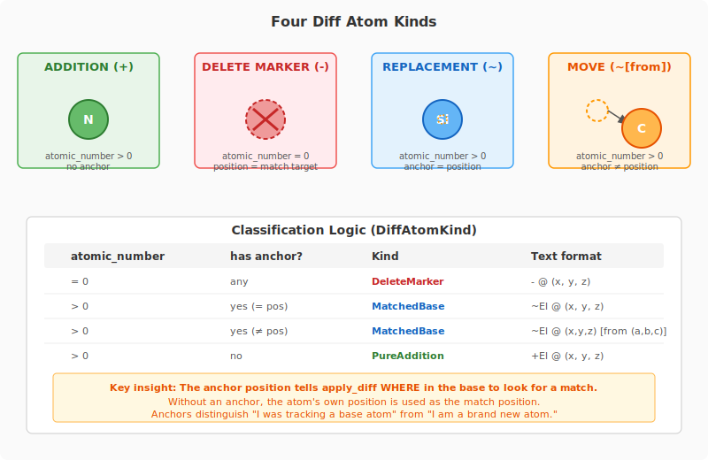
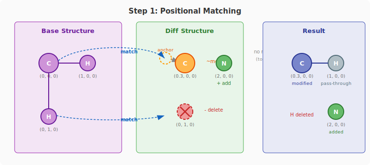
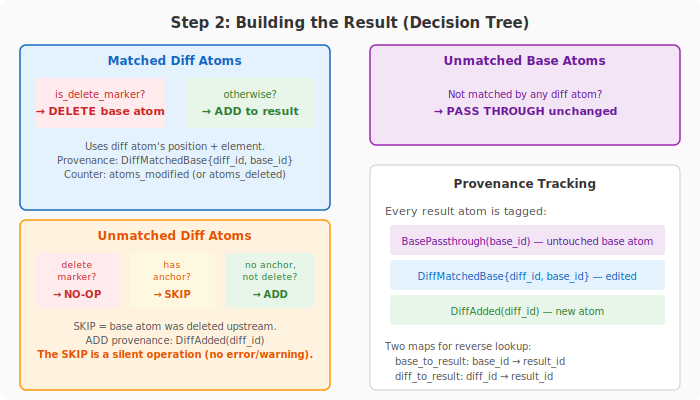
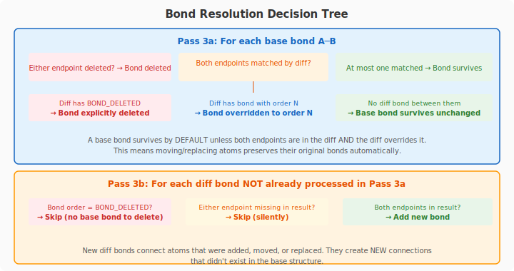
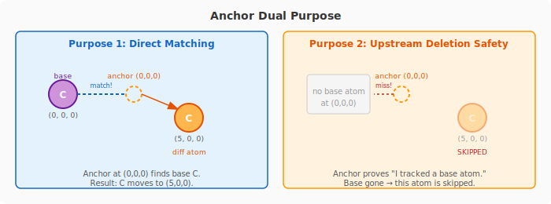
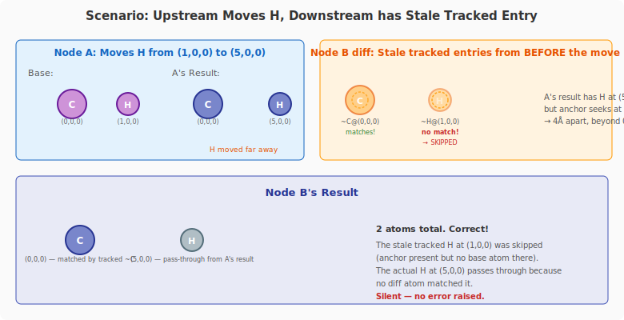

# Diff Representation and `apply_diff` — How atom_edit Works

This document explains the diff-based editing model used by `atom_edit` nodes. It covers the data representation, the matching algorithm, what happens when diffs are chained across multiple nodes, and all edge cases with their current behavior.

**Key source files:**
- `rust/src/crystolecule/atomic_structure_diff.rs` — the `apply_diff` algorithm
- `rust/src/structure_designer/nodes/atom_edit/atom_edit_data.rs` — diff mutation methods
- `rust/src/structure_designer/nodes/atom_edit/types.rs` — `DiffAtomKind` classification

---

## 1. Core Idea

An `atom_edit` node does not store a list of commands ("add atom here", "delete atom there"). Instead, it stores a single **diff** — an `AtomicStructure` with `is_diff = true`. When evaluated, the diff is applied to the input (base) structure via `apply_diff(base, diff, tolerance)` to produce the output.

```
┌──────────┐     ┌──────────┐     ┌──────────┐
│   Base    │ ──▶ │apply_diff│ ──▶ │  Result  │
│ Structure │     │          │     │ Structure│
└──────────┘     └──────────┘     └──────────┘
                      ▲
                      │
                 ┌──────────┐
                 │   Diff   │
                 │ Structure│
                 └──────────┘
```

---

## 2. Diff Atom Encoding

Every atom in the diff structure is one of four kinds, determined by two properties: **atomic_number** and **anchor position**.

### 2.1 The Four Atom Kinds



### 2.2 Summary Table

| Kind | `atomic_number` | Anchor | Meaning |
|------|----------------|--------|---------|
| **Addition** | > 0 | none | Brand new atom |
| **Delete marker** | = 0 | — | Marks base atom for removal |
| **Replacement** | > 0 | = position | Change element, same position |
| **Move** | > 0 | ≠ position | Reposition atom |

---

## 3. The `apply_diff` Algorithm

`apply_diff(base, diff, tolerance)` produces a result structure in three steps.

### 3.1 Step 1: Match Diff Atoms to Base Atoms

The algorithm uses **greedy nearest-first positional matching**:

1. For each diff atom, compute its **match position**: the anchor if present, otherwise the atom's own position.
2. Search the base structure's spatial grid for the nearest base atom within `tolerance` (default 0.1 Å).
3. Sort all diff candidates by closest match distance.
4. Greedily assign: closest matches claim their base atoms first. If a base atom is already claimed, try the next-nearest.



**Output of matching:** Two lists:
- **Matched pairs** — `(diff_id, base_id)` for each diff atom that found a base partner
- **Unmatched diff IDs** — diff atoms that didn't match any base atom

### 3.2 Step 2: Build the Result

Three passes over the data:

**Pass A — Matched diff atoms:**
For each matched pair `(diff_id, base_id)`:
- If diff atom is a **delete marker** → base atom is removed (not added to result)
- Otherwise → diff atom's position and element go into the result (replacement/move)

**Pass B — Unmatched diff atoms:**
For each unmatched diff atom:
- If it's a **delete marker** → no-op (trying to delete something that doesn't exist)
- If it **has an anchor** → **skip** (the base atom it was tracking no longer exists)
- Otherwise → **add** to result (genuine new atom)

**Pass C — Unmatched base atoms (pass-throughs):**
All base atoms that were NOT matched by any diff atom pass through unchanged.



### 3.3 Step 3: Bond Resolution

Bonds are resolved in two passes:

**Pass 3a — Base bond pass-through:** For each bond in the base structure:
- If either endpoint was deleted → bond is deleted
- If both endpoints are matched by diff atoms → check if the diff has a bond between the corresponding diff atoms:
  - Diff bond with `BOND_DELETED` order → explicit bond deletion
  - Diff bond with other order → override (change bond type)
  - No diff bond → base bond survives unchanged
- If at most one endpoint is matched → base bond survives unchanged

**Pass 3b — New diff bonds:** For each bond in the diff not already processed in Pass 3a:
- Skip `BOND_DELETED` markers for non-existent base bonds
- Map diff atom endpoints to result atoms and add the bond



---

## 4. Anchor Semantics Deep Dive

Anchors are the key mechanism that distinguishes **"I was tracking a base atom"** from **"I am brand new."** They serve two purposes:

### 4.1 Matching: WHERE to Search

When `apply_diff` searches for a base atom to match a diff atom, it uses:
- **Anchor position** (if present) — "look for a base atom HERE"
- **Atom position** (if no anchor) — "look for a base atom at my location"

This is critical for **moves**: a Carbon moved from `(0,0,0)` to `(5,0,0)` has its anchor at `(0,0,0)`. Without the anchor, the algorithm would try to match a base atom at `(5,0,0)` and fail.

### 4.2 Propagation: Upstream Deletion Safety

When a base atom no longer exists (deleted upstream), an anchored diff atom that was tracking it becomes **unmatched**. The anchor tells `apply_diff`: "this atom was NOT a pure addition — it was tracking something. Since that something is gone, skip this atom."

Without anchors, the algorithm couldn't distinguish between:
- A genuinely new atom at `(5,0,0)` → should survive
- A tracked atom whose base disappeared → should be removed



---

## 5. Chained `atom_edit` Nodes

When multiple `atom_edit` nodes are wired in sequence, each node's output becomes the next node's base:

```
[atom_fill] ──▶ [atom_edit A] ──▶ [atom_edit B] ──▶ [atom_edit C] ──▶ ...
                 diff_A              diff_B             diff_C
```

Each `apply_diff` call is independent. Node B sees the **result** of Node A (not the original base). Node B's diff was created by the user interacting with the result of Node A.

### 5.1 Scenario: Add in A, Move in B, Delete in A

This is the critical chaining scenario. Let's trace through it step by step.


### 5.2 Scenario: Upstream Move, Downstream Tracks at Old Position



### 5.3 Complete Edge Case Matrix

Here is every combination of upstream action + downstream diff state and what happens today. The **Diagnostic** column shows which warning line appears in the `atom_edit` node UI when the case is triggered (see section 8).

| # | Upstream (Node A) | Downstream Diff (Node B) | Behavior | Diagnostic |
|---|------------------|-------------------------|----------|------------|
| 1 | Atom exists at P | Addition (+) at P | Diff atom matches base → treated as modification | — |
| 2 | Atom exists at P | Addition (+) far from P | Addition survives (genuine new atom) | — |
| 3 | Atom exists at P | Delete marker (-) at P | Base atom deleted | — |
| 4 | Atom exists at P | Move (~) with anchor at P | Base atom matched via anchor → moved | — |
| 5 | Atom exists at P | Replacement (~) at P | Base atom matched → element changed | — |
| 6 | **Atom deleted** from P | Delete marker (-) at P | Unmatched delete marker → **no-op** | **unmatched delete markers** |
| 7 | **Atom deleted** from P | Move (~) with anchor at P | Unmatched + has anchor → **skipped** | **orphaned tracked atoms** |
| 8 | **Atom deleted** from P | Replacement (~) at P | Unmatched + has anchor → **skipped** | **orphaned tracked atoms** |
| 9 | **Atom deleted** from P | Addition (+) at P | No base atom there → **added** as new | — |
| 10 | **Atom moved** from P to Q | Tracked entry with anchor at P | Anchor at P, base now at Q (>tolerance) → **skipped** | **orphaned tracked atoms** |
| 11 | **Atom moved** from P to Q | Addition (+) at P | No base at P → added as new atom (may be wrong!) | — |
| 12 | **Atom moved** from P to Q | Tracked entry with anchor at Q | Anchor at Q matches moved atom → works | — |

**Key observations:**
- Rows 6, 7, 8, 10 are cases where a diff atom is ignored because its target base atom no longer exists. These were previously silent, but are now surfaced as diagnostics in the node UI (see section 8).
- Row 9 is interesting: an addition at a position where an atom was deleted will create a new atom there. This is arguably correct (the user explicitly added something).
- Row 11 is the most surprising: if an upstream move causes a new atom to appear where the moved atom used to be, and a downstream node has a pure addition at the same spot, the addition could accidentally match the new atom.

---

## 6. Bond Handling in Diffs

### 6.1 Bond Encoding

Bonds in the diff use the same `InlineBond` storage as regular structures, with one special value:

- `BOND_DELETED` (order = 0) — marks a base bond for deletion

### 6.2 Bond Resolution Rules

See the bond resolution diagram in section 3.3 above.

---

## 7. Diff View vs. Result View

An `atom_edit` node can toggle between two display modes:

- **Result view** (`output_diff = false`): Shows `apply_diff(base, diff)` — the final molecule. This is what downstream nodes see.
- **Diff view** (`output_diff = true`): Shows only the diff structure itself — additions, deletions, moves, bonds. Useful for understanding what the node is doing.

In diff view, the `enrich_diff_with_base_bonds` function optionally copies base bonds into the displayed diff where both endpoints are matched diff atoms. This gives visual context (you can see the bonds that will survive) without changing the stored diff.

Operations have **different semantics** in the two views:

| Operation | Result View | Diff View |
|-----------|------------|-----------|
| Delete atom | Adds delete marker (base) or removes from diff (addition) | Reversal: removes delete markers, reverts edits |
| Delete bond | Adds unbond marker | Removes bond from diff |
| Select | Uses provenance to resolve result → base/diff IDs | Direct diff atom IDs |

---

## 8. Diagnostics

`apply_diff` handles several edge cases by silently skipping diff entries that no longer apply (e.g., because upstream changes deleted or moved the base atom they were targeting). These cases used to be completely invisible — the diff atom was simply ignored with no feedback. Now, `apply_diff` returns a `DiffStats` struct that counts each occurrence, and the `atom_edit` node's Flutter UI displays them as red warning lines when any count is non-zero.

### 8.1 The Three Diagnostic Lines

| UI Warning | `DiffStats` field | Meaning | Edge case rows |
|------------|-------------------|---------|----------------|
| **"{n} orphaned tracked atom(s) (base changed upstream)"** | `orphaned_tracked_atoms` | An anchored diff atom (move or replacement) found no base atom at its anchor position. The base atom was deleted or moved upstream, so this tracked entry was skipped. | 7, 8, 10 |
| **"{n} unmatched delete marker(s)"** | `unmatched_delete_markers` | A delete marker found no base atom to delete. The target was already removed upstream, so the delete is a no-op. | 6 |
| **"{n} orphaned bond(s)"** | `orphaned_bonds` | A diff bond references one or both endpoints that are missing from the result (e.g., because those atoms were orphaned or deleted). The bond was skipped. | — |

### 8.2 Still-Silent Cases

Two edge cases remain intentionally silent (no UI warning):

| Situation | Behavior | Rationale |
|-----------|----------|-----------|
| Stale selection IDs | Silently dropped during selection remap | Selection stability — stale IDs are expected after upstream changes and are not actionable by the user |
| Unmatched bond delete marker (`BOND_DELETED` for a non-existent base bond) | Skipped | Harmless no-op — trying to delete a bond that doesn't exist |

