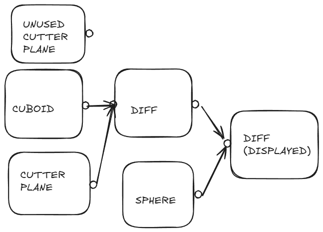

# atomCAD Model Representation and Kernel Architecture 

## Design philosophy

- We would like to use non-destructive editing where possible
- We would like to enable structure reuse as much as possible. The user should be able to distill useful parts of the design into a reusable representation. In the long run the possibility of an ecosystem of part libraries should be achievable.
- Balance power and simple UX as much as possible. (This is very hard, some tradeoff is needed here.) 

## Design paradigms

Before thinking about the architecture and UX of our software, let's first think about what design paradigms we support. By design paradigm I mean the way the user primarily thinks about their design and would like to interact with their design, and also how the design is fundamentally represented. We might support more paradigms later but let's review what we would like to support in the near future: 

- We want the user to be able to create geometry separately and create an atomic representation from a geometry separately in a non-destructive way.
- The most important way users create geometry is CSG (constructive Solid Geometry). 
- We would like to enable the user to do as much as possible by creating geometry and creating atoms from the geometry in a non-destructive way, but sometimes editing atom by atom is unavoidable and we would like to support this as well.

## Model representation

I created a separate, little more theoretical document about the model representation:  [Shape Algebra](./shapre_algebra)

## Node networks

I find that a very elegant way to implement a non-destructive editing system is to support a node network. Lots of successful non-destructive editing software use node networks. Some examples:

- Houdini (the whole system is based on different node networks)

- Unreal engine (Material Editor, Niagara, Blueprint Scripting)
- Blender geometry nodes, shader editor, compositor
- Davinci resolve

To get a feel on how a node network works in a geometry editing context you can watch into this video:

https://www.youtube.com/watch?v=2oC9TOgQ3KE

The 'Introduction to Houdini' page is also a good start:

https://www.sidefx.com/docs/houdini/basics/intro.html 

I considered somewhat simpler UX paradigms, but gaining a little simplicity we would lose too much power. I also think that the usage of node networks is quite common among technically savvy users. Some of the above software is complex not necessarily because of the node network paradigm but because of the complexity of the domain they operate in.

## Node network in atomCAD

A Node can have any number of input pins (including zero) and a positive number of output pins (usually one).

Each input and output pin has a type. You can connect an output pin with an input pin with a directed edge if their type match. The network should be a DAG: should not contain a circle.

Currently we develop an MVP, in which there are only 2 pin types:

- Geometry
- Atomic: atoms and bonds

Additionally nodes can have any number of parameters. Parameters can be filled only on the UI. There are parameters that may be promoted to pins in later version when we might plan more procedural nodes that can be utilized to fill these pins.

On the User interface there is always a 'displayed node'. The output of that node is displayed in the editor viewport. The displayed node is not necessarily the same as the selected node. The parameters of the selected node is displayed on the UI, and if there are gizmos associated with the selected node they are displayed and available for interaction. This means that for example if you select a cutter plane node, you can move that intuitively in the viewport while the displayed node might be their parent diff node which shows the geometry after the cut.

In the above example a plane cut away from a cuboid minus a sphere is displayed. There is also an unused experiment cutter plane on the picture which is currently not connected. In this case the user experiments with different cutter planes while not changing other parts of the node network.

## Supported nodes

There will be several nodes that create geometry from scratch based on some parameters. I list only the Cuboid node in this category now.

### Cuboid

Creates a cuboid geometry.

*Parameters:*

**extent**: Vec3

*output type*: Geometry

### Cutter plane

A half space defined by a plane which is usually used to cut away parts from a geometry with the Diff node.

*Parameters:* Miller index and offset of the plane

*output type*: SDF

### Union

Creates a CSG union from its inputs.

*Inputs:*

**geo1**: Geometry

**geo2**: Geometry

*output type*: Geometry 

### Intersection

Creates a CSG intersection from its inputs.

*Inputs:*

**geo1**: Geometry

**geo2**: Geometry

*output type*: Geometry

### Negation

Creates a CSG negation from its input.

*Inputs:*

**geo**: Geometry

*output type*: Geometry

### Diff

Creates a CSG diff from its inputs.

*Inputs:*

**geo1**: Geometry

**geo2**: Geometry

*output type*: Geometry

### SDF Function

*This node will be implemented only after the MVP. Please note that while other nodes are independent of the underlying implementation discussed in the shape algebra document, this node only works if implicits are used.*

Creates an SDF programmatically in a scripting language.

This can be used to create advanced highly procedural parametric SDFs.

Bret Victor made a demonstration of a system in which meaningful parameters could be intuitively set despite the textual programming language. It is in the first 10 minutes of his talk called "Inventing on Principle":

https://www.youtube.com/watch?v=EGqwXt90ZqA

It is clear that edit-to-run times should be very small, especially when only changing constant values.

When choosing the embedded scripting language, overall we need an easily embeddable language (into Rust) with reasonable sandboxing, and very quick edit-to-run numbers. We need to know the dependency tree between functions. If the language provides operator overloading (to help automatic differentiation) it is a big plus, but probably not a necessity, as we can live with numeric differentiation.

A promising choice seem to be https://rhai.rs/

Embeddable into Rust, supports operator overloading. It is interpreted, so there is no compilation: edit to run delay is probably minimal. On the other hand it might be a bit slow due to being interpreted.

*Inputs:*-

*Params:*

**function name**: string

parameters (or maybe even inputs) are automatically created based on the function parameters.

*output type*: Geometry

### Atomic from Geometry

Creates an atomic entity from a Geometry.

*Inputs:*

**geo1**: Geometry

*Params*: Several parameters related to fixing faces and edges.

*output type*: Atomic

### Edit atomic

Edits an atomic entity atom by atom. Encapsulates multiple edits which can be inspected one-by-one. 

*Inputs:*

**atoms**: Atomic

*Params*: Several parameters related to fixing faces and edges.

*output type*: atomic

## Undo-redo

What would be an undo history in a direct editing program is already embedded into the node network itself, so changes in our representation (like creating nodes, rewiring nodes, changing parameters) are 'meta changes' in this sense, so any version control on a representation which itself contains 'operation history' in itself seem to be a bit redundant, but still a necessity mainly because we want the users not to lose previous versions of their model. We will simply use a full global undo stack for anything the user does on the whole node network.

## Version control

Besides having a fully non-destructive base model + applying a global undo on it, we still have an almost independent problem: how different designers can cooperate, how merge conflicts are resolved. The global undo stack should not mess with this, so the task is to do version control for the fully non-destructive representation. I think it would be just too much detail to be planned up-front. I like to think of this task as trying to serialize down the representation into well mergeable text files, and do the version control in git. It is still possible to create a custom version control later, but it should not be planned up-front, it is enough to conceptually know that it can be done reasonably well.
