# atomCAD part design tutorial

This tutorial assumes you have completed [the basic atomCAD tutorial](atomCAD_basic_tutorial.md).

## Introduction
One difference in atomCAD as opposed to traditional CAD software is that we cannot make arbitrary shapes. It's not possible to make a perfect circle because it can only be approximated with atoms that have a "spherical" shape. The figure above shows how a circle may be approximated with a square lattice of blue atoms and how some atoms(shown in red) need to be removed from the lattice to approximate the circle. The curves of the circle are not exactly aligned with the crystal structure 

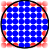

## Intro to Half Spaces

One of the most useful tools to make lattice aligned geometry in atomCAD is the `half_space`. A `half_space` is a plane that divides space into regions behind the plane and ahead of the plane. 

`half_spaces`, which align with crystal planes, can be used to make parts by "cutting" away the infinite crystal lattice. For example, below a triangle like part can be cut from a square lattice by taking the intersection of several half-spaces

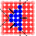

Now open up atomCAD, and set node display policy to *Manual*.

Next, set the `cuboid` to have a *Min Corner* at **(-2,-2,-2)** and have an *extent* of **(4,4,4)**. This make a cube with a side length of 4 centered at the origin.

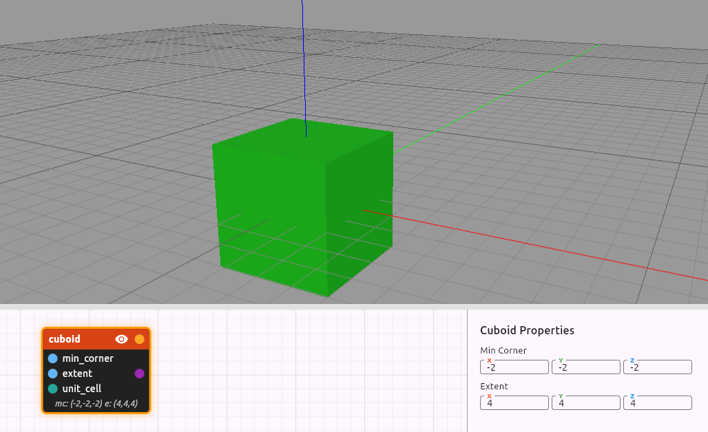 

Now hide the `cuboid`.

Now add a `half_space` node by right clicking, partially typing in the name `half_space`, and selecting `half_space`.

select the `half_space` node and make it visible. 

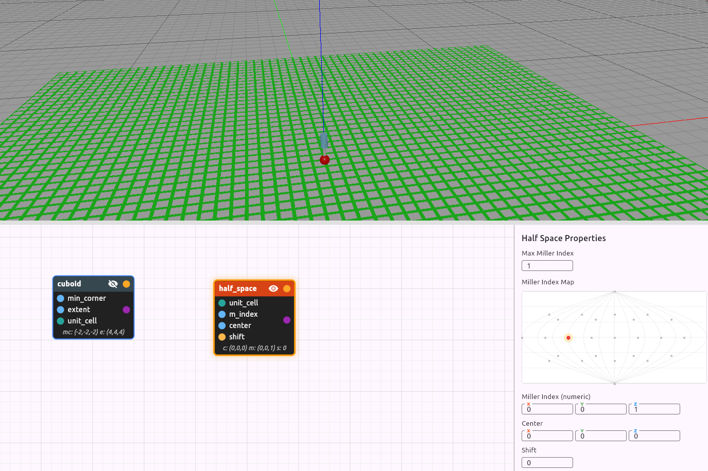

The front of a `half_space`is denoted with green and the back is denoted with red. In the image above, the front of the `half_space` is shown. 

By clicking and dragging on the cylinder, you can shift the `half_space` along its normal vector.

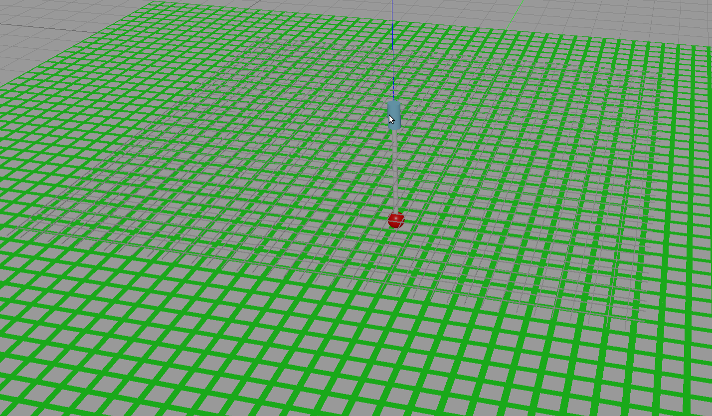

By clicking and dragging the red sphere, you can drag to the normal vector of the `half_space` to a number of discrete positions.

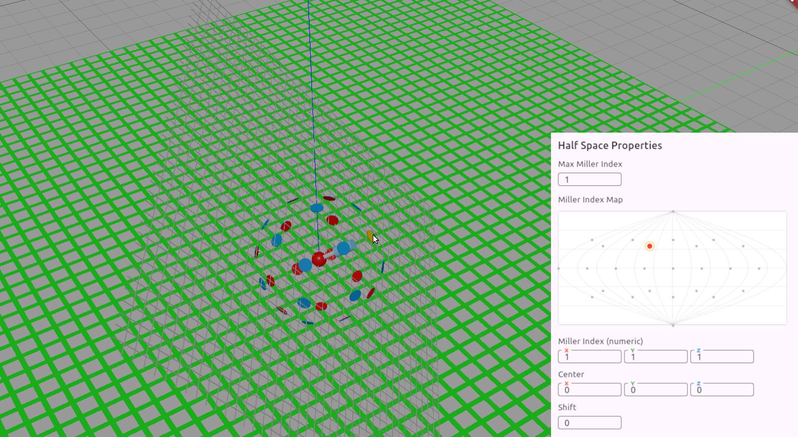

These positions are given as [Miller Indices](https://en.wikipedia.org/wiki/Miller_index). The _Miller Index Map_ displays a 2D representation of these directions and you can use it to change Miller Index instead. Alternatively you can enter the Miller Index numerically.

### Half Spaces and Boolean Operations
Boolean operations can be used on half-spaces to make arbitrary shapes or modify existing shapes. Even infinite, partial shapes can be made. Here's an example of how to make a V-shaped cut in a cuboid using half spaces.

Set the *Miller Index* of the `half_space` to **<-1,-1,0>** and the *shift* to **-1**.

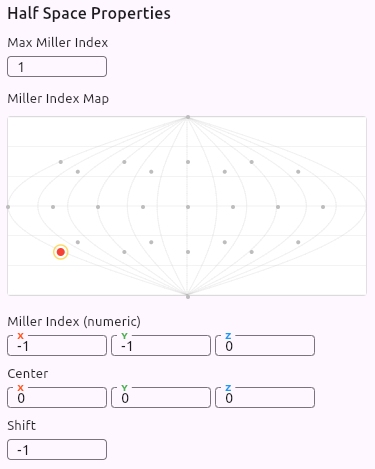

Now right-click on the `half_space` node and click 'Duplicate node'. Any node in atomCAD can be duplicated by right clicking and selecting 'Duplicate node.'

Set the *Miller Index* of this other `half_space` to **<1,-1,0>** and the *shift* to **-1**. This makes a `half_space perpendicular to the first.`

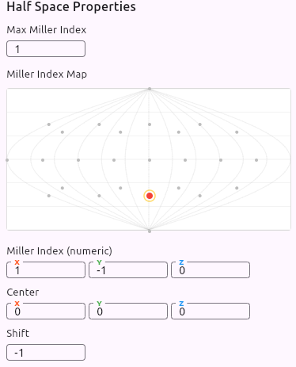

When both half spaces are visible, you should get the following:

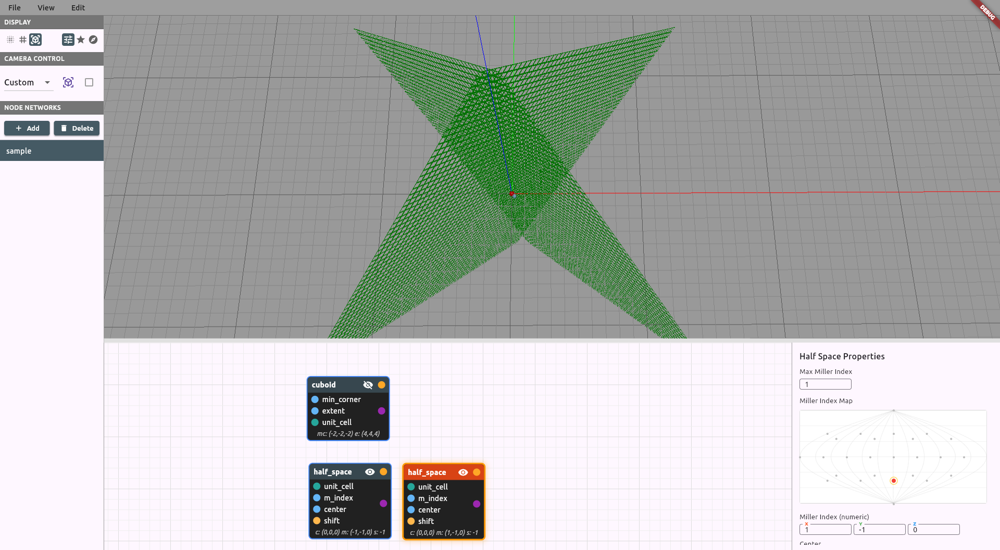

Now add an `Intersect` node and connect connect the two half-spaces to an `Intersect` node.

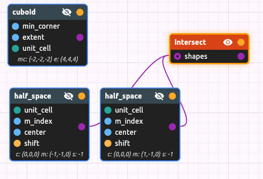

This makes a 'corner' shaped geometry that extends to infinity. You can see some of this structure by making the `Intersect` node visible.

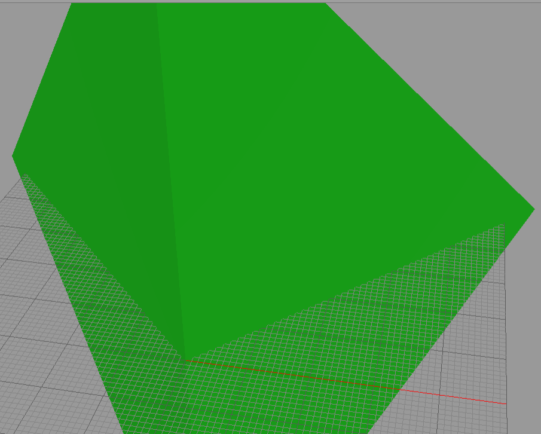

We can make a V-shaped groove in the `cuboid` by using a `diff` to subtract the corner shape we just made from the `cuboid`. Now add a `diff` node. Connect the `cuboid` node's output pin the to the `base` input pin of `diff`. Connect the `Intersect` node's output pin to the `sub` input of `diff`.

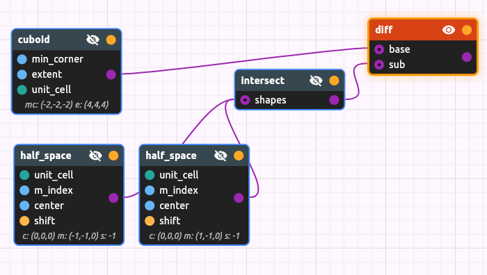

When the `diff` node is visible, you should now have a `cuboid` with a "V"-groove in it.
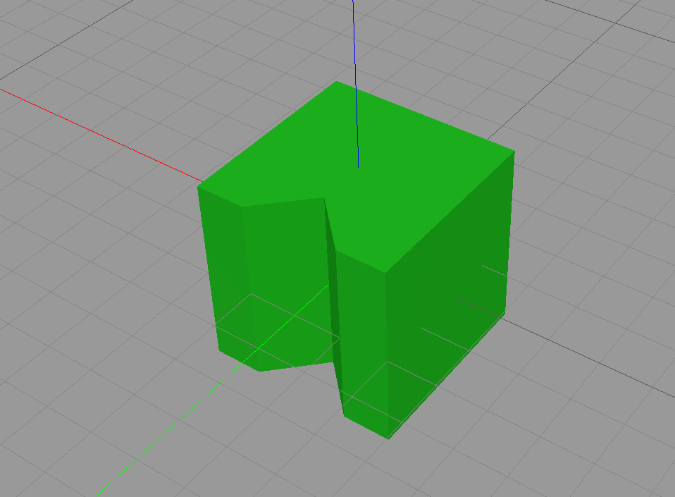

### Rotation
Now let's say we want to make an X shaped part, we could add new half spaces and intersections repeatedly to make the four "V" shaped grooves, but this is cumbersome. Instead, we can rotate the `intersect` we made multiple times using `lattice_rot` nodes.
Add a `lattice_rot` node and connect the output pin of `intersect` to its `shape` input pin.

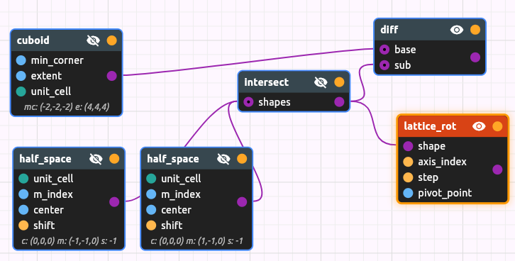

Now select `lattice_rot` and make it visible. IMPORTANT: `lattice_rot` needs to be visible in order for the crystal symmetry system to be determined!

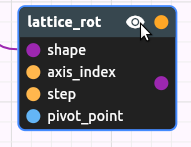

`lattice_rot` performs rotation operations that respect crystal lattice symmetries. It takes as input a `shape` to be rotated, a `pivot point` around which rotation occurs, the axis around which rotation occurs *axis_index*, and the amount the shape should be rotated around the axis *step*. There are only a limited number of axes of rotation that respect crystal symmetry, and these are given as a list from 0-12. 
>**TIP:** Check out the Rotation Demo in samples to get a better understanding of all symmetry axes 

Select `lattice_rot` and click on the box under *Symmetry Axis*. This brings up a list of rotation axes. 

We want to rotate around the Z-axis, so select **"2: 4-fold(0.00, 0.00, 1.00)"**

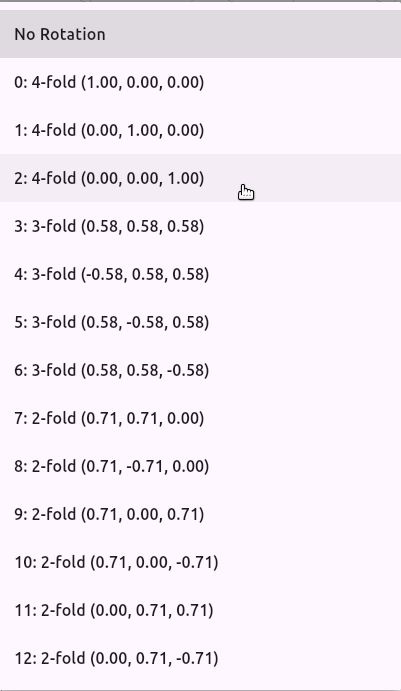

Now select `lattice_rot` and set *Rotation Step* to **1**. 

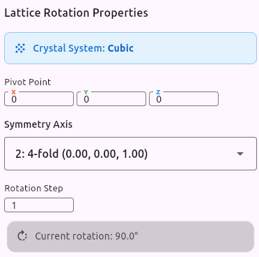

Rotation is given as an integer here rather than an angle because there are only a limited number of rotations permitted that respect crystal symmetry. Since we have choosen the Z axis, (0,0,1), the Z axis only permits 4-fold symmetry, so there are only 4 rotations permitted.

Now connect the output pin of `lattice_rot` to the `sub` input pin of `diff` to subtract the rotated geometry from the `cuboid`

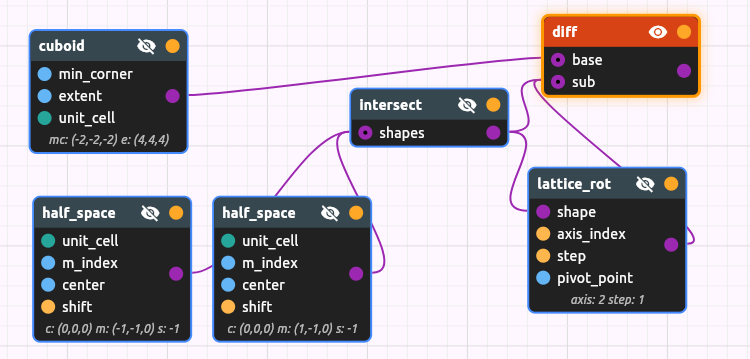

make `diff` the only visible node, and you should get the following shape

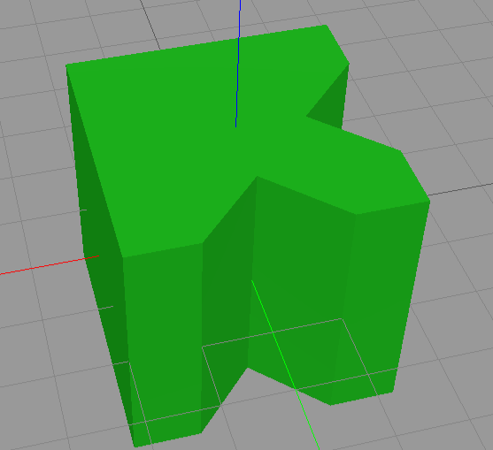

Now we need to make two more "V" grooves to make an "x" Now duplicate `lattice_rot` two times.

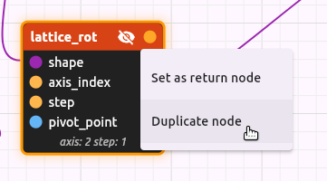

notice how duplicated nodes also copy all input pin connections. Connect each of the new `lattice_rot` nodes to `diff` and set the *Rotation Step* of one node to **2** and the other to **3**.
 
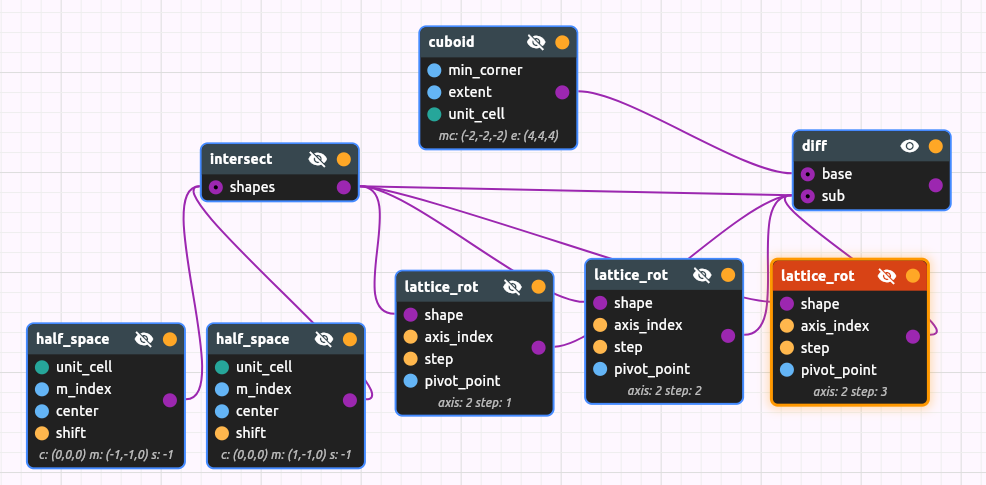

You should now end up with the intended "x" shape

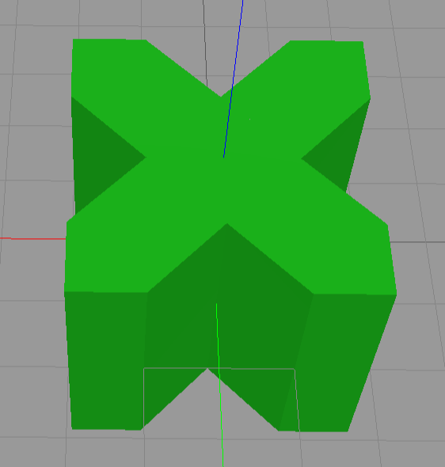

### Practical Design Considerations
When geometry is translated to atoms, we may end up with features that are less than desirable. A helpful way to check is to view the shape and the `atom_fill` of that shape to look at the atoms on the surfaces intended to form the shape. To do this add an `atom_fill` node and connect `diff` to its input pin.

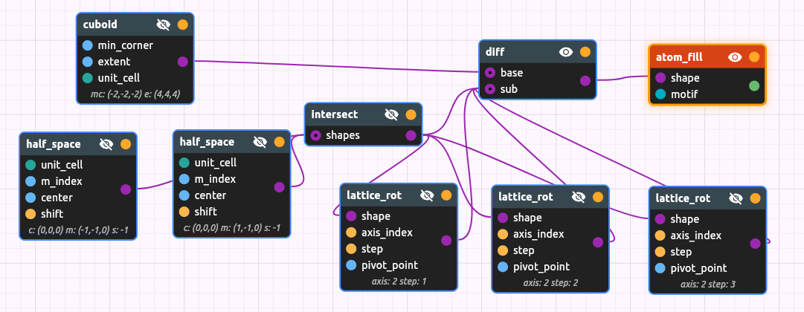

This reveals some problems with the x-shape. Circled below are a number of carbons with three hydrogens each. These are called [methyl-groups](https://en.wikipedia.org/wiki/Methyl_group)

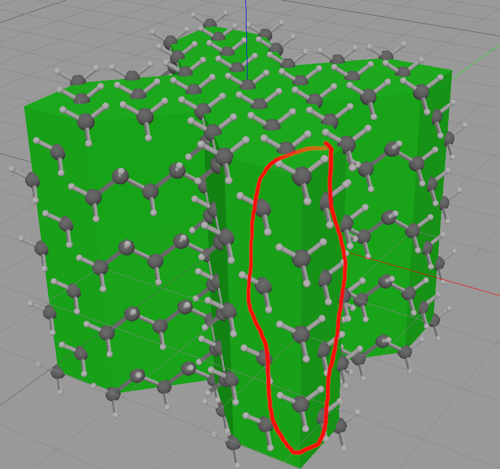

Methyl groups may be detrimental to certain applications. Because the carbon is only attached to the molecule by a single bond, it can flex more easily. This may create more drag in parts that slide past each other.
>**NOTE:** We recommend not making crystolecules with methyl groups. This is only a recommendation and not a hard rule. At present we are unsure if they offer any benefit or detriment.

Following this recommendation, we should redesign our part so that the crystolecule does not have methyl groups. 
So, add a `half_space` that intersects with one of the arms of the "x" as shown below:

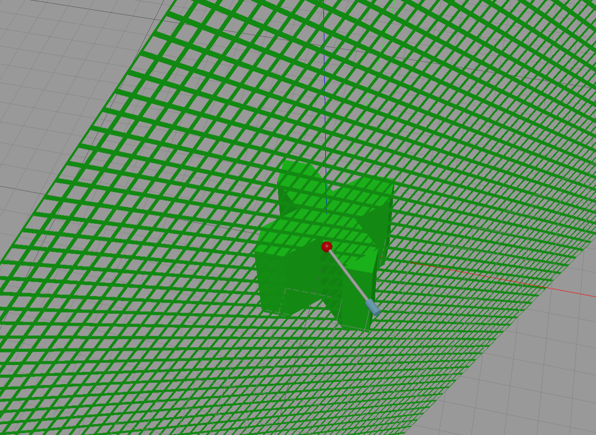

Try practicing using the `half_space` manipulation handles to change `half_space` orientation and shift so it matches the picture. Or just set the *Miller Index* to **<1, -1, 0>** and *shift* to **3**. 

Now use this `half_space` to make a cut on the 'x' by using an `intersect` node. Add an `intersect` node and connect `diff` and the `half_space` to it. You should obtain the following:

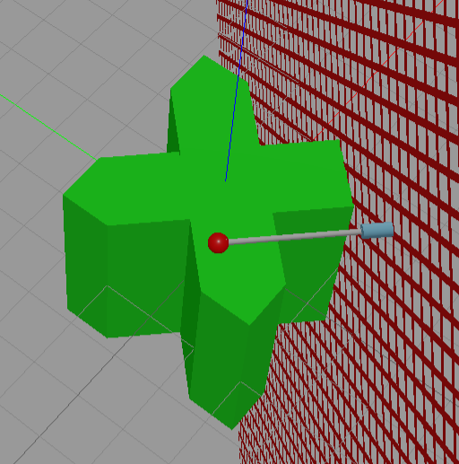

The intersection removes all geometry that's in front of the `half_space`, making a cut. 

Now use `lattice_rot` multiple times to rotate the `half_space` around the z axis as was done previously for the 'V' grooves. Connect each of these outputs to `intersect`

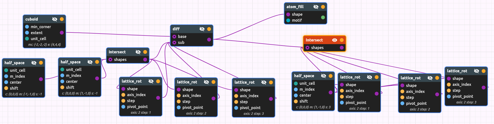

Which should result in the following part

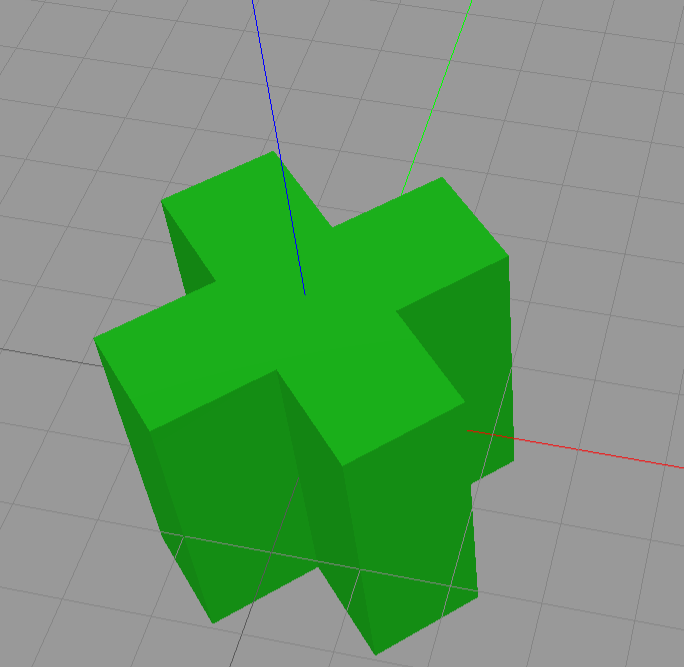

So did we finally eliminate all the methyl groups? Connect `atom_fill` to the `intersect` and make these the only visible nodes:

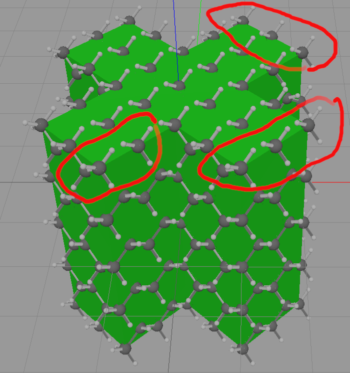

This reveals there are still methyl-groups on the edges. However, we can remedy them by using `atom_fill`'s motif offset option. This allows the entire crystal lattice to be offset by a defined vector. Select `atom_fill` and change the *Motif Offset* to **(0, 0, 0.5)**. This shifts the repeating crystal pattern(the motif) up the Z axis, by half a lattice distance.

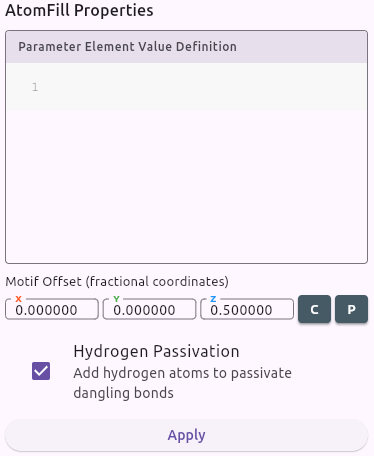

So now, there are no longer atoms on the boundary that would form methyl groups
 
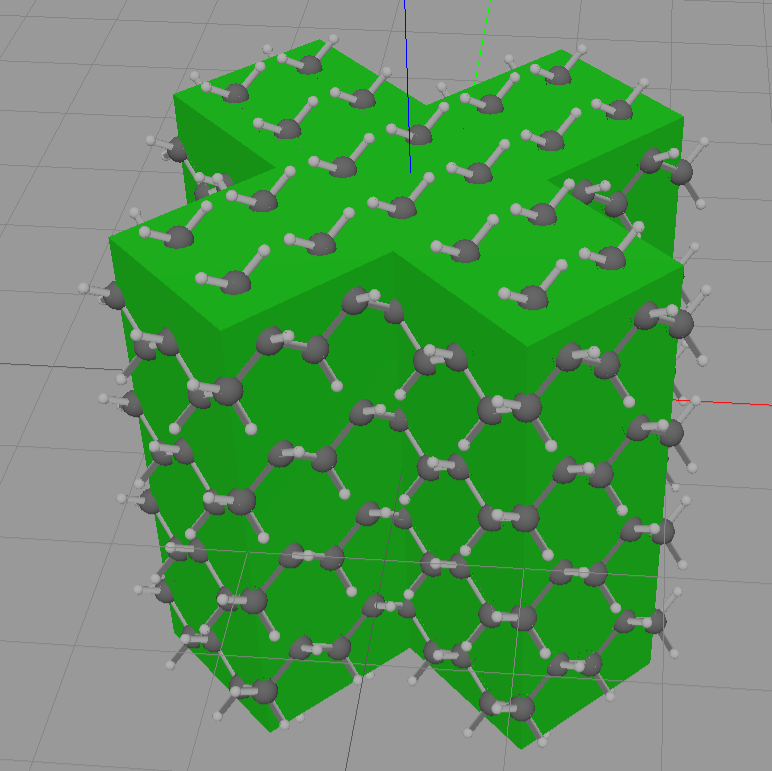
>**TIP:** for diamond, typically a shift of 0.5 along one or multiple axes is all that is needed to eliminate methyl groups

