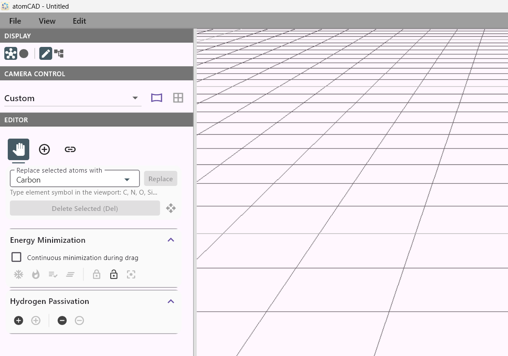
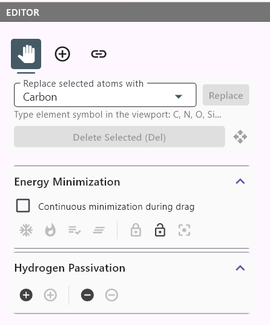
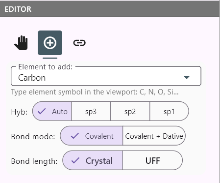
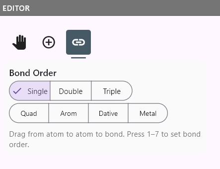

# Direct Editing Mode

← Back to [Reference Guide hub](../atomCAD_reference_guide.md)

atomCAD offers two modes of operation:

- **Direct Editing Mode** — A streamlined, beginner-friendly interface focused entirely on atomic structure editing.
- **Node Network Mode** — The full-featured parametric editor with node networks, described in the rest of this guide.

When you first launch atomCAD, you start in Direct Editing Mode. This mode hides node-network concepts entirely, presenting a simplified UI with just the 3D viewport, a camera control panel, a display settings panel, and the atom editor.

## The Atom Editor

The atom editor is the central tool for building and modifying atomic structures in atomCAD. In Direct Editing Mode the atom editor occupies the left sidebar; in Node Network Mode the same editor appears in the Node Properties panel when an `atom_edit` node is selected. The tools and features described below work identically in both modes (with minor simplifications in Direct Editing Mode, such as hiding node-network-specific options like *Output diff*).

The editor is based on **tools** — one tool can be active at a time. The active tool determines how you interact with the atomic structure in the viewport. You can switch tools using keyboard shortcuts: `F2` (Default tool), `F3` (Add atom tool), `F4` or `J` (Add bond tool).

### Default tool

The Default tool is the primary editing tool in the atom editor. Most editing features are available only when this tool is active.

**Selection and editing:**
- **Select** atoms and bonds using the left mouse button. Simple click replaces the selection, Shift+click adds to the selection, and Ctrl+click toggles the selection of the clicked object. Rectangle (marquee) selection is also supported.
- **Delete selected** atoms and bonds (also available via the `Delete` or `Backspace` key).
- **Replace** all selected atoms with a specific element.
- **Quick element selection:** Type an element symbol (e.g., `C`, `N`, `O`, `Si`) on the keyboard to set the active element. The typed symbol is shown as a cursor overlay. This also works in the Add atom tool (for setting the element of the next atom to be placed).
- **Transform** (move and rotate) selected atoms by dragging. Frozen atoms cannot be dragged.
- **Bond info:** When one or more bonds are selected, the UI shows bond order information and lets you change the order. Use keyboard shortcuts `1`–`7` to set bond order: `1` single, `2` double, `3` triple, `4` quadruple, `5` aromatic, `6` dative, `7` metallic.

**Freeze atoms:**

Atoms can be marked as **frozen** to prevent them from being moved during dragging and energy minimization. Frozen atoms are displayed with an ice-blue rim highlight so they are easy to identify.

The Default tool provides four freeze-related buttons:
- **Freeze selected** — Marks all selected atoms as frozen.
- **Unfreeze selected** — Removes the frozen flag from all selected atoms.
- **Select frozen** — Replaces the current selection with all frozen atoms.
- **Clear frozen** — Removes the frozen flag from all atoms.

**Energy minimization:**

The Default tool integrates UFF (Universal Force Field) energy minimization:

- **Minimize unfrozen** (`Ctrl+M`): Runs energy minimization on all unfrozen atoms in the structure.
- **Minimize selected** (`Ctrl+Shift+M`): Runs energy minimization on only the selected atoms.
- **Minimize diff**: Runs energy minimization where only atoms you added or modified are allowed to move; the original base atoms stay fixed. This button is only enabled when the atom_edit node has pending diff changes.
- **Continuous minimization:** When enabled, the minimizer runs automatically after each editing action, helping the structure settle into favorable geometries as you build. The following parameters can be tuned in *Edit > Preferences* under the **Simulation** category:
  - *Steps per frame* — Number of minimization iterations per animation frame (1–50).
  - *Settle steps on release* — Extra minimization steps run when you release a drag (0–500), giving the structure time to relax after manipulation.
  - *Max displacement per step* — Maximum distance (in Ångströms) any atom can move in a single step (default 0.1 Å). Lower values produce more stable but slower convergence.

**Hydrogen passivation:**

The Default tool includes one-click hydrogen passivation and depassivation:

- **Add hydrogens** (`Ctrl+H`): Adds hydrogen atoms to all undersaturated atoms (or only selected atoms if any are selected). The algorithm auto-detects hybridization and places hydrogens at correct bond lengths and angles.
- **Remove hydrogens** (`Ctrl+Shift+H`): Removes hydrogen atoms from the structure (or only from selected atoms and their neighbors).

### Add atom tool

- **Free placement:** Click empty space to place an atom at the clicked position.
- **Guided placement:** Click an existing atom to enter guided placement mode. The system computes chemically valid candidate positions based on the atom's hybridization and displays them as interactive guide dots. Click a guide dot to place and bond the new atom in one action.
  - Supports sp3, sp2, and sp1 hybridization geometries.
  - A **Hybridization** dropdown (Auto / sp3 / sp2 / sp1) lets you override the auto-detected hybridization.
  - A **Bond Mode** toggle (Covalent / Dative) controls the saturation limit: Dative mode unlocks lone pair positions for coordinate bonding.
  - When an atom is placed near an existing atom, the atoms are merged automatically.
- Press `Escape` or click empty space to cancel guided placement and return to idle.

### Add bond tool

- Add bonds by clicking two atoms in the viewport.
- **Bond order** can be configured. Common orders: single, double, triple. Specialized orders: quadruple, aromatic, dative, metallic.
- Use keyboard shortcuts `1`–`7` to select the bond order: `1` single, `2` double, `3` triple, `4` quadruple, `5` aromatic, `6` dative, `7` metallic.
- Clicking an existing bond cycles through the common orders (single → double → triple → single).

### Measurements

When 2–4 atoms are selected the UI displays a measurement card. Measurements are available regardless of which tool is active.

- **2 atoms:** bond distance (in Ångströms)
- **3 atoms:** bond angle (in degrees)
- **4 atoms:** dihedral (torsion) angle (in degrees)

A **Modify** button on the measurement card opens a dialog where you can enter a precise target value. Atoms are moved along bond axes, rotated around vertices, or rotated around torsion axes to achieve the target value. A "move connected atoms" option (on by default) moves the fragment attached to the moving atom rather than just the single atom.

**Atom info on hover:** Hovering over an atom shows a tooltip with its element, position, and which node produced it.

### Rim highlights

The atom editor uses colored rim highlights to convey atom state while preserving element colors:

- **Selected atoms** — magenta rim
- **Frozen atoms** — ice-blue rim
- **Delete markers** — red rim on neutral-colored sphere
- **Marked atoms** (for measurements) — yellow/blue rims

### Import XYZ

In Direct Editing Mode, *File > Import XYZ* imports atoms from an XYZ file directly into the current structure. This is the quickest way to load an existing molecule and start editing.

## Other capabilities

- **Undo / Redo** (`Ctrl+Z` / `Ctrl+Shift+Z` or `Ctrl+Y`): All editing actions can be undone and redone.
- **Export** via *File > Export visible* to `.mol` or `.xyz` format.

## Switching between modes

- **Direct Editing → Node Network:** Use *View > Switch to Node Network Mode* or the mode radio buttons in the Display section. Always available.
- **Node Network → Direct Editing:** Use *View > Switch to Direct Editing Mode*. This requires that exactly one `atom_edit` node is displayed and currently selected. If the criteria are not met, the menu item is disabled with a tooltip explaining why.

Both modes use the same `.cnnd` file format — your work is preserved when switching between modes.

## File menu differences

The *File > Import from .cnnd library* menu item is available only in Node Network Mode (it is an advanced feature for importing node networks).
