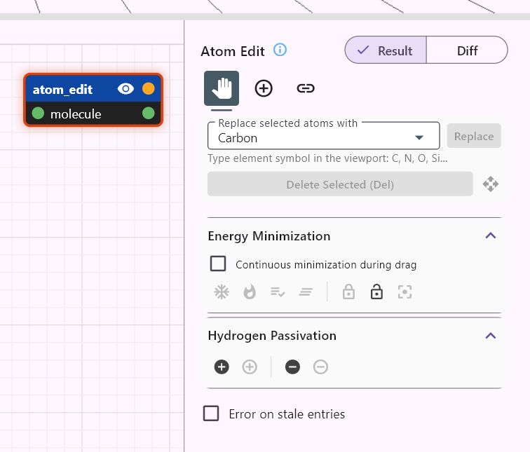

# Atomic structure nodes

← Back to [Reference Guide hub](../../atomCAD_reference_guide.md)

## import_xyz

Imports an atomic structure from an xyz file.


It converts file paths to relative paths whenever possible (if the file is in the same directory as the node or in a subdirectory) so that when you copy your whole project to another location or machine the XYZ file references will remain valid.

## export_xyz

Exports atomic structure on its `molecule` input into an XYZ file.


The XYZ file will be exported when the node is evaluated. You can re-export by making the node invisible and visible again.

This node will be most useful once we will support node network evaluation from the command line so that you will be able to create automated workflows ending in XYZ files. Just to export something manually you can use the *File > Export visible* menu item.

## atom_fill

Converts a 3D geometry into an atomic structure by carving out a crystal from an infinite crystal lattice using the geometry on its `shape` input.


The motif passed into the `motif` input pin is the motif used to fill the geometry. If no motif is passed in the cubic zincblende motif is used. (See also: `motif` node).

In the Parameter *Element Value Definition* text area you can specify (override) the values of the parameter elements defined in the motif. If for the default (cubic zincblende motif) you specify the following:

```
PRIMARY Si
SECONDARY C
```

The primary element changes from carbon to silicon:


You can also change the fractional motif offset vector. (Each component should be between 0 and 1). This can be useful to finetune where the cuts should be made on the crystal to avoid unwanted features like the methyl groups.

If the geometry cut is done such a way that an atom has no bonds that is removed automatically. (Lone atom removal.)

You can switch on or off the following checkboxes:

- *Remove single-bond atoms:* If turned on, atoms which only have one bond after the cut are removed. This is done recursively until there is no such atom in the atomic structure.
- *Surface reconstruction:* Real crystalline surfaces are rarely ideal bulk terminations; instead, they typically undergo *surface reconstructions* that lower their surface energy. atomCAD will support several reconstruction types depending on the crystal structure. At present, reconstruction is implemented only for **cubic diamond** crystals (carbon and silicon) and only for the most important one: the **(100) 2×1 dimer reconstruction**.
  If reconstruction is enabled for any other crystal type, the setting has no effect.
  The (100) 2×1 reconstruction automatically removes single-bond (dangling) atoms even if the *Remove single-bond atoms* option is not enabled. Surface reconstruction can be used together with hydrogen passivation or on its own.
- *Invert phase*: Determines whether the phase of the dimer pattern should be inverted. 
- *Hydrogen passivation:* Hydrogen atoms are added to passivate dangling bonds created by the cut.

## atom_move

Translates an atomic structure by a vector in world space. Unlike `lattice_move` which operates in discrete lattice coordinates, `atom_move` works in continuous Cartesian coordinates where one unit is one angstrom.


**Properties**

- `Translation` — 3D vector specifying the translation in angstroms.

**Gadget controls**

Drag the gadget axes to adjust the translation vector interactively.

## atom_rot

Rotates an atomic structure around an axis in world space by a specified angle.


**Properties**

- `Angle` — Rotation angle in radians.
- `Rotation Axis` — 3D vector defining the axis of rotation (will be normalized).
- `Pivot Point` — The point around which the rotation occurs, in angstroms.

**Gadget controls**

The gadget displays the pivot point and rotation axis. Drag the rotation axis to adjust the angle interactively.

## atom_union

Merges multiple atomic structures into one. The `structures` input accepts an array of `Atomic` values (array-typed input; you can connect multiple wires and they will be concatenated).


## atom_lmove

Translates an atomic structure by a discrete vector in **lattice space** (integer lattice coordinates). This is the atomic-structure counterpart of the `lattice_move` geometry node.

**Properties**

- `Translation` — 3D integer vector specifying the translation in lattice coordinates.

## atom_lrot

Rotates an atomic structure in **lattice space** using discrete symmetry rotations. This is the atomic-structure counterpart of the `lattice_rot` geometry node. Only rotations that are symmetries of the unit cell are allowed.

**Properties**

- `Rotation` — A valid lattice symmetry rotation.
- `Pivot` — 3D integer vector for the rotation pivot point.

## apply_diff

Applies an atomic diff structure to a base atomic structure. This node is used in advanced parametric workflows where defect patches are created separately (e.g., using an `atom_edit` node with *Output diff* enabled) and then applied to different base structures or at different positions.

**Input pins**

- `base` — The base `Atomic` structure.
- `diff` — The diff `Atomic` structure to apply.

The diff structure encodes additions, deletions, and modifications of atoms. The node uses position-based matching to apply the diff to the base structure.

## relax

Performs UFF (Universal Force Field) energy minimization on an atomic structure. Takes an `Atomic` input and outputs the minimized structure.

This node is useful in node-network workflows where you want to relax a structure non-destructively as part of a parametric pipeline. For interactive minimization during atom editing, use the energy minimization feature built into the `atom_edit` node instead.

## add_hydrogen

Adds hydrogen atoms to satisfy valence requirements of undersaturated atoms. Takes an `Atomic` input and outputs a hydrogen-passivated structure.

The algorithm detects hybridization (sp3, sp2, sp1) automatically and places hydrogen atoms at the correct bond lengths and angles. This is the node-network counterpart of the one-click hydrogen passivation in the `atom_edit` node.

## remove_hydrogen

Removes all hydrogen atoms from an atomic structure. Takes an `Atomic` input and outputs the bare framework without hydrogens.

Useful in workflows like: `remove_hydrogen` → transform/edit → `add_hydrogen`, allowing you to work with the bare framework and re-passivate afterward.

## atom_cut

Cuts an atomic structure using cutter geometries. Unlike `atom_fill` which creates atoms from geometry, `atom_cut` removes atoms that lie outside the cutter shapes — effectively performing a Boolean intersection between an existing atomic structure and one or more 3D geometries.

**Input pins**

- `molecule` — The `Atomic` structure to be cut.
- `cutters` — An array of `Geometry` values defining the region to keep (array-typed input; you can connect multiple wires).

**Properties**

- `Cut SDF Value` — The SDF threshold for the cut boundary (default 0.0). Atoms with SDF values greater than this threshold are removed.
- `Unit Cell Size` — The unit cell size in Ångströms used to normalize atom positions when evaluating against the cutter geometry.

Bonds connected to removed atoms are automatically deleted.

## atom_edit

The `atom_edit` node provides the same atom editing tools described in the [Direct Editing Mode](../direct_editing.md#the-atom-editor) section above — all tools, keyboard shortcuts, hydrogen passivation, energy minimization, freeze, and measurements work identically. When an `atom_edit` node is selected in the node network, the atom editor appears in the Node Properties panel.

This section covers the additional aspects of `atom_edit` that are specific to node-network workflows.



### How atom_edit stores edits

Internally, an `atom_edit` node stores a **diff** — an atomic structure that encodes additions, deletions, and modifications relative to the input (base) structure. When the node is evaluated, the diff is applied to the base to produce the output. This means the `atom_edit` node is non-destructive: the base structure flows in untouched, and the diff layer captures all your edits (added atoms, deleted atoms, moved atoms, element replacements). Multiple `atom_edit` nodes can be chained, each applying its own diff to the previous result.

### Output diff mode

The `atom_edit` node can output the raw diff structure instead of the applied result by enabling the *Output diff* checkbox. This makes diffs first-class values in the node network, enabling advanced workflows where defect patches are created once and then repositioned (via `atom_move`, `atom_lmove`, etc.) and applied to different base structures using the `apply_diff` node.
