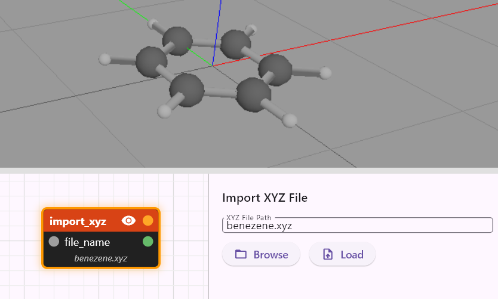
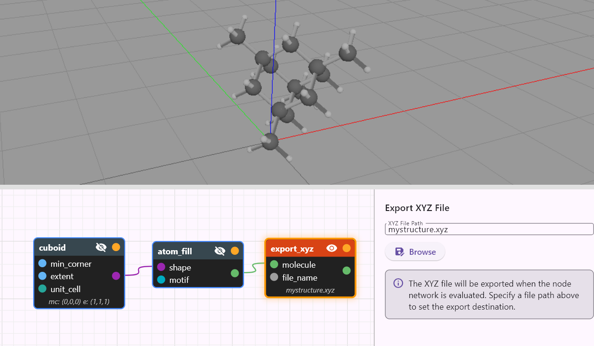
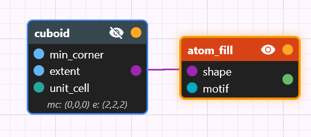
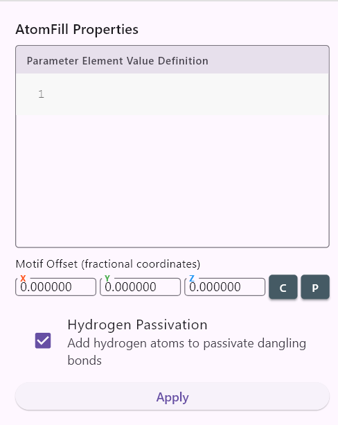
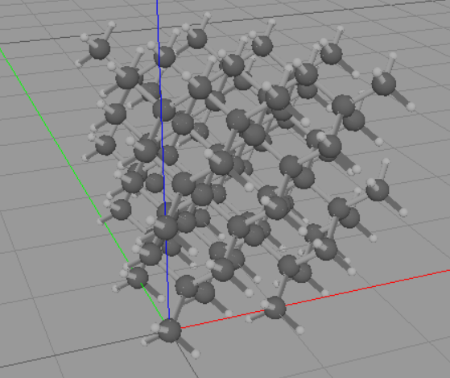
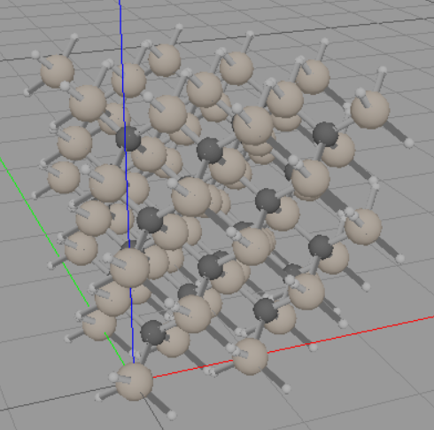
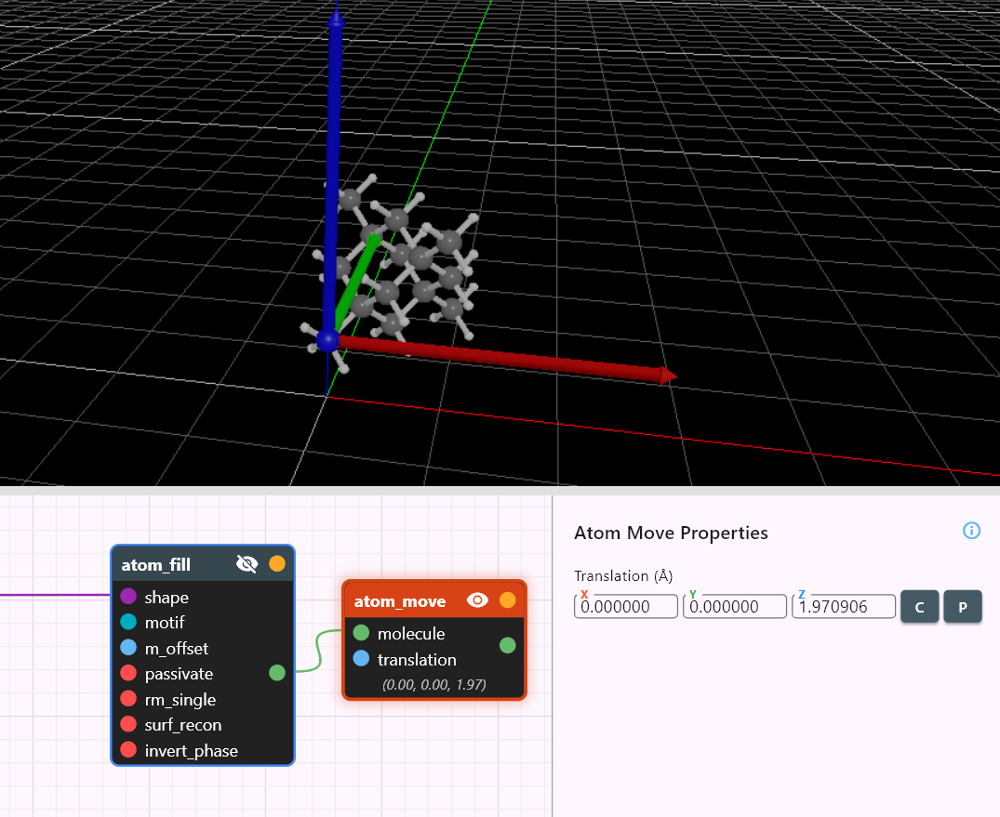
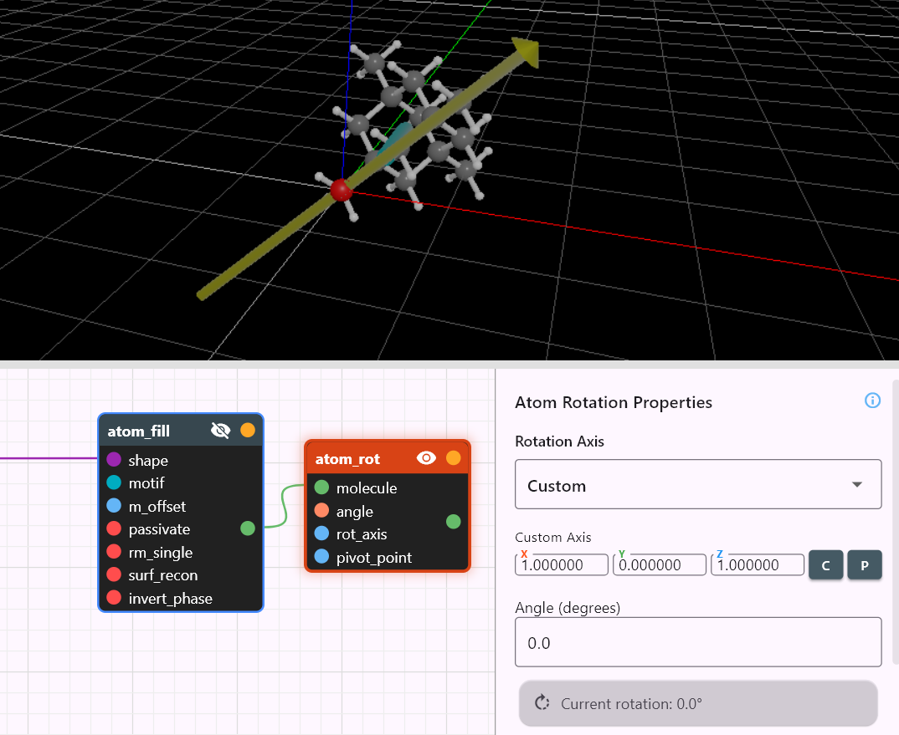
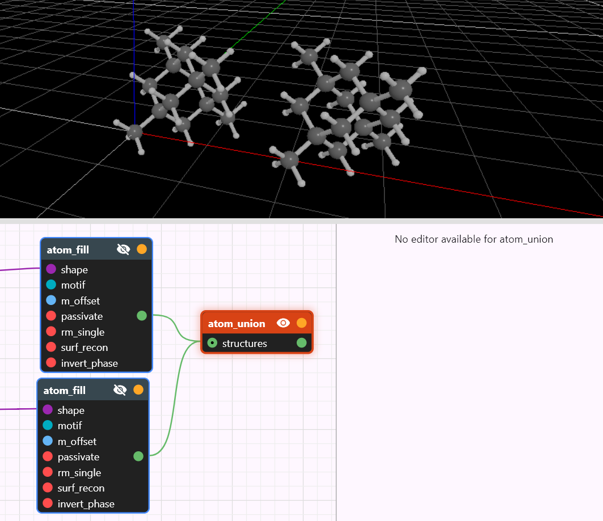
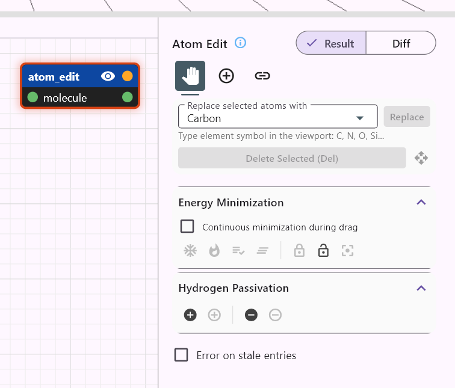

# Atomic structure nodes

← Back to [Reference Guide hub](../../atomCAD_reference_guide.md)

## import_xyz

Imports an atomic structure from an XYZ file. Outputs a `Molecule` — XYZ files carry no crystal-lattice information, so the result has no `Structure` association.



It converts file paths to relative paths whenever possible (if the file is in the same directory as the node or in a subdirectory) so that when you copy your whole project to another location or machine the XYZ file references will remain valid.

## export_atoms

Saves the atomic structure on its `molecule` input to a file. The **output format is chosen by the file extension** — `.xyz` for plain atomic coordinates, `.mol` for MOL V3000 (molecular structure with bond information). This is an **effect node**: its output type is `Unit`, and the file write only happens when the node is invoked through the right-click **Execute** action (or transitively from a `foreach` upstream of it). Display passes — including normal scene refreshes triggered by editing — never write a file. See [Execute action (side-effect nodes)](../ui.md#execute-action-side-effect-nodes).



**Input pins**

- `molecule: HasAtoms` — the `Crystal` or `Molecule` to write.
- `file_name: String` — the file path; its extension selects the format. May be wired in (typical when batch-exporting) or set as a stored property. Relative paths are resolved against the design's directory; absolute paths are stored relative when the file lives under the design tree, so projects remain portable when copied. An unrecognized or missing extension is reported as an error (in the property panel's format indicator while editing, in the node subtitle in the graph, and as a localized error at Execute time).
- `metadata: Record` (optional) — wire a record here to also write a `<file>.params.json` sidecar alongside the exported file, containing those generation parameters plus a BLAKE3 hash of the exported file for machine-readable verification. Written for every format.

**Output (single pin)**

- `Unit`. The pin is not displayable in the 3D viewport; its only purpose is to be wired into a `foreach` body (or to be the target of an explicit Execute) so the side effect fires when intended.

The property panel shows a **format indicator** under the file-path field that reflects the extension you type (e.g. "Format: XYZ", "Format: MOL (V3000)", or an error for an unrecognized extension); when `file_name` is wired, it notes that the format is decided from the wired value at Execute time. The **Browse** button first asks which format to save, then opens the OS save dialog for that single extension.

> **Note on `export_xyz` → `export_atoms`.** This node was formerly `export_xyz` (XYZ only). It was renamed and generalized to derive the format from the extension; old `.cnnd` projects are migrated automatically on load. (An even earlier version passed the molecule through on its output pin and wrote the file on any evaluation that reached it; it now returns `Unit` and writes only on Execute. If you want both the export side effect *and* the molecule downstream, wire the molecule directly into the downstream consumer and treat `export_atoms` as a sibling sink.)

## import_cif

Imports a crystal structure from a CIF (Crystallographic Information File) file — the standard exchange format for crystallographic data, carrying unit-cell parameters, space-group symmetry, and fractional atom positions. Unlike `import_xyz`, a CIF file describes a periodic crystal, so this node reconstructs the full conventional unit cell and emits the lattice vectors and a fractional motif alongside the atomic structure.


**Input pins** (all optional; can also be set as properties)

- `file_name: String` — path to the CIF file. Like `import_xyz`, paths are converted to relative paths whenever possible so projects remain portable when copied to another machine.
- `block_name: String` — when a CIF file contains multiple data blocks, selects which one to import. Empty / unconnected uses the first block.
- `use_cif_bonds: Bool` — when `true` (default), bond information present in the CIF (`_geom_bond_*` records) is used directly.
- `infer_bonds: Bool` — when `true` (default), bonds are inferred from interatomic distances if the CIF carries no explicit bonds (or as a fallback when `use_cif_bonds` is off).
- `bond_tolerance: Float` — multiplier applied to covalent radii when inferring bonds (default `1.15`).

**Output pins**

- `unit_cell: LatticeVecs` — the conventional unit cell read from the CIF.
- `atoms: Molecule` — the expanded conventional unit cell as an atomic structure, in Cartesian coordinates.
- `motif: Motif` — the same atom set expressed as a fractional `Motif` so it can be fed directly into a `structure` node and downstream `materialize` (typically together with `unit_cell`).

**Typical pipelines**

- *Direct fill:* wire `motif` and `unit_cell` into a `materialize` node (via a `structure` node) to use the imported crystal as a template for filling geometry.
- *Edit then fill:* wire `atoms` and `unit_cell` into a `motif_edit` node, edit interactively in 3D, then feed the edited motif into `materialize`.

## import_cube

Imports **volumetric scalar data** from a Gaussian `.cube` file — the standard output format of quantum-chemistry packages such as [PySCF](https://pyscf.org/), Gaussian and ORCA. A cube file holds a scalar quantity sampled on a regular 3D grid around a molecule: a molecular-orbital amplitude, an electron density, an electrostatic potential.


**Input pin** (optional; can also be set as a property)

- `file_name: String` — path to the `.cube` file. As with `import_xyz`, paths are converted to relative paths whenever possible so projects remain portable when copied to another machine. A wired value overrides the stored property.

**Output pins**

- `field: ScalarField` — the sampled data. `ScalarField` is a scalar function of 3D space; wire it into an [`isosurface`](#isosurface) node to draw it. It renders nothing in the 3D viewport on its own.
- `molecule: Molecule` — the atoms from the file's atom block, with bonds inferred. This is the atomic structure the field was computed around, and displaying it is the quickest way to confirm a file loaded correctly.

**Coordinates and units**

Coordinates and grid step vectors in a `.cube` file are **always read as Bohr** and converted to Ångström, which is what every producer in practice writes. (A convention exists whereby a negative voxel count signals Ångström, but it is documented inconsistently across sources, so atomCAD does not rely on it.)

To catch a file that was nevertheless written in Ångström, the node checks the atom block for chemical plausibility: it compares each atom's nearest-neighbour distance against the sum of the two covalent radii, and if the median ratio is far from 1 it shows an **amber (non-blocking) warning** naming the observed ratio. The node still produces a usable field and molecule — **the check warns, it never re-interprets the file.** Short contacts have too many innocent causes (an ion pair, a van der Waals cluster, two separated fragments) for a silent rescale by 1.89 to be safe, and a rescale would move the grid, the field and every threshold read off it in a way you could not see. If the warning appears and the geometry does look wrong, re-export the file from your quantum-chemistry package in Bohr.

Field **values** are passed through unconverted, in whatever atomic unit the source quantity uses — converting them would invalidate the published threshold conventions (roughly ±0.02–0.05 for orbital amplitudes, 0.002 for a density's molecular surface).

**Multi-field cube files are not yet supported.** A file whose atom count is written negative — the format's flag for several fields sharing one grid — is rejected with a clear message rather than misparsed.

**Typical pipeline**

- *Check the import:* display the `molecule` output pin. You should see the expected structure at the expected size; a molecule about 1.9× too large means the file's units are not what the header implies.
- *Draw the field:* wire `field` into an [`isosurface`](#isosurface) node.
- *Read the field numerically:* wire `field` into a [`sample_field`](./math_programming.md#sample_field) node together with a `vec3`, and wire the result into `print` to read values off the Console.
- *See what you loaded:* hover the **`field` output pin**. The readout names the **file name** and the file's own comment text, the grid, the step and extent in Ångström, the box the field occupies, the **value range** (and whether it is signed), and the memory it takes. Value readouts live on output pins only — there is nothing to hover on an input pin.

  The file name leads that first line deliberately. A `.cube`'s two comment lines are often a program banner, or blank; the name a producer chose — `si-cluster-S3-vacancy_spin.cube` — frequently carries the one thing the numbers cannot say, which is *what quantity this is*.

## isosurface

Draws the surface where a scalar field equals a given level — the standard way to picture a molecular orbital, an electron density or an electrostatic potential. Wire an [`import_cube`](#import_cube) `field` output into it and display the node.


**Input pins**

- `field: ScalarField` — **required.** The field whose level set is drawn.
- `color_field: ScalarField` — optional. A **second** field, sampled at every point of the surface to colour it — see *Painting by a second field* below. Unwired, the surface is painted by sign instead.
- `level: Float` — optional. Overrides **whichever level property is live** when wired — the isovalue in *absolute* mode, the enclosed fraction in *fraction* mode. In *auto* mode it is ignored, and the node says so with an amber advisory rather than dropping it silently.

**Output pin**

- `surface: Isosurface` — the surface specification. Display the node to see it; nothing downstream consumes an `Isosurface` yet.

**Properties**

| Property | Default | What it does |
|---|---|---|
| `level_mode` | `auto` | Which coordinate the level is expressed in: `auto`, `absolute` or `fraction` — see below |
| `level` | `0.02` | Isolevel **magnitude**, live in `absolute` mode |
| `level_fraction` | `0.72` | Share of the field the surface encloses, live in `fraction` mode |
| Positive color | blue | Color of the `+level` lobe |
| Negative color | red | Color of the `-level` lobe |
| Opacity | `0.4` | How see-through the surface is, `0` (invisible) to `1` (solid) — see below |
| Colormap, range min/max | blue-white-red, `-0.05`…`0.05` | The colour ramp and its domain — used only when `color_field` is wired, and disabled while it is not |

**Three ways to say what level to draw at**

A scalar field spans something like ten orders of magnitude, and the same number that gives a clean orbital lobe gives a blank screen on a density. So the level has three modes, and the mode is what decides which of the two stored numbers is used.

- **`auto`** (the default for a new node) chooses the level from the field itself, every time the node evaluates. Neither stored number is consulted.
- **`absolute`** uses the stored `level` as an isovalue in the field's own units. This is the mode for a conventional constant — `0.002` for a density envelope, `0.02`–`0.05` for an orbital amplitude.
- **`fraction`** uses the stored `level_fraction`: *how much of the field the surface encloses*, as a share of the field's total integrated magnitude, and the isovalue that achieves it is looked up from the data. `0.72` means the surface bounds the region holding 72 % of the field. This is the mode that transfers between fields — the same fraction means the same thing on an orbital and on a spin density, where the same isovalue does not.

**The mode is a unit, not a second level.** There is one level at any moment; the mode says whether you are reading it as a magnitude or as an enclosed fraction, and switching between `absolute` and `fraction` **converts**, so the surface does not move. Switching *to* `auto` is the exception, and the only switch that does move it — auto re-derives the level from the field and consults neither number.

Round trips are lossless where it matters: set an absolute `0.002`, switch to fraction, switch back, and your `0.002` is still there exactly as you typed it. (Behind that is a small subtlety — an enclosed fraction can only resolve to a value the field actually attains, so a blind conversion would hand back `0.00200034…` instead. The node notices that the parked `0.002` still encloses exactly what the surface encloses and keeps it verbatim. Change the fraction in between and you get the honest converted number instead.)

The node does store both numbers, and the text format writes both alongside the mode — with no field wired there is nothing to convert through, so each coordinate needs a parked value. You never see two levels on screen, though: the panel shows one row, for the coordinate the mode makes live.

**What `auto` decides, and on what basis.** It reads the field's value range and its distribution, and reports which branch it took in the level readout:

| Basis shown | What it means |
|---|---|
| `non-negative, density-like` | The field never goes negative and `0.002` is a plausible level in its units, so the density convention is used. |
| `signed field` | The field has both signs — an orbital, a spin density — where no absolute convention survives, so the level enclosing 72 % of the field is used instead. |
| `non-negative, atypical` | Non-negative, but `0.002` is nowhere near this field's own scale, so the density convention was rejected and the 72 % level used. **Treat the result as a starting point, not an answer** — this is what an ELF or a reduced density gradient gets, and the level will be adjustable-but-wrong rather than blank. |
| `non-negative, unchecked` | There were no stored samples to check the convention against, so `0.002` was taken on trust. |

**`auto` is volatile by design.** The level is re-chosen on every evaluation, so it moves when the field changes — a different `.cube` on the `field` pin, or the same file re-imported after a recalculation. That is what makes it a good default and a bad thing to publish from. **Freeze a figure by switching to `absolute` or `fraction` before you rely on it**; both are exact, so the surface does not move at the moment you switch. The only signal that a level is automatic is the passive `auto:` line in the readout — a document reopened against an edited field will show a moved surface with nothing announcing it.

**Reading the level back.** Hover the `surface` output pin and the readout gives the resolved isovalue, what it encloses, and — under `auto` — the basis:

```
Isosurface
  level:  0.002  ·  encloses 99.2% of ∫|v|  ·  auto: non-negative, density-like
  color:  phase
  field:  17x15x19
```

`∫|v|` is the field's total integrated magnitude, so `encloses 99.2%` means the region inside the surface accounts for 99.2 % of it. It is a share of the *field*, not of the box's volume — almost all of any cube file is empty space, and a share of volume would be dominated by it. The phrasing stays deliberately abstract because the field could be anything: on an orbital amplitude the quantity a chemist conventionally encloses is `|psi|²`, not `|psi|`, so calling this "percent of the electron density" would be wrong.

**The level panel**

The properties panel's *Level* group has one control of record and two readouts.

**The Mode dropdown is the only way to leave `auto`,** and picking `Fraction` or
`Absolute` **takes over** the level auto had arrived at, so the surface does not
move at the instant you switch. The same is true switching between the two manual
modes. Only a switch back *to* `auto` moves the surface — deliberately, since
that is what asking for an automatic level means.

**One numeric row is on screen at a time, and it is the live coordinate's.** In
`fraction` mode you get a *Fraction* row; in `absolute` mode an *Absolute* row.
Under `auto` neither coordinate is live, so there is **no** numeric row — the
readout below carries both numbers in every mode, which is what makes showing
only one row lossless. Two consequences worth knowing:

- With a wire on the `level` pin the row is greyed and shows what the wire
  drives, because the wire owns the value. (In `auto` the wire is ignored
  entirely, and the node carries an amber advisory saying so.)
- With no field wired the Mode dropdown stays live — the mode is yours, not the
  field's — and the row is greyed and blank, because there is no resolved value
  and the parked number is not what would be used.

The group's height therefore changes a little between modes: `fraction` carries a
slider, `absolute` a lone box, `auto` neither.

**The fraction slider covers 0.30 to 0.999.** Its travel is linear in the
*number of nines* rather than in the fraction itself, so about 70 % of it falls
in 0.9–0.999 where densities live, while the lower end still covers orbitals and
spin densities (0.5–0.9). Spread evenly in `f`, a slider would put almost nothing
where the useful values are.

That window is smaller than the property's legal range of `0 < f < 1`, and the
panel says so rather than lying about it: type a fraction outside the window —
`0.1`, say — and the slider **disables itself** with its handle at the nearer
stop while the box stays live and authoritative. Type a value back inside and the
slider comes back. The box is the control of record in every case. The ends
cannot be `0` or `1` in any event — `0` encloses nothing and `1` everything, and
both are rejected.

**The readout line** under the row is identical in all three modes, and is the group's answer of record — it is the one place both coordinates are always shown:

```
|v| = 0.002  ·  encloses 99.2% of ∫|v|
```

with an `auto: <basis>` line beneath it while the mode is automatic. It carries
no unit, deliberately: nothing here converts field values or assumes what they
are, and two of the fields it has to serve (ELF, a reduced density gradient) are
dimensionless numbers.

**The histogram** beneath the readout is where the level sits in the data. Its
horizontal axis is `log10 |v|` — linear would show a single spike — and its bars
are **mass per bin**, not sample counts: counted by sample, a cube file is
overwhelmingly vacuum and the plot would say nothing.

**The axis starts where the field's mass does, not at its smallest value.** A
density decays exponentially away from the nuclei, and the far corners of a
generous box hold real values around `1e-16`; a single one of them would
otherwise stretch the axis by twelve empty decades. So the plot drops the
leading tail once it holds under 0.01 % of `∫|v|`, and says so in a line
underneath when it has. It never crops past the marker, so a level typed out in
the tail still shows where it falls, and it never shrinks below three decades.
This is a zoom, nothing more — the level, the fraction and what `auto` decides
are all computed over every sample regardless. The rising-then-falling
curve drawn over the bars is the **cumulative** share of the field at or above
each magnitude, on its own 0–1 scale; its height where the marker crosses it
*is* the enclosed fraction, which is what makes a fraction legible against an
isovalue. The vertical marker is the current level, with the enclosed side
shaded, and **it is draggable** in `fraction` and `absolute` mode — dragging it
edits whichever number is live, and the whole drag is a single undo. Under
`auto` it is inert, like everything else in the group. Exact zeros are reported
as a count beneath the plot rather than given a bin, since `log10 0` has nowhere
to go.

The slider's travel is **not** the histogram's axis — one is in fraction space,
the other in `log10 |v|`. The cumulative curve is the only thing that relates
them.

**The surface redraws when you let go, not while you drag.** The slider, the
histogram marker and the *Opacity* slider all track the pointer live — the
handle, the number and the marker move as you would expect, and the readout
follows — but the 3D surface is re-extracted once, on release. Extraction is
marching cubes over the whole grid and runs on the same thread as the interface,
so redrawing it on every pointer frame would freeze the application without ever
managing to paint an intermediate surface. One consequence is worth knowing:
during a fraction drag the isovalue in the readout (and during an absolute drag
the percentage) is read off the histogram, so it is accurate to about one bar
until you release, when the exact value replaces it.

**The level is a magnitude, not a signed value.** The surface is extracted at `+level` *and* at `-level`, so a signed field such as an orbital shows both lobes at once, painted in the two phase colors. A level of zero or below is an error rather than a choice: at zero the two passes coincide, and a negative level would just be the positive one relabelled. An orbital's overall sign is arbitrary — the same calculation run twice can hand back `psi` or `-psi` — so the **swap button** between the two color swatches is how you match a published figure.

**Opacity.** A surface at full opacity hides whatever is inside it, which for an orbital is usually the molecule you wanted to see. Lowering *Opacity* makes the lobes translucent and the structure visible through them; the default `0.4` is a good starting point for an orbital, and `1` is right for a density envelope you want read as a solid shape. Exactly `1` takes a faster drawing path with no transparency work at all, so there is no cost to leaving an envelope opaque.

Two overlapping lobes are drawn back to front for the current camera, so their overlap reads correctly from every angle. Two limits are worth knowing: a translucent surface does **not** correctly interleave with [`xray`](#xray)-ghosted atoms — the ghosts are always drawn behind the surface, whichever is actually nearer — and two *nested* surfaces, one closed shell inside another, can be ordered the wrong way round. The first is common enough to notice; the second needs a field with an interior extremum inside a closed shell and is rare in practice. Neither affects an opaque surface.

*Preferences → Geometry Visualization → Isosurface extraction* has a **Surface transparency** setting with two extra comparison modes. They exist to evaluate the default and both draw overlapping lobes wrongly; leave it on *Sorted lobes (best)*.

**Two things the node cannot tell you, and both look like breakage**

- *A level above anything in the field draws nothing, silently.* An empty viewport looks exactly like a failed import, and there is no warning. This is the failure `auto` mode exists to keep you out of, so it is now something you meet only after taking the level over in `absolute` mode. Hover the **`field` output pin of the upstream `import_cube`** — value readouts are on output pins, so there is nothing to hover on the `isosurface` node's own input. That readout carries both halves of what you need: the **value range**, and the **file name and comment text** saying what the quantity is. Typical starting points are ±0.02–0.05 for an orbital amplitude and 0.002 for a density's molecular surface — an order of magnitude apart, which is why one default cannot serve both.
- *A `color_field` smaller than the surface paints the overhang neutral.* Outside its own box a field reads as `0.0`, which on a symmetric blue-white-red ramp is plain white — a plausible-looking picture that is simply missing data. It is easy to hit, because densities and potentials often come from separately-computed files with different boxes. There is no warning, so if part of a surface comes out flat white, suspect the boxes before you suspect the physics: compare the two `field` output-pin readouts, which each name the box they cover.

**Painting by a second field**

Wire a second field into `color_field` and the surface stops being painted by sign: every point on it is coloured by what *that* field reads there. The canonical use is the **electrostatic potential map** — an electron density envelope, coloured by the potential — which is how a chemist reads off where a molecule is electron-rich and where it is electron-poor.

**Which end is which.** The *Blue - White - Red* ramp runs blue at *Range min*, through white at the midpoint, to red at *Range max*. Read literally: **blue is the low end, red is the high end.** For an electrostatic potential entered directly, that puts blue over the electron-rich regions (lone pairs) and red over the electron-poor ones (the hydrogens of a polar bond) — the **opposite way round from most published ESP figures**, which colour electron-rich red. If you want to match a published figure, negate the potential upstream (an [`expr`](./math_programming.md#expr) node computing `-v`) rather than swapping *Range min* and *Range max*: entering them the wrong way round does not reverse the ramp, it flattens the whole surface to the midpoint colour.


The two fields are independent and need share nothing but a coordinate frame: two separate [`import_cube`](#import_cube) nodes, one into `field` and one into `color_field`, is the usual arrangement. Nothing stops you wiring the *same* field into both, which shades a surface by its own value — uniform on the surface itself, but a quick way to check a colour range.

**The colour range is the control that matters, and there is a button that sets it for you.** *Range min* and *range max* set which values sit at the two ends of the ramp; anything beyond clamps. The **fit button** beside the *Colormap* heading fills both in from the colour field's values **on the surface itself** — press it once and the domain is the one the picture actually needs.

*Fitting to the field's own extremes would be useless, and that distinction is the whole point.* A potential keeps climbing steeply near the nuclei, so its range over the **whole box** is one or two orders of magnitude wider than the span the surface covers — on a real methyl-chloride pair, `+97` against `+0.040`. Fitting to that would compress every value the surface *has* into the middle of the ramp and paint the envelope flat white. So the fit measures the *surface*: the values at the extracted vertices, weighted by area rather than by vertex count, because marching cubes puts vertices where the geometry is busy and a crumpled patch would otherwise dominate.

- A **signed** colour field (a potential) fits **symmetrically**, `±q`. That is not cosmetic: the blue-white-red ramp is diverging, and its white has to sit on zero or the sign can no longer be read off the picture.
- A **non-negative** colour field fits to the 2nd–98th percentile on the surface.

The fit writes two ordinary numbers into the document, exactly as if you had typed them. It is one undo step, it is saved with the design, and it does **not** re-fit itself later — a colour map is only comparable between two figures when the domain is the *same number*, so re-fitting per field would silently give two ESP maps two scales. Changing the extraction quality afterwards therefore leaves the domain exactly where it was.

**The fit is refused on a surface that is too coarse to measure**, with the button disabled and the reason in its tooltip. The statistic is read off the extracted mesh, whose resolution comes from a preference, so below a few hundred vertices the answer starts to wander — and a plausible wrong number written into a saved file is worse than a refusal. Raise *Preferences → Geometry Visualization → Isosurface extraction* quality and press it again.

**The span plot** beneath the two fields shows where the colour field's values sit on the surface: a signed, linear axis, bar height the surface *area* carrying each value, and the current domain drawn as a shaded span with a handle at each end. The handles are draggable — the numbers track the pointer and the surface recolours when you let go, the same commit-on-release rule the level controls follow — and the axis covers the surface's percentile band widened a little, so a domain set outside it is still visible rather than silently off the plot.

Typing the range by hand is still the right move when you are matching a published figure or comparing two designs: `±0.05` hartree/e is the conventional domain for a potential in atomic units, and the ramp saturates outside it by design.

With `color_field` unwired the two numbers stay on screen, greyed. They are not hidden, because a wire would make them live again unchanged — unlike the level rows, where the dormant number is the same quantity in the other unit.

Signedness and colour are independent: a signed field wired into `field` still shows both lobes, and both are painted per-vertex from the colour field. The phase colours and the swap button simply stop being consulted while `color_field` is wired.

**Resolution is a preference, not part of the document**

Extraction quality lives in *Preferences → Geometry Visualization → Isosurface extraction*, alongside the other geometry-quality knobs, and is described in [the UI guide](../ui.md). Changing it re-extracts every displayed surface and **does not modify your project** — nothing is marked dirty, no undo entry appears, and the saved file is untouched. The `level`, by contrast, is part of the design and is saved with it.

The one preference worth knowing about before you meet it is the **cell budget**. A grid past the budget is refused with a red error on the node naming the cell count, the budget and the multiplier to lower — the node keeps its value, only the picture is missing. That is deliberate: a coarser surface handed to you silently would be worse than a refusal.

**Typical pipeline**

`import_cube` → `isosurface`, then display both the `isosurface` node and `import_cube`'s `molecule` pin. The surface and the atoms should be registered with each other; a surface roughly 1.9× the size of the molecule means the file's units are not what its header implies.

## materialize

Converts a `Blueprint` into a `Crystal` by carving atoms out of the infinite crystal field using the blueprint's geometry as a cookie cutter. The output retains the `Structure`, so further structure-aligned operations remain available downstream.







The motif and motif offset used for filling come from the input Blueprint's `Structure` (which is built up by the `structure` / `motif` / `lattice_vecs` nodes upstream). If no upstream structure has been chosen, the default cubic zincblende motif is used. (See also: the `motif` and `structure` nodes.)

**Input pins**

- `shape: Blueprint` — the cookie-cutter geometry plus the structure that supplies the lattice and motif.
- `passivate: Bool` (optional) — see *Hydrogen passivation* below.
- `rm_single: Bool` (optional) — see *Remove single-bond atoms* below.
- `surf_recon: Bool` (optional) — see *Surface reconstruction* below.
- `invert_phase: Bool` (optional) — see *Invert phase* below.
- `rm_unbonded: Bool` (optional) — see *Remove unbonded atoms* below.
- `regions: Array[Record(MaterializeRegion)]` (optional) — per-region setting overrides; see *Per-region settings* below.
- `passiv_elem: Int` (optional, last pin) — the passivant element (atomic number) placed on dangling bonds when *Passivation* is on; overrides the *Passivant element* property. Restricted to the monovalent set H/F/Cl/Br/I (see [`passivate`](#passivate)).

**Stored-only properties** (set in the property panel, not wireable):

- *Rebond concave corners* (`rebond`, default on) — see *Concave corners* under *Surface reconstruction* below.
- *Parameter element values* — the `PARAM Element` mapping applied to the motif.

The boolean inputs default to the values set on the node properties; wiring an input overrides the property.

> **Note on the rename:** `materialize` was previously called `atom_fill`. The old `motif` and `m_offset` input pins are gone — both come from the input Blueprint's structure now. Older `.cnnd` files that still reference `atom_fill` will be migrated automatically.

### Parameter element overrides

Motifs declare *parameter elements* — placeholder slots like `PRIMARY` or `SECONDARY` that the `materialize` node substitutes with concrete elements when it materializes the crystal. The properties panel shows a *Parameter Element Overrides* table, populated automatically from the connected motif: one row per parameter, with the parameter's name on the left and an element dropdown on the right. Choose an element to override the parameter's default; leave a row at *Default (X)* to keep the motif's own default. For example, with the default cubic zincblende motif, switching `PRIMARY` from carbon to silicon yields the same silicon carbide as before — there is no longer a free-form text area to edit.



When a motif is edited inside `motif_edit`, parameter atoms (which carry non-physical atomic numbers) **simulate as their default element** for the purpose of force-field minimization, guided placement, and hydrogen passivation — a `PRIMARY` atom whose default is carbon will be treated as carbon for bond-length and hybridization calculations. This keeps the motif geometry realistic during interactive editing even before any concrete substitutions are chosen in `materialize`. Hovering over such an atom in the viewport shows an extra *Effective element: …* line in the tooltip whenever the displayed atomic number differs from the simulated one.

You can switch on or off the following checkboxes:

- *Remove unbonded atoms:* If turned on (the default), atoms left with no bonds after the cut are removed automatically (lone atom removal). Turn it off to keep unbonded atoms — useful for debugging what is actually being cut, dumping atoms for repackaging into a new structure or patch, or materializing salts such as NaCl whose ions are not covalently bonded.
- *Remove single-bond atoms:* If turned on, atoms which only have one bond after the cut are removed. This is done recursively until there is no such atom in the atomic structure. Note that this recursive cleanup **also removes unbonded (zero-bond) atoms** — both atoms that are already unbonded and atoms that become unbonded as the recursion peels away their neighbors. In other words, *Remove single-bond atoms* implies *Remove unbonded atoms*: enabling it removes lone atoms regardless of the *Remove unbonded atoms* setting.
- *Surface reconstruction:* Real crystalline surfaces are rarely ideal bulk terminations; instead, they typically undergo *surface reconstructions* that lower their surface energy. atomCAD will support several reconstruction types depending on the crystal structure. At present, reconstruction is implemented only for **cubic diamond** crystals (carbon and silicon) and only for the most important one: the **(100) 2×1 dimer reconstruction**.
  If reconstruction is enabled for any other crystal type, the setting has no effect.
  **Concave corners.** Where a (100) terrace runs into a rising wall — the inside corner of a trench, a pit or an etched step — the terrace can narrow until a row of surface atoms has no dimer partner left. Those atoms would otherwise keep both dangling bonds and receive **two** terminators each, and one of the two would sit far too close to a terminator on the wall opposite. Reconstruction detects that clash and resolves it the way a real surface does: it drops both terminators and bonds the two host atoms directly across the corner (a *rebonded step edge*). Each atom keeps the same number of bonds, so nothing becomes over- or under-coordinated; the new bond is left at its unrelaxed length and closes up when you `relax`.

  This is controlled by the **Rebond concave corners** property, on by default. It is a *sub-option* of surface reconstruction, not an independent step: it only acts on surface atoms the reconstruction left unpaired, so with *Surface reconstruction* off it does nothing whatever its own setting. Turning it off is mainly useful for comparison — it isolates this one effect while leaving everything else about the reconstruction identical.

  The (100) 2×1 reconstruction automatically removes single-bond (dangling) atoms even if the *Remove single-bond atoms* option is not enabled. Surface reconstruction can be used together with passivation or on its own, and the **dimer geometry is the same either way**: passivation adds terminators to the reconstructed atoms, it never moves them, so a bare reconstructed surface stands exactly where a passivated one would after its terminators are deleted (the dimer geometry is the monohydride one — Si–Si 2.44 Å, C–C 1.63 Å, with the dimer atoms lowered just enough that their back-bonds keep the bulk bond length; a pristine clean surface would really dimerize a little more tightly and buckle, which this option does not model). When both are on, the dimer terminators use the chosen *Passivant element* too — the symmetric mono-X 2×1 phase (e.g. Si(100)-2×1:Cl) is a real, experimentally known termination for halogens. The terminator **bond length** is element-dependent (molecular equilibrium values), while the dimer geometry and terminator angle keep their hydrogen-calibrated constants — a documented approximation that a subsequent `relax` refines. Steric note: heavy halogens (Br/I) at full coverage on diamond are unrealistically crowded; that judgement is left to you, as with the strained dihydride case.
- *Invert phase*: Determines whether the phase of the dimer pattern should be inverted. 
- *Passivation:* Terminating atoms are added to passivate dangling bonds created by the cut. A *Passivant element* dropdown next to the checkbox chooses the terminator — hydrogen by default, or a halogen F/Cl/Br/I placed directly at the correct host–halogen bond length (see [`passivate`](#passivate) for why this beats passivating with H and running `atom_replace` afterward). Wiring the `passiv_elem` input pin overrides the dropdown. Per-region overrides are possible via the `MaterializeRegion.passiv_elem` field (see *Per-region settings*), so you can, for example, fluorinate only one face.

### Per-region settings (`regions`)

The five booleans above (`passivate`, `rm_single`, `surf_recon`, `invert_phase`, `rm_unbonded`) normally apply to the **entire** structure. The optional `regions` input lets you override them inside one or more volumes you draw — for example, depassivating or reconstructing only the top surface of a slab while the rest keeps the node's default treatment.

**Building a region spec.** A region is a `MaterializeRegion` record built with an ordinary `record_construct` node (select the built-in `MaterializeRegion` type from its dropdown). Its fields are:

- `volume: Blueprint` (required) — the region's shape. Build it from the same geometry nodes you already use (`half_space`, `cuboid`, `sphere`, CSG combinations), in the **same real space** as the Blueprint being materialized. Only the volume's geometry is used; any `Structure` it carries is ignored. The typical region is a single `half_space` whose plane cuts through the surface you want to treat differently.
- `margin: Float` (optional) — membership tolerance in Å (see *Margin* below). Leave unset to use the default of 0.1 Å.
- `passivate`, `rm_single`, `surf_recon`, `invert_phase`, `rm_unbonded` (all optional `Bool`) — the per-region overrides. Each field has three states: **force on** (set to `true`), **force off** (set to `false`), and **inherit** (leave unset). An unset field is transparently inherited — a region that sets only `surf_recon: true` changes nothing else.
- `passiv_elem: Optional[Int]` — the per-region passivant element (atomic number), restricted to H/F/Cl/Br/I. Unset → inherit the node's *Passivant element* (or the `passiv_elem` pin). The `record_construct` / `array` editors render this field as an element dropdown. This is the strong use case for surface functionalization: e.g. a `half_space` region with `passiv_elem: 9` fluorinates only the top face while the rest of the slab keeps hydrogen.

Wire one or more region records into an `array` node and feed that into `materialize.regions`. A typical chain is: `half_space` → `record_construct(MaterializeRegion)` (with `surf_recon: true`) → `array` → `materialize.regions`.

**Root + painter's model.** The node's own checkboxes are the **root** — they apply to all of space and stay editable even when `regions` is connected (the side panel notes *"Regions override these settings inside their volumes."*). Regions layer on top of the root: for any point and any setting, the regions are resolved **last → first** in array order, and the first (latest-in-array) region that contains the point *and* sets that field wins; if none does, the root supplies the value. Resolution is per field, so overlapping regions compose field-by-field rather than wholesale. A disconnected `regions` pin, an empty array, or a region with every field unset all reproduce today's behavior exactly.

**Margin.** A point belongs to a region when the region geometry's signed distance at that point is ≤ the region's `margin`. The default of 0.1 Å matters because surface atoms produced by the cut sit numerically *on* the boundary of any region you build by reusing the cutting geometry — the small positive margin robustly captures those surface atoms without grabbing the layer below. A **negative** margin shrinks the region (e.g. to deliberately exclude the boundary layer). Where two regions' margins overlap, the array order decides the result inside the overlap band, deterministically.

## dematerialize

Converts a `Crystal` back to a `Blueprint` by discarding its carved atoms. The geometry shell is preserved as the Blueprint's geometry. Useful when you want to roll back from a materialized state and reuse the cookie-cutter shape upstream of further structure-aligned operations.

**Input pins**

- `input: Crystal` — the Crystal to dematerialize.

The operation is destructive: any atom edits applied to the Crystal (e.g. via `atom_edit`) are lost when the atoms are dropped. The Crystal must carry a geometry shell — Crystals that have lost their geometry (e.g. created via `enter_structure` from a free Molecule) cannot be dematerialized and produce an error.

Alignment is propagated through unchanged.

## exit_structure

Converts a `Crystal` to a `Molecule` by dropping its structure association. Atoms and any geometry shell pass through unchanged; the resulting `Molecule` is free-floating and can be moved with `free_move` or `free_rot`.

**Input pins**

- `input: Crystal` — the Crystal whose structure should be discarded.

This is the canonical step for breaking a Crystal out of its lattice context — for example, before exporting an unconstrained molecule, or before using free-space movement nodes that reject `Crystal` inputs.

## enter_structure

Converts a `Molecule` into a `Crystal` by re-associating it with a `Structure`. Pure packaging — atoms are not snapped to lattice positions; they stay exactly where they were.

**Input pins**

- `input: Molecule` — the free-floating atoms (and optional geometry shell) to wrap.
- `structure: Structure` — the structure (lattice vectors + motif) to attach.

Because the Molecule's atoms generally do not lie on the target structure's motif sites, the output Crystal is conservatively flagged `lattice_unaligned` (see [Blueprint alignment](../node_networks.md#blueprint-alignment)). Use this when you have arbitrary atoms (e.g. relaxed or imported) and want to bring them back into a structure-aware pipeline. Snapping atoms to the nearest lattice positions is a separate operation, not done by this node.

## free_move

Translates an unanchored object — a `Blueprint` or a `Molecule` — by a vector in world space (Cartesian coordinates). The input pin accepts the abstract `HasFreeLinOps` type; the concrete variant flows through unchanged. `Crystal` inputs are rejected — use `exit_structure` first to drop the lattice association, or use `structure_move` to stay in lattice space.



**Input pins**

- `input: HasFreeLinOps` — the Blueprint or Molecule to translate.
- `translation: Vec3` (optional) — the translation vector in ångströms.

For a `Blueprint`, only the geometry (the cookie cutter) moves; the structure stays fixed. The cutter typically drifts off-lattice as a result, so the output is flagged `lattice_unaligned`. For a `Molecule`, atoms and geometry move together freely.

`free_move` also exposes a `diff` output pin capturing the atom motion (a Blueprint input yields an empty diff) — see [Diff output pins on atom-manipulating nodes](#diff-output-pins-on-atom-manipulating-nodes).

**Gadget controls**

Drag the gadget axes to adjust the translation vector interactively.

## free_rot

Rotates an unanchored object — a `Blueprint` or a `Molecule` — around an axis in world space. Like `free_move`, the input is `HasFreeLinOps`; `Crystal` inputs are rejected.



**Input pins**

- `input: HasFreeLinOps` — the Blueprint or Molecule to rotate.
- `angle: Float` (optional) — rotation angle in degrees. (Stored on the node as `angle_degrees`; the pin keeps the short name `angle`.)
- `rot_axis: Vec3` (optional) — axis of rotation (will be normalized).
- `pivot_point: Vec3` (optional) — pivot point, in ångströms. Defaults to the origin.

For a `Blueprint`, only the geometry rotates; the structure stays fixed, so the output is flagged `lattice_unaligned`. For a `Molecule`, atoms and geometry rotate together.

`free_rot` also exposes a `diff` output pin capturing the atom motion (a Blueprint input yields an empty diff) — see [Diff output pins on atom-manipulating nodes](#diff-output-pins-on-atom-manipulating-nodes).

**Gadget controls**

The gadget displays the pivot point and rotation axis. Drag the rotation axis to adjust the angle interactively.

## atom_union

Merges multiple atomic structures into one. The `structures` input accepts an array of atomic structures (array-typed input; you can connect multiple wires and they will be concatenated). All elements of the array must be the same concrete type — either all `Crystal` or all `Molecule` — and the output preserves that type. Mixed `Crystal` + `Molecule` arrays are a validation error; insert an explicit `exit_structure` node first if you want a `Molecule` result.



## apply_diff

Applies an atomic diff structure to a base atomic structure. This node is used in advanced parametric workflows where defect patches are created separately (e.g. by taking the `diff` output pin of an `atom_edit` node) and then applied to different base structures or at different positions.

**Input pins**

- `base` — The base atomic structure (`Crystal` or `Molecule`).
- `diff` — The diff atomic structure to apply (`Crystal` or `Molecule`).

The output preserves the concrete type of `base` — a `Crystal` base produces a `Crystal` output, a `Molecule` base produces a `Molecule`.

The diff structure encodes additions, deletions, and modifications of atoms. The node uses position-based matching to apply the diff to the base structure.

## atom_composediff

Composes multiple atomic diffs into a single equivalent diff. Applying the composed diff to a base structure produces the same result as applying each input diff in sequence, but in one step.

**Input pins**

- `diffs: [HasAtoms]` — an array of diff structures to compose, in the order they would be applied. The array-typed input accepts multiple wires which are concatenated. All elements must be the same concrete variant (all `Crystal` or all `Molecule`); the output preserves that variant. Each element must itself be a diff (typically the `diff` output pin of an `atom_edit` or `motif_edit` node) — passing a non-diff atomic structure is an error.
- `tolerance: Float` (optional) — positional matching tolerance used when composing (default `0.1` Å). Can also be set as a property.

**Behavior**

The composition uses position-based matching to merge the diffs: a `diff_1` modification followed by a `diff_2` modification of the same atom collapses into one entry, an addition in `diff_1` cancelled by a deletion in `diff_2` drops out entirely, and so on. The resulting diff carries anchors back to the original base atoms, so it can be re-applied to the same base (via `apply_diff`) for the same final result, or shared across different bases that share enough atom positions.

A typical use is collapsing a long edit history into a single distributable patch: chain several `atom_edit` nodes, take their `diff` outputs, feed them through `atom_composediff`, and the result is one `Molecule` value that encodes the entire edit sequence.

## Diff output pins on atom-manipulating nodes

`atom_edit` is not the only node that can expose its effect as a **diff**. `relax`, the movement nodes (`free_move`, `free_rot`, `structure_move`, `structure_rot`), `atom_replace`, and `atom_cut` each carry a second **`diff`** output pin (pin 1) in addition to their primary `result` pin (pin 0) — the same two-pin shape as `atom_edit`. The `diff` pin is always a `Molecule` and encodes the node's effect (moved / replaced / deleted atoms) as an atomic diff that can be re-applied to a *different* base via `apply_diff`, composed with other diffs via `atom_composediff`, or repositioned with a movement node — exactly like an `atom_edit` diff.

By default only the `result` pin is shown in the viewport; toggle the `diff` pin's eye icon to display the diff atoms (with anchor arrows) instead of, or alongside, the result.

**The motivating workflow (relax a mockup, apply to the monster).** You want to relax a small feature of a large structure — say a tool tip on a full-size SPM probe of thousands of atoms. Instead of threading the whole structure (including its many frozen boundary atoms) through `relax`, relax a small **mockup proxy**, take its `diff` output, and `apply_diff` that diff onto the full-size structure. `relax` holds frozen atoms exactly fixed, so they never enter the diff automatically — the relax diff of a mockup with a frozen boundary contains only the atoms that actually moved.

Per-node specifics:

- **`relax`** — the diff contains every atom that moved during minimization (frozen atoms excluded). Because minimization nudges essentially every mobile atom at least slightly, `relax` has a `diff_min_move` property (default `0.0`, in Ångströms): an atom that moved by no more than this is treated as unchanged and pruned from the diff. Pruning makes "apply the diff" differ from "relax directly" by up to `diff_min_move` per atom; the default keeps exact behavior.
- **Movement nodes** (`free_move`, `free_rot`, `structure_move`, `structure_rot`) — the diff captures the **atom motion only**. Geometry motion (a Blueprint's cutter) and the atoms⇄geometry rigid coupling of a `Crystal` are *not* representable in a diff, so applying a movement diff to another structure moves its atoms but not its geometry. A `Blueprint` input (no atoms) yields an **empty diff** rather than an error, so stamp templates can be written generically.
- **`atom_replace`** — the diff contains only the replaced atoms (element-changed, anchored at their unchanged positions) and any rule-deleted atoms (delete markers). With the `region` pin wired, out-of-region atoms are untouched and never appear in the diff.
- **`atom_cut`** — a delete-only operation, so its diff is purely delete markers for the removed atoms; cut bonds produce no diff entries (a bond to a deleted atom drops out at apply time).

Feeding a structure that is *itself* a diff (e.g. an `atom_edit` `diff` pin) into these nodes is not supported.

## Restricting an atom operation to a region

Several atom operations — `passivate`, `remove_hydrogen`, `infer_bonds`, `atom_replace`, `freeze`, `unfreeze`, and `xray` — accept an optional **`region: Blueprint`** input pin (the last pin, except on `passivate`, where the `element` pin follows it) that confines their effect to a volume you draw. With `region` disconnected, the operation applies to **all** atoms (its original behavior). With `region` connected, the operation only touches atoms **inside** the region volume; atoms outside pass through untouched.

- **Membership.** An atom is in-region when the region geometry's signed distance at the atom's position is ≤ a small margin (default 0.1 Å — the same default `materialize`'s per-region margin uses). The margin reliably captures surface atoms that sit numerically *on* a boundary you built by reusing the cutting geometry, without grabbing the layer below.
- **Build the region** from the same geometry nodes you already use (`half_space`, `cuboid`, `sphere`, CSG combinations), in the same real space as the atoms. Only the region Blueprint's geometry is used; any `Structure` it carries is ignored. The typical region is a single `half_space` whose plane cuts through the surface you want to treat. A region disjoint from the structure is a well-defined no-op.
- **Which atom counts.** Each operation tests the position of the **existing (host) atom** it acts on: `passivate` tests the dangling-bond atom (the new terminator is placed wherever the bond template puts it, even if that lands just outside the region); `remove_hydrogen` tests the heavy atom an H is bonded to (an H sitting just outside the boundary is still stripped if its host is in-region); `infer_bonds` (re)infers a bond when **at least one** endpoint is in-region; `atom_replace` / `freeze` / `unfreeze` / `xray` test the atom being edited. Newly created atoms are never themselves membership-tested.
- **Multiple regions = chained nodes.** Because each of these operations returns the same kind of structure it received, you apply several regional treatments by placing several nodes in sequence, each with its own region — there is no multi-region pin on these nodes. (That painter's-algorithm pattern is unique to `materialize`, whose settings are consumed together in a single fill pass; see its *Per-region settings*.)

## relax

Performs UFF (Universal Force Field) energy minimization on an atomic structure. Takes a `Crystal` or `Molecule` input and outputs the minimized structure, preserving the concrete input type.

This node is useful in node-network workflows where you want to relax a structure non-destructively as part of a parametric pipeline. For interactive minimization during atom editing, use the energy minimization feature built into the `atom_edit` node instead.

**Frozen atoms.** `relax` honors the per-atom *frozen* flag: atoms marked frozen (by an upstream `freeze` node) are held fixed during minimization while their mobile neighbors move and settle. A frozen atom still participates in the force field — it pulls on its neighbors — it just doesn't move itself. This is how you relax only a sub-volume of a structure: freeze everything you want to hold, then `relax`. `relax` itself has no `region` pin; compose it with `freeze` / `unfreeze` to scope which atoms move.

**Diff output pin.** `relax` exposes a second `diff` output pin (and the `diff_min_move` pruning property) — see [Diff output pins on atom-manipulating nodes](#diff-output-pins-on-atom-manipulating-nodes) for the relax-a-mockup-apply-to-the-monster workflow.

## freeze

Marks atoms as **frozen** so a downstream `relax` node holds them fixed. Takes a `Crystal` or `Molecule` and outputs the same structure with the frozen flag set on the selected atoms, preserving the concrete input type.

**Input pins**

- `molecule: HasAtoms` — the input structure.
- `region: Blueprint` (optional) — restrict freezing to atoms inside this volume. Disconnected → **all** atoms are frozen. See *Restricting an atom operation to a region* above.

Freezing is a pure metadata edit — atom positions and bonds are unchanged. Chaining `freeze` nodes with different regions accumulates: `freeze(region A) → freeze(region B)` leaves the union of A and B frozen. Pair `freeze` with `relax` to constrain which atoms move (see `relax`).

## unfreeze

The inverse of `freeze`: clears the frozen flag so `relax` can move the atoms again. Takes a `Crystal` or `Molecule` and outputs the same structure with the frozen flag cleared on the selected atoms, preserving the concrete input type.

**Input pins**

- `molecule: HasAtoms` — the input structure.
- `region: Blueprint` (optional) — restrict unfreezing to atoms inside this volume. Disconnected → **all** atoms are unfrozen. See *Restricting an atom operation to a region* above.

## xray

Makes atoms **semi-transparent** in the 3D viewport so features buried inside a larger structure show through their ghosted surroundings — without cutting anything away or losing any atoms. Takes a `Crystal` or `Molecule` and outputs the same structure (concrete input type preserved) with a per-atom display alpha recorded on it. Like `freeze`/`unfreeze`, `xray` is a pure metadata pass-through: it changes only how atoms are *drawn*, never their positions, bonds, or count.

**Input pins**

- `molecule: HasAtoms` — the input structure.
- `alpha: Float` (optional) — the display alpha, `0` (fully transparent) to `1` (fully opaque). A wired value overrides the stored `alpha` property (same pin-over-property precedence as `extrude`'s `dir`); while wired, the node subtitle hides and the panel value is inert.
- `region: Blueprint` (optional) — restrict the effect to atoms inside this volume. Disconnected → **all** atoms are ghosted. See *Restricting an atom operation to a region* above.
- `fade_depth: Float` (optional, last pin) — depth in ångström at which atoms have faded out to fully transparent. `0` (the default) disables the ramp. See *Depth fade* below.

**Alpha semantics.** `alpha = 1.0` **removes** the recording (restores full opacity) — the display analog of `unfreeze`. Because of this, chained `xray` nodes compose **last-writer-wins**: an `xray` with region A at `0.3` followed by an `xray` with region B at `1.0` re-opaques the atoms in the overlap, and two nodes with disjoint regions leave each region at its own alpha. A bond fades with the more transparent of its two endpoints, so a bond crossing a region boundary ghosts rather than leaving an opaque stick poking into the transparent region.

**Depth fade (`fade_depth`).** With `fade_depth` at its default of `0`, one alpha applies to every ghosted atom regardless of how deep it sits. That is the right choice for a thin slab, but on a thick block the ghosted atoms stack up into a **fog**: each layer adds a little more opacity until the middle of the block is a wall you cannot see into, no matter how low you push `alpha`.

Setting `fade_depth` to a positive distance fixes that. Atoms then fade smoothly from `alpha` at the crystal surface — the most opaque the shell ever gets — down to **fully transparent** `fade_depth` ångström below it. What you see is a thin shell of the outermost atoms dissolving into nothing, with a clear view into the interior behind it. Because deep atoms contribute nothing, they cannot accumulate into fog however thick the block is, and `alpha` no longer has to be cranked to an extreme to compensate. A value of one to two unit cells (roughly 4–7 Å for diamond) is a good starting point; the panel's slider caps at 16 Å, and you can type larger values into the field.

**It is a soft depth cull — pair it with the cull depth.** The display's [space-filling cull depth](../ui.md#atomic-visualization) already hides deep atoms, but as a hard on/off at a threshold: atoms vanish abruptly while still fully visible, which is why a ghosted block shows its **hollow interior** as a distinct void. `fade_depth` is the smooth version of that same idea, and the two are meant to be used together: **raise the cull depth past `fade_depth`** (or turn it off) so that every atom the cull drops has already faded to invisible. Then the shell dissolves gradually and no hollow edge is ever visible. Raising it costs nothing — atoms that have faded to fully transparent are skipped entirely, exactly as if they had been culled, so the deep interior of a large crystal is just as cheap to draw as before.

**Need to exempt a few atoms from the fade?** The same ramp is available per style rule via [`apply_style`](#apply_style)'s `fade_depth` field — fade the block with a match-all rule, then let a later rule re-opaque chosen tagged atoms inside the faded volume, which a single `xray` region cannot express.

**Depth comes from the lattice fill.** The ramp reads the depth each atom was given when it was carved out of the blueprint, so it only does something for atoms built by a lattice fill (`materialize`, `patch_latticefill`). Imported (`.xyz`, `.cif`) and hand-placed atoms carry no depth, count as surface atoms, and keep the surface alpha — on such a structure the ramp does nothing at all. Two further consequences worth knowing: depth is recorded once, at fill time, so moving or relaxing atoms afterwards does not change it; and `atom_cut` removes atoms without re-deriving depth, so atoms newly exposed on a cut face keep their original (deep) depth and stay faded out there rather than appearing as a fresh surface. If you want a cut face to read as a surface, cut the **blueprint** before materializing rather than cutting the atoms afterwards.

**Impostor-only.** Transparency renders in the **impostor** atomic rendering method only (the default sphere/ball-and-stick/space-filling impostor modes). In `TriangleMesh` mode, x-rayed atoms render opaque — a documented limitation.

**Whole-scene alternative.** When you just want to see through *everything* temporarily — without wiring any nodes — use the **Make whole scene transparent** viewing lens instead (the opacity toggle in the [Display Preferences panel](../ui.md#atomic-visualization), alpha set in Preferences). That global lens and this node **compose by multiplication**: an atom ghosted here to α = 0.3 renders at 0.3 × the scene alpha, so `xray` regions stay more transparent than their surroundings even with the global lens on.

**Limitations to keep in mind:**

- **Ghost atoms stay pickable.** Viewport hit-testing (hover readouts, click-to-activate, atom-editing on a displayed result) ignores alpha, so a nearly-invisible ghost atom still intercepts clicks and hovers ahead of the buried atoms it reveals.
- **Place `xray` near the end of the chain — after any rebuilding node.** Nodes that *rebuild* a structure rather than edit it in place (`materialize`, `patch_latticefill`, …) silently drop the transparency recording; the atoms simply render opaque again downstream, with no error. Put `xray` after those nodes. Editing nodes (`atom_edit`, `relax`, movement nodes, other atom ops) preserve it — each surviving atom keeps its recorded alpha.
- **Intersecting ghosts can blend slightly wrong.** Where ghost impostors mutually intersect (a bond shaft entering its own atom's sphere, two heavily overlapping ghost spheres) the per-pixel blend order inside the intersection can be imperfect. This is inherent to sorted alpha blending and is subtle at a uniform region alpha.

## tag

Attaches a **named tag** to atoms — a piece of inert, durable metadata that marks a group of atoms so downstream tools can select them. Takes a `Crystal` or `Molecule` and outputs the same structure (concrete input type preserved) with the tag recorded on the selected atoms. Like `freeze`/`unfreeze`/`xray`, `tag` is a pure metadata pass-through: it changes only which group an atom belongs to, never its position, bonds, or count.

**Input pins**

- `molecule: HasAtoms` — the input structure.
- `name: String` (optional) — the tag name. A wired value overrides the stored `name` property (same pin-over-property precedence as `xray`'s `alpha`); while wired, the node subtitle hides.
- `region: Blueprint` (optional, last pin) — restrict tagging to atoms inside this volume. Disconnected → **all** atoms are tagged. See *Restricting an atom operation to a region* above.

**Tags are selectors, not property carriers.** A tag has **no visual effect on its own** and no behavior — it only records "these atoms belong to a group named X". Tags are invisible in the viewport; **hover an atom to see the tags it carries** (they show on their own `Tags:` line in the hover popup). To make tags *visible*, feed the tagged structure into [`apply_style`](#apply_style), which colors, ghosts, and labels atoms by tag (and by element) — `apply_style`'s `label: "{tag}"` draws the tag name right on the atoms carrying it.

**Editor.** The properties panel offers a free-text `name` field plus one-click chips listing the tag names already present on the input structure (a suggestion source populated after the node evaluates — empty while the input is unwired or the upstream errors). The field stays free text because `tag`'s usual job is introducing a *new* name.

**Composition & limits.** Tagging accumulates per atom: `tag "a"` → `tag "b"` leaves both tags on the overlap, and re-tagging an already-tagged atom is a no-op (idempotent). Tag names are trimmed of surrounding whitespace and are case-sensitive. A structure supports at most **32 distinct tag names**; a `tag` node that would exceed that (or is given an empty name) surfaces a localized error on the node and produces no output. Because `tag` applies to *atoms*, structure-rebuilding nodes (`materialize`, lattice fill) create **untagged** atoms — tag *after* materializing.

## untag

The inverse of `tag`: removes a named tag from atoms. Takes a `Crystal` or `Molecule` and outputs the same structure (concrete input type preserved).

**Input pins**

- `molecule: HasAtoms` — the input structure.
- `name: String` (optional) — the tag name to remove. **An empty name removes *every* tag** from the affected atoms (the blanket-clear analog of `xray`'s α = 1.0 / `unfreeze`). A wired value overrides the stored property.
- `region: Blueprint` (optional, last pin) — restrict the effect to atoms inside this volume. Disconnected → **all** atoms are affected. See *Restricting an atom operation to a region* above.

Removing a tag an atom does not carry is a no-op. As with `tag`, the editor offers the input's existing tag names as one-click chips.

## apply_style

Applies **per-atom visual styling** — color, transparency, render style, and text labels — driven by a list of rules that select atoms by element and/or tag. This is the consumer that gives [`tag`](#tag) a visible payoff: tag a group of atoms upstream, then color, ghost, or *name* that group here. Takes a `Crystal` or `Molecule` and outputs the same structure (concrete input type preserved) with the styling recorded on the matched atoms. Like `xray`, `apply_style` is a pure metadata pass-through: it changes only how atoms are *drawn*, never their positions, bonds, or count.

**Input pins**

- `molecule: HasAtoms` — the input structure.
- `rules: Array[Record(StyleRule)]` (optional) — the ordered list of style rules. Disconnected → the node is a no-op and passes the input through unchanged (so the network stays wireable while you build the rules).

The node has **no properties** — rules live entirely on the wire, so you can build a rule set once and feed it into several `apply_style` nodes, or compute it with `map`/`product`/`array_concat` like any other data. Selecting the node shows an empty properties panel; that is expected.

### The `StyleRule` record

`StyleRule` is a **built-in record type** (it appears in the schema dropdown of `record_construct`; you cannot rename, edit, or delete it). Every field is `Optional`, so any pin may stay unset:

| Field | Role | Meaning |
|---|---|---|
| `element: Optional[Int]` | selector | Matches atoms whose atomic number equals this value. |
| `tag: Optional[String]` | selector | Matches atoms carrying this tag (see [`tag`](#tag)). |
| `color: Optional[Vec3]` | property | Albedo override, `0`–`1` RGB (components are clamped). |
| `alpha: Optional[Float]` | property | Display alpha, `0`–`1` (same field and semantics as [`xray`](#xray)). |
| `render_style: Optional[String]` | property | Per-atom render style: `"ball_and_stick"`, `"space_filling"`, or `"default"` (restores the global mode). |
| `label: Optional[String]` | property | Text drawn on the atom, with `{element}` / `{tag}` substitution tokens. `""` removes a label. |
| `fade_depth: Optional[Float]` | property | Depth in ångström at which the rule's alpha fades to fully transparent (same ramp as [`xray`](#xray)'s `fade_depth`). Unset or `0` = no ramp. |

**Matching.** A rule matches an atom when **every present selector** matches: `element` alone matches every atom of that element; `tag` alone matches every atom with that tag; both present is an **AND** (only atoms that are both). **With no selectors at all, the rule matches every atom** — the whole-structure "make everything slightly transparent / recolor everything" case. A selector that nothing satisfies (an element no displayed atom carries, a tag name absent from the structure) simply matches nothing — that is **not** an error, because networks are parametric. An `element` value that doesn't fit a 16-bit integer, or an empty/whitespace `tag`, **is** an error (surfaced on the node, naming the offending rule).

**Ordering — last writer wins, per property.** Rules apply in array order. A matching rule overrides only the properties it sets, so a later rule that sets just `color` leaves an earlier rule's `alpha` in place on the overlap. The same rule extends across chained `apply_style` nodes: the downstream node's writes win where they overlap. There is no CSS-style specificity — order is the whole story.

**Alpha** is the exact same per-atom display alpha that `xray` writes, on the same field: `alpha = 1.0` **removes** the recording (restores full opacity), so a `StyleRule` with `alpha: 1.0` re-opaques atoms an upstream `xray` had ghosted, and the value composes by multiplication with the global *Make whole scene transparent* lens. As with `xray`, transparency renders in the **impostor** atomic method only — in `TriangleMesh` mode styled atoms show their color but stay opaque.

**Depth fade (`fade_depth`)** turns the rule's alpha into the same depth ramp [`xray`](#xray) offers (see *Depth fade* there for the full story: why a thick ghosted block fogs up, why to raise the space-filling cull depth past `fade_depth`, and why only lattice-filled atoms carry depth — imported and hand-placed atoms count as surface atoms). `alpha` and `fade_depth` combine into **one** alpha write per matched atom: the surface gets `alpha` (or full opacity, if the rule leaves `alpha` unset) and atoms `fade_depth` ångström below the crystal surface are fully transparent. Because the pair writes the alpha property as a unit, a later rule that sets `alpha` alone **overwrites the fade entirely** on its atoms — which is exactly the pattern `fade_depth` is here for ([issue #413](https://github.com/atomCAD/atomCAD/issues/413)): fade a whole block with a match-all rule, then follow it with `{tag: "marker", alpha: 1.0}` to keep a few tagged interior atoms fully visible inside the faded volume — something the single-region `xray` node cannot express.

**Color has no reset value.** `alpha` has a natural "back to default" (`1.0`); **`color` does not** — there is no identity color. To remove a color override, remove (or reorder past) the rule that set it rather than looking for a sentinel value.

### Render style

`render_style` overrides the drawing method for the matched atoms individually, so you can mix ball-and-stick and space-filling in one structure — for example, space-fill a buried dopant to make it pop out of a ball-and-stick crystal. It takes exactly one of three strings:

- `"ball_and_stick"` — draw the atom as a small sphere with stick bonds.
- `"space_filling"` — draw the atom at its full van der Waals radius.
- `"default"` — remove any override and follow the global atomic visualization mode (this is `render_style`'s "back to default", the analogue of `alpha: 1.0`). Any other string is an error, surfaced on the node.

A few consequences worth knowing:

- **Mixed bonds — any ball-and-stick endpoint wins.** A bond is drawn as a ball-and-stick stick whenever *at least one* of its two atoms is ball-and-stick; the stick simply disappears into the neighbor's opaque van der Waals sphere. A bond between two space-filling atoms follows the usual space-filling rule (drawn only when overstretched). **Accepted artifact:** if that space-filling neighbor is *also* transparent (a `StyleRule` or `xray` gave it `alpha < 1`), the swallowed stick segment shows through the ghost sphere — inherent to sorted transparency, the same class of artifact as `xray`.
- **A styled atom stays visible.** Depth culling shows an atom if *either* its own style or the global mode would show it, so space-filling a deep dopant never hides it behind the shallower space-filling cull depth — and a whole-structure `"space_filling"` restyle still respects the global mode's culling budget rather than disabling culling.
- **Cull-depth preferences stay global.** The two cull-depth *sliders* (ball-and-stick vs space-filling) remain global application preferences; `render_style` only changes which mode each atom draws in, not those thresholds.

Styled atoms are hoverable and measurable at their displayed radius, exactly as if the whole scene were in that mode.

### Labels

`label` draws **text on the atom** — the one styling channel that says *which atoms are these?* directly, instead of asking you to remember that green means surface. The text is drawn in the 3D scene as camera-facing 3D text, so it stays upright as you orbit, is **hidden by atoms in front of it**, and scales with zoom the way its atom does.

The field is a template, expanded **per matched atom**:

| Token | Expands to |
|---|---|
| `{element}` | The atom's chemical symbol (`C`, `Si`, …) — the same symbol the hover popup shows, including `P1` / `P2` for motif parameter elements. |
| `{tag}` | The rule's own `tag` selector if it has one; otherwise the atom's **first** tag; otherwise nothing. |
| `{{` / `}}` | A literal `{` / `}`. |

Because expansion is per atom, **one** match-all rule with `label: "{element}"` labels every atom with its own symbol — you do not write 118 rules. Anything else inside braces is an error naming the rule and the offending token, so a typo like `{elemental}` tells you rather than silently drawing nothing.

- **`""` is the reset.** An empty label removes the label, the way `alpha: 1.0` restores opacity and `render_style: "default"` restores the global mode. (Unlike the `tag` *selector*, where an empty string is an error — an empty tag name can never exist, but "draw no text" is meaningful.)
- **Labels work in both atomic rendering methods**, unlike `alpha` — they are drawn independently of how atoms themselves are drawn.
- **Labels ride the atom's displayed radius**, so a `render_style: "space_filling"` atom's label sits out on its van der Waals surface automatically. The two fields compose without either knowing about the other.
- **An invisible atom gets no label.** An atom with `alpha: 0` (or any labeled atom under a `scene_alpha` of 0) is skipped along with its label. A **ghosted** atom (`0 < alpha < 1`) *keeps* its label, drawn fully opaque — that is precisely how a deliberately faded atom stays identifiable.
- **Size** is one global preference: *Atom label size (Å)* in **Preferences → atomic visualization**, defaulting to `0.7` Å (roughly a ball-and-stick carbon's diameter). It is a world-space height, so labels scale with zoom; there is no per-rule size.
- Non-ASCII characters (in a tag name, say) draw as `?`.

**Label a handful of atoms.** There is deliberately no cap: a match-all `label: "{element}"` on a 100k-atom crystal will happily draw 100k labels and give you an illegible screen. Labels are for the few atoms worth naming — use selectors to pick them out, exactly as you already do for color. If the screen fills with text, narrow the selector.

### Authoring rules

The quickest path is one [`array`](./math_programming.md#array) node with element type `StyleRule`: every rule is an element you fill in on the node itself, and the field hints give you a color swatch, an alpha slider, a render-style dropdown, and a plain text box for the label per rule. Wire its output straight into `rules`.

Otherwise, build one `record_construct` node per rule (schema `StyleRule`). Either way, because every field is `Optional`, the per-field inline editor shows the *stored / (unset) / wired* tri-state, and leaving a field unset means "leave this property alone" (for a property) or "don't constrain on this axis" (for a selector).

- **One rule** → wire the `record_construct` straight into `apply_style` (a single value broadcasts to a one-element array).
- **Several rules** → an `array` of `StyleRule`, or collect several `record_construct` outputs with a [`sequence`](./math_programming.md#sequence) node and wire that into `rules`. Reach for `record_construct` + `sequence` when a rule's field has to be *wired* from another node; `array` holds typed-in values only.
- **Generated rules** (from `map`/`product`) arrive as an `Iter[Record]`; insert a [`collect`](./math_programming.md#collect) node before `rules`, since `Iter[T] → Array[T]` is not an implicit conversion.

The `expr` node is **not** an authoring path — its record literals cannot express an unset `Optional` field, which record-width subtyping requires here.

### Placement

**Place `apply_style` late in the chain — after any rebuilding node.** Styling is transient display state recorded on atoms; nodes that *rebuild* a structure rather than edit it in place (`materialize`, `patch_latticefill`, lattice fill) create fresh atoms and silently drop the styling, with no error. Put `apply_style` after those nodes, the same rule as `xray`.

Editing nodes preserve styling: `atom_edit` (and the other atom ops) carry each surviving atom's style through, following the atom's identity — an atom you move or replace keeps its style, deleted atoms' styles vanish, and atoms added by the edit start unstyled. Note that styles are applied where the `apply_style` node sits: an atom styled by an upstream element rule keeps its color even if a downstream `atom_edit` changes its element. Re-run the rules after the edit (place `apply_style` downstream) when you want them evaluated against the edited structure.

## passivate

Caps undersaturated atoms by placing a terminating atom at each open valence slot. Takes a `Crystal` or `Molecule` input and outputs a passivated structure, preserving the concrete input type. This is the node-network counterpart of the one-click passivation in the `atom_edit` node.

The algorithm detects hybridization (sp3, sp2, sp1) automatically and places the terminator at the correct bond length and angle for each open bond.

> **Note on the rename:** `passivate` was previously called `add_hydrogen` (hydrogen only). It was renamed and generalized to place any of the monovalent terminators below; old `.cnnd` projects are migrated automatically on load.

**Input pins**

- `molecule: HasAtoms` — the `Crystal` or `Molecule` to passivate.
- `region: Blueprint` (optional) — restricts passivation to dangling bonds on in-region atoms; a terminator whose host atom is in-region is still placed even if it lands just outside the region. Disconnected → all atoms are passivated. See *Restricting an atom operation to a region* above.
- `element: Int` (optional, last pin) — the terminator element as an atomic number; overrides the stored *Passivant element* property. Wiring it makes the passivant network-computable — e.g. `map` over `[9, 17, 35]` to generate a halogenation series.

**Passivant element.** The property panel offers a dropdown restricted to the five monovalent passivants: **H** (1, the default), **F** (9), **Cl** (17), **Br** (35), and **I** (53). Any other atomic number (whether typed into the text format or wired in) is rejected with an error naming the allowed set — passivation places exactly one single-bonded terminator per open slot, which only makes sense for a monovalent element. When the `element` pin is wired, the dropdown is disabled (the wired value wins) but keeps its stored value for when you disconnect.

**Why not just replace H with a halogen?** You *can* passivate with hydrogen and then run `atom_replace` H→F, but that leaves every fluorine sitting at the **hydrogen** bond length (≈1.09 Å for C–H instead of ≈1.35 Å for C–F), so a `relax` pass becomes mandatory and the relaxed positions depend on the optimizer trajectory — not a reproducible canonical geometry. `passivate` instead places each terminator **directly at the correct host–terminator equilibrium bond length** along the ideal bond direction, so a halogen-terminated surface is deterministic and needs no relax pass to be sensible. (The bond lengths are molecular equilibrium values; a subsequent `relax` still refines them if you want the fully minimized geometry.)

**Removing halogens.** There is no `remove_halogen` node — strip a halogen with `atom_replace` using target **Delete** (the `to = 0` sentinel) for that element, the same way you would remove any element in bulk.

## remove_hydrogen

Removes all hydrogen atoms from an atomic structure. Takes a `Crystal` or `Molecule` input and outputs the bare framework without hydrogens, preserving the concrete input type. (It removes hydrogen specifically — to strip a *halogen* terminator, use `atom_replace` → Delete for that element.)

Useful in workflows like: `remove_hydrogen` → transform/edit → `passivate`, allowing you to work with the bare framework and re-passivate afterward.

An optional **`region: Blueprint`** input pin (last pin) restricts removal to hydrogens whose heavy (host) atom is in-region — including an H whose own position is just outside the region. Disconnected → all hydrogens are removed. See *Restricting an atom operation to a region* above.

## infer_bonds

Recomputes bonds in an atomic structure based on interatomic distances and covalent radii. Takes a `Crystal` or `Molecule` and outputs the same structure with a refreshed bond list, preserving the concrete input type. Useful after importing files that lack bond information (e.g. some XYZ sources) or after operations that move atoms enough to invalidate the existing bonds.

**Input pins**

- `molecule: HasAtoms` — the input structure.
- `additive: Bool` (optional) — when `false` (default), the existing bonds are discarded and rebuilt from scratch. When `true`, existing bonds are preserved and only inferred bonds that are not already present are added.
- `bond_tolerance: Float` (optional) — multiplier applied to the sum of covalent radii when deciding whether two atoms should be bonded (default `1.15`).
- `region: Blueprint` (optional) — restrict bond inference to bonds with at least one endpoint inside this volume; a surface atom thus gets its bonds even to a neighbor just outside. Disconnected → bonds are inferred everywhere. See *Restricting an atom operation to a region* above.

**Properties**

The same `additive` and `bond_tolerance` values are also available as node properties for cases where you want a fixed setting without an extra wire.

## atom_replace

Substitutes atoms of one element for another (or removes them) in bulk, according to a list of replacement rules. The output preserves the concrete input type — a `Crystal` in produces a `Crystal` out, a `Molecule` in produces a `Molecule` out.


**Input pins**

- `molecule` — the atomic structure to transform (`Crystal` or `Molecule`).
- `rules: Array[Record(ElementMapping)]` (optional) — a replacement rule list built elsewhere in the network. `ElementMapping` is a built-in record def with two `Int` fields, `from` and `to` (atomic numbers; `0` on `to` means *Delete*). The easiest source is an [`array`](./math_programming.md#array) node with element type `ElementMapping` — its `from` / `to` fields carry `Element` hints, so each rule gets a pair of element dropdowns. Use `record_construct` + `sequence` instead when a rule has to be computed from other nodes, or `map`/`product` + `collect` when the rules are generated.
- `region: Blueprint` (optional) — apply the replacement rules only to atoms inside this volume; out-of-region atoms pass through unchanged. Disconnected → rules apply to all atoms. See *Restricting an atom operation to a region* above.

**Properties**

When `rules` is unwired, the replacement rules live as node properties instead. The property panel shows a list of rows, each with `[source element] → [target element]` and a delete button, plus an *Add Replacement* button at the bottom.

The **target dropdown** has an extra entry — *Delete* — at the top of the list. Choosing *Delete* removes every atom of the source element from the structure (and cleans up their bonds) instead of substituting them.

When `rules` is wired, the wired array entirely replaces the property list — the editor renders disabled (existing rows stay visible at half opacity so you can read what would come back on disconnect), and the node subtitle is suppressed (the upstream source carries its own subtitle). The stored property values are not cleared by connecting the pin; disconnect to edit inline again.

**Behavior**

- Each rule maps a source element to a target element (or to *Delete*).
- Atoms whose element is not listed in any rule pass through unchanged.
- Rules apply independently — each atom is matched against the rule list once.
- If multiple rules name the same source element, the last rule wins.
- Bond connectivity is preserved when an element is substituted; bonds attached to deleted atoms are removed.
- For wired rules, `from` is validated to `-1..=118` (the `-1` and `0` sentinels are silently ignored, matching the property-driven path) and `to` to `0..=118`; out-of-range values produce an evaluation error rather than a silent skip.

The node subtitle summarizes the active rules (e.g. `C→Si, O→S`, or `H→(del)` for a deletion rule), with a `… (+N more)` suffix when the list is longer than three entries. Suppressed when `rules` is wired.

`atom_replace` also exposes a `diff` output pin containing only the replaced and rule-deleted atoms (in-region only when `region` is wired) — see [Diff output pins on atom-manipulating nodes](#diff-output-pins-on-atom-manipulating-nodes).

**Text format**

The rule list serializes as an array of `(from_atomic_number, to_atomic_number)` pairs, with `0` representing *Delete*:

```
replace1 = atom_replace {
    replacements: [(6, 14), (8, 16)]
}
```

This replaces C→Si and O→S.

## atom_cut

Cuts an atomic structure using cutter geometries. Unlike `materialize` which creates atoms from geometry, `atom_cut` removes atoms that lie outside the cutter shapes — effectively performing a Boolean intersection between an existing atomic structure and one or more 3D geometries.

**Input pins**

- `molecule` — The atomic structure to be cut (`Crystal` or `Molecule`). The output preserves the concrete input type.
- `cutters` — An array of `Blueprint` values defining the region to keep (array-typed input; you can connect multiple wires).

**Properties**

- `Cut SDF Value` — The SDF threshold for the cut boundary (default 0.0). Atoms with SDF values greater than this threshold are removed.
- `Unit Cell Size` — The unit cell size in Ångströms used to normalize atom positions when evaluating against the cutter geometry.

Bonds connected to removed atoms are automatically deleted.

`atom_cut` also exposes a `diff` output pin — since the operation is delete-only, the diff is a set of delete markers for the removed atoms — see [Diff output pins on atom-manipulating nodes](#diff-output-pins-on-atom-manipulating-nodes).

## proxy

Cuts a **simulation proxy** — a cluster around a reaction site, capped where the
cut severed bonds and frozen beyond a given shell so the interior still feels
bulk. It is what you hand to `relax`, or export for an external code, when the
whole workpiece is too big to simulate at the level of theory the reaction
needs.

Mark the site by tagging its atoms (a `tag` node, usually gated by a small
region); everything else follows from the bond graph.

**Distance is bond hops, not a sphere.** The node counts hops over covalent
bonds from the nearest tagged atom. Three consequences:

- Only atoms the site is actually bonded to are kept — a second tip or the far
  wall of a trench is never dragged in as a disconnected fragment.
- The shells *are* the ONIOM layers: core, relaxed buffer and frozen rim are all
  naturally "N bonds from the site".
- The size series is discrete. `hops` = 4, 5, 6, 7 is a convergence series, one
  node each (or one node inside a `map` over a `range`).

An atom with exactly one bond — a hydrogen, a halogen passivant, a singly bonded
adatom — is a **rider**: it never counts as a hop, it is kept exactly when the
atom it hangs off is kept, and it inherits that atom's frozen state. So a real
surface termination and a tool's own hydrogens survive the cut intact. Every
"heavy atom" below means "not a rider".

**Input pins.** All but `molecule` are optional, and a connected pin overrides
the property of the same name.

- `molecule` — the structure to cut (`Crystal` or `Molecule`). A Crystal stays a
  Crystal, lattice intact.
- `focus` — the tag name marking the source atoms.
- `hops`, `rim`, `core` — see the properties below.
- `rm_single`, `passivate`, `fill` — the three flags.
- `passiv_elem` — the terminator's atomic number.

**Properties**

- `focus` (default `focus`) — the tag every source atom carries. Several tagged
  atoms are fine and are the usual case: before a reaction the tool apex is not
  yet bonded to the surface, so you tag the apex *and* the target atom and the
  two shells grow into one proxy.
- `hops` (default 3) — keep heavy atoms this many bonds out or nearer. This is
  the cost dial.
- `rim` (default 1) — how many shells of the cut are **frozen**, counted inward
  from the boundary: the outer `rim` shells get the frozen flag, and so do their
  riders and caps, leaving everything within `hops − rim` of a source free to
  move. It is measured *from the boundary* rather than from the sources so that
  the shielding stays put when you tune `hops` for cost — grow the cut and the
  relaxed interior grows with it. `rim: 0` still freezes whatever `fill`
  restored (those atoms lie beyond `hops`); a `rim` of `hops` or more freezes the
  whole cluster. Flags are only ever *set*, never cleared, so an atom frozen
  upstream stays frozen.
- `rm_single` (default on) — drop heavy atoms **the cut left** with a single
  heavy neighbour, repeated until none is left. An atom hanging by one bond is
  an artefact of the cut rather than a feature of the structure, which is why
  this is on. It is bounded three ways, and the third is the one to remember:
  an atom that was *already* singly bonded in the input is never touched on its
  own account; a focus atom is never dropped; and **only atoms in the frozen rim
  are eligible at all**, so the trim can never reach the relaxed interior. That
  last rule is what stops the cascade — each removal leaves a new atom hanging,
  one shell further in — from walking a chain or a linker all the way back to
  the site you cut around. The trim therefore reaches at most `rim` shells
  inward, and at `rim: 0` it has nothing to act on but what `fill` restored.
  Turn it off when you need the `hops` series to nest strictly.

  The cost of that bound is that a dangling atom can be left just inside the
  free depth, where one more round would have taken it. On a bulk cut it does
  not happen; where it does, the shape is chain-like — which is the case the
  bound is there for.
- `passivate` (default on) — cap every **severed** bond with a terminator on the
  old bond vector. Only severed bonds: an atom that was unsaturated in the input
  — a tool apex radical, a T-centre carbon, an unsaturated surface site — stays
  unsaturated, with no marking needed. This is the difference from the
  `passivate` node, which caps every dangling bond it finds.
- `passiv_elem` (default 1, hydrogen) — the terminator element; H, F, Cl, Br
  or I.
- `core` (default −1, off) — tag heavy atoms this many hops out or nearer with
  the tag **`high`**, the ONIOM high layer. Riders and caps inherit it. Untagged
  means "low"; no `low` tag is written. The tag is added, never removed.
- `fill` (default on) — keep every dropped heavy atom that bridged two or more
  kept ones, repeated until none is left. **Leave this on.** In the diamond
  lattice a removed atom very often had two surviving neighbours, and each would
  receive a cap pointing at the same vacated site: on silicon those two
  hydrogens land 1.42 Å apart, on carbon 0.74 Å, which is an H₂ molecule.
  Keeping the bridging atom instead turns the site into a boundary SiH₂ whose
  two caps point away from each other at 2.42 Å. The switch exists for
  reproducing hand-built clusters from the literature; it is not a size
  optimisation.

**The cut is a free-standing cluster, and the output says so.** Atoms carry a
*depth below the workpiece surface*, recorded when the crystal was materialized,
and the viewport uses it to skip drawing atoms buried deeper than the culling
threshold in Preferences. Nothing in a proxy is buried any more, so the node
clears that depth on every atom it outputs — otherwise the rim of a cut taken
out of the bulk would go undrawn while its cap hydrogens, which have no depth of
their own, kept drawing, and the proxy would appear to be surrounded by
free-floating hydrogens. The one thing to know: an `xray` node or a `fade_depth`
style rule placed *after* a `proxy` has no depth left to ramp over and applies
its surface alpha flat. Put either one upstream of the cut if you want the ramp.

**Reading the report.** The properties panel shows the cut's statistics: the
empirical formula and the atom counts (cost), the free/frozen split (the
relaxation's degrees of freedom), how much `fill` grew the cluster, the open
valences left on the output (this sets the multiplicity of a quantum-chemistry
input), the closest cap–cap distance, and the closest *dropped* heavy atom to
any free atom. The two distances read **—** when there is no such pair within
the search radius at all, which is an answer rather than a missing measurement.
The report appears once the node has been evaluated as the displayed node; a
`proxy` inside a `map` or a `closure` body has no report of its own.

Two of those are easy to misread:

- `farthest hop` is a **size** figure, not a shielding figure. `fill` grows the
  cluster only where the boundary is {100}-like, so the farthest kept atom can
  sit at roughly twice `hops` while the rim is still exactly `rim` shells thick
  in its thinnest direction. Do not lower `hops` or raise `rim` because the
  farthest hop looks large.
- A small `nearest dropped` (under about 4 Å) means an *unbonded* neighbour —
  a trench wall, a second tip — was close enough to matter sterically and was
  cut away. The remedy is to tag one of its atoms as focus too. The figure
  counts only atoms the cluster is **not attached to**: the workpiece
  continuing past the cut is always about two bonds from the relaxed interior,
  and a cap already stands on the first severed bond, so it is never what this
  line is warning about. A cut straight into the bulk normally reports **—**.

**Choosing the parameters.** Set `core` from the reaction (the atoms whose bonds
change, plus one shell) and `rim` from how much frozen bulk the cluster needs to
stand in for the workpiece — two or three shells. Then `hops` is free to be what
it is, a cost dial: raise it until the *free depth* in the report reaches as far
as the reaction's strain field does and the cost is the most you will pay, and
run the series downward until the energy stops moving. Neither of the other two
knobs moves when you do, which is the point of measuring the rim from the
boundary.

**Example.** A tool approach on Si(100), with the apex and the target dimer atom
both tagged. The silicon lattice comes from a `lattice_vecs` + `structure` pair,
and the tool is a second `materialize` lifted clear of the surface — the two are
*unbonded*, which is exactly why both need tagging:

```
si_cell   = lattice_vecs { cell_length_a: 5.43, cell_length_b: 5.43, cell_length_c: 5.43 }
si        = structure { lattice_vecs: si_cell }
slab_box  = cuboid { structure: si, min_corner: (0, 0, 0), extent: (8, 8, 4) }
slab      = materialize { shape: slab_box, parameter_element_value_definition: "PRIMARY Si\nSECONDARY Si", passivate: true, surf_recon: true }

tip_box   = cuboid { structure: si, min_corner: (0, 0, 0), extent: (2, 2, 2) }
tip_solid = materialize { shape: tip_box, parameter_element_value_definition: "PRIMARY Si\nSECONDARY Si", passivate: true }
tip       = structure_move { input: tip_solid, translation: (12, 12, 19), subdivision: 4 }
apex      = remove_hydrogen { molecule: tip, region: apex_ball }

scene     = atom_union { structures: [slab, apex] }
site      = tag { molecule: scene, name: "focus", region: apex_ball }
site2     = tag { molecule: site,  name: "focus", region: target_ball }
proxy_6   = proxy { molecule: site2, hops: 6, rim: 3, core: 1 }
relaxed   = relax { molecule: proxy_6 }
```

`remove_hydrogen` in a small ball at the tool's lowest lattice site is what makes
the apex a radical; `proxy` then leaves it one, because it caps severed bonds
only.

Duplicate `proxy_6` with `hops: 7` to check convergence — or drive the whole
series from one node:

```
hops_series = range { start: 4, step: 1, count: 4 }
series = map {
  xs: hops_series,
  input_type: Int,
  output_type: Crystal,
  body {
    p = proxy { molecule: ^site2, hops: $element, rim: 3 }
    output p
  }
}
```

The apex radical is unsaturated in every member; every silicon that lost a
neighbour carries a hydrogen on the old bond vector; the outer three shells of
each member are frozen, so each member up the series relaxes one shell more than
the last; and the two sites plus their first neighbours carry `high`.

**A caveat on the 2.42 Å figure.** With `fill` on, two caps on one host sit
2.42 Å apart *on an ideal lattice* — that is 1.48 Å along each of two bonds at
the tetrahedral angle. A cut that passes through a **reconstructed** surface
severs bonds whose atoms the dimerisation has already displaced, and a cap goes
on the real bond vector, not the ideal one. In the network above the seven-hop
cut reports a closest pair of 2.14 Å for that reason: two caps, both at exactly
1.48 Å, on directions subtending 92° instead of 109.5°. That is still a clean
rim — the number to worry about is the 1.42 Å of a *shared site*, which is what
`fill` removes, and anything under about 2 Å.

This network is in the repository as
`rust/tests/fixtures/proxy/proxy_worked_example.cnnd`.

## chemisorb

Finds **every way a posed molecule can bond to a surface**, relaxes each one
with UFF and ranks them. Typical uses: mounting a tooltip molecule on a bare
silicon apex (which feet bond to which surface atoms?), and checking how a
small molecule lands. One search is one **pose**: the adsorbate exactly as it
is wired, over the substrate exactly as it is wired. To compare poses, use one
node per pose.

**The search runs only when you press Run.** A search relaxes tens to
thousands of structures and takes seconds to minutes, so the node never runs it
while the network evaluates — not on an edit, not when you select it, not when
a downstream node changes. Until you press **Run** in the properties panel (or
run `atomcad-cli run <node>`), the node shows the **plan**: `best` is the
combined pose, unrelaxed; `candidates` is empty; `stats` counts what a run
would do, with `searched` false. After a run the node shows the result. If an
input or a search setting changes afterwards, the node goes back to showing the
plan with `stale` true, and the panel asks you to run again. Undo the change
and the result comes back. Results are **not saved** with the file; after
reopening a project, press Run again.

**What counts as a site.** A *site* is a substrate atom that has a free
valence (a dangling bond). There is no notion of a surface plane or a facet, so
any geometry works: terraces, other facets, step edges, clusters. An atom with
two dangling bonds can take two new bonds. An atom capped by a hydrogen is not
a site, so placing hydrogens on the surface by hand is how you block spots —
absolutely, unless H abstraction (`to_adsorbate`, below) is enabled.

**What the search enumerates.** Each adsorbate atom with a free valence (a
*foot*) forms at most one new bond, to a site within `reach` of it. Every
combination is tried, including partial ones: a tripod bound by one, two or
three legs gives three kinds of result, all ranked together. Frozen atoms are
respected: no bond forms between two frozen atoms, and frozen atoms stay put
during relaxation.

**Transfers** (optional). Wire the `transfers` pin to also let a monovalent
atom (hydrogen or a halogen) move across: from its only neighbour, the
*donor*, to an atom with a free valence on the other side. Two directions:

- `to_substrate` — an adsorbate atom gives one away. This is how **OH legs**
  mount: the H goes to a site, which frees the O to bond to another site. Without
  this, an OH oxygen is saturated and never bonds.
- `to_adsorbate` — a surface atom gives one away to a radical foot (H
  abstraction). With it enabled, a hydrogen on the surface is no longer an
  absolute block: a foot within reach may take it.

The donor must be a reactive atom of its side (the tags select donors, never
the hydrogens, so you never tag H atoms); the moving atom must be within
`reach` of where it goes; none of the three atoms may be frozen. Moving either
of two equivalent atoms on one donor (the two H of water) counts once. The
moved atom starts its relaxation on its new partner, on the side it came from.
Moves within one side (H hopping along the surface) are not searched.

**Input pins**

- `adsorbate` (`HasAtoms`) — the molecule, posed over the substrate. Its feet
  are the atoms with a free valence (a radical O, a bare C).
- `substrate` (`HasAtoms`) — the surface, typically the output of a
  [`proxy`](#proxy) node, frozen rim included.
- `transfers` (array of `ChemisorbTransfer`, optional) — one record per
  allowed transfer kind: `element` (the atomic number, 1 for H) and `direction`
  (`to_substrate` or `to_adsorbate`); two records to allow both directions.
  Disconnected, or an empty array, means bond forming only. Build it with an
  `array` node of element type `ChemisorbTransfer` (the panel offers an element
  dropdown and the two directions) or a `record_construct` per record.

**Properties**

- `adsorbate_tag`, `substrate_tag` (default empty = all atoms) — only atoms
  carrying this tag take part. Tag the feet to keep a reactive working end out
  of the search. A tag no atom carries is an error, so a typo does not read as
  "found nothing".
- `reach` (default 3.5 Å) — the largest foot-to-site distance considered.
- `pair_tolerance` (default 3.0 Å, 0 = off) — prunes multi-bond patterns: two
  chosen sites must be as far apart as the two feet bonding to them, within
  this. The default is deliberately generous. UFF lets a molecule flex a long
  way, and in calibration a tighter value (1 Å) pruned the best binding.
- `max_formed_bonds` (default 0 = no cap) — at most this many bonds per
  pattern. Transfers are not counted.
- `max_transfers` (default 1) — at most this many transfers per pattern,
  summed over all `transfers` records. Read only while `transfers` carries a
  record (the panel greys it out otherwise); a tripod with three OH legs needs
  3 to mount on all three.
- `budget` (default 10 000) — at most this many relaxations. A search that hits
  it is **not exhaustive**, and the panel says so.
- `max_iterations` (default 2000) — the UFF iteration limit per relaxation.
- `top_n` (default 10) and `energy_window` (default 30 kcal/mol) — how many
  candidates are listed, and how far above the best they may score. These only
  choose what is shown, so changing them re-lists a result instead of making it
  stale.

The relaxations follow the van der Waals setting in Preferences (the same one
`relax` uses); changing it makes a result stale.

**Output pins**

- `best` (`Molecule`) — the rank-1 structure after a run (the relaxed pose if
  nothing bonded); the unrelaxed pose before one.
- `candidates` (array of `ChemisorbCandidate`) — the listed candidates in rank
  order. Each record carries its `structure` (adsorbate + substrate, relaxed),
  `rank`, `score`, `strain`, `bond_energy`, `bonds` (e.g. `formed 3× O–Si`, or
  `formed 1× H–Si, 1× O–Si; broken 1× H–O` with a transfer), `sites` (the
  formed bonds by atom id, then the transfers, e.g. `O2–Si45; H3 O2→Si47`),
  `formed_bonds` (transfers not counted), `transfers`, `converged`, `worst_bond_ratio`, `estimated`, and `terms` (the
  strain split into `stretch`, `bend`, `torsion`, `inversion`, `vdw`). A record
  array draws nothing in the viewport; to look at another candidate, take its
  `structure` field (`array_at` + `record_destructure`).
- `stats` (`ChemisorbStats`) — the whole search: `feet`, `sites_in_reach`,
  `transfer_candidates` (the donor–atom–acceptor moves the records allow),
  `considered`, `pruned_valence`, `pruned_pair_tolerance`, `duplicates`,
  `to_relax`, `relaxed`, `unconverged`, `listed`, `truncated`,
  `estimated_pairs`, `seconds`, and the two run-state flags `searched` and
  `stale`. Downstream nodes can tell a result from a plan by `searched`.

In every output structure the atoms whose bonds changed carry the tag
`cs_changed`, so an `apply_style` rule can highlight them.

**How candidates are scored.** UFF treats a bond as a spring: a bond at its
rest length costs nothing, so UFF alone cannot say whether three bonds beat
two. The score adds what it misses:

- **strain**: the UFF energy of the relaxed candidate minus that of the same
  pose relaxed with no bonds formed;
- **bond energy**: the mean bond enthalpies of the bonds broken minus those of
  the bonds formed (tabulated for H, C, N, O, F, Si, P, S, Cl, Ge, Br and I);
- **score** = strain + bond energy, in kcal/mol. Lower is better.

A pair missing from the enthalpy table (N–Si, for example) is estimated with
Pauling's electronegativity rule. The candidate is flagged `estimated`, and the
panel names the pair before you run. An element outside the twelve cannot be
scored and is an error.

**Read rank 1 with care.** The bond-energy term dominates: one Si–O bond is
worth about 108 kcal/mol, while strains of 45–55 kcal/mol are routine. So the
ranking is effectively "most bonds first, then least strain", and a badly
distorted binding with more bonds can outrank a clean one with fewer. Before
treating rank 1 as the answer, look at its strain, its `worst_bond_ratio` and
its per-term breakdown (hover a row in the panel). The ranking is also crude by
nature: a surface dimer bond and a bulk bond are both just "Si–Si", and UFF
knows nothing about Si(100) dimer pairing. Use the node to find the handful of
plausible patterns, then take them to a finer method (UMA, DFT).

On bare Si(100)-2×1, a CH₂–CH₂ diradical posed over one dimer ranks the di-σ
binding on that dimer first, as experiment and DFT say, but only by about
4 kcal/mol over bridging two dimers of a row. On a smaller proxy (a frozen rim
closer to the site) the order flips. Margins of a few kcal/mol are within UFF's
error; check them against the proxy size.

**Water shows the limit plainly.** H₂O on bare Si(100)-2×1 with an H transfer
enabled dissociates, as it should: H + OH beats moving the H alone by the whole
Si–O bond (about 108 kcal/mol). But the known answer — H and OH on the two
atoms of **one** dimer — is a tie against H and OH on two neighbouring dimers:
the two form the same bonds, and UFF has nothing that prefers pairing the
dangling bonds of one dimer. Over several proxies and poses they differ by less
than half a kcal/mol and either can come first. Where two patterns form the same
bonds on the same kind of atoms, treat their order as undecided.

**What "exhaustive" means here.** For the given pose, every bonding pattern the
settings allow is relaxed, unless `truncated` is set. The assumptions are
exactly the settings: the pose, the tags, `reach`, `pair_tolerance`, the caps
and the enabled transfers. Patterns that need the molecule to rotate far from
its pose, to lose a group of atoms or to break one of its own bonds (other than
by an enabled transfer) are not searched.

A known quirk: the pair check compares distances only, so a "crossed" pattern
(foot 1 on site B, foot 2 on site A) passes it. UFF relaxes such a pattern into
a tangled structure that ranks last, typically with a very large strain.

**Reading the panel.** The panel shows the **Run** button, with the number of
hypotheses a run would relax (or what the last run did) beside it; a red line
when the result is stale; the search statistics, with **not exhaustive** in red
when the budget was hit, a *Transfer candidates* row when `transfers` is wired,
and a warning naming any estimated bond pairs; and the
ranked candidates, one line each with score, strain and bond energy, the bond
inventory underneath, and `est.` / `unconv.` marks. Hover a row for its sites,
worst bond ratio and strain terms. Run blocks the application while it works,
behind a placard. *Max transfers* is greyed out while `transfers` is not
wired, since nothing reads it then. The statistics appear once the node is displayed. A
`chemisorb` inside a custom network shows its result only where that network is
called with the inputs the run used; everywhere else it shows the plan.

**Example.**

```
mount = chemisorb { adsorbate: tool, substrate: surface, adsorbate_tag: "feet", reach: 3.5 }
```

Then press Run (or `atomcad-cli run mount`) and read `mount.stats` and
`mount.candidates`. The same tool with OH legs, each allowed to hand its H to
the surface:

```
h_off = array { element_type: Record(ChemisorbTransfer), elements: [{ element: 1, direction: "to_substrate" }] }
mount = chemisorb { adsorbate: tool, substrate: surface, adsorbate_tag: "feet", transfers: h_off, max_transfers: 3 }
```

## mechanosynth

Replays a **mechanosynthetic build sequence** onto a workpiece: the structure
after the first `step` positionally controlled reactions of a build script.
Scrubbing `step` from 0 up to the script's length shows the structure being
built, one reaction at a time.

Where the rest of atomCAD describes *what* a structure is, this node describes
*how* it gets made — the ordered sequence of hydrogen abstractions, hydrogen
donations, group placements and dimer manipulations a scanning-probe
mechanosynthesis process would run to grow the structure from a seed.


**Input pins**

- `base: HasAtoms` — the workpiece at step 0. Required. The output preserves the
  concrete input type (a `Crystal` in, a `Crystal` out; its geometry shell is
  passed through untouched — the node only edits atoms).
- `ops: OpLibrary` — the operation library the steps refer to (its format is
  [*Operation libraries*](../op_libraries.md)), from
  [`ops_library`](#ops_library).
- `steps: [BuildStep]` — the steps to replay, from
  [`build_script`](#build_script), from the array nodes, or from both
  concatenated. With nothing wired the node replays nothing and emits the base.
- `step: Int` (optional) — overrides the stored step number.
- `feedstocks: [HasAtoms]` (optional) — the **reservoirs** the build draws from
  and dumps onto: a cluster of bare carbons a spent tip recharges against, a
  patch of adsorbed species a placement picks up from. Wire several, or none.
- `tools: [HasAtoms]` (optional) — the **tool molecules** that perform the
  build, each tagged with the name of the tool type it plays. See
  [*Wiring the tools*](#wiring-the-tools).
- `time: Float` (optional) — overrides the stored step time. Clamped to
  `[0, 1]`. See [*Scrubbing inside a step*](#scrubbing-inside-a-step).

Every wired feedstock and tool must have the **same phase as `base`** — all
`Crystal` or all `Molecule`. A mismatch is a validation error on the node naming
the pin; wire the odd one through [`enter_structure`](#enter_structure) or
[`exit_structure`](#exit_structure) first.

**Output pins**

- `result` — the workpiece after the first `step` reactions, and **the workpiece
  alone**: nothing of the reservoirs and nothing of the tools, so an export or a
  count downstream never picks up an atom sitting on a tip. Preserves the
  concrete input type.
- `step` — a [`MechanosynthStep`](./math_programming.md#record-types) record describing the **last step applied**. Shown on demand like any extra output pin (click its eye), and wired downstream like any record. See [*The `step` output pin*](#the-step-output-pin).
- `scene` — everything at once: the workpiece, the reservoirs and the tools as
  one structure, with every tool atom tagged `ms_tool` and every reservoir atom
  `ms_feedstock`. This is the pin a freshly placed node **displays** (see below).
  With nothing wired to either array pin it is the same atoms as `result`.

A placed node shows `scene` rather than `result`, because `result` and the base
part of `scene` are the same atoms and showing both would draw the workpiece
twice. Click the eyes to change that; the choice is saved with the project.

**Properties**

- `step` — how many steps to apply. `0` is the untouched base, `k` means "the
  first `k` steps", and anything past the end of the script — including the
  default `-1` — means the whole build.
- `time` — where **inside** that last step the scene is taken, from 0 to 1.
  The default `1.0` is the end of the step with every tool back at its park,
  which is what the node showed before trajectories existed. See
  [*Scrubbing inside a step*](#scrubbing-inside-a-step), and
  [*Playing the build*](#playing-the-build) for running the whole script.
- `ops_file`, `build_file` — **deprecated**; see below.

The match tolerance is the **library's**, so it is pinned in one place for a
whole replay. A build file's own `tolerance` is still read but no longer used:
steps travel as an array now, and an array has no header to carry a second
value.

### The deprecated file properties

`mechanosynth` used to read both files itself, through an `ops_file` and a
`build_file` property. A project saved that way keeps replaying: with the
matching pin unwired and the property set, the node reads the file exactly as
it used to, and the path is still stored relative to the project file.

Nothing converts automatically — that would rewrite a design nobody asked to
have rewritten. Instead the panel shows a **Convert to nodes** button while
either property is set: one press builds the `ops_library` and `build_script`
nodes with the same paths, wires them in and clears the properties, as a single
undo entry. The result is atom-for-atom identical.

A wired pin always wins over its property, and the panel then hides that
property's field rather than leaving it editing something the node ignores.

### Wiring the tools


A tool molecule is an ordinary structure in the design — a tooltip you modelled,
or a tip apex imported from a file — wired to the `tools` pin. Nothing about the
step names it: **the library states which instrument each operation needs, and
atom tags say which molecule plays it.** So a build script never has to be
edited when the instrument changes, and nothing is searched for.

Per tool, a design applies five tags — one saying *which type this is*, four
saying *where it is*:

1. the **tool type's name**, on the whole molecule. One [`tag`](#tag) node with
   no region does this.
2. `apex` and the type's three leg tags, one each on the four **frame atoms**
   the library names. Use `tag` nodes with a small region each (a
   [`free_sphere`](./geometry_3d.md#free_sphere) around the atom), or
   [`atom_edit`](#atom_edit)'s *Tag selected…*.

The `ops_library` panel lists, per tool type, the tags a design must apply, its
state names and its note. Hovering an atom shows its tags, and an
[`apply_style`](#apply_style) rule with `label: "{tag}"` draws them — which is
how a mis-tagged frame is found.

Those four tagged atoms are all the pose needs: the library's frame is fitted
onto them, and the fit *is* the transform every tool-side pattern of that type
is placed with. Move the molecule in the design and the replay follows it. A
molecule carrying no type tag, two type tags, a frame tag on no atom or on two,
or a frame that does not fit within tolerance, is an error naming the molecule —
reported once, before the first step, rather than at the step that happens to
use it.

**One molecule per type.** Two wired molecules carrying the same type tag is an
error naming both: the library wrote one part and the design is offering two
actors for it, and the engine will not choose. A process that really uses two
of an instrument gives them two types in the library. A tool type with **no**
molecule is the other way round and is *not* an error — it is fine until a step
needs one, which is what lets a design wire the tools it has while the rest of
the library is still being written.

Each tool also carries a **symbolic state** from the library's vocabulary —
`charged` / `spent` for a hydrogen abstraction tool — starting at the type's
first state and moved by each operation that uses it. A step whose operation
needs a state the tool is not in fails with both states named, which is what
makes a missing recharge an error rather than a wrong structure.

**With `tools` unwired nothing is bound and no state is tracked.** That is not a
compatibility mode but a use: looking at what a build does to the workpiece
without modelling the instruments, which is how a library is developed before
its tools exist. Wiring the pin turns the tool model on for the whole script at
once.

### Feedstocks

A **reservoir** is a structure a build draws atoms from and dumps atoms onto: a
hydrogen dump for a spent abstraction tool, a cluster a donation tool recharges
from. Wire it to `feedstocks`. Like a tool it is an ordinary structure in the
design, and unlike a tool it needs no tags at all — being on the pin is the
whole of it.

- It appears in `scene`, with every one of its atoms tagged `ms_feedstock`, and
  **never** in `result`. An `export_atoms` downstream of `result` therefore
  writes the workpiece even while the build is shuttling atoms to and from a
  cluster parked 40 Å away.
- **An atom a step adds to a reservoir stays with the reservoir.** Added atoms
  belong to whichever participant the step's match landed in, so the hydrogen a
  recharge dumps is a reservoir atom from that moment on: it is in `scene`, it
  is not in `result`, and it carries neither `ms_added` nor `ms_layer` (those
  mean "what the build created on the workpiece" — see *Seeing the build*).
  The reservoir's atom count on the panel's *Feedstocks* line is what you watch
  change as you scrub across a dump.
- **A recharge is an ordinary step.** Nothing in the file marks one: `hdump` is
  an operation whose `before` matches on the reservoir and whose tool side puts
  the tool back in `charged`. Which structure it touched is the engine's answer
  from the participant map, not a field on the step.
- A step whose matched atoms span **two** participants — one workpiece atom and
  one reservoir atom, or two reservoirs — is refused (see *How a step is
  applied*). Park a reservoir clear of the workpiece.

Wiring a reservoir is independent of wiring tools. A build can draw on one with
no tool modelled at all, and a tool can be modelled with no reservoir in sight;
the two pins answer two different questions.

### Methods: how a step is performed

Every operation states its **method**, and a step never does. It is a closed
vocabulary of three words, and the library adds the *who*: a tool type for a
tip step, an `agent` for a bulk one.

| method | who performs it | what one step is |
|---|---|---|
| `tip` | a positional probe — the operation's tool type. A bare probe is a tool type with an empty tool side | one visit of one tool to one site |
| `bulk` | an exposure of the whole workpiece — a gas, a dose, light — named by the operation's `agent` (`"Cl2"`, `"UV"`) | one site's share of that exposure |
| `spontaneous` | nothing external: the workpiece rearranges by itself | one rearrangement, enabled by the step before it |

The kind implies the instrument. A `tip` operation has a tool side and therefore
a tool type; a `bulk` or `spontaneous` one has neither, and a library that gives
one a tool side does not load. A `bulk` operation must state an `agent`.

**Events.** Consecutive steps group into *events*, by two rules: a maximal run
of `bulk` steps sharing one `agent` is one event — a single dose, applied at
several sites — and a `spontaneous` step belongs to the event of the
non-spontaneous step before it, as the settling that follows it. (A spontaneous
step at the very start of a script is its own event.) Nothing stores an event;
the boundaries follow from the `method` and `agent` of the steps' *operations*,
which the `step` output pin reports for the current step.

**An event is a grouping for display, never a replay semantics.** The replay is
strictly sequential for every kind: each step's `before` is matched against the
scene as the steps before it left it. Two `bulk` steps at neighbouring sites are
*not* independent — one can add the atom the other's `*` slot then finds, or
delete a neighbour the other's pattern names — so the order of steps inside an
event is part of their meaning, exactly as for tip steps. A generator that wants
a stable file sorts its sites before it replays them; re-sorting an existing
file is an edit, and it has to be replayed again.

What is deliberately *not* in this vocabulary is the instrument. Earlier
libraries used free strings (`sam`, `stml`, `gas`, `dose`, `uv`, `relax`) that
were doing two jobs at once — kind and instrument — and the two have their own
fields now. A style rule that used to colour by such a label colours by
`tool_type` or `agent` instead.

### The properties panel

A **step scrubber**: a slider spanning `0` to the length of the loaded script, with a
numeric box beside it for typing an exact step. The box's `−` / `+` buttons step
one reaction at a time, as do the ↑ / ↓ arrow keys while it has focus (hold
Shift for ten); each press is one undo entry. Under them, a line names what the
current step did — `Step 12 of 47: gm_methylate`, followed by that step's `note`
when it has one. "Current" means the last step applied, so at step 0 the line
says only that this is the untouched base.

Below the note, a **method badge** — `tip`, `bulk` or `spontaneous`, coloured by
kind — carries the instrument beside it on a `tip` step and the agent on a
`bulk` one. After it, small **chips** show the step's `phase`, `layer` and
`site`, each omitted when the script says nothing about it, so an unannotated
build shows almost no chips rather than a row of placeholders. None of the four
is editable: the method and the instrument are the *operation's*, and the other
three are the step's own annotations, read from the script.

Below that, a **Tools** block lists one row per wired tool molecule — its index
on the pin, the type its tag names, the state it is in at the current step, and
the **pose residual**, which is how well its four tagged atoms fitted the
library's frame. A residual of a few thousandths of an Ångström is a tool
correctly tagged; a large one means a tag is on the wrong atom, and the replay
will say so. The row of the tool that is **away from park** at the current
step time shows a small flight icon in place of its index; at most one row ever
does, because only one tool is ever away from park (see [*Scrubbing inside a
step*](#scrubbing-inside-a-step)). A **Feedstocks** line follows it, one entry per wired reservoir in
pin order with how many of its atoms are in the scene at the current step — the
number that visibly changes as you scrub across a dump step. (The editor's
one-line readout gives the total instead: its question is whether a recharge is
due, not which reservoir moved.)

Both readouts are taken from the node's **last evaluation**. A node that has not
been evaluated — nothing displayed, nothing downstream — shows neither, which is
the same as having nothing wired to the pins.

The slider **applies on release**, not on every tick: each intermediate value
would be a full replay plus a re-render of the workpiece, and those frames are
never painted anyway. Drag to the step you want and let go. One drag is one undo
entry, so Ctrl+Z steps back to where the scrub started rather than walking
through it.

The stored `-1` ("every step") shows at the far end of the travel, and touching
the control replaces it with a concrete number. Leave the control alone if you
want the node to keep following a script that is still growing — a regenerated,
longer `build.json` then shows its full build without you moving the slider.

With no steps loaded the slider is disabled rather than parked at a
meaningless stop. The slider's range and the readout follow the **wired** steps
and step number, so a build assembled on the wire — two generated blocks joined
with `array_concat`, or one picked by a `switch` — scrubs exactly like one read
from a single file. A wire into `step` makes the slider and the phase rows
inert, which is said in a line under the field.

**The time row.** Under the step scrubber a second slider, **Time**, spans
`0` to `1` with a tick at the reaction, `0.5`, and a float box beside it for an
exact value. It says where *inside* the current step the scene is taken — see
[*Scrubbing inside a step*](#scrubbing-inside-a-step). Unlike the step
scrubber it applies **while you drag**: the point of the row is the tool moving
under your hand, so each frame of the drag re-evaluates the one step in
progress and the viewport follows. One drag is still one undo entry. A wire
into `time` disables the row and a line under it says so; the row then shows
the time the wire supplied, which is the time the outputs were computed at.

Under the row, three lines describe the **visit** — and are absent whenever
nothing is visiting: a `bulk` step, a settle outside a run, `tools` unwired.

- The first names the tool's **leg**: `flying from park`, `descending`,
  `at site (before)`, `at site (reacted)`, `ascending`, `flying to next site`,
  `returning to park`, or `hovering over next site` during a settle inside a
  run.
- The **approach** line is the sweep's verdict on the site:
  `approach: vertical, clear by 1.8 Å` or `approach: tilted 23°, clear by
  0.5 Å` — the tilt from vertical the obstacles forced on the tool, and how far
  the nearest obstacle stays outside the tool's envelope. A site nothing reaches
  reads, in the warning colour, `approach: blocked — best is tilted 41°, 0.3 Å
  short`: the tool visits anyway, along that least-blocked direction, and the
  number is how deep the nearest obstacle intrudes into the envelope. Nothing
  else changes — there is no error, the replay carries on, and the `step`
  record's `approach` goes negative so a style rule can paint the site.
- The **path** line is the scan of everything that moved: `path clear`, or
  `path clear (worst 1.32)` when something came within range — the closest any
  atom of the tool came to any atom of the scene over the whole visit, as a
  fraction of the pair's covalent-radius sum. Below the library's `clash`
  factor that is a collision, and the line, in the warning colour, says when
  and between whom: `path collides at 41 %: O of si_tool against Si 481, ratio
  0.62`. A collision on a flight is almost always the layout — a tool parked on
  another tool's line, or a park too low over the work — and moving the park is
  the fix; a collision on a descent is the library's envelope or the site's
  crowding.

The envelope the approach line is judging by can be drawn: switch on *Show tool
collision envelopes* in **Edit → Preferences → Atomic Structure Visualization**
(see [the preferences dialog](../ui.md#atomic-structure-visualization)) and a
wireframe cone appears on every bound tool and follows it through the visit,
so a tilt or a blocked line is something you read off the viewport rather than
take on trust.

### Navigating a long script by phase

A 450-step build is not scrubbed step by step. The panel lists the script's
**phases** under the scrubber, one row per run of consecutive steps that share
a `phase` and a `layer`, each row naming the phase, the layer and the step
range it covers. A phase name that recurs on several layers therefore gets one
row per layer, and a phase that is interrupted and resumed gets one row per
stretch. A run of steps that names neither a phase nor a layer shows as
*untitled*, so the list always covers the whole script.

Clicking a phase's row jumps to just **before its first step**: the workpiece
as it stands when the phase is about to begin. From there each `+` on the step
field applies the phase's next reaction, so a row is the starting point for
scrubbing through its phase. A phase's finished state is where the *next* row
lands; the end of the last phase is the end of the slider.

The highlighted row is the phase whose step comes **next**, not the one that
produced the current state. Right after clicking a row that row is highlighted;
at step 0 the first phase is; on the last step of a phase the following phase
is already highlighted, because a `+` from there starts it; and with every step
applied nothing is. The chips above the list still describe the last applied
step, so at a phase boundary they name the phase just finished while the
highlight names the one about to start.

The slider carries a **tick mark at each phase boundary** — the position a
row jumps to for the phase that follows it. A script with only one phase gets
neither the list nor the ticks: there is nothing there the slider does not
already say.

The phase list is derived from the file, so a regenerated script re-lists
itself with nothing to keep in sync by hand. When the `step` pin is wired the
list still shows where the build stands, but its rows are inert, like the
slider.


### The two files

A build is two JSON files, and [**Operation
libraries**](../op_libraries.md) is the reference for both: what
every field means, what the loader refuses and warns about, and how to author a
library a generator can be trusted to produce. In outline:

- an **operation library** (`atomcad-msops/4`, read by
  [`ops_library`](#ops_library)) names the reactions. An **operation** is a
  before/after pair of small atom lists with concrete positions in a local
  frame; comparing the two halves by *pattern id* is the whole rewrite — an id
  only in `before` is deleted, only in `after` added, in both with a different
  position moved, and likewise for bonds. Within a pattern the bond list is a
  **complete statement**: a listed pair must be bonded in the workpiece and an
  unlisted pair must not be. An atom may state `deg`, how many bonds its matched
  atom has in all; an operation may state `anchors`, how many of its leading ids
  a user may click, and `chiral`; a library may state its own `tolerance` and
  `clash` factor. Every operation states its `method`, and a `tip` operation
  carries a **tool side** — the same rewrite again, in the instrument's own
  frame — against a tool type declared in the file's `tools` section;
- a **build script** (`atomcad-msbuild/2`, read by
  [`build_script`](#build_script)) lists steps, each naming an operation and the
  rigid transform that places its local frame into workpiece coordinates, plus
  the optional `note` / `phase` / `layer` / `site` annotations the panel groups
  and chips by. A step never states its method: the method is the operation's.

Both files are meant to be written by a **generator** that already knows every
coordinate, not by hand.

### How a step is applied

Each `before` atom is matched to the nearest atom within the tolerance
that has a compatible element; every `before` atom must match a *distinct* atom.
Position and element **find** the atoms; the pattern's bonds and bond counts
then **verify** that the atoms found are the ones the pattern was written about:

- every `deg` a `before` atom states must be the number of bonds its matched
  atom actually has;
- every bond the pattern lists must be there, at that order, and every pair it
  leaves unlisted must have no bond at all (see [*Bonds are a complete
  statement*](../op_libraries.md#bonds-are-a-complete-statement)).

Both are checked here and at the interactive tool, for the target side and for
the tool side alike, so a step the editor offers is a step that replays. A
disagreement names the step, the operation, the transform and the atoms:

```
mechanosynth: step 41 (si_donate_site @ (7.13, 0.00, 4.42)) — before atom id 1
needs 3 bond(s), the matched Si has 4 (in base)

mechanosynth: step 12 (bridge @ (2.44, 2.44, 0.00)) — pattern atoms 1 and 2
should carry no bond, and carry one of order 1 (in base)
```

This is a change from earlier releases, which matched on position and element
alone. A build whose bonds do not hold was generated against a different
workpiece, and a replay that tolerated it would produce a wrong model in
silence — which, for a tool whose purpose is atomically precise manufacturing,
is the failure worth refusing. A structure whose bonds were never perceived —
an `.xyz` import — wants an [`infer_bonds`](#infer_bonds) node before the
`mechanosynth` node, or a library that states no `deg` and lists no bonds.

**Atoms do not overlap.** A third check looks at where the step's atoms
actually land. Every atom a step **adds or moves** is compared with everything
around it, and one rule decides: *two atoms that are not bonded to each other
must not be closer than the library's `clash` factor — 0.9 by default — times
the sum of their covalent radii.* Bonded atoms are never compared, whatever
their distance: a bond is the library's statement that the two belong at bond
distance, and the node has no better opinion.

```
mechanosynth: step 63 (precursor_chemisorb @ (4.34, 0.00, 7.68)) — the Cl it
places (pattern atom 7) lands 1.84 Å from the Si of atom 912, which it does not
bond to; the limit is 0.90 of the covalent-radius sum, 2.13 Å (in base)
```

The comparison is over the **whole scene**: an atom that lands inside a parked
tool is a collision whoever it belongs to. It runs at the interactive tool too,
so a way of placing an operation that would bury an atom is offered dimmed,
with that reason, instead of being placeable — the usual case being a planar
pattern whose mirrored fit points into the bulk. Like the bond and degree
checks, it is decided **before anything moves**.

What this catches is the offer that geometry alone cannot see: the fit is exact,
the bond counts agree, and the reaction would still put an atom where an atom
already is. What it deliberately does not do is judge chemistry — one threshold,
every non-bonded pair, no table of reactions.

**The structures the node is handed are checked too**, once, before the first
step. Bonds are checked everywhere it is possible to check them, and a build
that starts from an impossible workpiece cannot produce a possible one. Per
participant — the base, each feedstock, each tool:

- a structure with **two or more atoms and no bonds at all** is refused. This is
  the `.xyz` import again, and it is the one that would otherwise make every
  `deg` check pass vacuously on a structure that has no degrees:
  `feedstock 1: carries no bonds (412 atoms); import with bonds or wire a
  rebond node`;
- **two atoms of one structure that are not bonded and closer than the `clash`
  factor allows** are refused, naming both. Per participant, not across the
  scene: a tool parked in contact with the workpiece is a modelling choice, not
  a broken input.

**The match is over the whole scene, and then confined to one participant.**
With tools or reservoirs wired, everything is one structure — that is what makes
the tool a real object in the model rather than a number — so a pattern can land
on atoms that belong to different things, and three rules keep a step honest:

- a step's `before` matching **inside a tool** is refused. Tools are rewritten
  by the tool side of the operation that uses them, at the pose their tagged
  atoms solve for; nothing places a step on one;
- a step whose matched atoms **span two participants** — a workpiece atom and a
  reservoir atom, or two reservoirs — is refused naming both. It is almost
  always a reservoir parked too close to the workpiece;
- the **tool side** of a `tip` operation is matched at the tool's pose, and its
  matched atoms must all belong to that tool. A tool parked in contact with the
  workpiece can otherwise have a base atom inside tolerance of a pattern
  position, and the refusal names the atom it found.

All three are raised **before anything moves**, along with the state check, so a
refused step leaves the scene exactly as it was. That is also why a step is all
or nothing: a tool-side failure discovered halfway would otherwise leave the
target side's rewrite behind.

When a match fails, the message says which participant it was looking in —
`base`, `feedstock 1`, `tool 0 (habst_tool)`.

With nothing wired to `tools` the second and third of those rules never run: no
tool side is matched, nothing is bound and no state is checked (*Wiring the
tools*). The first still does — a reservoir needs no tool to be a separate
participant.

Added atoms land exactly where the operation says. **The node never relaxes**,
so coordinates stay ideal, tolerances stay tight, and every intermediate state
is reproducible. Wire `relax` downstream if you want a settled geometry.

A step that cannot match aborts evaluation with a message naming the step, the
operation, the transform, the pattern atom it was looking for and what was
actually nearest:

```
mechanosynth: step 17 (gm_methylate @ (3.567, 0.892, 11.31)) — before atom
id 1 (*) not found within 0.05 Å; nearest atom is H at 0.91 Å (in base)
```

The parenthesis names the participant the nearest atom belongs to, which is
often the whole diagnosis: a step that reports `(in feedstock 0)` is being
applied at a position inside the reservoir.

The partial state is reachable by setting `step` one lower, which is usually the
quickest way to see what the script expected.

### Seeing the build: five atom tags

The node paints five ordinary [atom tags](#tag), so an `apply_style` node
downstream can colour any of them — at the cost of five of the 32 tag slots.
All of them describe the state at the current step and are cleared from the base
before anything is applied, so tags left by an upstream `mechanosynth` never
leak into a downstream one's.

| Tag | Atoms |
|---|---|
| `ms_current` | the atoms the current step **changed** and left in place: the ones it added, moved, gave a different element, gave or took a bond from, or whose bonded partner it deleted. So a hydrogen abstraction highlights the radical site it created rather than nothing at all, while an operation's frame atoms — named only to fix its orientation — never light up. Painted on *every* participant, so a tip step lights up the site it visited **and** the apex that visited it. It moves **at** `time` 0.5, in the same instant the workpiece switches: while a tool is descending, the tag still marks the *previous* step's atoms, because that is the last reaction that has happened. |
| `ms_added` | every atom **created** by an applied step that still exists — what this build has put down so far, as against the base it started from. **Workpiece atoms only.** |
| `ms_layer` | every atom created by an applied step whose `layer` matches the *current* step's — the terrace under construction. Empty when the current step names no layer. **Workpiece atoms only.** |
| `ms_tool` | every atom of every wired tool molecule, in `scene`. Nothing in `result` carries it, since `result` has no tool atoms at all. |
| `ms_feedstock` | every atom of every wired reservoir, in `scene`. Likewise absent from `result`. |

**`ms_added` and `ms_layer` are about construction, not cargo.** They mean "what
this build created on the workpiece, by layer" — they feed style rules, counts
and exports — so an abstracted hydrogen sitting on the tip, or dumped on a
reservoir, carries neither. The atom is real and it is in `scene`; it is simply
not something the build put down. Tool and reservoir atoms are told apart by
`ms_tool` and `ms_feedstock` instead, and the `ms_added` set of `scene` is
exactly the `ms_added` set of `result`.

**Membership comes from the script's metadata, never from geometry.** An atom a
step merely *moved* was not created by it, so it stays out of that step's layer
— which is right: it belongs to the layer below. An atom a later step deleted no
longer exists and simply drops out of both sets.

Colour `ms_current` to make the reaction site pop out as you scrub, `ms_added`
to separate the build from its seed, and `ms_layer` to watch one terrace fill in.

### Scrubbing inside a step

`step` picks a reaction; `time` says how far into that reaction you are
looking. Together they are the whole clock: `step = k, time = u` means the
first `k − 1` steps applied and step `k` in progress at `u`.

A `tip` step is a **visit**. Its tool leaves its park, flies to a point six
ångström above the reaction site, descends onto the site along a direction
the engine finds by sweeping the tool's collision envelope over the scene,
sits there while the reaction happens, lifts off, and flies on — to its next
site if it has one coming, home if it does not. The timeline is fixed, so
`0.5` means the same thing on every step:

| `time` | the tool | the workpiece |
|---|---|---|
| `0.00` – `0.45` | flying in from park, then descending | before the step |
| `0.45` – `0.50` | landed on the site | before the step |
| `0.50` – `0.55` | still on the site | **after the step** |
| `0.55` – `1.00` | ascending, then flying to its next site or home | after the step |

"Before the step" means **everything** about it, `ms_current` included: while a
tool descends, the highlight still marks the previous step's atoms. Nothing
announces a reaction before it happens — which is what makes `0.5` the moment
you can see.

The rewrite is instantaneous and always will be — the engine has ideal
geometry and no transition states — so putting it in the middle of the dwell
is what gives you a landed-but-unreacted frame and a reacted-but-not-departed
one. For a `bulk` step, a `spontaneous` step, or a `tip` step with nothing
wired to `tools`, there is no visit and nothing moves: the scene simply
switches from before to after at `0.5`.

**A tool leaves park once per run, not once per step.** A *run* is a maximal
sequence of one tool's `tip` steps with only `spontaneous` steps in between.
Inside a run the tool never goes home: after each reaction it lifts to its
standoff and flies straight across to the next site, waits over it while the
crystal settles, and descends when its next step comes. A `bulk` step, or
another tool's `tip` step, ends the run and sends the tool home. So a shuttle
that alternates between a reservoir and the workpiece for sixty visits leaves
park once and returns once, and scrubbing across a step boundary inside a run
is continuous: the pose at the end of one step is the pose at the start of the
next.

Nothing about a trajectory is stored in your build script. The approach
direction depends on what is in the way, and what is in the way depends on
every step before this one — so reordering or editing a step re-plans it
against the scene it now follows, and it joins whatever run it now sits in.

**Where the tools go is your decision, and it matters.** The sweep does not
look at tools at all — not the visiting one, not the parked ones — so a
sequence can be generated before anyone decides where the tools sit, and the
tools can be moved afterwards without invalidating it. The cost is that
keeping them out of each other's way is yours. Park each tool on a **different
side** of the workpiece and its reservoirs — one to the left, one to the right,
one in front — clear of the work itself and of where the build will grow. Then
no flight crosses another tool and no park is in the way of a site, a tool
leaves park once per run, works across the scene and goes home when its run
ends. Nothing checks the layout for you, but the panel's path line tells you
when it is wrong: a tool parked on another's flight line reads as a collision
there, and the fix is to move the park.

The sweep's cone is invisible unless you ask for it. **Edit → Preferences →
Atomic Structure Visualization → Show tool collision envelopes** draws each
bound tool's envelope as a wireframe cage that rides with the tool — down onto
the site, across to the next one — so what a tilt is avoiding, and what a
blocked site is blocked by, can be seen against the atoms around the site. See
[the preferences dialog](../ui.md#atomic-structure-visualization).keeping them out of each other's way is yours: park each tool on a **different
side** of the workpiece and its reservoirs, clear of the work itself, and no
flight crosses another tool.

A site that no direction reaches is **reported, not refused**: the tool visits
it along the least-blocked direction the sweep found, and the `step` record's
`approach` goes negative. A view of a build is not the place to decide that the
build is impossible — that judgement belongs to whoever generates the sequence.

### Playing the build

Scrubbing shows you a moment; the transport row at the **top of the panel**
shows you the build. Hold its green **play** button and the scene runs: the time
advances by itself and, at the end of each step, the step advances and the time
returns to 0 — which is what makes the motion continuous across a boundary.
Dragging the step slider cannot do that, because it leaves the time where you
left it and every step after the first is entered part-way through its own
visit.

- **It plays while held, and stops the moment you let go.** Press to advance,
  release to talk, press again — it is the scrub you already know, performed by
  a clock instead of by hand. There is no separate stop, and no way to leave a
  panel playing.
- **A run is one Ctrl+Z.** However far it played, one undo returns you to where
  the press began.
- **The `×n` box sets the speed**, from ×1 to ×8, and it starts at **×2** — one
  second a step. ×1 is the slow gear, two seconds a step, for a reaction worth
  narrating while it happens; the stops above are for getting through a long
  build. Change it while playing and the next moment runs at the new rate;
  nothing jumps. The speed is remembered while the application is open and is
  **not** saved with the project — how fast you watched a build is not part of
  the build.
- **It never skips a step it meant to play.** On a scene heavy enough that one
  step costs more than a frame, the playback falls behind the clock rather than
  dropping steps you asked to see — so a high multiplier on a big scene simply
  reaches the machine's limit.
- **The end of the script releases the button for you**, and the next press
  starts the build over from the bare base. **Rewind** (⏮) jumps to step 0
  without playing.
- The row's readout — `step 12 / 171 · time 0.43` — says the same thing as the
  two sliders below it, so the top of the panel is enough to follow a run with
  everything under it scrolled out of sight.

The row is greyed out when a wire supplies `step` or `time`: playing has to
write both, and writing one the node ignores would move a number and not the
scene. Unwire the pin, or drive the animation from whatever is on the wire.

**Playing does not walk every step, and that is the point.** A `spontaneous`
settle holds its tool perfectly still while the crystal relaxes, so a playback
that gave it a second would break a tool's run into a movement, a second of
nothing, and another movement. Two rules fix it, and both are automatic:

- **Settles are stepped over.** A run then reads as one movement — descend,
  react, lift, fly, descend.
- **A stretch of `bulk` exposures plays as a single beat**, on the last step of
  the stretch. A chlorination phase of six doses and their settles is one
  second, not twelve.

**Nothing is skipped in the sense of not happening.** Landing on a step means
every step before it has been applied, so the scene you see is exactly the one
the stepped-over steps produced — you are not shown a shortcut, you are spared
the wait. Scrub with the step slider when you want to look at a settle itself:
scrubbing is for inspection, playing is for showing.

A step whose operation the wired library does not define is **never** skipped,
and neither is anything when no library is wired at all: with no method to
judge by, the playback walks every step rather than guessing which ones do not
matter.

### The `step` output pin

Everything the build script knows about the current step, as a record the rest
of the network can act on. Wire the pin into a
[`record_destructure`](./math_programming.md#record_destructure) (schema
`MechanosynthStep`), or read a field with [`expr`](./math_programming.md#expr).

| Field | Type | Value |
|---|---|---|
| `index` | Int | how many steps have been applied — the same number the panel shows, so a stored `-1` reads here as the script's length |
| `count` | Int | the script's step count |
| `op` | String | the last applied step's operation name |
| `note` | String | its `note` |
| `method` | String | the **operation's** kind — `tip`, `bulk` or `spontaneous`. Read from the wired library, not from the step |
| `phase` | String | its `phase` |
| `layer` | Int | its `layer` (`-1` for none) |
| `site` | Int | its `site` (`-1` for none) |
| `t` | Vec3 | its placement point, in workpiece coordinates |
| `r` | Mat3 | its rotation — so a downstream network can *orient* a gadget at the reaction site, not only place it. The identity when the step states none |
| `tool_type` | String | the instrument a `tip` step used, from the operation. Empty otherwise |
| `tool_state` | String | that tool's state **after** the step. Empty when the type carries no states, or when nothing plays the type |
| `agent` | String | the species or energy a `bulk` step used — `Cl2`, `UV`. Empty otherwise |
| `time` | Float | the clamped step time the outputs were computed at |
| `tool_r` | Mat3 | the moving or hovering tool's frame at that time. The identity when every tool is parked |
| `tool_t` | Vec3 | that frame's origin — the tool's apex. Zero when every tool is parked |
| `approach` | Float | how far every obstacle clears the tool's envelope along the approach, in ångström: positive means the site is reachable, **negative** that it is blocked and the tool is visiting along the least-blocked direction. Capped at `10.0`, which is also what it reads when nothing visits |
| `contact` | Float | the closest the tool came to anything on its way in and out, as a ratio of the two atoms' covalent radii. Below the library's clash factor the visit collides. Capped at `2.0`, which is also what it reads when nothing came near or nothing moves |

"Current" means the **last step applied**, matching the panel's wording. At step
0 nothing has run, so every string field is empty and the record reads
`{index: 0, count, op: "", …, t: (0, 0, 0), r: identity}`
— it does not describe step 1, which has not happened yet. `time` is the
exception: it reports the step time you asked for whatever the step is, because
it describes the question rather than the answer.

The schema is fixed rather than read from your file: a pin's type has to be
known before anything is evaluated, and a type that changed with a file's
contents would disconnect downstream wires every time the generator was re-run.
If you need a field that is not here, ask for it to be added.

The three output pins are **one evaluation**. When the result pin carries an
error — a missing file, a mis-tagged tool, a step that failed to match — the
`step` and `scene` pins carry the same error, because a record whose `index`
described a replay that did not finish would be a lie.

A typical use: a [`switch`](./math_programming.md#switch) on `step.method`
picking one style rule set per kind, so tip steps and bulk steps are coloured
differently as you scrub; or an `expr` building a caption out of `phase`,
`layer` and `index`. The trajectory fields carry the same weight: `tool_r` and
`tool_t` are what a camera follow or a downstream gadget needs and cannot
derive, and an `expr` over `approach` or `contact` drives a style rule that
paints a tool whose site is blocked or whose flight collides.

## mechanosynth_edit

Authors a build script by clicking atoms, and replays it like
[`mechanosynth`](#mechanosynth). Same engine underneath, different job: the
replayer plays a script a generator wrote, this node is where a script is
written by hand.


**Input pins**

- `base: HasAtoms` — the workpiece to build on. Required.
- `ops: OpLibrary` — the operation library (its format is [*Operation
  libraries*](../op_libraries.md)), from [`ops_library`](#ops_library).
  Required.
- `steps: [BuildStep]` (optional) — a **prefix**: steps that run before the
  node's own block. Read-only while it is wired; *Adopting the prefix* is how
  a generated step becomes an editable one.
- `feedstocks: [HasAtoms]`, `tools: [HasAtoms]` (optional) — the replayer's two
  participant pins, with the same meaning and the same phase rule. See
  [*Wiring the tools*](#wiring-the-tools).

**Output pins**

- `result` — the workpiece after the prefix and the authored steps **up to the
  cursor**, with the cursor step's atoms tagged `ms_current`. The workpiece
  alone. Same concrete type as `base`.
- `steps: [BuildStep]` — the prefix followed by the **whole** authored block,
  whatever the cursor says. Wire it into `mechanosynth`,
  [`export_build_script`](#export_build_script) or the array nodes.
- `scene` — the merged scene at the cursor, as on the replayer, and the pin a
  placed node displays. A reservoir atom exists only here, which matters:
  **a recharge is authored by clicking the reservoir**, and with `result` alone
  shown there is nothing to click.

**Properties**

- `cursor` — how many authored steps `result` shows. `-1` means "all" and keeps
  following the block as it grows; anything past the end clamps, exactly as the
  replayer's `step` slider does.
- `authored` — the block itself (see *The text format*, below).

### Two ways to use the editor

The `tools` pin decides which of two jobs this node is doing, and neither is a
degraded version of the other.

**Modelling, with `tools` unwired.** No tool is bound, no state is tracked, and
no offer carries a tool annotation: the question is what the *library* can do to
this workpiece, and the answer is exactly what it was before tools existed. This
is how a library is developed — you find out that the reaction sequence works
before you own a model of the instrument that performs it. A sequence authored
this way is a real sequence; it simply says nothing about instruments.

**Tool-aware authoring, with `tools` wired.** The tools carry their states
across the block, a missing recharge becomes an error at the step that needs it
rather than a wrong structure downstream, and the offer list answers for the
instrument as well as for the site — *Authoring with tools*, next, is what that
looks like. This is the mode a process is finished in.

The `feedstocks` pin is independent of the choice. You can wire a reservoir
without modelling a tool at all, and a dump step is then an ordinary rewrite of
the reservoir.

### Authoring with tools

With `tools` wired, every offer the library makes is also asked whether its tool
can do the job here and now: the type must be bound, the tool must be in the
state the operation needs, and its tool side must match at the tool's pose. A row
whose tool is not ready is shown below the rule with the near misses, dimmed,
with the reason where the residual would be — *habst_tool is
spent*, *no molecule tagged `probe` on the tools pin*. It previews like a near
miss — clicking it puts the reason in place of the row — but it cannot be
placed, for the same reason: it could not replay. The two refusals name
different fixes, because they have different causes: a near miss wants a library
that covers this environment, a blocked tool wants a *step*.

A click on a **tool atom** is answered with "tools are rewritten by their
operations, not placed on", and offers nothing.

When the block fails at the cursor step, both structure pins carry the error —
a downstream export must never receive a silently truncated build — while the
**viewport keeps showing the state after the last successful step**, which is
the one the failing step is being authored against. The panel says so in as many
words, with the atom count, and the failing row carries the engine's message.
The `steps` output keeps its whole array throughout: the block is stored data
and the prefix arrived intact, which is what lets you insert a recharge *while*
the block is failing.

### Making a sequence tool-aware

A sequence authored without tools is not a dead end, and turning it into a
tool-aware one is a mechanical walk rather than a rewrite. It is the workflow
most designs follow — model first, instrument later.

1. **Wire the tools.** Tag the molecules and wire them to `tools`. Nothing else
   changes: the block, the cursor and the steps are what they were.
2. **Put the cursor at the start and step forward.** Every step whose tool is in
   the right state replays as before. The first step that needs a state the tool
   is not in stops the cursor: the viewport shows the state before it, the row
   carries the reason — *habst_tool is spent* — and the *Tools* readout says the
   same thing.
3. **Insert the recharge in front of it.** With the cursor on the step *before*
   the failing one and `scene` displayed (the default), click the reservoir
   atom. The offer list shows the recharge as its applicable row, because that
   is what a spent tool can do there. Commit it: the step is inserted after the
   cursor, the readout flips to *charged*, and the step that failed now replays.
4. **Repeat to the end.** One click per recharge, and the cursor never has to go
   backwards — a recharge inserted at the frontier cannot invalidate anything
   before it, and it touches the reservoir and the tool but never the workpiece.

The result is the same sequence with recharges interleaved, exact to the same
file rounding, authored in as many clicks as there are recharges.

(A half-converted sequence — one that *already* contains some recharges — can be
knocked out of step by an inserted one, since recharging an already-charged tool
is a state error too. The walk still finds it, at the frontier, as one more
failing step; that one is deleted rather than inserted in front of.)

**A sequence that arrives on the `steps` pin** cannot be walked this way, because
the authored block comes *after* the wired prefix and the cursor never enters it.
Which way out is right depends on where the sequence came from:

- **regenerate it.** A generated sequence belongs to its generator. The
  recharges are one more rule there, emitted from the same tool-state
  bookkeeping the library already encodes, and the file stays reproducible. This
  is the right answer whenever there *is* a generator.
- **adopt it.** For a sequence that is nobody's output any more — an old file, a
  hand-written one — paste the steps into the `authored` block as literals
  through the [node network text format](../../node_network_text_format.md),
  then remove the `steps` wire. The walk above applies from there.

### The block comes after the prefix

The `steps` pin is a prefix and the node's own block follows it. The cursor only
ever moves inside the block, so scrubbing shows your own steps being applied to
whatever the upstream produced. To author *between* two generated blocks, chain
two editors through `result`: the second one's prefix is the first one's output.

There is deliberately no "insert at index 17 of the wired steps": an edit list
over someone else's block breaks silently the moment that block changes length,
which is the same drift that made absolute-coordinate diffs unworkable. When you
want to change a step that arrived on the wire, take ownership of it instead —
*Adopting the prefix*, next.

The `steps` output ignores the cursor. The cursor says what to *show*; it never
changes what the node hands downstream.

### Adopting the prefix, and inserting a file

A generator writes a build file, [`build_script`](#build_script) loads it, and
the wire carries it here. That is a **live link**: the file is read on every
evaluation, regenerate it and the node replays the new one. It is also read-only
— the whole prefix is one collapsed row in the panel, and none of the block's
tools reach it.

To edit a generated step, move it into the block. The prefix row carries an
**Adopt these into the block** button: one press copies every wired step into
the authored block, in front of whatever was already there, and **disconnects
the `steps` pin**, as a single undo entry. The cursor moves with the steps, so
the viewport shows exactly what it showed a moment before. Afterwards those are
ordinary authored steps — reorder them, delete them, annotate them, place new
ones between them.

Below the step list, **Insert steps from file…** does the same thing from a file
dialog, splicing the file's steps in at the cursor. It is always available —
with `steps` wired as much as without, since what decides whether an imported
step replays is the state of the workpiece where it lands, not how the steps in
front of it got there. A file whose first step expects the bare base will fail
after a prefix; so will the same file dropped after a block you authored by
hand. Wiring the phase you keep regenerating and *inserting* the phase you want
to hand-edit is a good use of the pair.

Both are **one-shot imports, not links.** Nothing on the node remembers where
the steps came from: there is no path to see and nothing to reload, which is the
visible difference from [`build_script`](#build_script),
[`ops_library`](#ops_library) and [`import_xyz`](#import_xyz) — those keep a
path field with a Browse and a Reload beside it precisely because they *do*
track their file. The trade is the obvious one: regenerate the build and an
adopted block will not follow it. Adopt when the generator has got you most of
the way and the process is now yours to edit; keep the wire when you expect to
regenerate and replay.

An imported step counts as **exact** (*Exactness, and the two chips*, below). A
generated file's step is its author's assertion about where the reaction goes,
and the editor has no better evidence to offer than the generator had.

The upstream [`build_script`](#build_script) node is left where it is, wired to
nothing. Delete it if you are done with it — adoption will not delete a node you
did not ask it to.

### Placing a step

Click one atom of the workpiece and the library answers with the operations that
fit **that atom**, ranked, each previewed on the workpiece before you choose.
Choosing one places the step exactly: the rigid transform comes from fitting the
operation's `before` pattern onto the atoms that are actually there, so no
coordinate is typed and no orientation is guessed.

**"Click the atom the operation acts on" is literally the rule.** An operation
is offered only on its **anchors** — by default the one atom at the origin of
its pattern, or the first `anchors` ids where the library says so
([*`anchors`*](../op_libraries.md#anchors-which-atoms-a-click-may-play)). Click
any other atom of its pattern, a frame atom especially, and the operation is
simply not in the list: a frame atom is one the operation names to
fix its orientation and does not touch, so clicking it is not a statement about
where the reaction should happen.

Which anchor your click stands for is then decided by a fixed rule, never asked:
the one at the origin if its element admits your click, else the anchor with the
smallest id. The rule is strict — if the fit fails with your atom in that role,
you get a message naming the role rather than the reaction silently landing on a
neighbour.

An operation can also be listed **dimmed with a reason instead of a residual**,
when the geometry fits but the atom you clicked is not the host it wants: "`…`
needs a host with 3 bond(s); the clicked atom has 4". That is the library's
coverage report on your click — the reaction is real, the site is not — and the
fix is a variant for that environment, not a looser gate.

An operation can fit a site in more than one way — a dimerization with two bare
neighbours is two different reactions — and then the candidates are offered
instead of one being chosen for you. When only one fits, it is placed
immediately.

**Operations that nearly fit are shown too**, dimmed, with how far off they are:
"`si_donate_dimer` — 0.31 Å off". That is the library telling you this host is
not an environment it was calculated for. It cannot be chosen — there is no cast
past the gate — and the two honest fixes are to add the variant to the library
or to loosen the library's own `tolerance`.

The tool is available while the node is selected and **any** of its output pins
is being displayed — `scene` by default, which is what makes the reservoir
clickable and so makes a recharge authorable. A click on the workpiece means the
same thing under either pin, because base atom ids are shared between them.

### The offer popup


The answer to a click opens **beside the atom you clicked**, not in the property
panel — the list follows the atom as you orbit, and clamps to the viewport edge
rather than sliding off it.

The atom you asked about is **ringed in orange**, and the list opens clear of
the ring and of the ghosted preview, so it does not cover the reaction it is
describing. When the list ends up far from its atom — a reaction near the edge
of the viewport, or one you have moved the list away from — a dashed line joins
the two. **Drag the list by its header** to put it anywhere you like, including
straight over the reaction: once you take hold of it the position is yours, and
it will not step aside on its own. It goes on following the atom from there, and
the ⌖ button in the header snaps it back to the automatic placement.

**Resting the pointer on a row ghosts it on the workpiece; clicking one places
it.** The ghost is translucent atoms *and bonds* in the scene itself, behind
whatever is in front of them: added green, deleted red, moved blue with a trail from where they
were, an element swap amber. Anything that cannot be placed — a near miss, a fit
whose tool is not ready, a placement a check refuses — is ghosted in amber
throughout, because it is for looking at, not for placing.

**An added atom wears its element symbol.** The colour says what the step
does, not which atom arrives, and two rows that put different elements on the
same site — a chlorine and a silicon, say — would otherwise ghost as the same
green sphere. So every added ghost, and every element swap, carries its symbol
as the same camera-facing text `apply_style`'s `label` draws, a little smaller
than a scene label and following the display's label scale. A moved atom keeps
its element and a deleted ghost sits on an atom you can already see, so neither
is labelled.

Some operations move no atom at all. `bridge` and `bridge_c` in the silicon
library have identical before and after atom lists and differ only in the bond
between them — the crystal coupling two radicals that are already in place — so
their preview is a single green stick, and applying one adds a bond and nothing
else. A row whose preview looks empty is worth a second look at its note: the
library says what it does there.

The preview waits a moment before appearing, so a pointer crossing the list
previews only the row it comes to rest on. The ghosts are real geometry and
drawing them costs a redraw, so that wait is sized from how long the last redraw
actually took — immediate on a small molecule, a little longer on a large slab.

- **Up / Down** move the selection, previewing each one. **Enter** places the
  selected row.
- **Clicking anything that cannot be placed** — a row below the rule, or a
  dimmed placement of a row above it — previews it in amber *and* replaces the
  row with the reason; it places nothing, and neither does Enter on it.
- **Typing** filters the rows by the start of the operation name; **Backspace**
  undoes a letter. Filtering only hides rows — the library is not searched
  again, so it is instant however long the list, and it clears the selection
  rather than picking a new row for you.
- **Esc**, or a click on empty space, closes the popup.

An operation that fits **in more than one way** is listed as one row per
placement, indented under its name with a rule down the side — there is no
second list to open. Each variant carries an arrow pointing the way that
placement goes *as you are currently looking at it* (it re-aims as you orbit), a
number, and its own badge, so a mirrored placement says `exact · mirrored`. The
number is what tells two apart when their arrows agree, which happens when they
are symmetric about the view axis; clicking one previews it either way.

**A refused placement stays in the list, dimmed, and says why.** The checks of
§*How a step is applied* decide one **placement** at a time, not one operation:
a planar pattern usually fits both ways up, and it is routine for one of them to
be clean while the mirrored one points into the bulk. Such a row stays **above
the rule** with its good placements offered, and the refused ones are dimmed in
place under the same name, carrying the reason where their `exact · mirrored`
would be — *would put H 0.42 Å from the Si of atom 912*. Clicking one previews
it in amber like a near miss, which is the useful thing to do with it: the
ghost shows exactly what is in the way.

A row goes **below the rule** only when there is no way at all of placing it —
every placement refused, or the clicked atom itself is wrong for the operation
(*si_donate_site needs a host with 3 bond(s); the clicked atom has 4*). Then the
row carries that reason as its own badge, the way a near miss carries its
residual, and it is refused before it asks which placement you meant.

The operation's note lives on the ⓘ beside its name — hover it. The row itself
stays short, which is what makes room for the variants.

**Muting from the popup.** Pointing at a row reveals an eye-off button beside
it. Clicking it leaves that operation out of this node's offer list from now on
— the same setting the panel's *Operations* section edits, taken from the place
you actually notice the clutter. The row disappears at once; nothing is
re-searched, because the rows in hand describe the same workpiece either way.

**The list always says what it left out.** A footer reads `4 of 19 operations
muted` whenever anything is, and that matters most when nothing applies: an
empty popup means *the library cannot do anything here*, and a filter that said
nothing would turn that into a lie. **show all here** asks the whole library
about this one atom, mute list ignored — it is the way to check that a
disappointing answer is the library's and not your own filter. Rows it brings
back carry a lit eye-off, which is both the badge saying *this one is muted* and
the button that unmutes it. They place like any other row: muting decides what
you are offered, never what can be done.

A placement returns the tool to the start: the next viewport click is another
question, not a repeat of the last answer. That is deliberate. A library names
one operation per host *environment* (`si_donate_dimer`, `si_donate_site`, …),
so the operation you just placed is usually the wrong one at the next site, and
a click whose meaning depended on invisible state would place it there anyway.

### The panel

- **The prompt** at the top says what a click will do: "Click an atom to see
  what can be done there", or that the popup is waiting for a choice. With no
  library wired it says that instead — there is nothing to place without one.
- **Operations** lists what the wired library contains, behind a filter box.
  Nothing here arms anything — placement is always atom-first — but this is
  where you **mute** the operations you are not using, so the offer popup stays
  about the phase you are working in. See
  [*Muting operations*](#muting-operations).
- **The prefix** is one read-only row ("142 steps from the steps pin"), because
  it is not editable here.
- **The cursor** is the same scrubber the replayer has, over the authored block
  alone, with the same phase rows beneath it. Moving it is navigation and is not
  undoable.
- **The step list** numbers the block from 1. A row shows its operation, its
  note, a dot in its operation's method colour and a warning triangle when the
  step is
  inexact or approximate. Drag the handle to reorder, and each row has
  **Duplicate** and **Delete**. Clicking a row moves the cursor to it and opens
  its `note` / `phase` / `layer` / `site` fields, headed by a read-only **method
  badge** carrying the instrument or the agent; typing into one of the fields
  costs a single undo step, not one per keystroke. There is no `method` field to
  edit: the method is the operation's.
- **A summary line** above the list counts the inexact and approximate steps, so
  a block that is not exact says so without scrolling.
- **The prefix row**, above the cursor, counts the steps arriving on the `steps`
  pin and carries **Adopt these into the block**; **Insert steps from file…**
  sits below the list. Both are described in *Adopting the prefix, and inserting
  a file*.
- **The Tools readout** below it names each bound tool and its state at the
  cursor — *habst_tool · spent* — with the number of wired reservoirs and their
  total atom count beside it. It is what tells you a recharge is due *before* the offer list
  does: walk the cursor forward and watch the state, rather than discovering it
  on a blocked row.
- **The last-good-state line** appears only when the block fails at the cursor
  step, and says what the viewport is drawing: the state before the failing
  step, with its atom count. Without it the view would be a lie by omission —
  the pins carry an error, so an empty viewport is what you would expect, and
  what is actually in front of you is the step before.

### Exactness, and the two chips

The match tolerance decides whether a candidate is *accepted*; it never enters a
coordinate. Every placed atom lands at exactly `r · p + t`, so a step is exact
if and only if its `(r, t)` is — which is what each authored step's stored **fit
residual** reports.

- A residual below 1e-4 Å means the step reproduces what a generator would have
  written, to the rounding the files use. Such a step carries no chip.
- A larger residual gets a warning chip with the number: the library's pattern
  did not quite match the environment it was applied to, and the atoms it placed
  are off by about that much.
- A step whose orientation had to be derived from the host's **bonds** — because
  the operation names no frame atoms — is flagged *approximate* separately. Its
  coordinates came from the application's idea of where a bond goes, not from
  the library. Measured on a reconstructed Si(100) dimer that is 0.15–0.17 Å at
  the added atom.

A design with no chips replays to the same structure a generator's own run
produces. The residual is the editor's own record and does **not** travel on the
`steps` wire, so `export_build_script` neither sees it nor writes it.

### Highlights

Only `ms_current` is painted here, on the atoms the cursor step changed — on
every participant, so a tip step lights up the apex as well as the site.
`ms_added` and `ms_layer` describe a *finished* build and stay the replayer's;
an editor's result is a work in progress. `ms_tool` and `ms_feedstock` are
painted on `scene` here as they are there, since they say what a thing *is*
rather than what the build has done to it.

### The text format

The block serialises as an `authored` property holding one record literal per
step, and the cursor as an int:

```
edit = mechanosynth_edit { base: slab, ops: lib, steps: gen, cursor: 2, authored: [
  { op: "habst", t: (12.71, 9.53, 8.02), phase: "layer1", layer: 1, site: 0 },
  { op: "dimerize", t: (14.27, 9.53, 8.02), r: ((0.0, 1.0, 0.0), (-1.0, 0.0, 0.0), (0.0, 0.0, 1.0)), residual: 0.0213 }
] }
```

A step literal takes the [`BuildStep`](./math_programming.md#record-types)
fields plus two that belong to the editor only: `residual: Float` and
`approximate: Bool`. An identity `r`, an empty `note` / `phase`, a
`layer` or `site` of `-1`, a residual below 1e-4 Å and `approximate: false` are
omitted on output and defaulted on input — so a short step stays short, and a
step you typed by hand counts as **exact**: your assertion has the same standing
a generated file's step has. An unknown field is a parse error naming it rather
than a silent drop.

**There is no `method` field**, and writing one is that parse error. The method
is the operation's, read from the wired library; a step that could name its own
would be a step that could disagree with the library about how it is performed.
A `.cnnd` saved before the field was removed still loads — the key is dropped
where the text format refuses it — so an old project needs no migration.

A third property, `muted`, holds the operation names the placement tool's
offer list leaves out — see [*Muting operations*](#muting-operations). It is
always written, `[]` included:

```
edit = mechanosynth_edit { base: slab, ops: lib, muted: ["cl_donate_core"], authored: [] }
```

Editing the block from the text is an ordinary undoable edit, and so are the
list's own operations — reorder, delete, duplicate, each metadata chip, and
muting. **Moving the cursor is not**: it is navigation, exactly like the
replayer's slider.

### Muting operations

A library names one operation per host *environment*, so it grows on purpose
and the offer list stays short because it only shows what fits the atom you
clicked. That works within a family of variants; it does not help with a whole
**method** you are not using in this phase. A `bulk` dose fits nearly
everywhere, so while you are authoring a `tip` sequence by hand its rows are on
every popup, and they are the easiest rows to click by accident.

**Muting an operation removes it from that node's offer sweep.** The node stores
a list of names, and the tool does not ask those operations what they can do at
the atom you clicked.

It is a **view filter and nothing else.** A muted operation is still in the
library and still means what it means: a step already in the block replays
normally, the `steps` and `scene` pins are unchanged, an export is unchanged,
and [`mechanosynth`](#mechanosynth) has no mute list at all. Muting changes what
you are *offered*, never what a step *does*.

Two consequences worth knowing:

- **The list is per node, and travels with the project.** Two editors in one
  network can be authoring two phases with two different working sets, and a
  colleague who opens your file sees the list you saw. Muting is undoable.
- **A name the wired library does not define is kept and ignored.** Rewire the
  `ops` pin to a library that has it again and the mute comes back with it, so
  swapping libraries never quietly loses your working set.

**Where to do it.** Expand **Operations** in the node's panel. The heading
shows `Operations (15 / 19)` while anything is muted, so you can see the state
without opening the section. Inside there are three ways to edit the same list:

- **A checkbox per operation.** Checked means offered. Each row also carries the
  operation's instrument — `si_tool`, `Cl2`, `spontaneous` — which is what the
  chips above group by.
- **An instrument chip per group**, reading `si_tool 7/7`. Click it to mute the
  whole group; click a fully muted one to bring it back. This is the one-click
  form of *I am not doing precursor deposits this week*: in the silicon library
  that is the `C2HCl3` chip.
- **Mute these / Unmute these**, beside the filter box, acting on whatever the
  filter matched. Type `cl_donate`, press *Mute these (4)*.

The chips are a fast way to edit a list of operations, not a separate setting:
they write the individual names. So an operation added to the library later is
offered, even if it lands in a group you muted last week.

A muted name the wired library does not define is listed in italics at the
bottom with a ⓘ. That is the *rewire the pin and it applies again* case, and it
is shown rather than hidden so the mute is there to undo.

The whole list can also be written through the `muted` property above.

## ops_library

Loads a mechanosynthesis **operation library** from a JSON file and emits it as
a value, for [`mechanosynth`](#mechanosynth)'s `ops` pin.

**Input pins**

- `file: String` (optional) — overrides the stored path.

**Output pins**

- `ops: OpLibrary` — the parsed library.

**Properties**

- `file` — path to the library (JSON), stored relative to the project file
  whenever possible.

`OpLibrary` is an **opaque** value: there is nothing inside it the network can
read, no way to build one from nodes, and no `expr` support. It is a value the
way a `Motif` is — produced by one node, consumed by pins that ask for it. Wire
one library node into as many consumers as you like; it is parsed once and
shared.

The panel lists what the file holds — each operation's name, its **method badge**
with the instrument or the agent beside it, how many atoms its `before` and
`after` patterns have, and whether it is `chiral` — under the tolerance in
force. That listing is the only view of a parsed library from inside the
application, and it is where you read the operation names a build script refers
to.

Above the operations, a **Tool types** section names the instruments the library
envisions: each type's name, its note, its state vocabulary (the first state is
the one every bound tool starts in) and — the part a design has to act on — the
**atom tags** a molecule must carry to *be* that tool: the type's own name on
the molecule, and one frame tag on each of four atoms. That list appears nowhere
else in the application, so this is the instruction for making a molecule usable
on `mechanosynth`'s `tools` pin. A library whose operations are all `bulk` or
`spontaneous` has no tool types and shows no section.

The path field has a **Browse** button and a **Reload** button beside it. They
are not the same write: Browse (or typing a path) points the node at a file,
while Reload re-reads the file it is already pointing at, for when it changed on
disk. There is no file watching.

A library that breaks the origin convention, names a bond it probably means to
have, or would over-coordinate an atom loads with a warning naming the
operation, shown in the panel and in the problems list — [*Warnings the loader
raises*](../op_libraries.md#warnings-the-loader-raises) lists them all. A parse
failure is an error on the output pin naming the file and the offending
operation.

**[Operation libraries](../op_libraries.md)** is the file's reference: every
field of the format, and the rules for authoring one. This node is where a
library is wired in; that page is where it is written.

## build_script

Loads a mechanosynthesis **build script** from a JSON file and emits its steps
as an array of [`BuildStep`](./math_programming.md#record-types) records.

**Input pins**

- `file: String` (optional) — overrides the stored path.

**Output pins**

- `steps: [BuildStep]` — the file's steps, in order.

**Properties**

- `file` — path to the build script (JSON), stored relative to the project file
  whenever possible.

Because the steps are an ordinary array, a loaded block behaves like any other:
join two with [`array_concat`](./math_programming.md#array_concat), append one
authored step with `array_append`, reshape with `map` and `filter`, pick between
two with `switch`. That is the whole reason a build script is a value rather
than a file name on the replayer.

Absent per-step fields take the file format's own defaults — an identity
rotation, empty `note` / `phase`, `-1` for `layer` and `site` — so a
step stating only `op` and `t` reads out the same way whether it came from a
file or was written by hand.

This node keeps a **live link** to its file: the steps are re-read whenever the
file changes, which is what the path field and the **Reload** button beside it
mean. Feeding them to [`mechanosynth_edit`](#mechanosynth_edit) therefore gives
that node a read-only prefix. To edit a generated step by hand, adopt the prefix
into the editor's block — *Adopting the prefix, and inserting a file*, which is
a one-shot copy and gives up the link.

Whether a step names an operation that exists cannot be checked here: this node
sees no library. An unknown operation passes through and is reported by whatever
consumes the steps, naming the step index and the operation.

## export_build_script

Writes a `[BuildStep]` array back out as a build JSON file — the format
[`build_script`](#build_script) reads, and the way an assembled or reshaped
block leaves the application.

**Input pins**

- `steps: [BuildStep]` — the steps to write. Required.
- `file_name: String` (optional) — overrides the stored path.
- `metadata` (optional) — any record; written into the file's header.

**Output pin**

- `Unit`.

Like [`export_atoms`](#export_atoms) this node exists for its **side effect**:
it writes only when you right-click it and choose **Execute**, so an ordinary
evaluation never touches the disk.

Per-step fields holding their default are **omitted**, which is what makes a
load and a re-export a round trip rather than a re-write: an identity rotation,
an empty `note` or `phase`, and a `layer` or `site` of `-1`. The file it writes
is `atomcad-msbuild/2`.

## Surface reconstruction patches (`patch_build` + `patch_latticefill`)

A surface reconstruction is periodic: a small per-cell rearrangement (form a dimer, add an adatom, depassivate/repassivate, remove or substitute surface atoms) repeats across a crystal face. The `materialize` node has a *Surface reconstruction* checkbox for the one hard-coded case (cubic-diamond (100) 2×1), but the **patch** nodes let you author *any* reconstruction once and tile it across a region.

The two nodes form an author-then-apply pair:

- **`patch_build`** extracts a reusable *patch* from a hand-built example — you draw a slab of the reconstructed surface sitting on its bulk and one tile's volume, and the node figures out the tile automatically.
- **`patch_latticefill`** tiles that patch across a workpiece and welds it in.

The key idea is that **periodic bonds are never represented explicitly — they emerge from coincidence.** The tile is an ordinary atomic structure that *includes* the atoms it shares with its neighbours (and the bulk atoms it bonds down into). When tiles are laid out on the lattice, each shared atom lands on the identical position as the corresponding atom of the next tile; fusing those coincident atoms (a *weld*) turns every boundary-crossing bond into an ordinary bond. The same weld fuses the tile to the surrounding bulk. So a patch carries no motif, no fractional coordinates, and no diff — just a `Molecule`, a few integer tiling vectors, and a cut volume.

A patch is a **built-in record** — `Patch = { tile: Molecule, tiling_vectors: Array[IVec3], cut_volume: Blueprint }` — so you can inspect or assemble one with the ordinary `record_destructure` / `record_construct` nodes if you ever need to. See [Record types → built-in record defs](./math_programming.md#record-types).

> **Scope (v1).** One face at a time; multi-face stitching and edges/corners are left to passivation or manual cleanup. The patch and the region must share a lattice (the tiling vectors are integer combinations of the substrate lattice — incommensurate interfaces are out). Boundary bonds reaching more than one cell are supported but uncommon.

### patch_build

Extracts a tileable patch from an authored slab and a cut volume. The authoring model is **draw, don't assemble**: build an ordinary big slab of the reconstructed surface on its bulk (a `Crystal` or `Molecule`), draw **one tile's volume** as a normal `Blueprint`, and let the node extract the tile. You never mark individual atoms as interior / boundary / ghost — that is all settled by coincidence at weld time.


**Input pins**

- `source: HasAtoms` — the whole authored slab (the reconstruction **on its bulk**). Only its atoms are read; the stored tile is *computed* from this, not equal to it. A `Crystal` or a `Molecule` both work.
- `lattice: HasStructure` — supplies the lattice vectors used to interpret and validate the integer tiling vectors.
- `tiling_vectors: Array[IVec3]` — 1–3 periodic directions, each an integer combination of `lattice`'s vectors (1 = chain/edge, 2 = surface, 3 = bulk twin). Typically produced by a [`plane_tiling_vectors`](./math_programming.md#plane_tiling_vectors) node rather than typed by hand. Must be linearly independent.
- `cut_volume: Blueprint` — the geometry of **one tile**. It does double duty: at build time it separates the slab into interior (kept as real tile atoms) and the outward-bonded ghosts; the same volume is stored in the patch and drives substrate removal at apply time.

**Output (single pin)**

- `Patch` — the tileable patch record.

**Property**

- `Build threshold ε (Å)` (default `0.1`) — a slab atom counts as *interior* when its cut-volume membership SDF ≤ ε. Keep it above any on-surface jitter so atoms drawn right on the cut face are caught, but well below the interplanar spacing so it never grabs the layer below.

**How extraction works.** Interior atoms (inside the cut) become real tile atoms. Slab atoms *outside* the cut that are bonded to an interior atom are copied as **patch-ghosts** — these are exactly the two kinds of atom the weld needs: neighbour-tile atoms (across a tile boundary → realize the periodic bond) and bulk collar atoms (one step into the substrate → realize the tile↔bulk bond and inherit the bulk's bonds). Bonds with at least one interior endpoint are kept; ghost–ghost bonds are dropped. The extracted atoms and the cut volume are kept **in the coordinates you drew them in** — they came straight off the authored slab, so they are already on the lattice. Because every placement `patch_latticefill` makes is a whole-lattice-vector translation (the tiling steps plus the optional `origin` offset), every atom stays on the lattice and the welds line up; and at the default offset nothing is moved, so the patch reappears exactly where it was authored.

### patch_latticefill

Tiles a patch across a region and welds it in, producing the reconstructed `Crystal`.


**Input pins**

- `target: HasAtoms` — the structure being reconstructed.
- `region: HasStructure` (optional) — where to tile; supplies the substrate lattice vectors and the fill extent. Defaults to `target`'s extent (in which case `target` must be a `Crystal`, so it carries a structure). `target` and `region` are separate pins because in 3D the fill volume need not match the workpiece volume.
- `patch: Patch` — from `patch_build`.
- `origin: IVec3` (optional, default `(0,0,0)`) — a whole-cell **offset** applied to the entire reconstruction. The default `(0,0,0)` places it exactly where it was authored (same lattice registration) — what you want whenever `target` is the crystal the patch was built from, or an equivalent one. Set it to slide the reconstruction by whole unit cells, or to pick a different phase (e.g. which sites pair into dimers). It does **not** change *how much* of the region is filled — tiling always covers every cell whose footprint fits; `origin` only shifts their common phase.
- `passivate: Bool` (optional, default `true`) — hydrogen-passivate the danglers left after welding and dropping unwelded ghosts. Set `false` to keep edge danglers exposed — e.g. when a later `patch_latticefill` on an adjacent face is meant to bond to them — and passivate once at the end. (Matches `materialize`'s passivate.)
- `tolerance: Float` (optional, default `0.1` Å) — weld tolerance. Atoms within this distance fuse into one. Keep it below the smallest interatomic spacing so distinct lattice sites never over-merge.

**Output (single pin)**

- `Crystal` — the reconstructed crystal.

**What it does, in order.** Starting from the authored registration shifted by `origin`, select the cells whose tile fits the region. A cell is selected when **all of the tile's interior atoms, placed at that cell and projected onto the surface plane, land inside the region** — whole-cell containment in the periodic directions (no partial lateral tiles), free along the surface normal (so the cut volume may legitimately stick out to reach passivation hydrogens above the face). Cut the displaced substrate in those cells, place a copy of the tile in each — at `origin = (0,0,0)` and no tiling step the copy lands exactly where it was drawn — weld all coincident atoms (fusing tile↔tile periodic bonds and tile↔bulk collar bonds in one pass), drop any patch-ghost that found no real twin (a true reconstruction edge), then passivate the residual danglers. Cut and place share the same cell set, so substrate is never removed where it is not also reconstructed.

**Property — Test height at lattice origin** (default **off**). The "surface plane" the containment test projects onto needs a height that lies inside the target slab. Off (the default) derives it from the **target** slab's own extent, so it works wherever the target sits — including a thin slab offset from the lattice origin (the common case, since a surface is authored at the height where it sits). On projects onto the plane through the **lattice origin** instead — simpler, but it **selects nothing** when the target does not straddle the origin (the badge then reads "No tiles placed"). Leave it off unless your workpiece is deliberately built through the origin.

**Compatibility badge.** After each evaluation the properties panel shows a compatibility badge summarizing the weld outcome:

- **Tiles placed** — how many cells received a tile. **Zero is a failure, not a success**: no cell was selected, so the patch added nothing (usually the test plane missed the target — see *Test height at lattice origin*).
- **Welded joins (neighbour + bulk)** — shared/collar atoms (the tile's outward "ghost" atoms) that landed on a real atom and fused: each one realizes a bond either to a neighbouring tile (a periodic bond) or down into the bulk (a **collar** bond — the ring of atoms where the patch attaches to the substrate beneath it). A healthy result has many.
- **Orphaned edge ghosts (dropped)** — ghost atoms that found no real twin: they point outward across the patch's outer **edge** (no neighbour tile there) or at bulk that isn't present. They are dropped and hydrogen-passivated. **This is normal** — every finite patch has a perimeter of these; it is *not* a defect on its own.
- **Over-coordinated atoms** — real atoms left with more bonds than chemically allowed after welding. This *is* a defect — usually the patch sits **too low / into the sub-surface**.

The badge reads red **No tiles placed** when nothing was tiled; amber **Check fit** on a real problem — over-coordinated atoms, or a patch that was placed but whose ghosts *all* failed to weld (it's floating / mis-registered); and otherwise green **Welded in** (a normal perimeter of orphaned edge ghosts does not turn it amber). It reads *not yet evaluated* until the node has been displayed at least once. For collars to weld, `target` must share the build lattice's full lattice **and** motif registration (a registration mismatch shows up as a patch that placed tiles but welded nothing — the floating "Check fit" case).

**Debug views (panel checkboxes, off by default).** Two non-physical toggles for understanding *why* cell selection chose the cells it did:

- **Project atoms to test plane** — outputs the patch atoms flattened onto the exact plane the containment test runs on (no weld). Lets you see each atom's test position against the region footprint and read off why a tile passed or failed.
- **Show frontier tiles** — also places the one-cell-wider ring of cells around the selection, flagging the *not-selected* ones as **frozen** (so they render distinctly) — you see the just-excluded neighbours next to the included ones. When nothing was selected at all, it shows the `−1…+1` block around the origin instead, so you can still see where the rejected tiles would have gone.

## atom_edit

The `atom_edit` node provides the same atom editing tools described in the [Direct Editing Mode](../direct_editing.md#the-atom-editor) section above — all tools, keyboard shortcuts, hydrogen passivation, energy minimization, freeze, measurements, and the [guideline tool](../direct_editing.md#guideline-tool) work identically. When an `atom_edit` node is selected in the node network, the atom editor appears in the Node Properties panel.

This section covers the additional aspects of `atom_edit` that are specific to node-network workflows.



### How atom_edit stores edits

Internally, an `atom_edit` node stores a **diff** — an atomic structure that encodes additions, deletions, and modifications relative to the input (base) structure. When the node is evaluated, the diff is applied to the base to produce the output. This means the `atom_edit` node is non-destructive: the base structure flows in untouched, and the diff layer captures all your edits (added atoms, deleted atoms, moved atoms, element replacements). Multiple `atom_edit` nodes can be chained, each applying its own diff to the previous result.

### Output pins: result and diff

`atom_edit` is a **multi-output** node. It exposes two output pins:

- **`result`** (pin 0) — the applied result: the base structure with the diff applied. This is the primary output for normal editing workflows.
- **`diff`** (pin 1) — the raw diff structure (additions, deletions, modifications relative to the base). The diff is itself an atomic structure, so it can be repositioned (via movement nodes) and re-applied to different base structures using the `apply_diff` node.

Each pin has its own eye icon — display either or both in the 3D viewport. When both are displayed, atom selection and other tool interactions act on `result` (the lower-indexed displayed pin); the `diff` rendering is visual-only. Display only `diff` to interact directly with diff atoms (this replaces the legacy "Output diff" checkbox; old `.cnnd` files with `output_diff: true` are auto-migrated to display the `diff` pin instead).

The `result` pin preserves the concrete input type — Crystal in / Crystal out, Molecule in / Molecule out. The `diff` pin is always a `Molecule` (a raw diff has no inherent lattice identity).

In the text format, refer to a non-default output pin with `.pinname` after the source node, e.g. `apply_diff { base: input, diff: my_edit.diff }` to take the diff from `my_edit` rather than the default `result`. See the [Node Network Text Format](../../node_network_text_format.md) document for the full syntax.

### Tolerance

`atom_edit` matches diff entries to base atoms by position. The match radius is controlled by a single `tolerance` value (in Ångströms), available both as a node property and as the optional `tolerance` input pin. A wired pin overrides the property; when the pin is unconnected, the property value is used. The current value is shown in the node subtitle as `tol=…` whenever the pin is not connected.

Lower values make matching more strict (good when atoms are densely packed); higher values let the diff still apply after the base structure has been deformed slightly. The default works for typical atom-scale geometry; reach for the property when re-applying a saved diff to a relaxed or otherwise perturbed base.

## motif_edit

A visual, interactive motif editor — the spatial counterpart of the textual `motif` node. Place atoms in 3D, see neighboring cells, draw cross-cell bonds, and the result is converted to a `Motif` (with fractional coordinates) at the output. Internally `motif_edit` uses the same diff-based architecture as `atom_edit`: all atom-editor tools, keyboard shortcuts, hydrogen passivation, energy minimization, freeze, and measurements work identically.


**Input pins**

- `molecule: HasAtoms` (optional) — base atomic structure used as the starting point. Often the `atoms` output of an `import_cif` node, an existing `Crystal` you want to convert into a motif, or unconnected to start from an empty motif.
- `unit_cell: LatticeVecs` (optional) — basis vectors used to convert between Cartesian editing space and fractional motif coordinates. Defaults to cubic diamond when unconnected.
- `tolerance: Float` (optional) — positional matching tolerance for the diff (default same as `atom_edit`).

**Output pins**

- `result: Motif` (pin 0) — the constructed motif in fractional coordinates, ready to feed into a `structure` node and downstream `materialize`. While the wire carries a `Motif`, the viewport renders the corresponding 3D atomic structure (with ghost atoms and wireframe box) so the editing experience is fully visual.
- `diff: Molecule` (pin 1) — the raw diff structure (additions, deletions, modifications relative to the base) for inspection or for routing through `apply_diff` / `atom_composediff`.

### Working in Cartesian, exporting fractional

Atoms inside the editor are placed and dragged in **Cartesian** coordinates (one unit = one ångström) so that all the existing atom-editor tools — guided placement, drag, rotate, minimize — behave exactly as they do in `atom_edit`. The conversion to fractional motif coordinates happens at the output boundary using the connected `unit_cell`.

### Unit-cell wireframe and ghost atoms

The viewport shows the primary unit cell as a wireframe parallelepiped, plus **ghost atoms** — faded copies of motif atoms in the 26 neighboring cells. Ghost atoms make the periodic structure visible and serve as bond targets when you want to express a bond that crosses a cell boundary.

A `Neighbor depth` property (`0.0`–`1.0`, default `0.3`) controls how far into neighboring cells ghosts are shown. The default value covers diamond-family bonding geometries with minimal visual clutter; raise it to see deeper neighbors, lower it to declutter.

### Cross-cell bonds

To create a bond that crosses a cell boundary, use the **Add Bond** tool to draw from a primary-cell atom to a ghost atom. The node records the corresponding `relative_cell` offset and renders the bond's symmetric counterpart on the other side of the cell automatically, so the bond is visible from any direction. Internally only one canonical entry is stored; the symmetric rendering is generated on the fly.

### Parameter elements

Motifs use *parameter elements* — placeholder slots like `PRIMARY` or `SECONDARY` that get substituted with concrete elements by the `materialize` node. `motif_edit` exposes parameter elements directly: define them in the node's properties (a list of `(name, default element)` pairs) and place them as atoms in the editor. Hover tooltips show the parameter name (e.g. *PRIMARY*) instead of *Unknown*, and minimization, guided placement, and hydrogen passivation use the parameter's default element so the geometry is realistic while editing.

### Typical workflows

- *Build a motif from scratch:* leave `molecule` unconnected, wire a `lattice_vecs` into `unit_cell`, then place atoms and bonds in 3D.
- *Edit an imported crystal:* wire `import_cif`'s `atoms` output into `molecule` and its `unit_cell` output into `unit_cell`. The full conventional cell shows up as the base; edit on top of it non-destructively.
- *Modify a supercell:* feed a `supercell` node's output through `materialize` / `import_xyz` (or any path that produces atoms) into a `motif_edit` to introduce vacancies, substitutions, or dopants inside an enlarged cell.
