# 3D Geometry nodes

← Back to [Reference Guide hub](../../atomCAD_reference_guide.md)

These nodes output a 3D geometry which can be used later as an input to an `atom_fill` node to create an atomic structure.
Positions and sizes are usually discrete integer numbers meant in crystal lattice coordinates.


## extrude

Extrudes a 2D geometry to a 3D geometry.

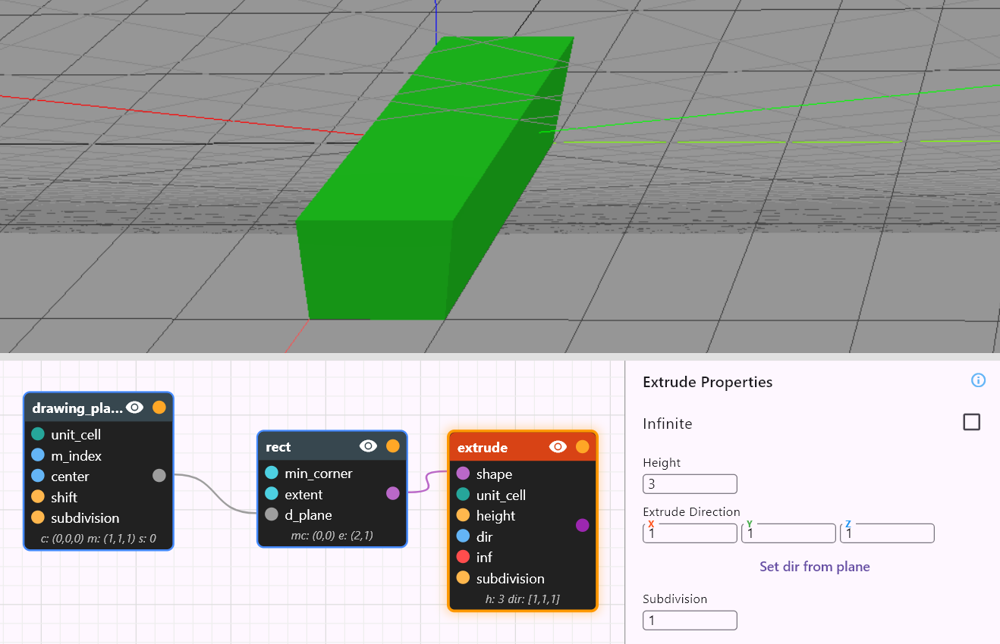


You can create a finite or infinite extrusion. Infinite extrusion is unbounded both in the positive and negative extrusion direction. Finite extrusions start from the plane and is also finite in the (positive) extrusion direction.

The extrusion direction can be specified as miller indices. The *'Set dir from plane'* button makes the extrusion direction the miller direction of the drawing plane.


## cuboid

Outputs a cuboid with integer minimum corner coordinates and integer extent coordinates. Please note that if the unit cell is not cubic, the shape will not necessarily be a cuboid: in the most general case it will be a parallelepiped. 

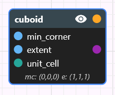

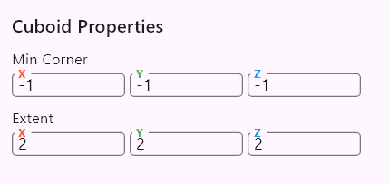

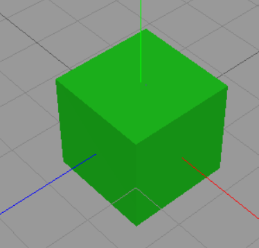

## sphere

Outputs a sphere with integer center coordinates and integer radius.

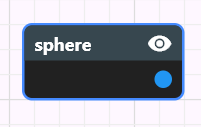

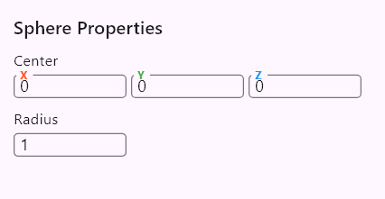

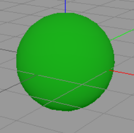

## half_space

Outputs a half-space (the region on one side of an infinite plane).

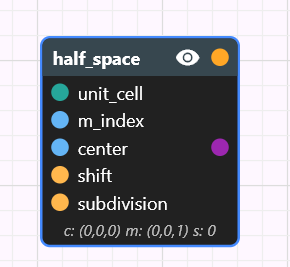

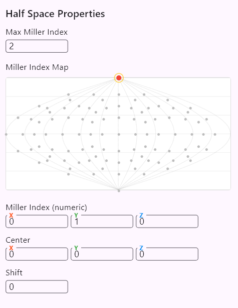

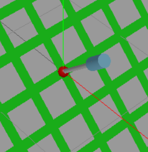

**Properties**

- `Center` — 3D integer vector; shown as a red sphere in the gadget.
- `Miller Index` — 3D integer vector that defines the plane normal. Enter it manually or pick it from the *earth-like* map. The number of selectable indices on the map is controlled by `Max Miller Index`.
- `Shift` — integer offset along the Miller Index direction. Measured in the smallest lattice increments (each step moves the plane through lattice points).

**Visualization**
The half-space boundary is an infinite plane. In the editor it is shown as a striped grid (even in Solid mode) so you can see its placement; otherwise the whole view would be uniformly filled. After any Boolean operation involving a half-space, the result is rendered normally.

**Gadget controls**

- Drag the light-blue cylinder to change `Shift`.
- Click the red `Center` sphere to show circular discs (one per Miller index) on a selection sphere; drag to a disc and release to choose that Miller index. The number of discs depends on `Max Miller Index`.

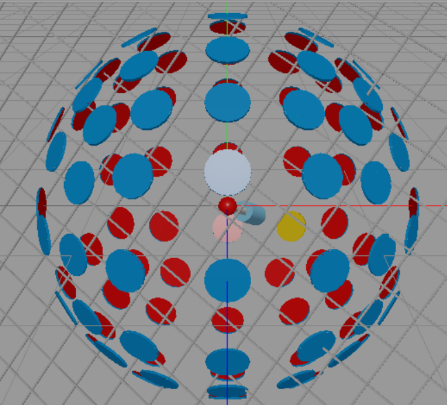

**Notes**
Striped rendering is only a visualization aid; it does not affect Boolean results.

## facet_shell

Builds a finite polyhedral **shell** by clipping an infinite lattice with a user‑supplied set of half‑spaces.

> WARNING: **facet_shell** currently only works correctly with cubic unit cells. We intend to add proper generic unit cell support to the **facet_shell** node in the future.

Internally it is implemented as the intersection of a set of half spaces: the reason for having this as a separate
built-in node is a set of convenience features.
Ideal for generating octahedra, dodecahedra, truncated polyhedra, Wulff shapes.

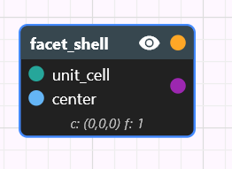

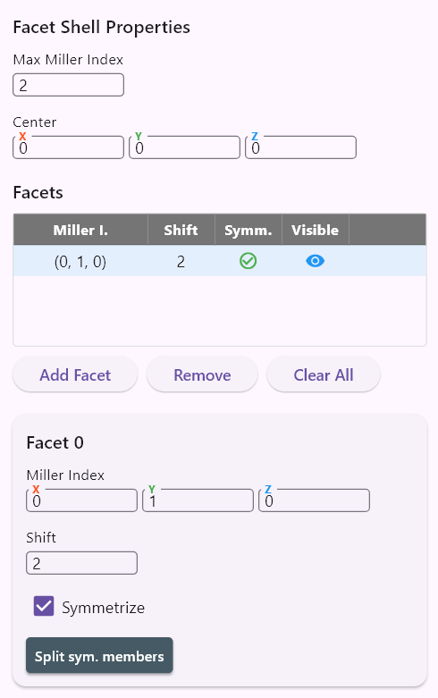

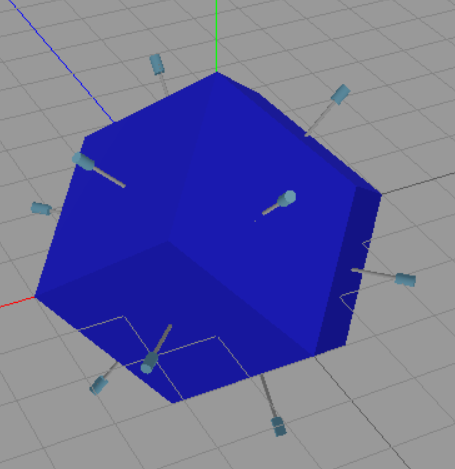

This node generally offers the same features as the half_space node, but some additional features are also available:

- clicking on a facet selects it.
- when a facet is selected you can manipulate it the same way as a half space.
- if you turn on the **symmetrize** boolean property for a facet, the facet will be symmetrized using the natural point group symmetry according to the miller index family. Basically a symmetrized facet is replaced with a set of facets according to the following table:

```
Miller family | Num. of planes | Equivalents generated
{100}         | 6              | (±1, 0, 0), (0, ±1, 0), (0, 0, ±1) — the six cube faces
{110}         | 12             | All permutations of (±1, ±1, 0) — normals pointing to the mid‑edges of the cube
{111}         | 8              | All sign combinations of (±1, ±1, ±1) — normals pointing to the eight corners of the cube
{hhl} (h≠l)   | 24             | All permutations of (±h, ±h, ±l) — “mixed” families where two indices are equal, one distinct
General (hkl) | 48             | All permutations of (±h, ±k, ±l) — the full 48‑member orbit under O<sub>h</sub>
```

- The 'Split symmetry members' button creates individual facets from the symmetry variants of a facet.

## union

Computes the Boolean union of any number of 3D geometries. The `shapes` input accepts an array of `Geometry` values (array-typed input; you can connect multiple wires and they will be concatenated).


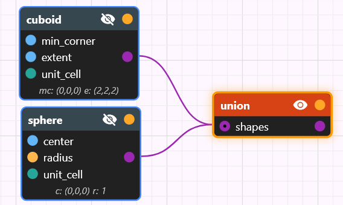

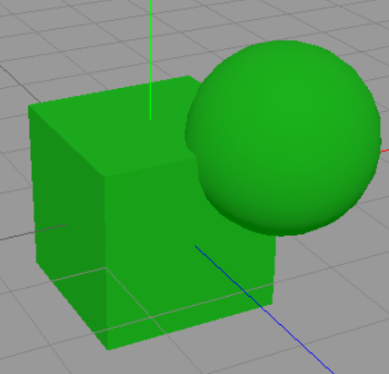

## intersect

Computes the Boolean intersection of any number of 3D geometries. The `shapes` input accepts an array of `Geometry` values.

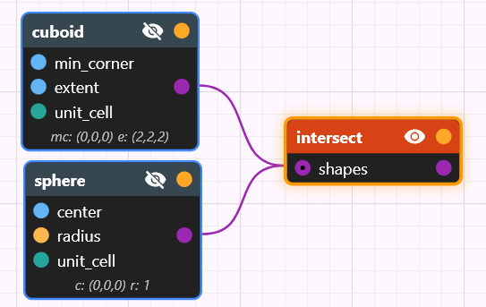

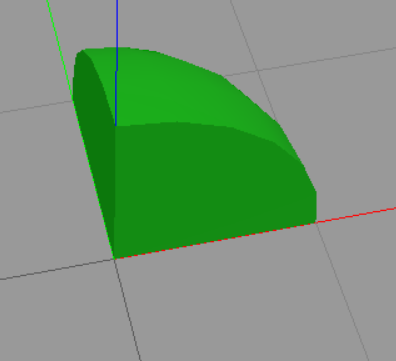

## diff

Computes the Boolean difference of two 3D geometries.

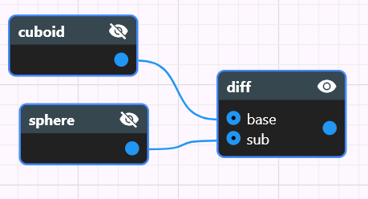

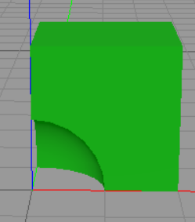

We could have designed this node to have two single `Geometry` inputs but for convenience reasons (to avoid needing to use too many nodes) both of its input pins accept an array of `Geometry` values and first a union operation is done on the individual input pins before the diff operation.
The node expression is the following:

```
diff(base, sub) = diff(union(...each base input...), union(...each sub input...))
```

## lattice_move

**Moves** the geometry in the **discrete lattice space** with a relative vector.

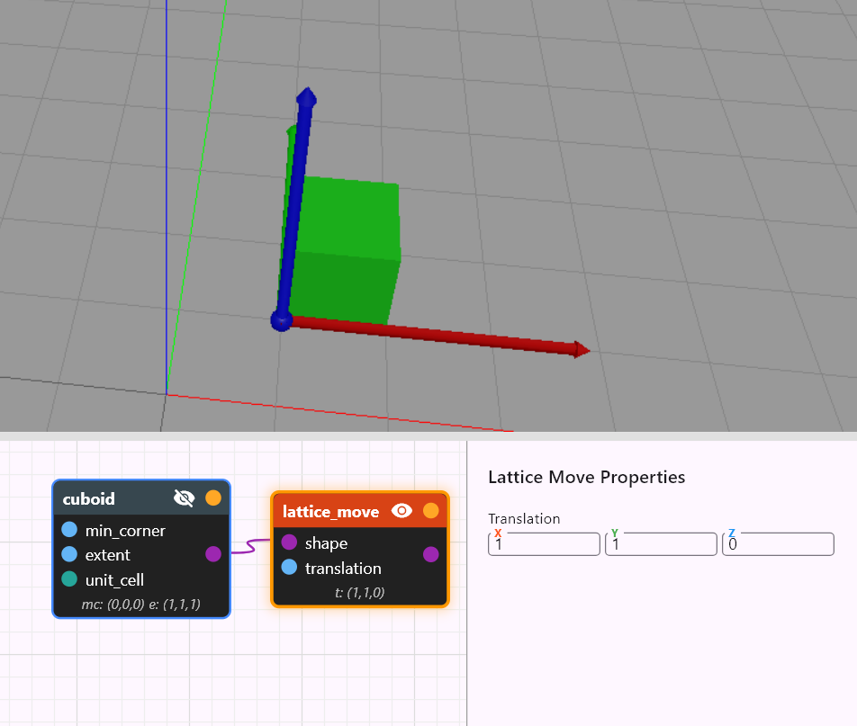


*Continuous* transformation in the lattice space is not allowed (for continuous transformations use the `atom_move` and `atom_rot` nodes which are only available for atomic structures).

You can directly enter the translation vector or drag the axes of the gadget.

## lattice_rot

**Rotates** geometry in lattice space.

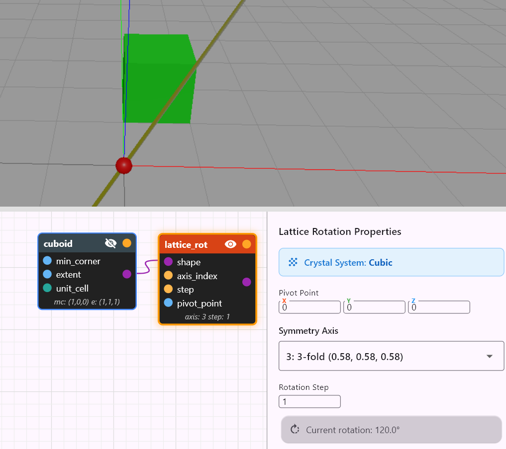

Only rotations that are symmetries of the currently selected unit cell are allowed — the node exposes only those valid lattice-symmetry rotations.
You may provide a pivot point for the rotation; by default the pivot is the origin `(0,0,0)`.
