# Math and programming nodes

← Back to [Reference Guide hub](../../atomCAD_reference_guide.md)

## int

Outputs an integer value.

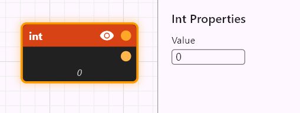

## float

Outputs a float value. 

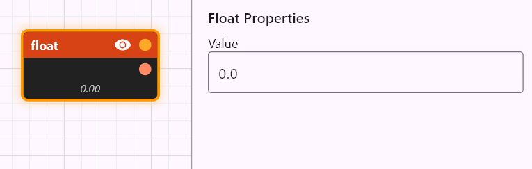

## ivec2

Outputs an IVec2 value.

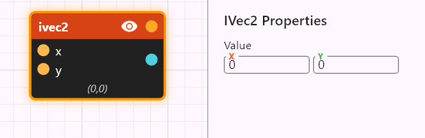

## ivec3

Outputs an IVec3 value.

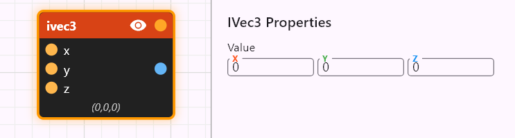

## vec2

Outputs a Vec2 value.

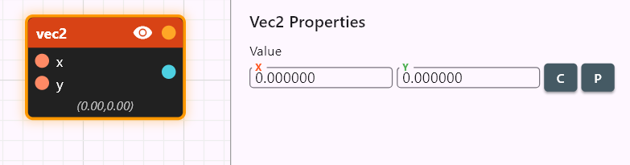

## vec3

Outputs a Vec3 value.

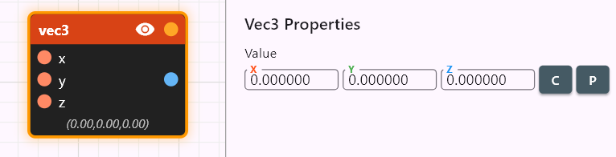

## imat3_rows

Outputs an `IMat3` (3×3 integer matrix) built from three row vectors.

**Input pins** (all optional, default to identity rows)

- `a: IVec3` — row 0 (default `(1, 0, 0)`)
- `b: IVec3` — row 1 (default `(0, 1, 0)`)
- `c: IVec3` — row 2 (default `(0, 0, 1)`)

**Stored property**

- 3×3 integer grid that supplies the row defaults when an input pin is unwired. Default is identity, so an unwired `imat3_rows` is the identity constant.

The subtitle shows `det = N` for the resolved matrix, or `det = ?` when any row is wired (the determinant cannot be precomputed).

## imat3_cols

Same as `imat3_rows` but the three input vectors are interpreted as **columns** instead of rows: `m[i][j] = col_j[i]`.

## imat3_diag

Outputs a diagonal `IMat3` from a single `IVec3`.

**Input pin**

- `v: IVec3` (optional, default `(1, 1, 1)`)

The result is `diag(v.x, v.y, v.z)`. This is the node to use when wiring an `IMat3` input pin (for example `supercell.matrix`) for the simple axis-aligned case.

## mat3_rows

Floating-point counterpart of `imat3_rows`: outputs a `Mat3` (3×3 float matrix) from three `Vec3` row vectors. Defaults are the float identity rows.

## mat3_cols

Floating-point counterpart of `imat3_cols`: three `Vec3` columns → `Mat3`.

## mat3_diag

Floating-point counterpart of `imat3_diag`: `Vec3 → Mat3` (`diag(v.x, v.y, v.z)`).

## bool

Outputs a Bool value (`true` or `false`).

## string

Outputs a String value.

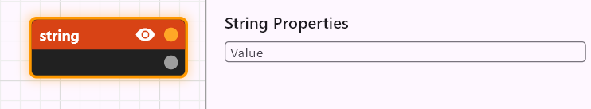

## expr

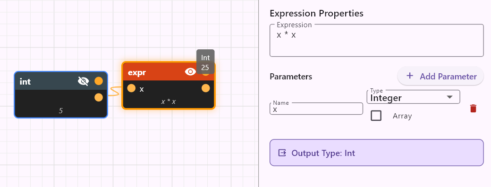

You can type in a mathematical expression and it will be evaluated on its output pin.
The input pins can be dynamically added on the node editor panel, you can select the name and data type of the input parameters.

The expr node supports scalar arithmetic, vector operations, conditional expressions, and a comprehensive set of built-in mathematical functions.

**Expression Language Features:**

**Literals**

- integer literals (e.g., `42`, `-10`)
- floating point literals (e.g., `3.14`, `1.5e-3`, `.5`)
- boolean values (`true`, `false`)

**Arithmetic Operators:**

- `+` - Addition
- `-` - Subtraction  
- `*` - Multiplication
- `/` - Division
- `%` - Modulo (integer remainder, only works on integers)
- `^` - Exponentiation
- `+x`, `-x` - Unary plus/minus

**Comparison Operators:**
- `==` - Equality
- `!=` - Inequality
- `<` - Less than
- `<=` - Less than or equal
- `>` - Greater than
- `>=` - Greater than or equal

**Logical Operators:**
- `&&` - Logical AND
- `||` - Logical OR
- `!` - Logical NOT

**Conditional Expressions:**

```
if condition then value1 else value2
```
Example: `if x > 0 then 1 else -1`

**Vector Operations:**

*Vector Constructors:*

- `vec2(x, y)` - Create 2D float vector
- `vec3(x, y, z)` - Create 3D float vector
- `ivec2(x, y)` - Create 2D integer vector
- `ivec3(x, y, z)` - Create 3D integer vector

*Member Access:*
- `vector.x`, `vector.y`, `vector.z` - Access vector components

*Vector Arithmetic:*
- Vector + Vector (component-wise)
- Vector - Vector (component-wise)
- Vector * Vector (component-wise)
- Vector * Scalar (scaling)
- Scalar * Vector (scaling)
- Vector / Scalar (scaling)

*Type Promotion:*

Integers and integer vectors automatically promote to floats and float vectors when mixed with floats.

**Vector Math Functions:**
- `length2(vec2)` - Calculate 2D vector magnitude
- `length3(vec3)` - Calculate 3D vector magnitude
- `normalize2(vec2)` - Normalize 2D vector to unit length
- `normalize3(vec3)` - Normalize 3D vector to unit length
- `dot2(vec2, vec2)` - 2D dot product
- `dot3(vec3, vec3)` - 3D dot product
- `cross(vec3, vec3)` - 3D cross product
- `distance2(vec2, vec2)` - Distance between 2D points
- `distance3(vec3, vec3)` - Distance between 3D points

**Integer Vector Math Functions:**

- `idot2(ivec2, ivec2)` - 2D integer dot product (returns int)
- `idot3(ivec3, ivec3)` - 3D integer dot product (returns int)
- `icross(ivec3, ivec3)` - 3D integer cross product (returns ivec3)

**Matrix Operations:**

The `Mat3` and `IMat3` types are 3×3 matrices, stored row-major (`m[i][j]` is row `i`, column `j`).

*Matrix Constructors:*

- `mat3_rows(a, b, c)` / `imat3_rows(a, b, c)` — build a matrix from three row vectors.
- `mat3_cols(a, b, c)` / `imat3_cols(a, b, c)` — build a matrix from three column vectors.
- `mat3_diag(v)` / `imat3_diag(v)` — diagonal matrix from a single vector.

*Arithmetic:*

- `Mat3 + Mat3`, `Mat3 - Mat3` — component-wise addition / subtraction (and the `IMat3` analogues).
- `Mat3 * Mat3` — standard matrix product.
- `Mat3 * Vec3` — matrix × vector (row-major: `result[i] = Σ_j m[i][j] · v[j]`). The reverse `Vec3 * Mat3` is rejected.
- The integer analogues `IMat3 * IMat3` / `IMat3 * IVec3` work identically. `IVec3` and `IMat3` operands promote to their float counterparts when mixed with floats, just like the scalar/vector promotion rule.

*Member Access:*

- `m.m00`, `m.m01`, … `m.m22` — access the nine entries of a `Mat3` (returns `Float`) or `IMat3` (returns `Int`). `.mIJ` is row `I`, column `J`.

*Matrix Functions:*

- `transpose3(m)` / `itranspose3(m)` — transpose.
- `det3(m)` — determinant (`Mat3 → Float`).
- `idet3(m)` — determinant (`IMat3 → Int`).
- `inv3(m)` — inverse (`Mat3 → Mat3`); returns an error for a singular matrix (`|det| < 1e-12`). No integer counterpart — an integer inverse would need a rational type.
- `to_mat3(m)` / `to_imat3(m)` — explicit `IMat3 ↔ Mat3` casts (the float→int direction truncates).

**Mathematical Functions:**

- `sin(x)`, `cos(x)`, `tan(x)` - Trigonometric functions
- `sqrt(x)` - Square root
- `abs(x)` - Absolute value (float)
- `abs_int(x)` - Absolute value (integer)
- `floor(x)`, `ceil(x)`, `round(x)` - Rounding functions

**Operator Precedence (highest to lowest):**
1. Function calls, member access, parentheses
2. Unary operators (`+`, `-`, `!`)
3. Exponentiation (`^`) - right associative
4. Multiplication, division, modulo (`*`, `/`, `%`)
5. Addition, subtraction (`+`, `-`)
6. Comparison operators (`<`, `<=`, `>`, `>=`)
7. Equality operators (`==`, `!=`)
8. Logical AND (`&&`)
9. Logical OR (`||`)
10. Conditional expressions (`if-then-else`)

**Example Expressions:**
```
2 * x + 1                           // Simple arithmetic
x % 2 == 0                          // Check if x is even (modulo)
if x % 2 > 0 then -1 else 1         // Conditional with modulo
vec3(1, 2, 3) * 2.0                // Vector scaling  
length3(vec3(3, 4, 0))              // Vector length (returns 5.0)
if x > 0 then sqrt(x) else 0       // Conditional with function
dot3(normalize3(a), normalize3(b))  // Normalized dot product
sin(3.14159 / 4) * 2               // Trigonometry
vec2(x, y).x + vec2(z, w).y        // Member access
distance3(vec3(0,0,0), vec3(1,1,1)) // 3D distance
```

## range

Creates an array of integers starting from an integer value and having a specified step between them. The number of integers in the array can also be specified (count).

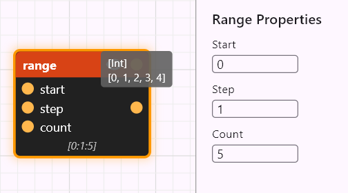

## sequence

Collects a fixed number of inputs into an ordered array. Use `sequence` when you want to build an array from inputs that come from different upstream nodes and you care about their order, or when you want each element to appear on its own labeled pin in the network — `range` and `map` produce arrays from rules, but `sequence` lets you wire up the elements explicitly one at a time.


**Properties**

- `Element type` — the type of every input pin and of the output array's elements (e.g. `Int`, `Blueprint`, `Crystal`, …). All input pins share this type.
- `Count` — number of input pins (minimum 1). Each pin is named by its index (`0`, `1`, `2`, …) and the output is `[ElementType]` with elements in pin-index order.

**Behavior**

The output is the array of values from connected pins, in pin-index order. Unconnected pins are skipped (they do not contribute a `None` element). For element-typed pins, each pin can also accept array-typed input thanks to the standard array conventions, but typically each pin carries a single value.

This node is also how the `Display array outputs` workflow is built up by hand: feed several outputs you want to view side-by-side into a `sequence` node, mark its output pin as displayed, and the array's elements render together in the viewport.

## map

Takes an array of values (`xs`), applies the supplied `f` function on all of them and produces an array of the output values.

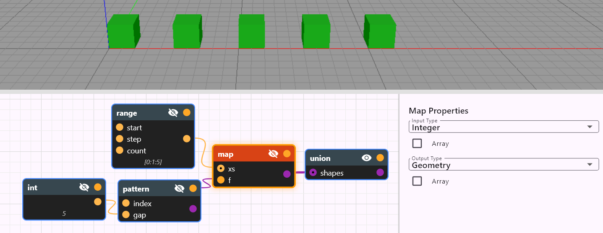

To see the map node in action please check out the *Pattern* demo [in the demos document](../../../samples/demo_description.md).

The above image shows the node network used in the Pattern demo. You can see that the input type chosen for the map node is `Int` and the output type is `Blueprint`. The data type of the `f` input pin is therefore `Int -> Blueprint`. You can see this if you hover over the `f` input pin with the mouse:

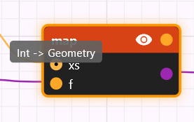

You can see that the `pattern` custom node in this case has an additional input pin in addition to the required one `Int` input pin: the `gap` pin. As discussed in the functional programming chapter, additional inputs are bound when the function value is supplied to the `map` node (this can be seen as a partial function application): this is the case with the `gap` input pin in this case and so this way the gap of the pattern can be parameterized.
