# Parts of the UI

← Back to [Reference Guide hub](../atomCAD_reference_guide.md)

This is how the full window looks like:
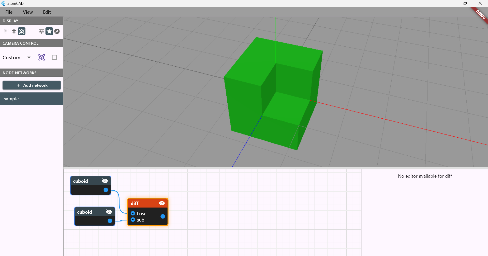

---

We will discuss the different parts of the UI in detail. The parts are:

- 3D Viewport
- Node Networks List Panel
- Node Network Editor Panel
- Node Properties Panel
- Display Preferences Panel
- Camera Control Panel
- Refresh status strip
- Profiler panel
- Preferences Dialog (Edit > Preferences)

## 3D Viewport

The node network results are displayed here.

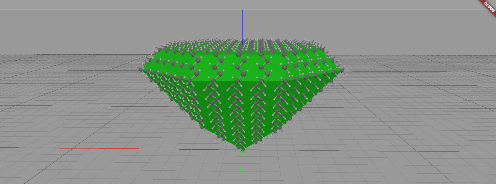

You can navigate the viewport with the mouse or touchpad. Although it is possible to use atomCAD with a touchpad we **strongly recommend using it with a mouse**. You can choose between multiple control mechanisms depending on your preference and constraints. (For example some mice do not have a middle mouse button or a mouse wheel).

- **Pan (move camera):**
  - Option 1: **Middle mouse button drag**
  - Option 2: SHIFT right mouse button drag
  - Option 3: SHIFT *touch-pan*  (for Magic Mouse or touchpad)

- **Orbit:** **Right mouse button drag**
- **Zoom:** 
  - Option 1: **Mouse scroll wheel**
  - Option 2: Vertical component of *touch-pan* (for Magic Mouse and touchpad)
  - Option 3: Pinch zoom (for touchpad)


All three operations use a *pivot point*. The pivot is the point where you click when you start dragging: if you click an object, the pivot is the hit point on that object; otherwise the pivot is the point on the XY plane under the cursor. You can visualize the pivot as a small red cube in **Edit → Preferences** (`Display camera pivot point`). For example, orbiting rotates the camera around the pivot point, and zooming moves the camera toward (or away from) the pivot point.

Orbiting is constrained so the camera never rolls (no tilt). This prevents users from getting disoriented. If you need complete freedom, a 6-degree-of-freedom (6DoF) camera mode will be developed soon.

By default the axis kept vertical on screen while orbiting is the world **Z** axis. When you work on a crystal surface that is not aligned with Z — a (111) or (110) surface, for example — that surface never levels out on screen and orbiting around it feels awkward. You can pick a different **navigation up-axis** (typically the surface's plane normal) so the surface stays level and orbits naturally. Use the **Up:** button in the [Camera Control Panel](#camera-control-panel). Changing the axis is a view-only convenience: it does not move or re-orient your model, and the background grid keeps showing the true world/lattice orientation.

## Node network composability and Node Networks list panel

A structure design consists of node networks. The list of node networks in the current design is shown in the **Node Networks** panel. Select a network in the panel to open it in the node network editor. To create a new network, click the **Add Network** button.

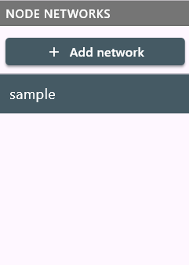

Node networks in a design can be browsed in the **List** tab or in the **Tree** tab. Especially in larger designs or in reusable part libraries it is beneficial to organize your node networks in a namespace hierarchy. The hierarchy can be created by simply naming your node networks using the '.' character as a separator.

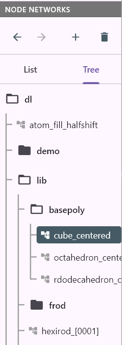

> Terminology: a name like `dl.lib.basepoly.cube_centered` is the qualified name of the given node network, while the name `cube_centered` is the simple name of that same node network.

**Where new things land.** The panel's **Add Network**, **Add record type def** and **New folder** buttons create the new item *next to the one you are working on* — in the namespace of the active network (or of the active record type def, when the schema editor is open). Working in `dl.lib.basepoly` and pressing **Add Network** gives you `dl.lib.basepoly.UNTITLED`, not a network at the top level. Each button's tooltip names the folder it will create in, so you can always check before clicking. In a design that uses no namespaces the active network is at the top level anyway, so the buttons behave exactly as if there were no rule at all.

Two ways to aim somewhere else:

- **Into a particular folder:** right-click that folder in the **Tree** tab and choose *Add node network*, *Add record*, or *New folder…*. The item is created inside it whatever is currently active.
- **At the top level:** right-click the empty space below the entries in the **Tree** tab and choose *Add node network at root*, *Add record at root*, or *New folder at root…*. This is how you start a new top-level namespace while you are working deep inside an existing one.

A network is created under an automatic name (`UNTITLED`, `UNTITLED1`, …) and becomes active immediately, with its folder expanded so you can see where it landed; rename it in place by double-clicking its row. If it landed in the wrong folder, *Move / rename…* in its right-click menu moves it in one step, and `Ctrl+Z` undoes the creation entirely.

**Renaming and moving.** Double-clicking a row renames it in place. What that in-place field edits differs between the two tabs, deliberately:

- In the **List** tab it holds the whole qualified name, so you can retype the path there.
- In the **Tree** tab it holds only the row's own name — its place in the hierarchy is already shown by where the row sits. Typing a dot into it still works and pushes the item *deeper*: renaming `myname` to `sub.myname` inside folder `a.b` gives `a.b.sub.myname`.

To move something *rootwards* or sideways — the direction in-place renaming cannot express — use **Move / rename…** from the row's right-click menu. It works on a network, on a record type def, and on a whole folder, and opens a dialog holding the **full qualified path** for you to edit:

- Editing the last segment renames it, exactly like the in-place field.
- Editing the leading part moves it: `a.b.myname` → `a.myname` promotes it one level, `a.b.myname` → `c.myname` moves it into a different folder.
- **Clearing the field entirely** (folders only) promotes the folder's whole contents to the top level.

Applied to a folder, the operation is a batch: the dialog lists every `old → new` rename it is about to perform, so you can see the whole subtree move before committing. Names that would collide with something already there are flagged in red and the **Apply** button stays disabled until you resolve them. Moves are undoable with `Ctrl+Z` like any other edit.

**Drag and drop.** In the **Tree** tab you can also just drag a row onto its destination:

- Dropping onto a **folder** moves the item into that folder. Dropping onto another **item** moves it into *that item's* folder — the same "drop next to a sibling" convention file explorers use.
- While a drag is in progress, a **Move to top level** bar appears at the bottom of the panel; dropping there promotes the item to the root.
- Resting the cursor on a **collapsed folder** springs it open, so you can drop into a branch that was closed when you started dragging.
- Dragging near the **top or bottom edge** of the panel scrolls the tree, so a destination that is off screen is still reachable in one drag.
- Dropping a folder into itself or into one of its own descendants is refused (the row will not highlight).

A drop does not commit anything on its own: it opens the same *Move / rename…* dialog, pre-filled with the destination you dropped on. So you always get the preview, the conflict check and a **Cancel** — an accidental drop costs one click on *Cancel*, not an undo.

**Who uses this network?** In the **List** tab, a network that is used somewhere in the design shows a small grey number at the right edge of its row: how many nodes across the whole design are instances of it. Networks that nobody uses show no number at all. Click the number — or right-click the row (in either the **List** or the **Tree** tab) and choose *Find Usages* — to jump to a usage; when there are several, you pick one from a list. This is the same navigation described under [Find Usages](#navigating-between-node-networks) below, started from the panel instead of from a node, so the landing is centered in the editor rather than anchored on the node you came from.

**Where is the error?** When something in a network is broken, its row shows a small coloured badge at the right edge (above the usage count) carrying the number of *problems* — one per underlying failure, not one per node it made dark (see [One problem, one entry](#one-problem-one-entry) below). The badge covers **both kinds of problem**: structural (validation) errors found by checking the design, and runtime (evaluation) errors that happened while computing results — a node whose relax failed or whose required input is unwired appears here just like a badly-wired one. The colour encodes severity: **red** when at least one problem makes a node's output unavailable (that node and everything downstream of it goes dark), **amber** when the problems are only advisory warnings. In the problem list, the *icon* tells the two kinds apart: a filled circle or warning triangle for structural problems, a **bolt** (⚡) for runtime ones.

Hovering the badge lists the problems; clicking it takes you to them. If there is a single problem tied to a node, clicking jumps straight there; if there are several, a list appears and you pick one, and each entry names the offending node (and, for a problem inside a higher-order function body, which body it is in). Choosing one activates the network, selects the node, and scrolls it into view — the same oriented jump as *Find Usages* — so you no longer have to hunt through a large network for the thing that is broken. This works from both the **List** and the **Tree** tab. In the **Tree** tab, a collapsed folder that hides an errored network is marked with a small red or amber dot, so a problem is never fully concealed by a collapsed branch — the dot points at the branch to expand.

**Getting the text out.** Error messages are meant to be pasteable into a bug report, so every error surface offers a way to copy it:

- *Edit > Copy all problems* copies **the whole design's** problem list — every network, every entry, with its severity, its kind (structural/runtime), the node it sits on and its downstream trail — as a plain-text report. This is the one to use when filing an issue. It is available in Direct Editing Mode too, where the only other error surface is a banner that carries no message at all.
- In the problem list opened from a row badge, the header carries a **⧉** that copies just that network's problems, and every entry carries its own **⧉**. Copying does not close the list.
- Right-click a broken node in the editor → *Copy error message* copies that node's message, prefixed with which network and node it came from. (The red hover tooltip cannot be selected with the mouse — it disappears the moment the pointer leaves the node — so this is how you get its text.)
- Error dialogs (*Load Error*, *Save Error*, *Import Error*, "cannot delete…") and the red error boxes in the property panels have **selectable** text and a **Copy** button.
- Failure messages that flash at the bottom of the window carry a **Copy** action for as long as they are on screen.

Two things to know about runtime entries:

- **Coverage:** runtime errors exist only for what was actually evaluated — the displayed nodes and everything feeding them. A node that is neither displayed nor upstream of anything displayed is never evaluated, so a failure lurking in it surfaces only once it participates in a displayed result.
- **Staleness:** the design is only evaluated while its network is the active one. When you switch away, a network's runtime entries are kept from its last evaluation and shown **dimmed** (greyed text, outlined bolt, a "from last evaluation" note) — they reflect the state when you left, and are refreshed the next time the network is active. Structural entries are always current for the whole design.

Problems in text you typed into a node — a `motif` definition, a `materialize` or `motif_sub` parameter-element list that does not parse — are listed here too, alongside everything else. They used to be visible only as a badge on the node itself, so a mistyped definition in a corner of a large design was easy to lose. `motif` reports its parse error in **red** (with nothing parsed there is no motif to hand downstream); `materialize` and `motif_sub` report theirs in **amber**, because they ignore the unparsed overrides and keep producing a result.

One message, one entry: when the same fact would otherwise be reported twice — once as a structural problem and again as the runtime failure it predicts — only the structural entry is shown, so a broken node reads as one problem rather than two phrasings of it.

##### One problem, one entry

A failure spreads: the node that broke goes dark, and so does everything downstream of it, each picking up its own *error in … input* message. Listing all of them would bury the one thing you can actually fix, so the panel lists the **root cause** — the node where the failure started — and tucks its downstream consequences underneath it, indented, in the same list. The badge count follows the same rule (one failure three nodes deep reads as **1**, and the hover text notes the size of its downstream trail as *+2 downstream*). The canvas is deliberately the opposite: there every affected node keeps its own red badge, because when you are looking at a node you want to know why *it* is dark.

From any consequence you can go straight to the thing that caused it:

- **Right-click a broken node → *Go to root cause***, offered whenever the node's error came in through a wire rather than starting there. (The same menu offers *Copy error message*.)
- In the panel's problem list, an indented entry carries a small **↑** button that does the same, and a **⧉** that copies it.

The jump follows the failure wherever it lives — **including into another network**. If the root cause is inside a custom node, the panel lists it as its own entry qualified with the network it lives in (*in myPart*), and jumping activates that network and selects the node. One thing to expect there: a network is evaluated on its own terms when you open it — with its own parameter defaults — so the node you land on may show **no** error badge, because the failure only happens with the arguments the calling network passes in. That is why the jump also flashes the original error text: you land with the context in hand. Use *Back* to return to where you came from.

Once you are inside an errored network, you can step through its problems one at a time with **`F8`** (next) and **`Shift+F8`** (previous), which cycle the selection across the errored nodes and wrap around — the same commands appear under *Edit > Go to next/previous error*, and right-clicking a broken node offers *Go to next error* too. A node carrying several messages is visited once per lap (its badge shows all of them). This keeps you within the network you are editing; errors in other networks stay reachable from their panel badges.

In the node network editor panel: Node titles show only the simple name, with the full qualified name available on hover.

### Navigating between node networks

When working with custom nodes (nodes defined by subnetworks), you can quickly navigate to their definitions:

- **Go to Definition:** Right-click a custom node and select *Go to Definition* to open the subnetwork that implements it.
- **Find Usages:** Right-click a custom node and select *Find Usages* to navigate in the opposite direction — to the other places where that node's type is used. Usages are found anywhere in the open design, including inside the bodies of higher-order function nodes. If there is exactly one other usage, you jump to it straight away; if there are several, a list appears and you pick one. The node you right-clicked is not listed (it is a usage of its own type, which is never what you are looking for), so a node that is the only instance of its type reports *No other usages*.

  The jump keeps you oriented: the zoom level does not change, and the node you land on appears at the same place on screen where the node you right-clicked was. The usage is also selected, so if it sits inside a collapsed function body you land on the body's node and find the usage highlighted when you open the body. Use *Back* (below) to return to where you came from.

  The same search is available from the **Node Networks** panel — see [the usage count on a panel row](#node-network-composability-and-node-networks-list-panel) above. Started from there it asks about a *network* rather than about a node under the cursor, so nothing is excluded from the result: a network nobody instantiates reports *is not used by any network*.

The **Node Networks** panel includes browser-like navigation buttons at the top:

- **Back (←):** Returns to the previously viewed node network.
- **Forward (→):** Moves forward in the navigation history after going back.

These buttons are grayed out when navigation in that direction is unavailable.

Each node network stores its own camera settings (position, orientation, orthographic mode). When you switch between node networks, the camera automatically restores to the saved view for that network. Camera settings are saved as part of the `.cnnd` file.

## Node network editor panel

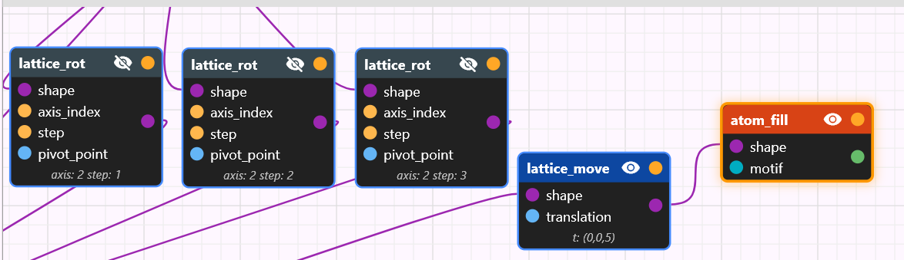

### Navigating in the node network editor panel

There will be a separate longer chapter in this document about node networks. Here we just discuss how to use the node network editor panel in general. If this UI chapter does not make sense yet to you, come back to it after reading the node networks chapter.

The node network editor canvas can be panned the following way:

- Option1: **Middle mouse button drag**
- Option 2: SHIFT right mouse button drag
- Option 3: SHIFT *touch-pan* (for Magic Mouse or touchpad)

If you get lost you can use the *View > Reset node network view* menu item.

The node network can be zoomed using the mouse scroll wheel.

Each node network remembers its own canvas view (pan position and zoom level). When you switch between networks — or navigate with *Back* / *Forward* — the editor restores the view you last left for that network instead of re-framing from scratch, so you land where you were looking. A brand-new network (or one saved before this was added) has no stored view, and the editor frames its top-left node instead; *View > Reset node network view* also re-frames to the top-left node. The stored view is saved as part of the `.cnnd` file.

### Manipulating nodes and wires

**Add nodes**
Right-click in the node editor to open the **Add Node** window and add a new node.

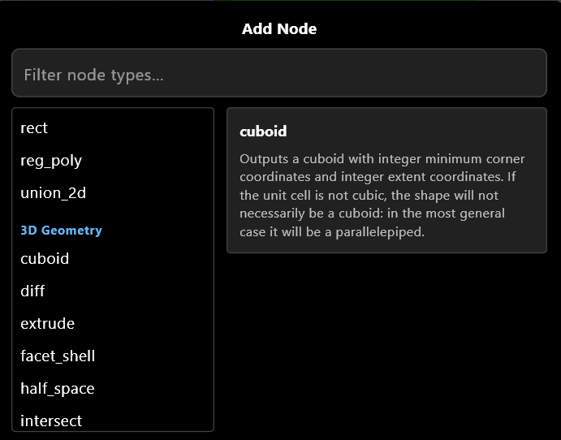

**Move nodes**
Left-click a node and drag to move it.

**Edit a comment note in place**
Double-click a [comment](./nodes/annotation.md#comment) node — the yellow sticky note — to type into it directly on the canvas, rather than going to the Node Properties panel. Double-click its title bar to edit the title, its body to edit the text; the cursor lands on the character you clicked. Click outside to finish, or press `Esc` to discard. The panel fields still work and stay in sync.

**Connect pins**
Left-click and drag from an output pin to an input pin to create a wire. To disconnect a wire, select it and press `Del` (see Selection below).

**Quick-add node from wire**
If you drag a wire from a pin and release it in empty space, the **Add Node** window opens filtered to show only nodes with compatible pins. After selecting a node type, the new node is created at the drop location and the wire is automatically connected. If multiple pins are compatible, a dialog lets you choose which one.

**Selection**
Multiple nodes and wires can be selected. Selection is used for:

- Deleting selected nodes or wires with the `Del` key.
- Editing the *active* node’s properties in the **Node Properties** panel.
- Enabling viewport interactions for the *active* node: many node types expose interactive *gadgets* in the viewport; the exact interactions depend on the node type (see the Nodes Reference section).

*Single selection:*
- Left-click a node or wire to select it (clears previous selection).

*Multi-selection:*
- **Ctrl+click** a node or wire to toggle it in/out of the current selection.
- **Shift+click** a node or wire to add it to the current selection.
- **Rectangle selection:** Left-click and drag on empty space to draw a selection rectangle. Any node or wire that overlaps the rectangle is selected. Modifier keys work with rectangle selection too: Ctrl toggles, Shift adds.

*Active vs selected:*
When multiple nodes are selected, the most recently selected/added node becomes the *active* node. The active node is shown with a different color and is the one whose properties appear in the Node Properties panel and whose gadget is shown in the viewport.

*Moving multiple nodes:*
When you drag any selected node, all selected nodes move together.

**Visibility vs selection**
Selecting a node does *not* make its output visible. Visibility is controlled independently by an **eye icon next to each output pin**: a node with one output pin has one eye icon; a multi-output node such as `atom_edit` has one eye icon per pin, each toggling that pin's display in the 3D viewport independently. The **Geometry Visualization** preferences panel also contains node display policies that may automatically change node visibility when selections change (see **Geometry Visualization** preferences). Display policies operate at node level — they make pin 0 visible; additional pins of a multi-output node are only displayed via explicit toggle. Nodes inside a higher-order function's or closure's body region have no eye icon — except inside a **parameter-less closure**, whose body nodes are viewable (see [Viewing the contents of a parameter-less closure](./node_networks.md#viewing-the-contents-of-a-parameter-less-closure)); display policies never touch body nodes either way.

**Copy, cut, paste, and duplicate**
Selected nodes can be copied, cut, and pasted:
- `Ctrl+C` to copy, `Ctrl+X` to cut, `Ctrl+V` to paste (also available via right-click context menu).
- `Ctrl+D` to duplicate selected nodes in place.
- Internal wires between copied nodes are preserved; external connections (wires to nodes outside the selection) are dropped.
- Pasted nodes are placed at the mouse cursor position.
- You can copy nodes in one network and paste into a different network.

**Factor selection into subnetwork**
You can convert a group of selected nodes into a reusable custom node type:
1. Select one or more connected nodes.
2. Right-click and choose **"Factor into Subnetwork..."**.
3. A dialog opens where you can set the subnetwork name and edit parameter names.
4. On confirmation, the selected nodes are moved into a new subnetwork and replaced with a single custom node instance.

The selection must be a "single-output subset" — at most one wire may exit the selection to nodes outside it. Parameter nodes cannot be included in the selection.

**Inline a custom node**
The inverse of factoring: you can replace a custom node instance with a copy of its subnetwork's contents, spliced into the current network in place.
1. Right-click a custom node instance and choose **"Inline"**. (The item appears only for custom nodes — built-in nodes, including the higher-order-function nodes, `closure`, and `apply`, cannot be inlined.)
2. The single instance is removed and the subnetwork's nodes are copied in where it stood. Each input pin's incoming wire is reconnected to whatever inside the subnetwork consumed the matching `parameter`, and consumers of the instance's output are reconnected to the subnetwork's return node. Surrounding nodes are pushed right and down to make room for the (usually larger) inlined content.

The named subnetwork definition in the user-types panel is **left untouched** — only this one instance is expanded, and any other instances of the same custom node keep working. Inlining works in any scope, including inside a higher-order-function body, and is undoable (`Ctrl+Z`).

**Convert between a closure and a named network**
A [`closure`](./nodes/math_programming.md#closure) and a custom node instance used as a [function value](./nodes/math_programming.md#function-values-and-closures) are two representations of the same thing — a function with some captured values — so you can convert freely between them. Both operations are exact inverses of each other, work in any scope (including inside a higher-order-function body), and are undoable (`Ctrl+Z`).

- **Convert to Closure** — right-click a custom node instance and choose **"Convert to Closure"**. The instance is replaced by a `closure` node whose inline body is a copy of the subnetwork's contents. The instance's **wired** input pins become **captures** in the body (the capture wires are reconnected to the same sources); its **unwired** input pins become the closure's **parameters**. The named subnetwork definition is left untouched. The item appears only for a custom node instance that is *used as a function* — i.e. nothing consumes its normal output, only its [function pin](./node_networks.md#anatomy-of-a-node) (or it is unconsumed) — and whose subnetwork has a return node. Use it when you want to edit one function's body in place, or reshape an instance into a reusable `closure`.

- **Extract to Network…** — the inverse: right-click a `closure` node and choose **"Extract to Network..."**. A dialog asks for a name; on confirmation a new custom node type is created from the closure's body and the `closure` is replaced by an instance of it, used through its function pin. The closure's **parameters** and its **captures** both become `parameter` nodes of the new network; the instance's capture pins are wired to the original capture sources. Use it to promote a one-off closure body into a named, reusable subnetwork that appears in the user-types panel.

**Click-to-activate from viewport**
When multiple nodes have their output visible in the 3D viewport, you can click on a rendered output to activate the node that produced it. The first click activates the node and scrolls the node network panel to reveal it; subsequent clicks on the same node’s output perform the normal action (e.g., atom selection). If outputs from multiple nodes overlap at the click position, a disambiguation popup appears letting you choose which node to activate. The active node’s geometry is rendered with a distinct color to help distinguish it from other visible outputs.

Clicks on the active node's interactive gadget (e.g. the XYZ translation gizmo's arrows) always go to the gadget — they are never treated as click-to-activate, even when another node's rendered output lies behind the gizmo. Gizmo handles also have a minimum grab size in screen pixels, so they stay easy to hit when zoomed out.

### Execute action (side-effect nodes)

Some nodes exist to *do something* rather than to produce a value: `export_atoms` writes an atomic-structure file (`.xyz` or `.mol`) to disk; `foreach` runs a body once per element of an upstream stream; future effect nodes will follow the same pattern. These nodes return the [`Unit` data type](./node_networks.md#data-types) (a value that carries no information) so the node graph can wire them around without misrepresenting them as data sources.

Effect nodes only fire when the user **explicitly invokes them**. To run an effect node, **right-click the node and choose Execute** from the context menu. This is the *only* way an effect node fires — display passes (the implicit re-evaluations triggered by editing parameters, moving nodes, panning the camera, etc.) skip over Unit-returning nodes entirely, even when the node is visible. That eliminates a whole class of footguns where editing an unrelated parameter would silently overwrite an exported file.

The Execute action is **one-shot**: invoking it runs a single evaluation pass with the side-effect flag set, then resets. There is no "armed" state — to re-fire, right-click and choose Execute again. The targeted node is evaluated independently of display state: whether the node is visible or not, and whether anything downstream is displayed, the action evaluates the node and its transitive inputs fresh.

While an Execute pass is running, a small modal **"Executing…"** dialog appears so you know the app is working and not frozen. (The Rust evaluator runs synchronously on the UI thread, so the dialog does not animate while the pass is in flight; it disappears as soon as the pass completes.) On success, a status snackbar confirms completion; on error, a snackbar surfaces the message and the targeted node lights up red in the graph.

The most common pattern is a `product → foreach( variant → export_atoms(...) )` pipeline: edit the product axes freely (no files written), then right-click the `foreach` node and choose Execute to write one file per variant. See the [`foreach`](./nodes/math_programming.md#foreach) and [`export_atoms`](./nodes/atomic.md#export_atoms) reference entries for full pipeline examples.

## Console panel

The **Console panel** is a docked, collapsible bottom strip that displays entries pushed by the [`print` node](./nodes/math_programming.md#print) — a debug-observation surface for the node graph. Hidden by default; toggle with **Ctrl+`** (backtick — same as VS Code / Chrome dev tools), via the *View > Show/Hide Console* menu entry, or by clicking the close `×` icon on the panel header.

When visible, the panel shows a chronological list of entries, newest at the bottom. Each row reads:

```
[HH:MM:SS]  [▶]  network_name / node_label    text
```

The `▶` marker appears only on entries produced by Execute passes, so you can tell at a glance which prints came from an explicit run versus a normal display refresh. Entries accumulate across passes; closing and reopening the panel does not lose them, but closing the application does (the log is in-memory only).

Header controls:

- **Autoscroll toggle** — when on (default), the view scrolls to the latest entry as new ones arrive; when off, the scrollbar stays where you parked it so a long log won't yank away while you are reading older entries.
- **Clear** (trash icon) — empties the buffer.
- **Close** (×) — collapses the panel; equivalent to *View > Hide Console* or **Ctrl+`**.

A small dot on the *View > Show Console* menu item (and on the toolbar toggle, when the panel is closed) signals that new entries arrived since the panel was last open. Opening the panel clears the dot.

See the [`print` node reference](./nodes/math_programming.md#print) for how to feed the Console panel from a node network.

## Refresh status strip

Along the very bottom of the window runs a thin, always-visible strip that reports how long the last screen refresh took and where that time went:

```
refresh 1.83 s — eval 1.61 · tess 0.15 · gpu 0.02 · view 0.05   (Partial)
refresh 0.04 s — eval —    · tess 0.02 · gpu 0.01 · view 0.01   (Lightweight)
```

All numbers are seconds. The phases are:

- **eval** — evaluating the node network to produce the displayed results. This is usually the dominant cost on a heavy design.
- **tess** — turning those results into triangles, lines and impostors for the renderer.
- **gpu** — uploading the new meshes to the graphics card.
- **view** — rebuilding the editor's own views (node network, panels, lists) from the updated state.

The tag in brackets says which kind of refresh you are looking at:

- **Full** — everything was re-evaluated.
- **Partial** — only the parts affected by what you just changed. Toggling a node's display on and off should be visibly cheaper than a Full refresh.
- **Lightweight** — no evaluation at all; only the gadget and the view were updated. This is what a gadget drag produces, and it is why the **eval** entry reads `—` rather than `0.00`: there was no evaluation phase to time, which is not the same thing as an instantaneous one.

During a drag the strip updates about five times a second rather than on every mouse move, so watching it costs nothing.

There is nothing to configure and nothing to switch on; the strip is simply there. It is a quick way to answer "why did that feel slow?" — for instance, to see whether a sluggish edit is spending its time evaluating the network or drawing an unusually heavy structure.

One thing can appear at the right-hand end of the strip: an amber **memo OFF**
marker. It means the [evaluation memo](#the-evaluation-memo-and-its-off-switch)
has been switched off, which can make evaluation several times slower on a
design with shared nodes. It is a diagnostic state, and the marker is on the
always-visible strip precisely so that "everything got slow" has an answer
sitting in front of you rather than behind a panel you last opened an hour ago.

## Profiler panel

Where the [refresh status strip](#refresh-status-strip) says *how long* the last
refresh took, the **Profiler panel** says *what it was spent on*. It is a
docked, collapsible bottom panel, hidden by default; open it from
*View > Show Profiler* and close it from the same entry or the panel's `×`.

The panel has four tabs, and only the first one works without switching
anything on.

### Phases

A table of the last ~20 refreshes, newest first, with each one broken into its
phases in milliseconds: **Eval**, **Scene** (scene-dependent node data),
**Gadget**, **Tess**, **GPU** and **Bkgnd** (the background grid/axes rebuild),
against the refresh's **Total**.

Two columns need a word of explanation:

- **N** — a run of consecutive *Lightweight* refreshes is folded into a single
  row, because one gadget drag emits hundreds of them and they would otherwise
  push every interesting refresh out of the table before you could look at it.
  `N` says how many ticks the row covers, and its timings are their means.
- **CSG hit/lookup** — how many geometry-conversion cache lookups the refresh
  made and how many of them hit. The *time* is already charged to the node that
  triggered the conversion; the counter is here because it explains why two
  otherwise identical refreshes differ.
- **Memo hit/req** — the same reading for the
  [evaluation memo](#the-evaluation-memo-and-its-off-switch): how many node
  results the refresh asked for and how many were served from earlier in the
  same refresh. A row taken with the memo switched off reads `off` and is
  tagged `·memo off` in the **Mode** column, which is what makes an A/B pair
  legible side by side.

Above the table, an always-present line reports the memo's numbers for the most
recent refresh: hits over requests, the peak number of entries and megabytes it
held against the budget from [Memory preferences](#memory), what it still held
at the end, and — when they are non-zero — how many entries were retired with
their loop iteration and how many were deliberately not stored. If the memo ever
had to **evict** something for space, that line turns amber and names the
preference to raise: an eviction means work was recomputed, and it is the one
number here that is a problem rather than a reading.

As on the strip, a Lightweight refresh shows `—` for **Eval** rather than
`0.00`: it runs no evaluation pass at all, which is not the same thing as an
instantaneous one.

### Turning per-node measurement on

The other three tabs need the **Per-node** switch in the panel header. It is off
by default and deliberately not remembered between sessions: per-node
measurement costs two clock reads and a table update on *every node
evaluation*, which is nothing on a normal graph and very much something inside a
`map` body over a hundred thousand elements. A profiler that inflates the
numbers it reports is worse than none, so switch it off when you are done
measuring. (Phase timing, and therefore the Phases tab and the status strip, has
no off switch and no measurable cost.)

The **Profile full refresh** button next to it arms the switch and forces a
*Full* refresh. Use it whenever you want two readings you can compare: without
it the panel shows whatever partial refresh happened to run last, and two
measurements taken minutes apart may have evaluated quite different amounts of
the network.

The tables are a snapshot. Switching Per-node back off — or doing anything else
that causes an ordinary refresh — leaves the last measured tables on screen
rather than blanking them.

### The evaluation memo and its off switch

During a refresh, atomCAD keeps each node's result so that a node feeding
several others is computed once rather than once per consumer — this is what
makes the [cost model](./node_networks.md#cost-model-how-often-a-node-is-computed)
true. That table is the **evaluation memo**, and it is on by default; its size
limit is the *Evaluation memo (MB)* budget in [Memory preferences](#memory).

The **Memo** switch in the profiler panel header — mirrored by
*View > Disable Evaluation Memo* — turns it off. This is a diagnostic, not a
preference:

- Unlike **Per-node**, it defaults **on**, because it is how the application
  normally behaves.
- Toggling it forces a *Full* refresh, so the effect shows up in the very next
  reading rather than one refresh later.
- It is not remembered between sessions. It resets to on when you restart.
- While it is off, the [refresh status strip](#refresh-status-strip) shows an
  amber **memo OFF** marker.

What it is *for*: if you ever suspect a result is wrong, switch the memo off and
refresh again. The viewport must not change. If it does, that is a bug in
atomCAD worth reporting — and this is the one-click comparison that establishes
it, on the design and the state that provoked it.

Switching the memo **on** disarms the [self-check](#redundancy) if it was armed,
and the self-check cannot be armed while the memo is on; the strip above the
Redundancy table says so and points back here.

### By node type

`Type | Nodes | Evals | Self | Total | % self`, sorted by self time. This is
the first place to look: it answers "which *kind* of node is this design
spending its time in", and it is usually a much shorter list than the per-node
one.

- **Self** is the time inside that node's own evaluation, with the time spent
  evaluating its inputs subtracted.
- **Total** includes everything the node pulled from upstream.
- **Evals** counts evaluations, not nodes — a node that several other nodes
  depend on is evaluated once per consumer, so this number is routinely larger
  than **Nodes**.

### By node

`Node | Lookups | Evals | Self | Total | Wasted`, sorted by self time, one row
per node.

**Lookups** counts how many times a result for the node was *asked for*, and
**Evals** how many times it was actually computed. Today those are always equal
— nothing reuses an evaluation result between requests. **Wasted** is the part
of the node's self time that would disappear if they were reused; it reads `—`
for the few nodes where reuse is not on the table (see
[Redundancy](#redundancy) below). **Self** and **Total** mean what they do in
the By-node-type table.

The node is named by its full address — `main/fold#12/add#3 (mysum)` is the
`add` node with id 3, custom-named `mysum`, inside the body of the `fold` with
id 12 in the network `main`. **Click a row to jump to that node on the canvas**,
the same way *Find Usages* and the error picker jump.

The address is relative to the network the node actually lives in, so the jump
crosses network boundaries: a row reading `geo.1-precursor_proxy/materialize#8`
opens the `geo.1-precursor_proxy` network and selects node 8 there. Note what
such a row means — it is **one row for the node itself**, summed over every
instance of that subnetwork and every time each was evaluated. A high **Evals**
count on it is the interesting signal: the same subnetwork cone is being
recomputed once per consumer.

Two readings in this table look like bugs and are not:

- **A custom-node instance shows almost no self time against a large total.**
  That is correct and is the useful reading: the instance itself only delegates
  to its network's return node, so its *total* is what the subnetwork cost.
- **A `map` shows a near-zero total, with the time appearing under the `collect`
  that consumed it.** `map` is lazy — its body runs when something pulls
  elements out of the stream, so the work is attributed to the puller. To read
  the cost of a `map` body, look at the body's own rows.

A greyed-out, non-clickable row is rare: it is a node inside a lazily evaluated
`map`/`filter` body whose position could not be pinned down to a single network.
It is measured like any other and still rolls up in the By-node-type table;
there is simply no address to jump to.

### Redundancy

The question this tab answers is *not* "how often was this node evaluated?" but
"how often was it evaluated **in a situation it had already been evaluated
in**?" Only the second kind of repetition is avoidable, and the difference is
easy to get backwards.

**Which reading you are getting depends on the memo switch**, and the footnote
says which:

- With the [memo](#the-evaluation-memo-and-its-off-switch) **on** — the normal
  state — this tab shows the redundancy that is *left*. A healthy design reads
  `1.0×` almost everywhere, and the footnote confirms there were no unexplained
  repeats. It does **not** show what the memo saved: a result served from the
  memo is not requested again further up the cone either, so both the counts and
  the **Wasted** column collapse. To see what the memo actually did, read the
  memo line above the [Phases](#phases) table, or profile the same design once
  each way and compare the two ring rows.
- With the memo **off**, the tab shows the redundancy that *would* be there
  without it, and the footnote gives the total a perfect memo would save. This
  is the reading the memo was designed against.

The distinction between the two kinds of repetition:

- A node that two other nodes both depend on is *requested* twice with the exact
  same inputs. One of those two requests is pure repetition — and, with the
  [evaluation memo](#the-evaluation-memo-and-its-off-switch) on, it is served
  from the first rather than recomputed.
- A node inside a `map`/`fold` body running over three elements is evaluated
  three times — but each run sees a *different* element, so nothing is repeated
  and nothing could be saved.

The tab makes that distinction with **Envs**, short for *environments*. An
environment is everything that can make one evaluation of a node differ from
another: which subnetwork instance it was running inside, and — for a node in a
loop body — which iteration it was on. By that reading the first case above is
**one** environment visited twice, and the second is **three** environments
visited once each.

`Node | Lookups | Envs | Factor | Self | Wasted | Note`, ranked by **Wasted**:

- **Lookups** counts *requests*, not computations, so it does not fall when the
  memo starts serving them — it measures demand. To see what was actually
  computed, compare it against **Envs**.
- **Factor** is `Lookups / Envs`. `1.0×` means every request was genuinely
  different work. `11×` means ten of the eleven requests were repetitions — with
  the memo on, ten of them were served rather than recomputed.
- **Wasted** is what that costs in milliseconds — the actionable number, and the
  reason the table is sorted by it rather than by the factor. A node with a `20×`
  factor and 0.1 ms of self time is not worth anything; a `2×` factor on a
  600 ms `materialize` is.
- **Note** marks the rows where the repetition could *not* simply be cached
  away: `iterator` (the node produces a lazy stream, which is deliberately not
  stored — its cost lives in whatever drains it), `cycle` (the node is part of a
  wiring loop that escaped validation, which is a bug to fix rather than a
  saving to collect), `subnetwork` (a custom-node instance requested one pin at
  a time, which the memo cannot store as a whole — the expensive work inside the
  subnetwork is still shared) and `evicted` (the memo did hold this result and
  had to drop it to stay inside its budget; raise *Evaluation memo (MB)* in
  [Memory preferences](#memory) if you see this on a design you work with).
  Those rows show `—` under **Wasted** so the number is never read as money on
  the table.

The footnote under the table gives the same numbers for the pass as a whole.
With the memo on it ends with the one number that matters: how many rows were
recomputed within a single situation *without* a reason in the **Note** column.
That should read as "no unexplained repeats"; anything else is a bug in atomCAD
worth reporting. With the memo off it gives the total a perfect memo would save
instead.

Read the per-node rows before the total: a design can be "2.5× redundant"
overall while all of that sits in two nodes and the rest is 1.0×.

Nothing in this tab changes what the application computes.

The strip above the table reports the **self-check**: an expensive, off-by-
default verification that two evaluations the profiler considers "the same
situation" really did produce the same result. It exists to test the profiler's
own reasoning rather than your design — a clean run means the redundancy numbers
above can be trusted, and a violation means they cannot.

Switch it on with the toggle at the left of the strip, then take a profiled
refresh. It needs **Per-node** on as well, and it can only be armed with the
[evaluation memo](#the-evaluation-memo-and-its-off-switch) **off** — the check
compares two computations of the same situation, and the memo serves the second
from the first, so under a memo it would pass without testing anything. It is
markedly slower than ordinary profiling — it summarises every result the pass produces and keeps one
summary per distinct situation — so switch it back off when you go back to
measuring time. On a very large pass the sampling stops at a ceiling and the
strip says so; a clean result then covers only the part of the pass that was
sampled.

### What this panel is not

It measures at node boundaries, so it will tell you *which* node is slow but not
which line inside it. For that, an external profiler is still the right tool.

## Node Properties Panel

The properties of the active node can be edited here.

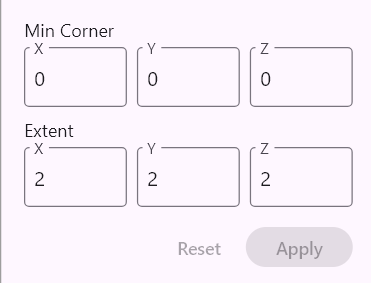

**Which network am I in?** The panel is headed by the qualified name of the active node network, with the namespace greyed and the network's own name emphasised:

```
dl.lib.basepoly.cube_centered
```

When the name is too long for the panel it breaks after the namespace's dot, so the part you usually want — the name itself — is never the part that gets cut off:

```
dl.lib.irod100.
x_rect100_centered
```

The header stays put whichever node is selected, and the name can be selected with the mouse; the **⧉** button beside it copies the whole qualified name to the clipboard in one click — handy when you need to type it into a dialog, hand it to the command line, or quote it in a bug report.

This is different for each node, we will discuss this in depth at the specific nodes. There are some general features though:

- When dragging the mouse on integer number editor fields the number can be
incremented or decremented using the mouse wheel. Shift + mouse wheel works in 10 increments.
- Selecting a **custom node** (a node defined by a subnetwork) shows an auto-generated panel with one editable field per simple-typed parameter pin — see [Editing custom node parameters](./node_networks.md#editing-custom-node-parameters).

In case no node is selected the description of the active node network can be edited in the node properties panel:

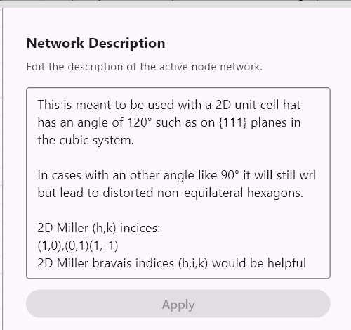

This description will be displayed beside the custom node in the *Add Node* window. The shorter **Summary** above it is what verbose command-line listings show. Both belong to the network named in the panel header, so if you are unsure which network's documentation you are typing into, look at the top of the panel.

## Display Preferences Panel

This panel contains common settings for how geometry and atomic structures are visualized.

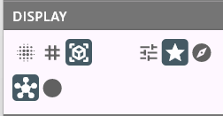

The buttons are arranged in **groups separated by vertical lines**, and a group is always of one kind: either a *radio group*, where exactly one button is lit at a time (the geometry rendering methods), or a run of independent *on/off toggles* (show axes, show grid). This matters because a lit button looks the same either way — the separators tell you whether the neighbours are alternatives to each other or unrelated switches. Groups covering the same subject sit next to each other, and the whole bar reflows into as many lines as it needs, so widening or narrowing the sidebar changes how the groups are distributed across lines.

### Geometry Visualization mode

Choose how geometry node outputs are rendered:

- **Surface Splatting** — The surface is represented by many small discs sampled from the object’s Signed Distance Field (SDF). This mode renders true implicit geometry (no polygonal mesh is produced).
- **Wireframe (Explicit Mesh)** — The geometry is evaluated to a polygonal mesh and displayed as a wireframe (edges only). Use this mode when you need to inspect mesh topology or see precise polygon edges.
- **Solid (Explicit Mesh)** — The geometry is evaluated to a polygonal mesh and rendered as a solid. This is the default mode.

In **Surface Splatting** and **Solid** modes the outer surface is shown in green and the inner surface in red (inner = surface facing inward).

A separate **Show geometry shell on Crystal and Molecule** toggle (next to the three rendering-mode buttons) controls whether the geometry shell carried by a Crystal or Molecule is rendered alongside its atoms. Crystals always have a shell (it is the cookie-cutter geometry that produced them); Molecules can also carry a shell when they were built from a Blueprint via `exit_structure`. Turn the toggle off when the shell would obscure the atoms; turn it on to see how the shell aligns with the atomic structure. The toggle persists in preferences.

### Node display policy

Choose how node output visibility is managed:

- **Manual (User Selection)** — Visibility is controlled entirely by the eye icons on each output pin; selection changes do not affect visibility.
- **Prefer Selected Nodes** *(default)* — Visibility is resolved per *node island* (a node island is a connected component of the network):
  - If an island contains the currently selected node, that selected node's output is made visible.
  - If there is no selected node in the island, the output of the island’s frontier nodes are made visible.
- **Prefer Frontier Nodes** — In every island, the output of the frontier nodes are made visible. Frontier nodes are nodes whose output is not connected to any other node’s input — i.e., they represent the current “results” or outputs of that island.

Even when a non-Manual policy is active, you can still toggle a pin's visibility manually using its eye icon; that manual visibility will persist until the selection or policy changes it.

### Atomic visualization

- Ball and stick: atoms are represented with small balls (their radius is half the covalent radius) and bonds are represented as sticks.
- Space-filling: atoms are represented as big balls: their radius is exactly the van der Waals radius (we use data published by Santiago Alvarez in 2014)
- **Scene transparency** (opacity icon): a toggle that ghosts the whole scene so you can see internal features through their surroundings — a quick, non-destructive alternative to placing [`xray`](nodes/atomic.md#xray) nodes. It flips the *Make whole scene transparent* preference on or off; the alpha it uses (default 0.5) is set in **Edit → Preferences → Atomic Structure Visualization**. Impostor rendering only. It multiplies with any per-region `xray` transparency, so `xray`-ghosted atoms stay more transparent than the rest of the scene.

### Background (axes and grid)

Two toggles for the scene's background furniture, mirroring the checkboxes in **Edit → Preferences → Background**. They are here because they are typically flipped back and forth while framing a screenshot, which is awkward to do from inside the preferences dialog.

- **Show axes** (axis icon): shows or hides the Cartesian axes. Same setting as *Show Axes* in the preferences dialog; the subordinate *Show Lattice Axes* option remains there.
- **Show grid** (grid icon): shows or hides the Cartesian grid. Note this is a *different* control from the **Wireframe** geometry rendering mode, whose icon is also a grid — wireframe changes how your geometry is drawn, this one only affects the background.

### Editing mode

The last group switches between [Direct Editing Mode](./direct_editing.md) (pencil icon) and Node Network Mode (tree icon), the same as *View → Switch to …*. The pencil is greyed out when there is no displayed `atom_edit` node selected to edit; its tooltip says so.

## Camera Control Panel

Contains common settings for the camera.

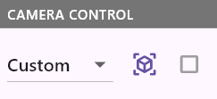

- **View dropdown:** Snaps the camera to a canonical orientation — Top, Bottom, Front, Back, Left, or Right — or shows *Custom* when the current orientation is none of these. The canonical views follow the navigation up-axis: with a (111) up-axis, *Top* faces the (111) surface.
- **Perspective / Orthographic buttons:** Switch between perspective and orthographic projection. The active mode is highlighted.
- **Up: ⟨axis⟩ button:** Sets the navigation up-axis — the axis kept vertical on screen while orbiting (see [3D Viewport](#3d-viewport)). The label shows the current axis (`Z` by default); a non-default axis is highlighted so a tilted turntable is never a mystery. Clicking it opens the **Navigation Up Axis** dialog:
  - Choose **Plane (hkl)** to use a crystal plane's normal, or **Direction [uvw]** to use a lattice direction. (These differ on non-cubic lattices — the plane normal is not the lattice direction of the same index.) Enter the index with the map or the numeric fields. The dialog shows which lattice the index is interpreted in (the active node's lattice, or a cubic-diamond fallback).
  - **From displayed plane** is a one-click shortcut: if the active node produces or is drawn on a construction plane (a `drawing_plane`, or a 2D shape such as `rect`/`circle`), it takes that plane's normal directly.
  - **Apply** sets the axis, **Reset (Z)** returns to the world-Z default, and **Close** dismisses the dialog. When you apply a new axis the image rolls until the new axis reads as vertical — that is the expected confirmation, not a glitch.

  The chosen axis is stored per node network (like the rest of the camera settings) and saved in the `.cnnd` file. A freshly created network starts from the default Z axis.

## Menu Bar

Used for loading and saving a design, exporting a design to .xyz or .mol, undo/redo, and for opening the preferences panel.

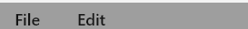

- *File > New*: Creates a new blank design.
- *File > Load Design*, *File > Save Design*, *File > Save Design As*: The native file format of an atomCAD design is the .cnnd file format. CNND stands for Crystal Node Network Design. It is a json based format. It contains a list of node networks. Can be used as a design file or as a design library file intended for reusing node networks from it as custom nodes in other designs.
  - *Save Design* (**Ctrl+S**) is a quick save: it writes the design straight back to the file it was loaded from or last saved to, with no dialog. A short confirmation appears at the bottom of the window ("Saved *filename*", or "No changes to save" when the design is already up to date). If the design has never been saved and so has no file yet, **Ctrl+S** opens the *Save Design As* dialog instead.
  - *Save Design As* (**Ctrl+Shift+S**) always opens the file dialog, so it is the way to write the design to a *new* file — the one you pick also becomes the target of subsequent quick saves.
- *File > Export visible*: You can export visible atomic structures into `.xyz` or `.mol` format. `.mol` is a better choice because in this case bonds are saved too. `.xyz` do not support bond information so when saving into `.xyz` bond information is lost. In case of `.mol` the newer `V3000` flavor is used instead of the old `V2000` flavor because `V3000` supports more than 999 atoms.
- *File > Export node network image...*: Saves the **whole** active node network as a `.png` — including the parts that do not fit on screen, which is what makes it usable for sharing a large network in a discussion or an issue. Available in Node Network Mode only.
  - The dialog offers a **zoom level** (the same three levels the canvas itself uses — *Normal*, *Zoomed out*, *Zoomed out far*), a **resolution** multiplier (1×, 2×, 3×) and a **margin**, the blank space around the content in pixels of the image at 1×. It shows the resulting pixel size as you change any of them, so you can see what you are about to get.
    - It always opens at *Normal* zoom and 1× — a faithful, full-detail image — however you happen to be zoomed on the canvas at the time. Zooming out is for fitting a very large network into the size limit below; the higher multipliers are for keeping small node labels legible when the picture will be scaled down again elsewhere.
    - The margin defaults to 60 px. Note that wires curve out slightly beyond the outermost nodes, so a margin of 0 can clip a wire's bulge.
  - **Only the selection** exports just a region: the image is framed on the box the selected nodes span. Select them however you like beforehand — a rubber-band drag on empty canvas, **Shift**+drag to add another band, **Ctrl**+click to toggle one node — and note that the selection does *not* have to fit on screen; several distant clusters simply produce a box spanning all of them. The checkbox starts ticked when something is selected, and is greyed out when nothing is. The file is named `<network>_selection.png`.
    - The region is a **crop, not a filter**: unselected nodes that fall inside the box are drawn too, and wires leaving the box run to the edge, so the picture looks like that part of the canvas rather than like a cut-out. Nodes straddling the edge are cut in half, so include the whole of anything you want shown.
    - Selecting nodes *inside* a higher-order-function or closure body does not count — the export frames the top-level canvas, so a body-only selection reads as "nothing selected".
  - Very large networks hit a maximum image dimension of 8192 pixels. **That limit applies to the image being written, not to the network**, so a network too large to export whole at a given zoom level can still be exported a region at a time at that same zoom level. The dialog reduces the resolution multiplier on its own to stay inside the limit and says so; if even a 1× image would be too big, it says so and suggests a smaller zoom level or a selection.
  - **What is on the canvas is what lands in the image**, framed to the network's own extents rather than to your current view — so your pan and zoom are left exactly as they were. Error borders and collapsed higher-order-function bodies appear as they do on screen, so expand a body if you want its contents in the image.
  - **Selection is left out of the picture.** Selected nodes and wires, and the active node's highlight, are drawn plain in the image — they are editing state, and in a region export the selection would otherwise light up everything you framed. Your selection itself is untouched: nothing is deselected, so you can adjust it and export again.
  - A comment note that is too small for its text scrolls that text out of sight on the canvas, and the image is clipped in the same way. Resize the note until all of its text is visible before exporting.
- **File dialogs remember where you were.** Every file dialog reopens in the folder you last used, so you do not have to dig down the same path each time. The folder is remembered separately for each kind of dialog, and persists across sessions:
  - designs (*Load Design*, *Save Design As*, *Open Recent*),
  - `.cnnd` libraries (*Import from .cnnd library*),
  - structure imports (`.xyz`, `.cif` — both the *Import XYZ* menu item and the Browse buttons on the `import_xyz` / `import_cif` nodes),
  - structure exports (`.xyz`, `.mol` — both *Export visible* and the `export_atoms` node's Browse button),
  - node network images (*Export node network image...*).

  So exporting a structure to a renders folder does not move where *Load Design* opens next time. If a remembered folder has since been deleted or lives on a drive that is not mounted, the dialog falls back to the system default.
- *Edit > Undo* (`Ctrl+Z`) / *Edit > Redo* (`Ctrl+Shift+Z` or `Ctrl+Y`): Undo and redo all operations, including node edits, wire connections, atom editing, and more.
- *Edit > Validate active network*: Validates the active node network and reports any errors. Available in Node Network Mode only.
- *Edit > Go to next error* (`F8`) / *Edit > Go to previous error* (`Shift+F8`): Steps selection through the active network's errors one at a time, wrapping around, so you can walk its problems without hunting for the red nodes. Each step activates the errored node and scrolls it into view (the same oriented jump the error badge uses). Greyed out when the active network has no errors. Available in Node Network Mode only.
- *Edit > Auto-Layout Network*: Automatically arranges nodes in the current node network for a clean, readable layout, using whichever algorithm is selected under *Auto-layout algorithm* in [Preferences](#preferences-dialog). The view is refitted around the result. This is a single undoable step — if you don't like the new arrangement, `Ctrl+Z` puts every node back where it was.
- *Edit > Copy all problems*: Copies every problem in the design — across all networks — to the clipboard as a plain-text report, for pasting into a bug report. Greyed out when the design has no problems. Available in both modes. See [Where is the error?](#node-networks-panel) above.
- *View > Switch to Horizontal Layout* / *View > Switch to Vertical Layout*: Changes the orientation of the node network editor panel.
- *View > Show/Hide Console* (**Ctrl + backtick**): Toggles the [Console panel](#console-panel) docked at the bottom of the window.

## Preferences Dialog

The *Edit > Preferences* menu item opens the Preferences dialog, which contains advanced settings organized into categories. All preferences are persisted across sessions.

### Geometry Visualization

| Setting | Description |
|---------|-------------|
| Visualization method | *Surface Splatting*, *Solid*, or *Wireframe*. Controls how geometry node outputs are rendered. |
| Samples Per Unit Cell | Resolution for surface splatting tessellation. Higher values produce smoother surfaces. |
| Sharpness Angle Threshold | Angle (in degrees) used to detect sharp edges during mesh generation. |
| Mesh Rendering | Normal calculation method: *Smooth* (interpolated normals), *Sharp* (flat shading), or *Smart (detect sharp edges)* (smooth within groups, sharp at edges). |
| Show geometry shell on Crystal and Molecule | When enabled, Crystal and Molecule outputs render their geometry shell together with the atoms. Disable to hide the shell when it would obscure the atomic structure. Mirrors the toggle in the Display Preferences panel. |

### Atomic Structure Visualization

| Setting | Description |
|---------|-------------|
| Visualization method | *Ball and Stick* or *Space Filling*. |
| Rendering Method | *Impostors* (high-performance) or *Triangle Mesh* (traditional geometry). |
| Ball & Stick Cull Depth | Distance (in Ångströms) beyond which atoms are hidden in Ball and Stick mode. Set to 0 to disable culling. |
| Space Filling Cull Depth | Distance (in Ångströms) beyond which atoms are hidden in Space Filling mode. Set to 0 to disable culling. |
| Make whole scene transparent | Global "see through everything" viewing lens: when enabled, **every** atom and bond renders semi-transparent at the alpha below, without any [`xray`](nodes/atomic.md#xray) nodes. Impostor rendering only (no effect in *Triangle Mesh* mode). It composes with `xray` by **multiplication** — an atom an `xray` node ghosted to α = 0.3 becomes 0.3 × the scene alpha, so ghosted regions stay more transparent than their surroundings. The same toggle is available as a one-click button in the [Display Preferences panel](#atomic-visualization). |
| Scene transparency alpha | The global alpha (0 = fully transparent, 1 = fully opaque) used when *Make whole scene transparent* is on. Default 0.5. Editable with the slider or the numeric field; the value is kept even while the toggle is off. |
| Atom label size (Å) | Height of the text drawn by an [`apply_style`](nodes/atomic.md#apply_style) rule's `label` field. Default 0.7 Å — roughly a ball-and-stick carbon's diameter. This is a **world-space** size, so labels scale with zoom like the atoms they name; range 0.05–10. Applies to every label in the scene (there is no per-rule size). |

### Other Settings

| Setting | Description |
|---------|-------------|
| Display camera pivot point | Shows or hides the camera pivot point as a small red cube. |

### Layout

| Setting | Description |
|---------|-------------|
| Auto-layout algorithm | *Topological Grid* or *Sugiyama*. Controls which algorithm is used for automatic node layout. |
| Auto-layout after AI edit operations | When enabled, the node network is automatically re-laid out after edits made via the CLI or AI assistant. |

### Background

| Setting | Description |
|---------|-------------|
| Background Color | The scene background color. |
| Show Axes | Toggles visibility of the Cartesian axes. Mirrors the toggle in the [Display Preferences panel](#background-axes-and-grid). |
| Show Lattice Axes | Toggles dotted lines showing non-Cartesian lattice directions (nested under Show Axes). |
| Show Grid | Toggles visibility of the Cartesian grid. Mirrors the toggle in the [Display Preferences panel](#background-axes-and-grid). |
| Grid Size | Spacing between grid lines. |
| Grid Color / Grid Strong Color | Colors for regular and primary (axis-aligned) grid lines. |
| Show Lattice Grid | Toggles a secondary grid aligned to the lattice (useful for non-cubic unit cells). |
| Lattice Grid Color / Lattice Grid Strong Color | Colors for the lattice grid lines. |
| Drawing Plane Grid Color / Drawing Plane Grid Strong Color | Colors for the 2D drawing plane grid. |

### Simulation

| Setting | Description |
|---------|-------------|
| Use vdW distance cutoff | Uses a 6 Å distance cutoff for van der Waals interactions during energy minimization. Faster on large structures with negligible accuracy loss. |
| Steps per frame | Number of continuous minimization iterations per animation frame (1–50). |
| Settle steps on release | Extra minimization steps run when a drag is released (0–500). |
| Max displacement per step | Maximum atom displacement per minimization step in Ångströms (default 0.1 Å). |

### Memory

Budgets, in megabytes, for the caches that let atomCAD avoid repeating work it
has already done. **Lowering a budget costs recomputation, never correctness** —
a cache that has to discard something simply recomputes it the next time it is
needed, so the design you get is identical either way. Raise them if you work
with large designs and have memory to spare; lower them if atomCAD is using more
memory than you want to give it.

Changes take effect immediately — no restart — and are persisted like every
other preference.

| Setting | Description |
|---------|-------------|
| CSG mesh cache (MB) | Converted 3D geometry meshes kept for reuse. Default 200 MB. Lowering it makes geometry-heavy designs slower to evaluate. |
| CSG sketch cache (MB) | Converted 2D geometry sketches kept for reuse. Default 56 MB. Lowering it makes sketch-heavy designs slower to evaluate. |
| Hidden node scene cache (MB) | Scene data kept for nodes you have hidden, so making them visible again is instant instead of a re-evaluation. Default 256 MB. |
| Evaluation memo (MB) | Results kept **during a single refresh** so that a node feeding several others is computed once instead of once per consumer (see [Cost model](./node_networks.md#cost-model-how-often-a-node-is-computed)). Default 1024 MB. Unlike the other three this table is built and discarded within one refresh, so the number is a ceiling on a peak rather than memory atomCAD holds on to — which is why the default is larger: a single million-atom structure can be tens or hundreds of megabytes on its own. |

## Import from library .cnnd files

The *File > Import from .cnnd library* menu item allows you import selected node networks from a library .cnnd file.

A library .cnnd file is just a regular .cnnd file containing node networks created to be reused in other files.

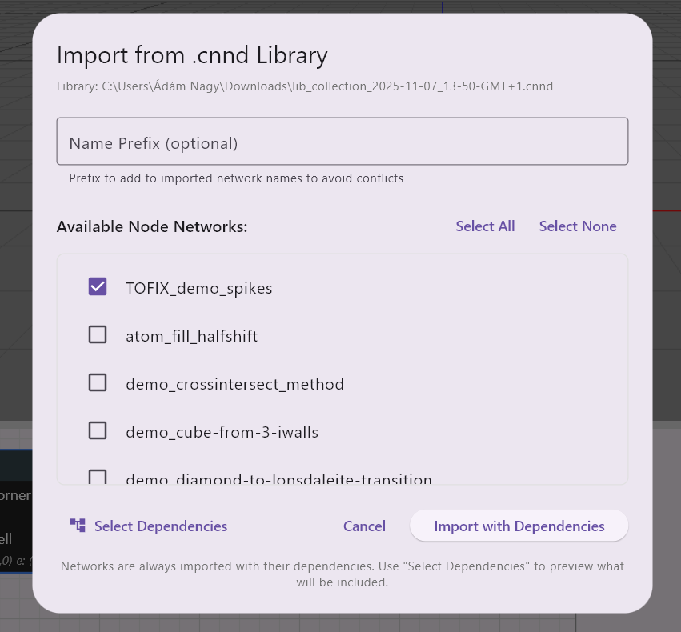

- It is possible to select any number of node networks to import from a library .cnnd file
- Always imports with transitive dependencies
- It is possible to select (preview) those dependencies
- You can specify a prefix which will be prepended to all the network names to avoid naming conflicts or to be able to load a parallel version of networks under a different 'namespace' to be able to compare them.
- From time to time you might want to import a new version of the node networks with the same new from a file with a new version. It is possible to overwrite node network with the same name when importing but a proper 'Overwrite warning' message is displayed.
