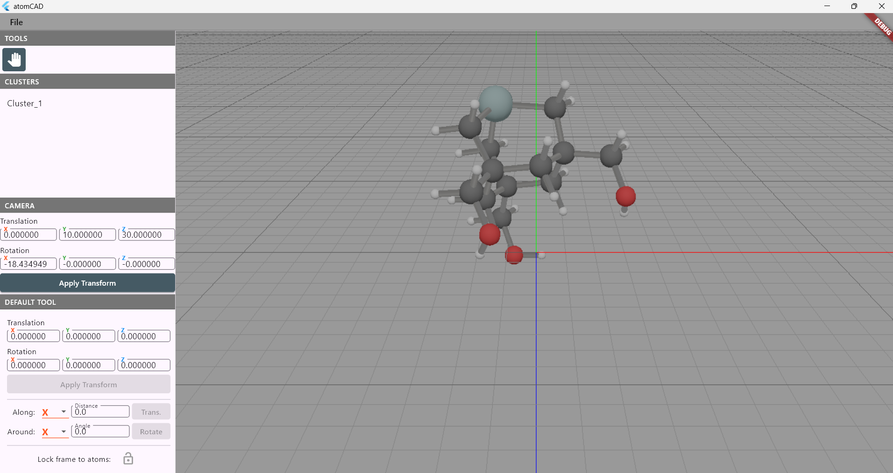
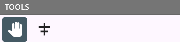
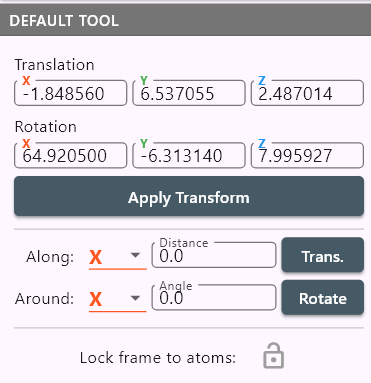
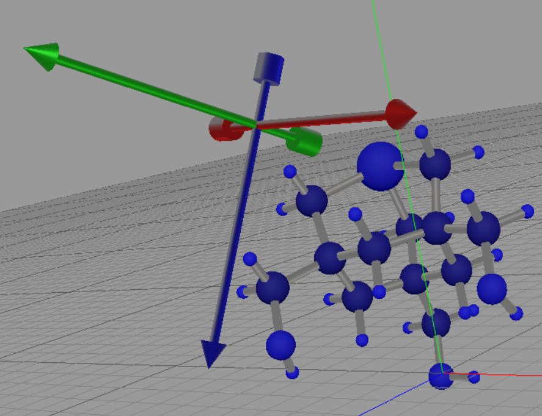
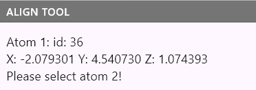
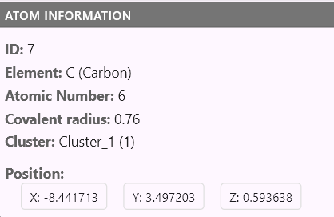
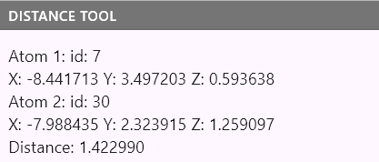

# Scene Composer User's Guide

## Introduction

The Scene Composer is a tool for creating and editing molecular 3D input scenes for simulation.

## Parts of the UI

The UI of the Scene Composer is split into the following parts:

- Menu bar
- Tools panel
- Clusters panel
- Camera panel
- Active tool panel
- 3D viewport

The menu bar is the topmost part of the UI, the viewport is the right part of the ui, and the rest is at the left.

## Menu bar

The menu bar contains the following items:

- File/New Scene
- File/Import XYZ
- File/Export XYZ

When an XYZ file is imported, bonds are automatically detected based on atom proximity. Also, clusters are automatically
created based on bound structures.
After you imported an XYZ file, you can import other ones on top of it.
If you want to start a new scene, you can use the 'New Scene' option.

## Clusters Panel

The clusters panel contains the list of clusters in the model.
Left clicking on a cluster selects it and deselects every other cluster.
Shift clicking on a cluster adds it to the selection.
Control clicking on a cluster inverts the selection for the newly selected item.

Clusters can also be selected in the 3D viewport, we will discuss it when discussing the default tool.

## Camera Panel

The camera panel contains the camera transform, which you can edit by hand. It is also updated when you move the camera in the 3D viewport.

## Viewport Navigation

You can navigate in the viewport the following way:

- Move: drag with middle mouse button
- Rotate: drag with right mouse button
- Zoom: use mouse scroll wheel

## Tools Panel

The tools panel contains the following tools:

- Default tool
- Align tool
- Atom Info tool
- Distance tool

### Default Tool

In the default tool, you can select clusters and move them in the 3D viewport using local frame gadgets.

Clicking on an atom when in this tool, will select the cluster that contains the atom.
Shift click adds to the selection.
Control click inverts the selection for the newly selected cluster.

When a set of clusters is selected, you can move them in the 3D viewport using local frame gadget.
Dragging the local axes the frame is moved along the axis.
Control dragging the local axes the frame is rotated around the axis.
Dragging the cylinder at the end of the axes also rotates around the axis.

Clicking on the icon at 'Lock frame to atoms' will lock or unlock the frame to the atoms in the selection.
Move the frame in an unlocked state when you want to align the frame to atoms in the selection. (For this,
you can use the align tool in an unlocked state.)
Move the frame in a locked state when you want to move the atoms in the selection.

When the default tool is active you can also move the frame from the UI:
- You can set the absolute global position and orientation.
- You can translate along an axis with an exact amount in Angstroms.
- You can rotate around an axis with an exact amount in degrees.

### Align Tool

In the align tool, you can align selected clusters to atoms.
In the align tool panel you can read the instructions to select the 3 atoms to align to.

- When selecting the first atom, the frame's origin is set to the atom's position. MAke sure to have the 'lock frame to atoms' turned off if you want to align the frame to atoms in the selection!
- When selecting the second atom, the frame's x axis is set to the vector from the first atom to the second atom.
- When selecting the third atom, the frame's y axis is set in such a way that the 3 atoms are all on the local XZ plane of the frame.

When 3 atoms are selected, the frame is fully aligned to the 3 atoms. Now if you select an atom again,
the process starts over.

### Atom Info Tool

The atom info tool shows information about the selected atom. (You can select an atom using left mouse click.)

#### Distance Tool

The distance tool shows the distance between the selected atom and the mouse cursor.
You can select the atoms using left mouse click.

