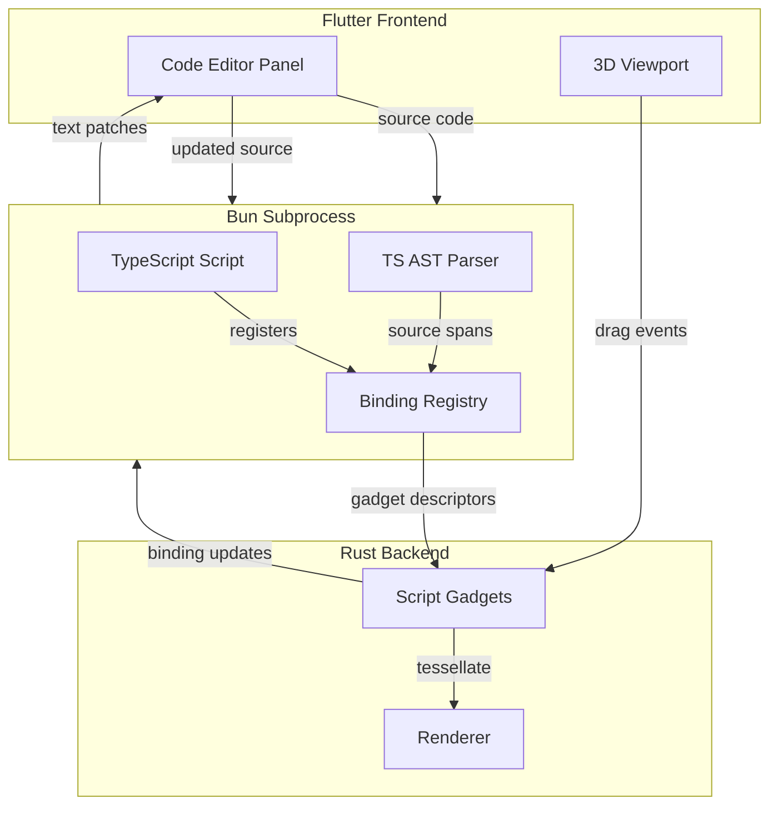

# Smart Editor Integration: Bret Victor-Style Direct Manipulation

This document details the design for viewport gadgets that modify TypeScript source code, inspired by [Bret Victor's "Learnable Programming"](http://worrydream.com/LearnableProgramming/) concepts.

## The Problem

In the node network paradigm:
- User selects a node → viewport displays interactive gadgets (XYZ handles, rotation controls)
- User drags a handle → gadget updates internal state → `sync_data()` writes back to `NodeData`
- The node network re-evaluates with new values

With TypeScript-generated geometry, there's no equivalent interaction:
- User sees rendered geometry but cannot interactively adjust parameters
- Any changes require editing code in an external text editor
- The feedback loop between "see" and "adjust" is broken

## The Solution: Editable Bindings

Introduce explicit helper functions that mark values as **gadget-controllable**:

```typescript
import { editableVec3, editableNumber, latticeMove } from "atomcad";

export function main() {
  const translation = editableVec3("move.translation", [0, 0, 0]);
  const radius = editableNumber("sphere.radius", 5.0);
  
  const sphere = createSphere(radius);
  return latticeMove(sphere, translation);
}
```

When the user drags the XYZ handles in the viewport, the TypeScript source is patched:

```typescript
// Before drag:
const translation = editableVec3("move.translation", [0, 0, 0]);

// After drag:
const translation = editableVec3("move.translation", [3, 5, 2]);
```

The script re-executes automatically, and the geometry updates in real-time.

## Architecture



## Core Concepts

### 1. Editable Bindings (TypeScript)

Each `editable*` call:
- Returns the plain value (used for geometry construction)
- Registers a **Binding** with:
  - `id: string` — stable identifier across runs (e.g., "move.translation")
  - `type` — "number", "vec3", "ivec3", etc.
  - `filePath` — which TypeScript file contains this binding
  - `sourceSpans` — exact character ranges for the literal(s) to rewrite
  - `currentValue` — the runtime value

```typescript
function editableVec3(
  id: string, 
  value: [number, number, number],
  opts?: { gadget?: "xyz_axes" | "lattice_axes", min?: number, max?: number }
): [number, number, number] {
  if (!bindingRegistry.has(id)) {
    const callSite = captureCallSite(); // via Error().stack
    const spans = findLiteralSpans(id, callSite);
    bindingRegistry.register({ id, type: "vec3", filePath: callSite.file, sourceSpans: spans, value, opts });
  }
  return value;
}
```

### 2. Source Mapping via TypeScript AST

When a script runs:
1. Parse the source with `ts.createSourceFile()`
2. On each `editable*` call, capture the call site (file, line, column)
3. Walk the AST to find the `CallExpression` at that location
4. Extract the source spans of the literal arguments (numeric literals or array elements)

For `editableVec3("id", [1, 2, 3])`:
- The second argument is an `ArrayLiteralExpression`
- Extract three spans: one for each numeric literal `1`, `2`, `3`

This approach preserves formatting—only the numeric values change, not surrounding whitespace or comments.

### 3. Gadget Descriptors (TypeScript → Rust)

After executing `main()`, the Bun process returns:

```json
{
  "geometry": { /* ... */ },
  "gadgets": [
    {
      "bindingId": "move.translation",
      "gadgetKind": "xyz_axes",
      "initialValue": [0, 0, 0],
      "worldTransform": { /* position/orientation */ }
    },
    {
      "bindingId": "sphere.radius",
      "gadgetKind": "radius_slider",
      "initialValue": 5.0
    }
  ]
}
```

### 4. Script Gadgets (Rust)

Extend the existing gadget system with `ScriptGadget` types that mirror node gadgets but are driven by `bindingId`:

```rust
pub struct ScriptTranslationGadget {
    pub binding_id: String,
    pub translation: DVec3,
    pub unit_cell: UnitCellStruct,
    // Drag state fields...
}

impl Gadget for ScriptTranslationGadget {
    fn hit_test(&self, ray_origin: DVec3, ray_direction: DVec3) -> Option<i32> { /* ... */ }
    fn start_drag(&mut self, handle_index: i32, ray_origin: DVec3, ray_direction: DVec3) { /* ... */ }
    fn drag(&mut self, handle_index: i32, ray_origin: DVec3, ray_direction: DVec3) { /* ... */ }
    fn end_drag(&mut self) { /* ... */ }
}

trait ScriptGadget: Gadget {
    fn binding_id(&self) -> &str;
    fn current_value(&self) -> serde_json::Value;
}
```

### 5. Value Writeback & Code Patching

When a gadget value changes:

1. **Rust → Bun:** Send binding update
   ```json
   { "method": "binding/update", "params": { "bindingId": "move.translation", "value": [3, 5, 2] } }
   ```

2. **Bun:** Compute text patch
   ```typescript
   const binding = bindingRegistry.get("move.translation");
   const patch = computePatch(binding, [3, 5, 2]);
   // patch = { filePath: "...", ranges: [{ start: 45, end: 46, replacement: "3" }, ...] }
   ```

3. **Bun → Editor:** Send patch to Flutter
   ```json
   { "method": "editor/patch", "params": { "filePath": "...", "ranges": [...] } }
   ```

4. **Editor:** Apply patch, update displayed code, send full source back to Bun for re-execution

## Execution Model

Treat the Bun subprocess as a pure function:
- **Input:** TypeScript source code
- **Output:** Geometry + Gadget descriptors + Logs/Errors

The loop:
1. Editor source changes (user typing or gadget drag)
2. Editor sends full source to Bun: `{ "method": "script/run", "params": { "source": "..." } }`
3. Bun parses, clears binding registry, executes `main()`
4. During execution, `editable*` calls register bindings
5. Bun returns geometry + gadgets
6. Rust instantiates `ScriptGadget` objects
7. User drags gadget → value update → goto step 1

This avoids file watchers or complex incremental AST synchronization.

## Handling Complex Expressions

For expressions like `x * 2 + 5`, require explicit wrapping:

```typescript
// Adjust just the offset:
const result = x * 2 + editableNumber("offset", 5);

// NOT: editableNumber("result", x * 2 + 5)  // expression, not literal
```

The `editable*` helpers require literal values (numbers, arrays, objects) as arguments. This keeps the source patching simple and predictable. AI models can easily produce code in this pattern.

## Gadget Type Registry

Map binding types to gadget kinds:

| Binding Type | Default Gadget | Description |
|--------------|----------------|-------------|
| `number` | Slider or numeric display | 1D value adjustment |
| `vec3` | XYZ axes (like `lattice_move`) | 3D translation |
| `ivec3` | Lattice XYZ axes | Integer lattice translation |
| `quat` | Rotation handles (like `atom_trans`) | 3D rotation |

Geometry API functions can specify which gadget to use via the `opts` parameter:

```typescript
const pos = editableVec3("pos", [0, 0, 0], { gadget: "lattice_axes" });
```

## Performance Considerations

**Live Drag Performance:**
- Re-running the full script on every drag delta may be slow
- Start with "update on drag end"
- Later, enable throttled updates (10-20 Hz) during drag
- Use lightweight "preview" transforms in Rust between full re-runs if needed

**AST Parsing:**
- TypeScript parsing is fast (~1-10ms for typical scripts)
- Cache parse trees by source hash if scripts grow large

## Relationship to Node Networks

This smart editor integration is complementary to, not replacing, node networks:

| Aspect | Node Networks | TypeScript + Gadgets |
|--------|---------------|---------------------|
| **Authoring** | Visual, in-app editor | Text editor (external or embedded) |
| **AI Generation** | Requires custom textual projection | Native, high-quality output |
| **Interactivity** | Full gadget support | Gadget support via editable bindings |
| **Composability** | Subnetworks, custom nodes | Functions, modules, npm packages |
| **Persistence** | .cnnd files | .ts files |

Users could:
1. Have AI generate initial TypeScript code
2. Interactively refine parameters via viewport gadgets
3. Optionally convert to a node network for further visual editing (future feature)

## Implementation Phases

**Phase 1: Core Infrastructure**
- Implement `editable*` helper functions in TypeScript
- Add AST parsing and source span extraction
- Implement binding registry and gadget descriptor generation

**Phase 2: Rust Integration**
- Create `ScriptGadget` trait and implementations
- Extend gadget hit-testing and dragging to support script gadgets
- Implement binding update JSON-RPC messages

**Phase 3: Editor Integration**
- Add code editor panel to atomCAD (or integrate with external editor)
- Implement text patching based on binding updates
- Connect the full execution loop

**Phase 4: Polish**
- Throttled updates during drag
- Error handling and binding validation
- Additional gadget types (sliders, color pickers, etc.)
