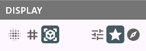

# atomCAD Structure Designer User's Guide

## Introduction

The Structure Designer is a tool for creating diamond crystal structures with defects.
It supports non-destructive editing through the use of a node network.

## Notations in this document

Instead of the usual TODO notation we use TODOC and TODEV notation in this document:

- TODEV: means that the feature mentioned needs to be developed and documented
- TODOC: means that something needs to be documented but is already developed in atomCAD

## Basic Tutorial

See [Structure Designer Tutorial](./structure_designer_tutorial.md)

I recommend first reading the tutorial before reading this document which is more of a reference.

## Parts of the UI

This is how the full window looks like:


---

We will discuss the different parts of the UI in detail. The parts are:

- 3D Viewport
- Node Networks List Panel
- Node Network Editor Panel
- Node Properties Panel
- Geometry Visualization Preferences Panel
- Camera Control Panel

## 3D Viewport

The node network results are displayed here.


The viewport can be navigated with the mouse the following way:

- Move: drag with middle mouse button
- Rotate: drag with right mouse button
- Zoom: use mouse scroll wheel

Here is the exact camera control algorithm:

We maintain a point in space which we call the **camera target point**. This point is always a the center of the viewport (determines where the camera looks) but also has a (varying) depth.

Anytime the user start rotating, moving or zooming the camera target is always adjusted based on the mouse position.
To avoid sudden camera rotation when we adjust the camera target we always keep it on the camera forward axis, we just adjust its depth. This is done by tracing a ray from the camera eye through the mouse position and see where it intersects geoemtry or atomic structure. This intersection point is then projected on the camera forward axis and this is the new camera target point.
This way if the user focuses on content far away the camera target will also be far away, while if the user is focusing on
content close to the camera the camera target will be close to the camera too.

When rotating the camera will rotate around the camera target point in a restricted way so that the camera is never tilted. What happens that horizontal mouse movement controls a yaw around the vertical exis going through the camera target points, and the vertical mouse movement controls a pitch around a horizontal axis going through the camera target point. Roll is not allowed.

When panning the camera panning speed will be determined by the camera target depth: the closer the camera target is to the camera the slower the panning speed will be.

When zooming the camera zoom speed will be determined by the camera target depth: the closer the camera target is to the camera the slower the zoom speed will be so that the user can zoom on the focused content.

What happens when the ray trace do not hit any content? In this case we try to rely on the XZ plane. Currently we hit a ray from the eye both through the mouse position and both in the camera forward direction and if both hit the XZ plane we take the intersection through the camera forward direction as the camera target point.

TODEV: option to be able to see the camera target point.
TODEV: The XZ plane handling probably needs to be revised.

## Node network composability and Node networks list panel

A node network consist of nodes. A node can be a built-in node or a custom node.
You can create a custom node by creating a node network with the same name which will be the implementation of the custom node.
Node networks are composable this way like functions in a programming language. When you use node B in node network A then node network B acts as a subnetwork of node network A.
As nodes can have parameters and outputs you will see how these can be set-up in a subnetwork later in thi document.

A structure design consist of node networks. The list of these node networks is displayed in the Node networks list panel. You can select one to edit in the node network editor panel. You can create a new node network in your design by clicking on the 'Add network' button.


## Node network editor panel


### Anatomy of a node


Each node can have zero to many named input pins. We also call these the parameters of the node.
Each node have exactly one output pin.

An input pin can have a small dot in it: This singifies that the input pin is a 'multi pin': this means that multiple wires can go to this pin. How these are interpreted are always discussed at the documentation of the specific nodes.

The color of a pin represents its data type. A wire can go only from an output pin to an input pin and they must have the same color. The following colors are used:

- Purple: 2D geometry
- Blue: 3D geometry
- Green: Atomic structure

### Navigating in the node network editor panel

The node network canvas can be panned by dragging the middle mouse button.
If you get lost you can use the 'View/Reset node network view' menu item.

### Manipulating nodes and wires

A new node can be added to the network by clicking the right mouse button: it will open the Add Node Menu.
Nodes can be dragged around using mouse left-click and drag. You can connect pins of nodes by left-click dragging a pin to another pin.
Currently one node or wire can be selected by lef-clicking it. Selecting a node or wire has the following uses:

- The selected node or wire can be deleted by pressing the del key on the keyboard
- The properties of the selected node can be edited in the node properties panel
- When a node is selected you may be able to interact with the model in the viewport: what kind of interations these are depend on the node type and we will discuss them in the nodes reference section. Most of the time this involves one or more interactive *gadgets* appearing in the viewport.

Selecting a node is not the same as making its output visible in the viewport.
Node visibility is controlled by toggling the eye icon on the upper right corner of the node. There are also node display policies in the geometry visualization preferences panel which influence whether the visibility of some nodes are automatically changed on selection change. (See: Geometry Visualization Preferences Panel)

TODEV: being able to select and drag multiple nodes should be possible.

## Node Properties Panel

The properties of the active node can be edited here.


This is different for each node, we will discuss this in depth at the specific nodes. There are some general features though:

- When dragging the mouse on integer number editor fields the number can be
incremented or decremented using the moue wheel. Shift + mouse wheel works in 10 increments.

## Geometry Visualization Preferences Panel

There are common settings for geometry visualization here.



At the left of the panel the **visualization mode** of geometry nodes can be selected. The possible options are:

- Surface Splatting: Little discs are regularly placed on the surface of the geometry. Internally uses the implicit evaluation of the node network geoemtry to determine where the surfaces are. (For example a sphere is actually a sphere in this representation.)
- Wireframe (Explicit mesh): The geometry is rendered as a wireframe. Internally uses polygon meshes to evaluate the node network: we call this explicit evaluation. In this case for example a sphere is approximated by a polygon mesh.
- Solid (Explicit Mesh): The geometry is rendered as a solid. Internally uses the explicit evaluation of the node network geoemtry. This is the default visualization mode.

Both in case of 'surface splatting' and 'solid' visualization modes the outer surface of a geometry is rendered green and the inner surface is rendered red.

At the right side the **node display policy** can be selected. These are the following:

- Manual (User Selection) In this case whether the output of a node is visible or not should be set manually by the user and it has nothing to do with which node is selected.
- Prefer Selected Nodes. This is the default policy. In this case in each connected node island if the selected node is in that island the selected node is vmade isible, if there is no selected node in that island the frontier nodes are visible.
- Prefer Frontier Nodes. In this case the frontier nodes are visible. Frontier nodes are the ones whose output is not connected to any input, so these can be thought of the current 'results' of the network.

Even in non Manual modes you can use the eye icon to toggle the visibility of a node, and this will stay intact until you change the current selection.

## Camera Control Panel

Contains common settings for the camera.


## Menu Bar

For loading and saving a design and for opening the preferences panel:


## Nodes reference

We categorize nodes bz their output pin data type. Therefore there are the following types of nodes:

- 2D Geometry nodes
- 3D Geometry nodes
- Atomic structure nodes

You create 2D geometry to eventually use the *extrude* node to create 3D geometry from it. You create 3D geometry to eventually use the *geo_to_atom* node to create an atomic structure from it.

### 2D Geometry nodes

These nodes output a 2D geometry which can be used later as an input to an extrude node to create 3d geoemtry.
2D geometry nodes are on the XZ plane.
Similarly to the 3D geometry nodes, positions and sizes are usually discrete integer numbers meant in crystal lattice coordinates.

#### rect

Outputs a rectangle with integer minimum corner coordinates and integer width and height.


#### circle

Outputs a circle with integer center coordinates and integer radius.


#### reg_poly

Outputs a regular polygon with integer radius. The number of sides is a property too.
Now that we have general polygon node this node is less used.


#### polygon

Outputs a general polygon with integer coordinate vertices. Both convex and concave polygons can be created with this node.
The vertices can be freely dragged.
You can create a new vertex by dragging an edge.
Delete a vertex by dragging it onto one of its neighbour.


#### half_plane

Outputs a half plane.
You can manipulate the two integer coordinate vertices which define the boundary line of the half plane.
Both vertices are displayed as a ritnalge based prism. The direction of the half plane is indicated by the direction of the triangle.


#### union_2d

Outputs the boolean union of any number of 2D geometries. The 'shapes' input pin is a multi pin.


#### intersect_2d

Outputs the boolean intersection of two 2D geometries. The 'shapes' input pin is a multi pin.


#### diff_2d

Outputs the boolean difference of two 2D geometries.
We could design this node to have two 'single pin' inputs but for convenience reasons (to avoid needing to use too many nodes)
both of its input pins are multi pins and first a union operation is done on the individual input pins before the diff operation.
The node expression is the following:

```
diff_2d(base, sub) = diff_2d(union_2d(...each base input...), union_2d(...each sub input...))
```


### 3D Geometry nodes

#### extrude


#### cuboid

Outputs a cuboid with integer minimum corner coordinates and integer extent coordinates.


#### sphere

Outputs a sphere with integer center coordinates and integer radius.


#### half_space

Outputs a half space.


It is possible to manually edit properties of the half space or use the gadget which appears
when the node is selected.

- The 'Center' property is a 3d integer vector. It is displayed as a red sphere in the gadget.
- The 'Miller Index' property is also a 3d integer vector which determines the normal of the half space. You need not enter it manually: one way to enter it is selecting it on the 'earth-like' map. The amount of points appearing on the map depends on the 'Max Miller Index' property which you can also select. 
- 'Shift' is an integer property and it defines the shift from the center in the direction of the Miller Index.
Its integer number is meant in the smallest possbile increments where at each shift value the plane goes through
crystal lattice points.

The boundary of a half space is an infinite plane. In atomCAD a half space is rendered specially compared to other geometry.
Even in solid rendering mode it is rendered as a grid of stripes.
The reason is that normal solid rendering would not give enough information about its spatial placement. (We would just see that the whole screen is covered in green, which would not be very helpful.)
Once a half space participates in boolean operations we no longer render it as a grid of stripes: results of boolean operations are rendered normally as any other geometry.

##### Manipulating the half space gadget

You can also menipulate the half space by interacting with the gadget.
First, you can drag the light blue cylinder to modify the shift value of the plane.
Second, you can click on the red sphere at the center: when you do this circular discs appear on a sphere surface,
each corresponding to a miller index. You can select one of the disks by dragging the mouse to one of them while you
hold the mouse left button and release the left button on the appripriate one.
The amount of circular discs appearing depends on the 'Max Miller Index' property you selected.


#### facet_shell


#### union


#### intersect


#### diff


#### geo_trans


### Atomic structure nodes

#### geo_to_atom

#### edit_atom

#### atom_trans

#### anchor

#### stamp

#### relax


