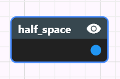
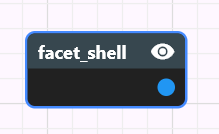
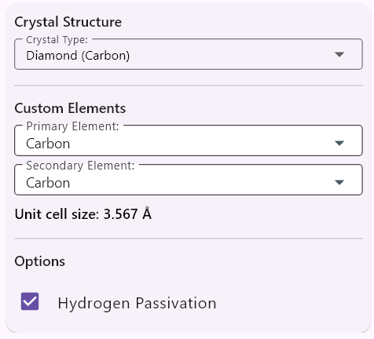

# atomCAD Structure Designer User's Guide

## Introduction

The Structure Designer is a tool for creating diamond crystal structures with defects.
It supports non-destructive editing through the use of a node network.

## Notations in this document

Instead of the usual TODO notation we use TODOC and TODEV notation in this document:

- TODEV: means that the feature mentioned needs to be developed and documented
- TODOC: means that something needs to be documented but is already developed in atomCAD

## Basic Tutorial

See [Structure Designer Tutorial](./structure_designer_tutorial.md)

I recommend first reading the tutorial before reading this document which is more of a reference.

## Parts of the UI

This is how the full window looks like:


---

We will discuss the different parts of the UI in detail. The parts are:

- 3D Viewport
- Node Networks List Panel
- Node Network Editor Panel
- Node Properties Panel
- Geometry Visualization Preferences Panel
- Camera Control Panel

## 3D Viewport

The node network results are displayed here.


The viewport can be navigated with the mouse the following way:

- Move: drag with middle mouse button
- Rotate: drag with right mouse button
- Zoom: use mouse scroll wheel

Here is the exact camera control algorithm:

We maintain a point in space which we call the **camera target point**. This point is always a the center of the viewport (determines where the camera looks) but also has a (varying) depth.

Anytime the user start rotating, moving or zooming the camera target is always adjusted based on the mouse position.
To avoid sudden camera rotation when we adjust the camera target we always keep it on the camera forward axis, we just adjust its depth. This is done by tracing a ray from the camera eye through the mouse position and see where it intersects geoemtry or atomic structure. This intersection point is then projected on the camera forward axis and this is the new camera target point.
This way if the user focuses on content far away the camera target will also be far away, while if the user is focusing on
content close to the camera the camera target will be close to the camera too.

When rotating the camera will rotate around the camera target point in a restricted way so that the camera is never tilted. What happens that horizontal mouse movement controls a yaw around the vertical exis going through the camera target points, and the vertical mouse movement controls a pitch around a horizontal axis going through the camera target point. Roll is not allowed.

When panning the camera panning speed will be determined by the camera target depth: the closer the camera target is to the camera the slower the panning speed will be.

When zooming the camera zoom speed will be determined by the camera target depth: the closer the camera target is to the camera the slower the zoom speed will be so that the user can zoom on the focused content.

What happens when the ray trace do not hit any content? In this case we try to rely on the XZ plane. Currently we hit a ray from the eye both through the mouse position and both in the camera forward direction and if both hit the XZ plane we take the intersection through the camera forward direction as the camera target point.

TODEV: option to be able to see the camera target point.
TODEV: The XZ plane handling probably needs to be revised.

## Node network composability and Node networks list panel

A node network consist of nodes. A node can be a built-in node or a custom node.
You can create a custom node by creating a node network with the same name which will be the implementation of the custom node.
Node networks are composable this way like functions in a programming language. When you use node B in node network A then node network B acts as a subnetwork of node network A.
As nodes can have parameters and outputs you will see how these can be set-up in a subnetwork later in thi document.

A structure design consist of node networks. The list of these node networks is displayed in the Node networks list panel. You can select one to edit in the node network editor panel. You can create a new node network in your design by clicking on the 'Add network' button.


## Node network editor panel


### Anatomy of a node


Each node can have zero to many named input pins. We also call these the parameters of the node.
Each node have exactly one output pin.

An input pin can have a small dot in it: This singifies that the input pin is a 'multi pin': this means that multiple wires can go to this pin. How these are interpreted are always discussed at the documentation of the specific nodes.

The color of a pin represents its data type. A wire can go only from an output pin to an input pin and they must have the same color. The following colors are used:

- Purple: 2D geometry
- Blue: 3D geometry
- Green: Atomic structure

### Navigating in the node network editor panel

The node network canvas can be panned by dragging the middle mouse button.
If you get lost you can use the 'View/Reset node network view' menu item.

### Manipulating nodes and wires

A new node can be added to the network by clicking the right mouse button: it will open the Add Node Menu.
Nodes can be dragged around using mouse left-click and drag. You can connect pins of nodes by left-click dragging a pin to another pin.
Currently one node or wire can be selected by lef-clicking it. Selecting a node or wire has the following uses:

- The selected node or wire can be deleted by pressing the del key on the keyboard
- The properties of the selected node can be edited in the node properties panel
- When a node is selected you may be able to interact with the model in the viewport: what kind of interations these are depend on the node type and we will discuss them in the nodes reference section. Most of the time this involves one or more interactive *gadgets* appearing in the viewport.

Selecting a node is not the same as making its output visible in the viewport.
Node visibility is controlled by toggling the eye icon on the upper right corner of the node. There are also node display policies in the geometry visualization preferences panel which influence whether the visibility of some nodes are automatically changed on selection change. (See: Geometry Visualization Preferences Panel)

TODEV: being able to select and drag multiple nodes should be possible.

## Node Properties Panel

The properties of the active node can be edited here.


This is different for each node, we will discuss this in depth at the specific nodes. There are some general features though:

- When dragging the mouse on integer number editor fields the number can be
incremented or decremented using the moue wheel. Shift + mouse wheel works in 10 increments.

## Geometry Visualization Preferences Panel

There are common settings for geometry visualization here.


At the left of the panel the **visualization mode** of geometry nodes can be selected. The possible options are:

- Surface Splatting: Little discs are regularly placed on the surface of the geometry. Internally uses the implicit evaluation of the node network geoemtry to determine where the surfaces are. (For example a sphere is actually a sphere in this representation.)
- Wireframe (Explicit mesh): The geometry is rendered as a wireframe. Internally uses polygon meshes to evaluate the node network: we call this explicit evaluation. In this case for example a sphere is approximated by a polygon mesh.
- Solid (Explicit Mesh): The geometry is rendered as a solid. Internally uses the explicit evaluation of the node network geoemtry. This is the default visualization mode.

Both in case of 'surface splatting' and 'solid' visualization modes the outer surface of a geometry is rendered green and the inner surface is rendered red.

At the right side the **node display policy** can be selected. These are the following:

- Manual (User Selection) In this case whether the output of a node is visible or not should be set manually by the user and it has nothing to do with which node is selected.
- Prefer Selected Nodes. This is the default policy. In this case in each connected node island if the selected node is in that island the selected node is vmade isible, if there is no selected node in that island the frontier nodes are visible.
- Prefer Frontier Nodes. In this case the frontier nodes are visible. Frontier nodes are the ones whose output is not connected to any input, so these can be thought of the current 'results' of the network.

Even in non Manual modes you can use the eye icon to toggle the visibility of a node, and this will stay intact until you change the current selection.

## Camera Control Panel

Contains common settings for the camera.


## Menu Bar

For loading and saving a design and for opening the preferences panel:


## Nodes reference

We categorize nodes bz their output pin data type. Therefore there are the following types of nodes:

- 2D Geometry nodes
- 3D Geometry nodes
- Atomic structure nodes

You create 2D geometry to eventually use the *extrude* node to create 3D geometry from it. You create 3D geometry to eventually use the *geo_to_atom* node to create an atomic structure from it.

### 2D Geometry nodes

These nodes output a 2D geometry which can be used later as an input to an extrude node to create 3d geoemtry.
2D geometry nodes are on the XZ plane.
Similarly to the 3D geometry nodes, positions and sizes are usually discrete integer numbers meant in crystal lattice coordinates.

#### rect

Outputs a rectangle with integer minimum corner coordinates and integer width and height.


#### circle

Outputs a circle with integer center coordinates and integer radius.


#### reg_poly

Outputs a regular polygon with integer radius. The number of sides is a property too.
Now that we have general polygon node this node is less used.


#### polygon

Outputs a general polygon with integer coordinate vertices. Both convex and concave polygons can be created with this node.
The vertices can be freely dragged.
You can create a new vertex by dragging an edge.
Delete a vertex by dragging it onto one of its neighbour.


#### half_plane

Outputs a half plane.
You can manipulate the two integer coordinate vertices which define the boundary line of the half plane.
Both vertices are displayed as a ritnalge based prism. The direction of the half plane is indicated by the direction of the triangle.


#### union_2d

Outputs the boolean union of any number of 2D geometries. The 'shapes' input pin is a multi pin.


#### intersect_2d

Outputs the boolean intersection of two 2D geometries. The 'shapes' input pin is a multi pin.


#### diff_2d

Outputs the boolean difference of two 2D geometries.


We could have designed this node to have two 'single pin' inputs but for convenience reasons (to avoid needing to use too many nodes)
both of its input pins are multi pins and first a union operation is done on the individual input pins before the diff operation.
The node expression is the following:

```
diff_2d(base, sub) = diff_2d(union_2d(...each base input...), union_2d(...each sub input...))
```

### 3D Geometry nodes

These nodes output a 3D geometry which can be used later as an input to an atom_to_geo node to create an atomic structure.
Positions and sizes are usually discrete integer numbers meant in crystal lattice coordinates.

#### A note on the scaling of geometry in the viewport

When displaying geometry, crystal lattice coordinates are converted to amstrongs by multiplying them with the diamond crystal structure unit cell size (**3.567 Ångströms**). The grid displayed in the viewport is also scaled by this factor. If you use an geo_to_atom node to convert a geometry to diamond, its size will be the same. But if you convert the geometry to another crystal structure the size will be different: it will be scaled instead by the unit cell size of that crystal structure.


#### extrude

Extrudes a 2D geometry to a 3D geometry.


#### cuboid

Outputs a cuboid with integer minimum corner coordinates and integer extent coordinates.


#### sphere

Outputs a sphere with integer center coordinates and integer radius.


#### half_space

Outputs a half space.




It is possible to manually edit properties of the half space or use the gadget which appears
when the node is selected.

- The `Center` property is a 3d integer vector. It is displayed as a red sphere in the gadget.
- The `Miller Index` property is also a 3d integer vector which determines the normal of the half space. You need not enter it manually: one way to enter it is selecting it on the 'earth-like' map. The amount of points appearing on the map depends on the `Max Miller Index` property which you can also select. 
- `Shift` is an integer property and it defines the shift from the center in the direction of the Miller Index.
Its integer number is meant in the smallest possbile increments where at each shift value the plane goes through
crystal lattice points.

The boundary of a half space is an **infinite plane**. In atomCAD a half space is rendered specially compared to other geometry.
Even in solid rendering mode it is rendered as a **grid of stripes**.
The reason is that normal solid rendering would not give enough information about its spatial placement. (We would just see that the whole screen is covered in green, which would not be very helpful.)
Once a half space participates in boolean operations we no longer render it as a grid of stripes: results of boolean operations are rendered normally as any other geometry.

##### Manipulating the half space gadget

The half space can be manipulatedby interacting with the gadget.
- First, you can **drag the light blue cylinder** to modify the **shift** value of the plane.
- Second, you can **click on the red sphere** at the center: when you do this circular discs appear on a sphere surface,
each corresponding to a **miller index**. You can select one of the disks by dragging the mouse to one of them while you
hold the mouse left button and release the left button on the appripriate one.
The amount of circular discs appearing depends on the 'Max Miller Index' property you selected.


#### facet_shell

Builds a finite polyhedral **shell** by clipping an infinite lattice with a user‑supplied set of half‑spaces.
Internally it is implemented as the intersection of a set of half spaces: the reason for having this as a separate
built-in node is a set of convenience features.
Ideal for generating octahedra, dodecahedra, truncated polyhedra, Wulff shapes.




This node generally offers the same features as the half_space node, but some additional features are also available:

- clicking on a facet selectes it.
- when a facet is selected you can manipulate it the same way as a half space.
- if you turn on the **symmetrize** boolean property for a facet, the facet will be symmetrized using the natural point group symmetry according to the miller index family. Basically a symmetrized facet is replaced with a set of facets according to the following table:

```
Miller family | Num. of planes | Equivalents generated
{100}         | 6              | (±1, 0, 0), (0, ±1, 0), (0, 0, ±1) — the six cube faces
{110}         | 12             | All permutations of (±1, ±1, 0) — normals pointing to the mid‑edges of the cube
{111}         | 8              | All sign combinations of (±1, ±1, ±1) — normals pointing to the eight corners of the cube
{hhl} (h≠l)   | 24             | All permutations of (±h, ±h, ±l) — “mixed” families where two indices are equal, one distinct
General (hkl) | 48             | All permutations of (±h, ±k, ±l) — the full 48‑member orbit under O<sub>h</sub>
```

- The 'Split symmetry members' button creates individual facets from the symmetry variants of a facet.

#### union

Outputs the boolean union of any number of 3D geometries. The 'shapes' input pin is a multi pin.


#### intersect

Outputs the boolean intersection of two 3D geometries. The 'shapes' input pin is a multi pin.


#### diff

Outputs the boolean difference of two 3D geometries.


We could have designed this node to have two 'single pin' inputs but for convenience reasons (to avoid needing to use too many nodes)
both of its input pins are multi pins and first a union operation is done on the individual input pins before the diff operation.
The node expression is the following:

```
diff(base, sub) = diff(union(...each base input...), union(...each sub input...))
```

#### geo_trans

Transforms a geometry in the discrete lattice space.
'Continuous' transformation in the lattice space is not allowed (for continuous transformations use the atom_trans node which is only available for atomic structures).


The integer coordinates for translation are of course meant in crystal lattice coordinates.
The integer cooridinates for rotation are meant in multiples of 90 degrees.

The gadget for the node is currently only displayed but not draggable.

TODEV: The gadget should be draggable to allow for translations.
TODEV: The gadget should allow for rotations.

##### Nuances of the geometry transformations in atomCAD

When designing the geometry transformation system in atomCAD we had to make some choices. In all cases our aim was to make the system as intuitive as possbile. The choices are the following:

- in an atomCAD node network every geometry output contains not only the geometry itself but also a transformation gizmo orientation and position (6 degree of freedom). We also call this the **local coordinate system** or **local transform** of the geometry output but we often just casually refer to it as the placement of **the transformation gizmo**. 
- The translation vector of the geo_trans node is meant in world space irrespective of the orientation of the transformation gizmo.
- The rotation angles are meant as euler angles applied in the order xyx on the local gadget axes. 
- For geometry we have a simple guiding axiom: **geometry** is always **rigidly attached to the transformation
gizmo**. (Geometry never moves in the transformation gizmo's local coordinate system.)
- All non-transformation nodes have a default placement for the transformation gizmo: For example in case of a cuboid or sphere the position is the center of mass, the orientation is the identity rotation. For unions and intersection the position is the average of the positions of the inputs and the rotation is the identity rotation. 

The reason for our choices:
- rotation is simple to reason about if interpreted as local rotations
- translation is more easy to reason about as world space translation

Disadvantages:
- In case of rotated axes when dragging a gizmo axis (e.g. dragging the x axis)
actually a different axis coordinate is changed in the node data (e.g. y coordinate is changed, as the local x axis is the global y axis)

Ultimately the main question is: what was the user's intent with that node? While it is hard to capture intent we think that
these choices are the best we can do for most cases.

### Atomic structure nodes

#### geo_to_atom

Converts a 3D geometry into an atomic structure by carving out a crystal from an infinite crystal lattice using the geometry on its input.





#### atom_trans

The atom_trans node is similar to the geo_trans node but it is available for atomic structures instead of geometry
and the transformation happens not in integer lattice space but in continuous space where one unit is one angstrom.


We repeat here the main design decisions which are common with the geo_trans node:

- similarly to geometry output every atomic structure output also contains a transformation gizmo orientation and position. 
- The translation vector of the atom_trans node is meant in world space irrespective of the orientation of the transformation gizmo.
- The rotation angles are meant as euler angles in degrees applied in the order xyx on the local gadget axes. 
- atomic structures are always **rigidly attached to the transformation
gizmo**. (atomic structures never moves in the transformation gizmo's local coordinate system.)

TODEV: The gadget is displayed but is should also be draggable to support translations and rotations.

#### edit_atom

This node enables the manual editing of atomic structures. In a node network every single atomic modification could be placed into a separate node but this would usually lead to a very complex node network. In atomCAD we made a compromise: an edit_atom_node is a set of atomic editing commands. There user can freely group atomic editing commands into edit_atom_nodes at their will. 


The edit atom node is probably the most complex node in atomCAD. When you select this node you can feel like you are in a separate sub-application inside atomCAD. The node properties section of this node contains the user interface of this 'atom editor sub-application'. 

The UI contains undo and redo buttons which are controlling only the commands inside the node (this is not a global undo redo functionality of the application).

The atom editor UI is based on 'tools': one tool can be active at a time. The active tool determines how you can interact with the
atomic structure on the viewport.

##### Default tool


Features:
- Select atoms and bonds using the left mouse button. Simple click replaces the selection, shift click adds to the selection and control click inverts the selection of the clicked object.
- Delete selected
- Replace all selected atom with a specific element
- Transform (move and rotate) selected atoms

TODEV: gizmo for the transformation of the selected atoms

##### Add atom tool


- Add a specific atom by left-clicking in the viewport

##### Add bond tool


- Add bonds by left-clicking on two atoms in the viewport

#### anchor

This node is a helper node for the stamp node: It enables the user to select an atom as the anchor atom
for the molecule in case if will be used as a 'stamp' input of the stamp node.


#### stamp

This node can be used to stamp defects in a crystal structure.


The node has two atomic structure inputs:

- 'crystal': The crystal structure in which the defect(s) will be stamped
- 'stamp': The molecule which will be stamped into the crystal


You can stamp multiple so-called **stamp placements** into a crystal using the same stamp node. For example you can stamp multiple
T-centers into a crystal with one single stamp node.

The stamp placement can be created by clicking on an atom in the crystal. The stamp will be placed so that the anchor atom of the stamp will be at the clicked atom. You can also select the orientation of the placement.


#### relax

An atomic structure can be energy-minimized using the relax node.


Relaxation is done using OpenFF an OpenMM. More details: [./force_fields_integartion.md]()

TODEV: input parameters of the energy minimization and the possibility of locking specific atoms. See: https://kanban.mps.inc/cards/1579948050741200107

TODEV: for convenience also make a 'relax' command available as a command inside the `edit_atom` node.
