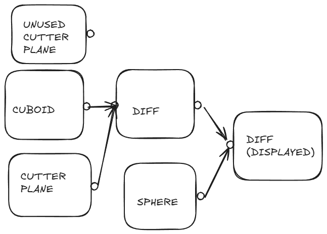

# atomCAD System Design 

## Design philosophy

- We would like to use non-destructive editing where possible
- We would like to enable structure reuse as much as possible. The user should be able to distill useful parts of the design into a reusable representation. In the long run the possibility of an ecosystem of part libraries should be achievable.
- Balance power and simple UX as much as possible. (This is very hard, some tradeoff is needed here.)  

- We want the user to be able to create geometry separately and create an atomic representation from a geometry separately in a non-destructive way.
- The most important way users create geometry is CSG (constructive Solid Geometry). 
- We would like to enable the user to do as much as possible by creating geometry and creating atoms from the geometry in a non-destructive way, but sometimes editing atom by atom is unavoidable and we would like to support this as well.

## Node networks

I find that a very elegant way to implement a non-destructive editing system is to support a node network. Lots of successful non-destructive editing software use node networks. Some examples:

- Houdini (the whole system is based on different node networks)

- Unreal engine (Material Editor, Niagara, Blueprint Scripting)
- Blender geometry nodes, shader editor, compositor
- Davinci resolve

To get a feel on how a node network works in a geometry editing context you can watch into this video:

https://www.youtube.com/watch?v=2oC9TOgQ3KE

The 'Introduction to Houdini' page is also a good start:

https://www.sidefx.com/docs/houdini/basics/intro.html 

## Node networks in atomCAD

I created a separate, little more theoretical document about node networks in atomCAD:  [Node Networks Algebraic Foundations](./nn_foundations.md) 

A **node** can have any number of (including zero) parameters. These can be also called **input pins**. A node has exactly one **output pin**.

Each input and the output pin of the node has a **data type**. You can connect an output pin with an input pin with a directed edge if their type match. We call these directed edges, which always go from an output pin to an input pin a **wire**. The network should be a DAG: should not contain a circle.

An input pin can be a single-data pin, which means that it can only accept one wire, or a multi-data pin which can accept multiple wires.

Currently we develop an MVP, in which there are only 2 data types:

- **geometry** (2D shape)
- **atomic**: atoms and bonds

Additionally nodes can have any amount of node data. Node data can be filled only on the UI. Node data usually consist of so called node **properties**. There are properties in the node data that may be promoted to input pins (a.k.a parameters) in later versions when we might plan more procedural nodes that can be utilized to fill these pins.

On the User interface some nodes can be marked as currently **displayed nodes**. The output of those nodes are displayed in the editor viewport. There is also a **selected node** which is not necessarily a displayed node. The properties of the selected node is displayed on the UI, and if there are gizmos associated with the selected node they are displayed and available for interaction. This means that for example if you select a cutter plane node, you can move that intuitively in the viewport while the displayed node might be their parent diff node which shows the geometry after the cut.

In the above example a plane cut away from a cuboid minus a sphere is displayed. There is also an unused experimental cutter plane on the picture which is currently not connected. In this case the user experiments with different cutter planes while not changing other parts of the node network.

You can select a node by clicking on its title bar. Whether a node is displayed, is simply a toggle on the node. There is also a global toggle to 'display frontier nodes' which means that when the node DAG changes, always the frontier nodes will be displayed. Frontier nodes are nodes that have an unconnected output.

For the description of all the built-in node types refer to the [atomCAD Nodes Reference](./nodes_reference.md)

## atomCAD Architecture Overview

Architectural elements:

- Kernel
- UI
- Renderer

### Kernel

- Written in Rust.
- Contains a representation of the Structure DAG and the History DAG.
- Unit testable
- Called Kernel for simplicity, but it is more and editor backend, as it also deals with tool state and selection state

### UI

- Made in Flutter
- Custom node network implementation for atomCAD purposes
- Adaptive, selection-based action bar

More details:

[UI](./ui_design.md)

### Renderer

- Only special representations need to be rendered (geometry visualizations like disc cloud; atomic structures and editor 'gizmos'), so the renderer do not need to be general purpose

- Must support multiple views (like balls and stick vs. balls only for atomic structures)
- Must Handle huge models in the long run (not in the short run though, so we can start with something simple)

More details:

[Renderer](./renderer.md)

