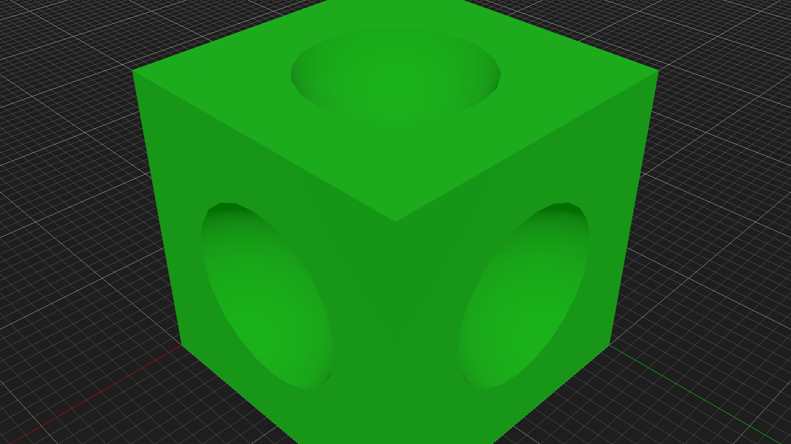
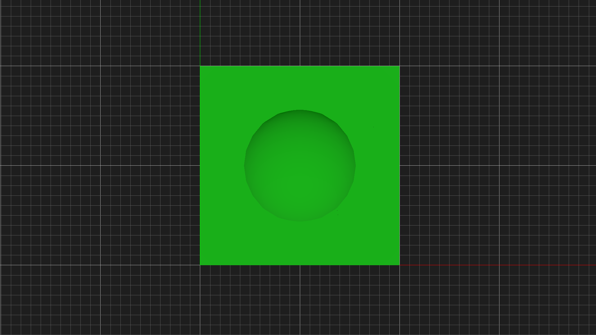
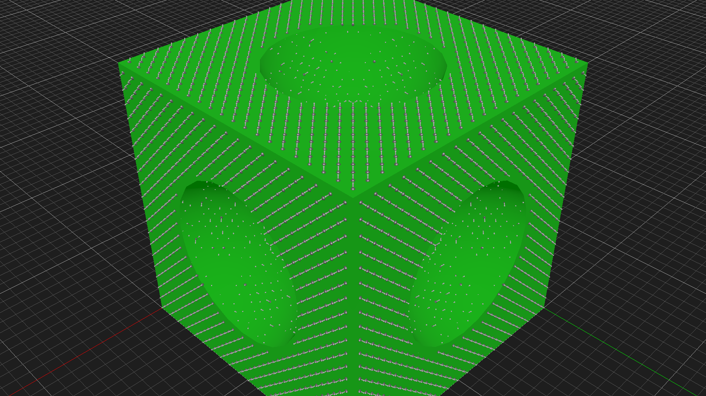
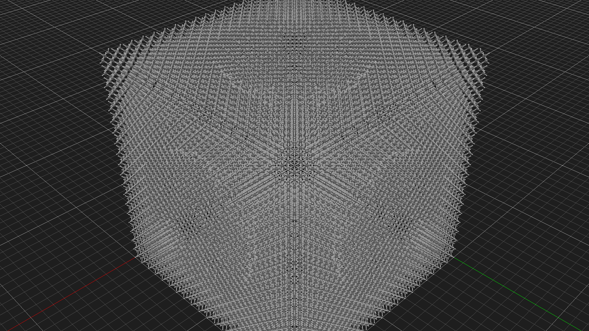
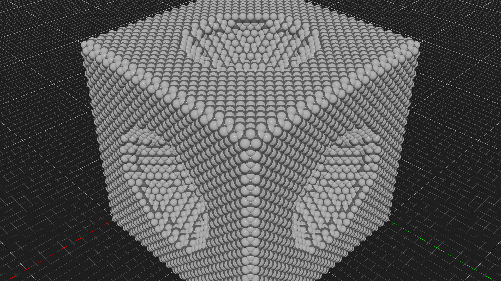
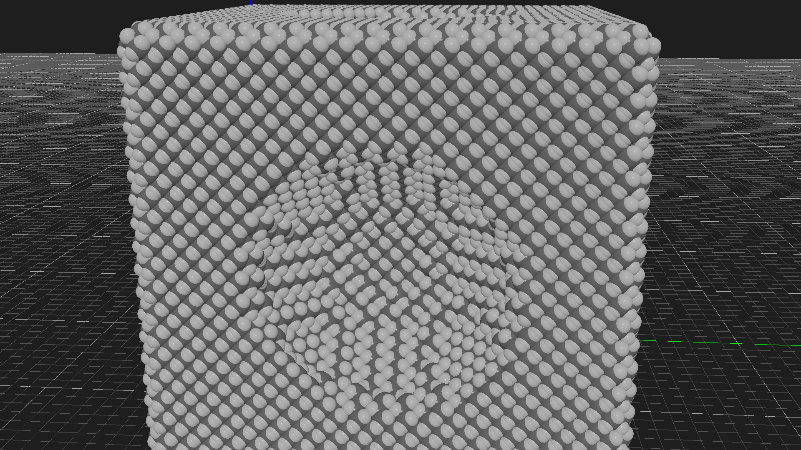
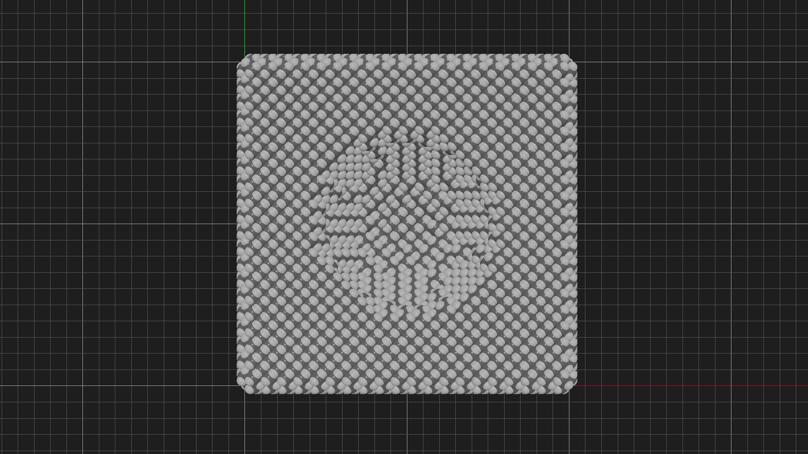

# atomCAD Camera & Screenshot Test Report

**Date:** 2026-01-23
**Purpose:** Test the new camera control and screenshot capabilities of atomcad-cli

## Structure Built: Diamond Cube with Spherical Indentations

I created a cube-shaped diamond nanostructure with spherical holes carved into each of its six faces. This design was chosen because:
- It has interesting geometry visible from multiple angles
- The spherical indentations test CSG (boolean subtraction) operations
- The structure looks different from various camera positions, making it ideal for testing camera controls

### Structure Statistics
- **Atoms:** 64,021 carbon atoms
- **Bonds:** 113,420 covalent bonds
- **Size:** 20 x 20 x 20 lattice units (~71 x 71 x 71 angstroms)
- **Features:** Passivated surface (hydrogen atoms on dangling bonds), single-bond atoms removed

## Node Network

```
outer = cuboid { min_corner: (0, 0, 0), extent: (20, 20, 20) }
hole1 = sphere { center: (10, 10, -2), radius: 6 }
hole2 = sphere { center: (10, 10, 22), radius: 6 }
hole3 = sphere { center: (10, -2, 10), radius: 6 }
hole4 = sphere { center: (10, 22, 10), radius: 6 }
hole5 = sphere { center: (-2, 10, 10), radius: 6 }
hole6 = sphere { center: (22, 10, 10), radius: 6 }
frame = diff { base: [outer], sub: [hole1, hole2, hole3, hole4, hole5, hole6] }
atoms = atom_fill { shape: frame, passivate: true, rm_single: true, visible: true }
```

## Camera & Screenshot Testing

### 1. Geometry View - Perspective (Isometric)

First, I visualized just the geometry (green solid) from an isometric perspective angle.

**Camera settings:**
- Eye: (150, 150, 150) angstroms
- Target: (35, 35, 35) angstroms
- Projection: Perspective



The cube with spherical indentations is clearly visible. The green rendering shows the SDF-based geometry.

---

### 2. Geometry View - Side View

Changed camera to view from the side, looking straight at one face.

**Camera settings:**
- Eye: (0, 200, 50) angstroms
- Target: (35, 35, 35) angstroms
- Projection: Perspective


This shows the spherical indentation in one face clearly.

---

### 3. Geometry View - Orthographic Top-Down

Switched to orthographic projection for a technical drawing style view.

**Camera settings:**
- Eye: (35, 35, 200) angstroms
- Target: (35, 35, 35) angstroms
- Projection: Orthographic
- Ortho height: 60



The orthographic projection eliminates perspective distortion, showing the true square shape with circular indentation.

---

### 4. Atoms - Ball and Stick with Geometry

Added atoms to the structure using `atom_fill`. Initially kept geometry visible to show atoms on the surface.

**Display settings:**
- Atomic visualization: ball-and-stick



The atoms appear as white lines/points along the green geometry surface.

---

### 5. Atoms Only - Ball and Stick

Hid the geometry to show only the atomic structure.



The crystalline diamond lattice structure is now visible. You can see the regular pattern of the diamond cubic crystal and the spherical indentations carved into each face.

---

### 6. Space-Filling View - Perspective

Switched to space-filling visualization mode where each atom is shown as a sphere at its van der Waals radius.

**Display settings:**
- Atomic visualization: space-filling



The space-filling view clearly shows the physical extent of each carbon atom. The spherical indentations and cube shape are well defined.

---

### 7. Space-Filling View - Side Angle

Changed camera to a lower side angle for dramatic effect.

**Camera settings:**
- Eye: (200, 50, 80) angstroms
- Target: (35, 35, 35) angstroms
- Projection: Perspective



This angle shows the depth of the spherical indentation and the regular atomic layers.

---

### 8. Space-Filling View - Orthographic Top-Down

Technical top-down view in orthographic mode.

**Camera settings:**
- Eye: (35, 35, 250) angstroms
- Target: (35, 35, 35) angstroms
- Projection: Orthographic
- Ortho height: 50



Clean orthographic view showing the square structure with centered circular indentation.

---

### 9. Space-Filling View - Close-Up with White Background

Final close-up shot demonstrating the background color override feature.

**Camera settings:**
- Eye: (80, 80, 80) angstroms
- Target: (35, 35, 35) angstroms
- Projection: Perspective

**Screenshot settings:**
- Background: 255, 255, 255 (white)


This dramatic close-up shows individual carbon atoms clearly. The white background makes it suitable for publications or presentations.

---

## Features Tested

### Camera Control Features
| Feature | Status | Notes |
|---------|--------|-------|
| Set eye position | Working | Coordinates in angstroms |
| Set target position | Working | Look-at point in angstroms |
| Set up vector | Working | Defines camera orientation |
| Perspective projection | Working | Default mode with depth perception |
| Orthographic projection | Working | Technical drawing style, no perspective |
| Ortho height control | Working | Controls zoom level in ortho mode |

### Screenshot Features
| Feature | Status | Notes |
|---------|--------|-------|
| Basic capture | Working | Saves to specified path |
| Custom resolution | Working | -w and -h flags |
| Background color override | Working | --background R,G,B |
| PNG format | Working | Proper PNG output |

### Display Settings
| Feature | Status | Notes |
|---------|--------|-------|
| Ball-and-stick mode | Working | Small atoms with bond lines |
| Space-filling mode | Working | Van der Waals radius spheres |
| Geometry visibility | Working | Can show/hide geometry nodes |

## Conclusions

The camera control and screenshot capabilities of atomcad-cli are working well:

1. **Camera positioning** is intuitive using eye/target/up vectors in angstrom coordinates
2. **Projection modes** (perspective vs orthographic) work correctly
3. **Screenshots** capture the viewport accurately at specified resolutions
4. **Background color** can be overridden per-screenshot
5. **Display modes** switch correctly between ball-and-stick and space-filling

The new features enable effective programmatic visualization and documentation of atomCAD designs.
