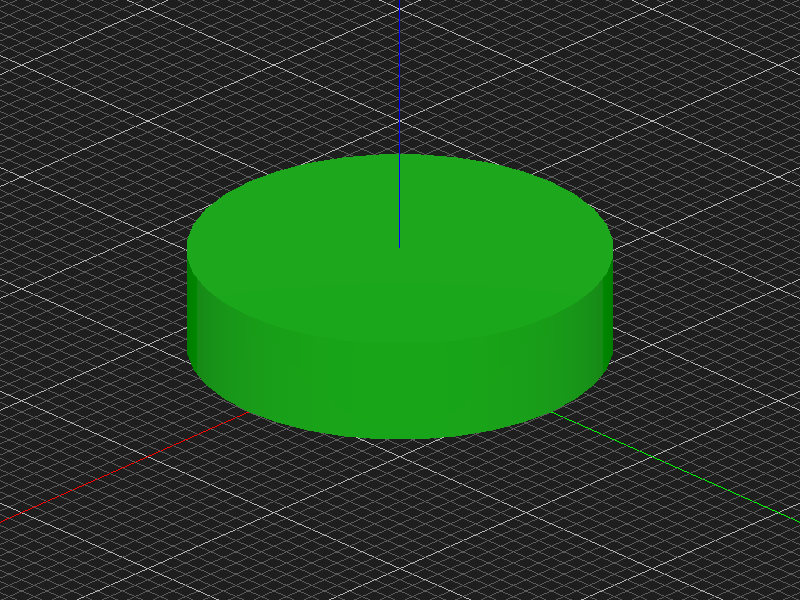
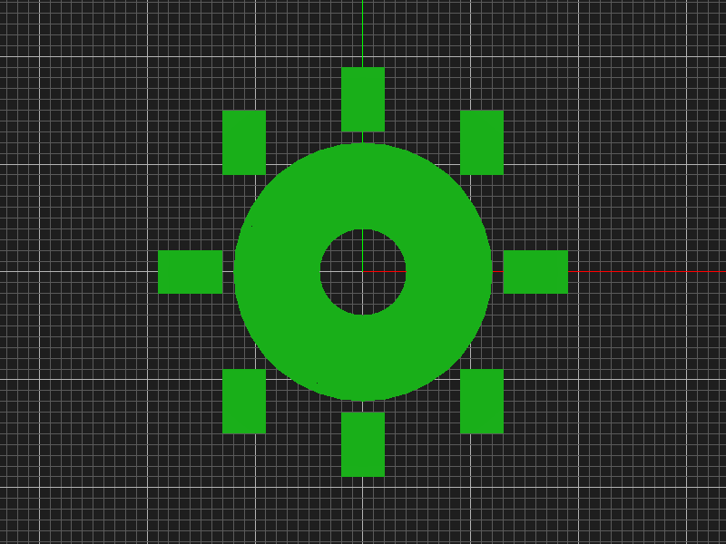
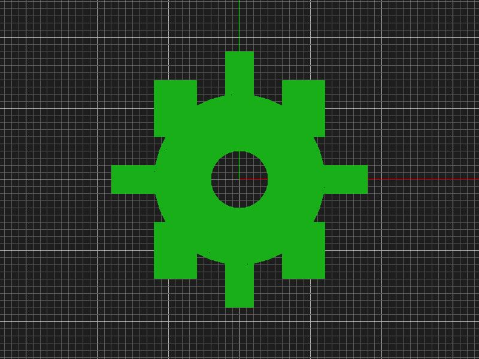
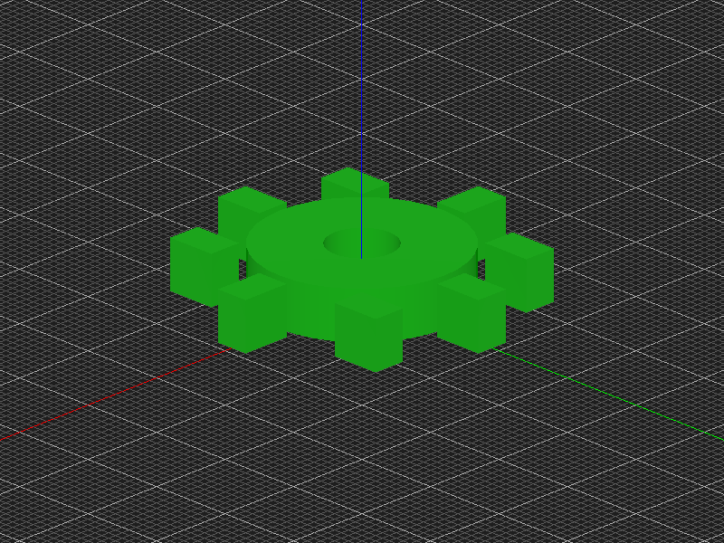
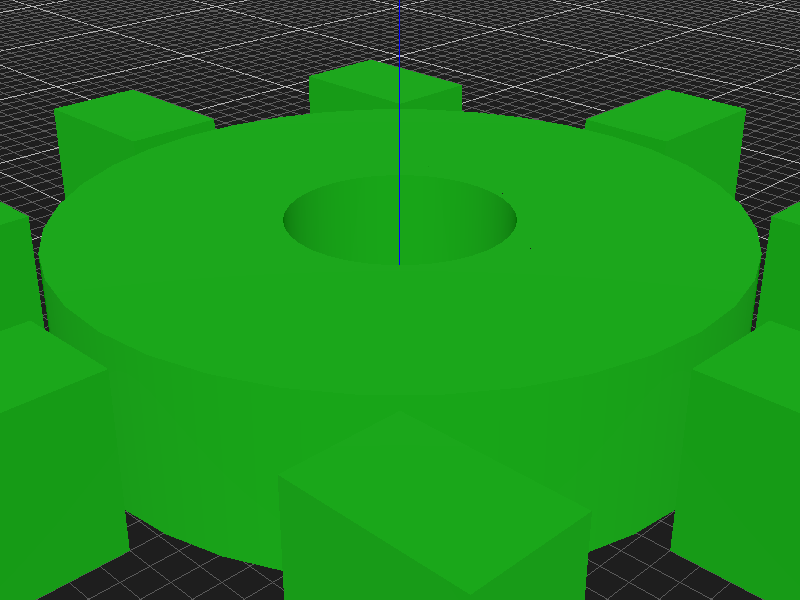
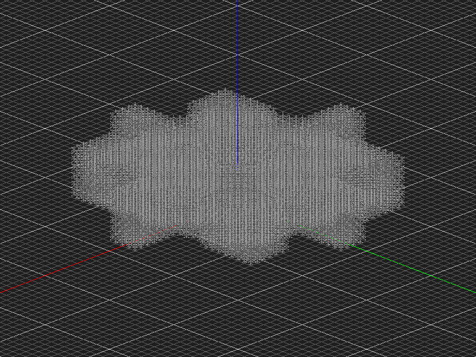
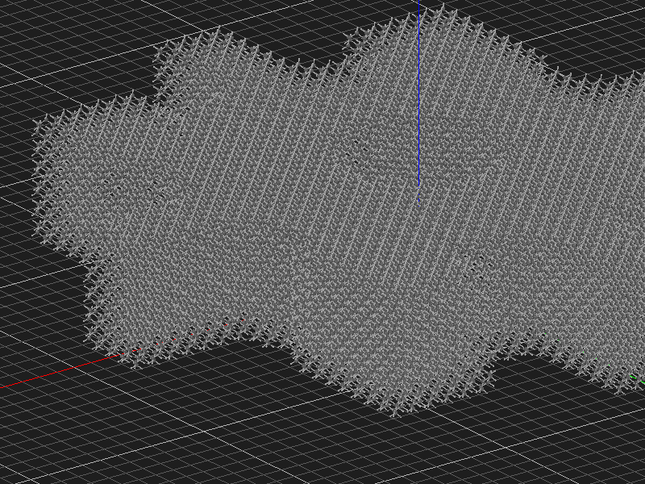
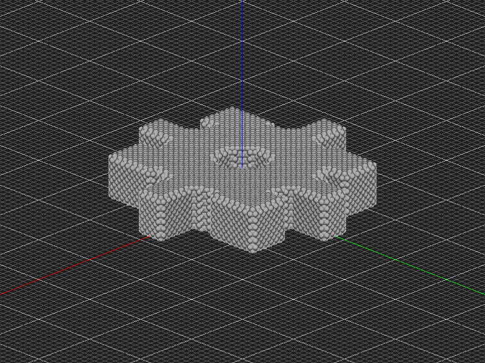
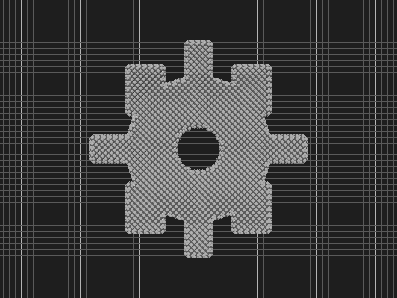
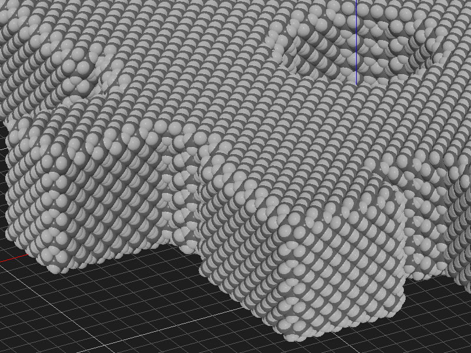

# Diamond Gear - Camera & Screenshot Test Report

**Date:** 2026-01-23
**Purpose:** Test atomcad-cli camera control and screenshot capabilities

## Overview

This report documents the creation of a **diamond crystal gear** using atomCAD's node network system. The gear demonstrates CSG (Constructive Solid Geometry) operations and the ability to fill arbitrary shapes with diamond lattice atoms.

## Build Process

### Step 1: Gear Body

Started with a simple cylinder (extruded circle) with radius 12 lattice units and height 6 lattice units.



### Step 2: Adding Gear Teeth

Created 8 rectangular teeth positioned around the circumference and added a center hole (radius 4) for an axle. The teeth were created using `rect` nodes with `min_corner` and `extent` parameters, then extruded to match the gear height.

Initial attempt showed teeth not properly connected:



After adjustment to ensure proper overlap:



### Step 3: Complete Geometry

The final CSG operations:
- **Union:** Combined body cylinder with all 8 teeth
- **Difference:** Subtracted center hole for axle



Close-up showing the gear teeth detail:



## Atomic Structure

### Ball-and-Stick Visualization

Filled the gear geometry with diamond lattice atoms using `atom_fill` with:
- `passivate: true` - adds hydrogen atoms to dangling bonds
- `rm_single: true` - removes atoms with only one bond

**Result:** 42,056 atoms and 70,228 bonds



Close-up showing the diamond lattice structure in a gear tooth:



### Space-Filling Visualization

Switched to space-filling mode to show van der Waals atomic radii.

Isometric view:



Top-down view clearly showing the gear profile:



Close-up showing individual atomic spheres:



## Camera & Screenshot Features Tested

| Feature | Command | Status |
|---------|---------|--------|
| Set camera position | `--eye x,y,z` | Working |
| Set camera target | `--target x,y,z` | Working |
| Set up vector | `--up x,y,z` | Working |
| Orthographic projection | `--orthographic` | Working |
| Ortho zoom level | `--ortho-height N` | Working |
| Screenshot to file | `-o path.png` | Working |
| Custom resolution | `-w 800 -h 600` | Working |
| Display settings | `--atomic-viz` | Working |
| Background color | `--background R,G,B` | Working |

## Node Network Summary

```
body_circle = circle { radius: 12 }
body = extrude { shape: body_circle, height: 6 }
hole_circle = circle { radius: 4 }
hole = extrude { shape: hole_circle, height: 8 }
tooth1-8 = rect { ... }  # 8 gear teeth
t1-8 = extrude { shape: tooth1-8, height: 6 }
gear_solid = union { shapes: [body, t1, t2, ...] }
gear = diff { base: gear_solid, sub: hole }
atoms = atom_fill { shape: gear, passivate: true, rm_single: true }
```

## Conclusions

The atomcad-cli camera control and screenshot features work as expected:

1. **Camera positioning** correctly uses angstrom coordinates (lattice units * 3.567 for cubic diamond)
2. **Orthographic projection** provides clean technical views without perspective distortion
3. **Screenshot capture** saves PNG files at specified resolutions
4. **Display settings** properly switch between ball-and-stick and space-filling modes
5. **Background color** can be customized for different visual effects

The diamond gear contains over 42,000 atoms arranged in a perfect diamond crystal lattice, demonstrating atomCAD's capability for atomically-precise mechanical component design.
