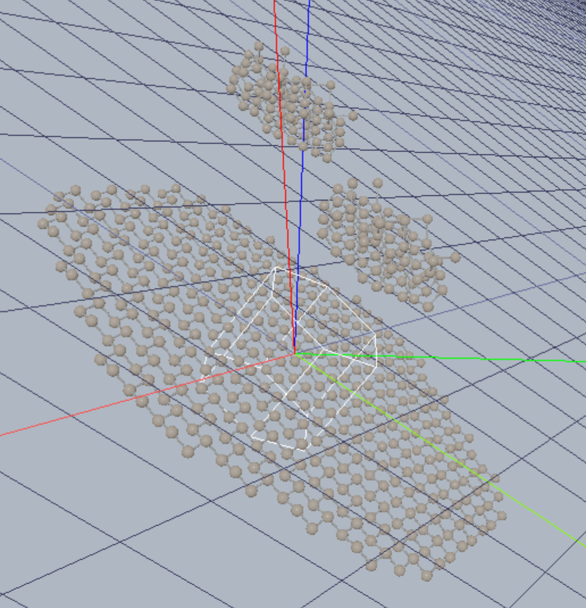
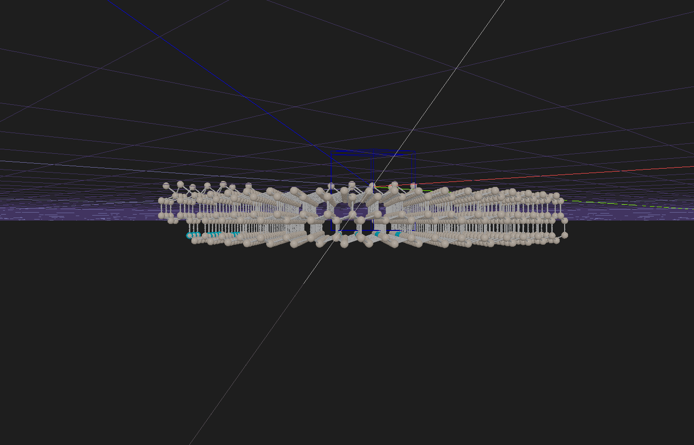
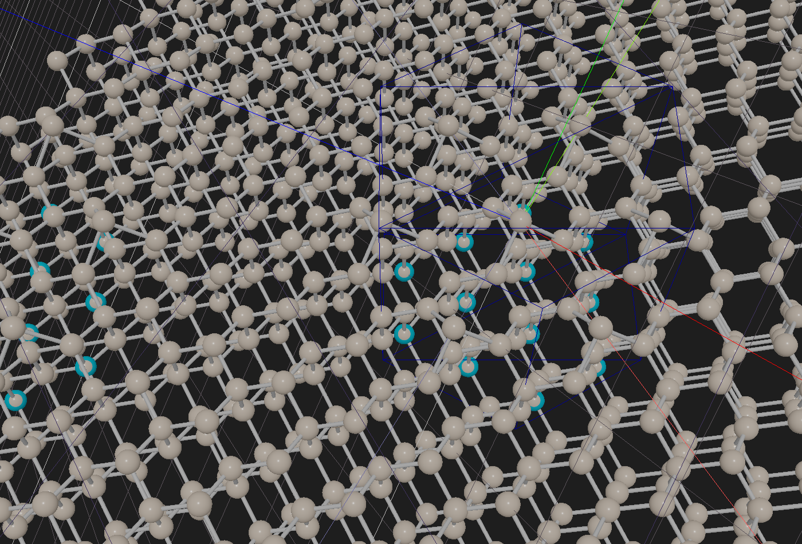

# Surface-patch fix — `proxy(111).00_patch_experiment`

*Prepared for mechadense. Covers (1) a change to atomCAD itself and (2) two small edits to your `.cnnd`. The modified `.cnnd` is attached.*

---

## TL;DR

Your patch had two independent problems:

1. **atomCAD bug** — `patch_latticefill` applied the patch **too high in [111]** (it floated above the surface). This was a genuine defect in atomCAD and is now **fixed in the code** (branch `patch-latticefill-fix`, commit `eecbd851`). You need a build that includes it.
2. **Your design** — your *target* crystal didn't match the *slab the patch was authored from*, so the collars couldn't weld. Fixed with **two edits to your network** (now in the attached `.cnnd`).

Compatibility badge on `patch_latticefill1`, before → after:

| | welded ghosts | orphaned ghosts | over-coordinated |
|---|---|---|---|
| your original (floating) | ~0 | all | – |
| code fixed, target unchanged | 22 | 62 | 14 |
| **code fixed + target matched** | **67** | **17** | **0** |

The patch now welds into a continuous (111) surface, with no over-coordination. The remaining 17 orphaned ghosts are just the true outer edges of your small (≈2-tile) patch — that's expected, and passivation caps them.

---

## Your symptom

> ★ The patch is applied too high in [111] direction. An other height than its creation.
> ★ The patch is applied only one second time in (−a,−b) 2D direction in incorrect lattice spacing.

Both bullets traced back to the same root cause, plus a second issue with your target.

---

## Problem 1 — "applied too high" was an atomCAD bug (fixed in atomCAD)

**What was happening.** `patch_build` used to re-express the extracted tile relative to a **hidden internal reference cell `R`** (the cut's min-corner cell), and `patch_latticefill.origin` placed `R` at an *absolute* target lattice cell (defaulting to the region centre). Because `R` was never shown to you, there was no way to know which `origin` would put the patch back where you drew it. With `origin = (0,0,0)` the patch was displaced by a whole lattice vector with a large +[111] component — it lifted off the slab into vacuum, so the collars found no substrate to weld onto and it floated. That floating *is* the "too high" you saw.

**The fix (generic, not specific to you).** The tile is now kept **in the coordinates you drew it in**, and `origin` is a plain **whole-cell offset** that defaults to `(0,0,0)` = *exactly where you authored it*. Every placement is a whole-lattice-vector translation, so welds still line up — but now:

> **build → apply to the same crystal with the default `origin` reproduces your drawing in place.**

No hidden anchor, nothing to reverse-engineer. Your `origin` was already `(0,0,0)`, so you don't change anything — the fix simply makes that value mean what you'd expect. (If you ever *do* want to slide the reconstruction, `origin` now nudges it by whole cells; a shift by a full tiling vector is a no-op, sub-cell shifts pick the phase — e.g. which sites pair up.)

This needs a build with commit `eecbd851`. We verified on **your** network that the fixed code evaluates `patch_latticefill1` to a real on-surface crystal (no longer floating).

---

## Problem 2 — your target didn't match the slab you built the patch from (fixed in your `.cnnd`)

A patch can only weld onto a target that shares the **full lattice and motif registration** of the slab it was extracted from — the collar atoms have to land exactly on the target's atoms. Your build slab and your target were two different `proxy(111).0_proxy(111)` instances that **didn't match**:

| parameter | build slab `TTPL.0_proxy(111)1` | target `TTPL.0_proxy(111)2` (before) |
|---|---|---|
| `half_thickness` | **3** | **1** |
| `motif_offset_variant` | **2** | default (0) |
| `half_width` | 8 | 14 (fine — just extent) |

Two consequences:

- **Thickness.** Your tile is ~15 Å deep (a 4-layer cut plus its collar). A `half_thickness = 1` target is far thinner than that, so the deep collar atoms had no bulk to weld into → orphaned, and some landed in awkward spots → over-coordinated.
- **Symmetry variant.** You authored the reconstruction on `motif_offset_variant = 2` but applied it to the default variant. Your own comment in the network already flags this: *"other symmetry variants vary in height so… the origin will need to be adjusted (also likely laterally too)."* Mismatched registration is exactly what produced the mix of orphaned **and** over-coordinated atoms.

**Edits made (in the attached `.cnnd`):**

1. `int11` (target `half_thickness`): **1 → 3** — match the build slab so the tile has bulk to weld into.
2. target `motif_offset_variant`: wired to **`int5` (= 2)** — match the build slab's registration.

Result: over-coordination dropped to **0** and welds rose from 22 to **67**. That's the whole improvement in the table above.

### After

![Top-down [111]: a continuous, gap-free reconstructed (111) surface](patch_latticefill_fix_images/after_top_down.png)

---

## What's still yours to decide (we deliberately didn't touch these)

These are design choices about *your* reconstruction, not bugs — so we left them alone rather than guess your intent:

- **The reconstruction content.** Your `atom_edit` diffs are almost all `~Si @ …` (replace Si with Si) plus freezing, which reads as *scaffolding/freezing* rather than a finished atomic rearrangement. If you're going for **Si(111) √3×√3 R30°**, that's defined by the tiling vectors, not the current diff.
- **Tiling density / √3×√3.** Your `plane_tiling_vectors` superlattice is `a:(2,0), b:(0,2)` — a **2×2** cell (≈26.6 Å period), which is why only ~2 whole tiles fit your region (your second bullet) and why most ghosts are edges. For **√3×√3 R30°** set the superlattice rows to **`a:(2,1), b:(-1,1)`** (in your `u=[2,-1,-1] / v=[-1,2,-1]` basis), and size the cut hexagon to one √3 cell so tiles tessellate without gaps. A smaller cell over the same region also gives many more tiles and proportionally fewer edge-orphans.
- **`passivate`.** Currently `false` (danglers left exposed). Set it `true` for a finished, hydrogen-capped surface, or keep it `false` if you intend to bond an adjacent face later and passivate once at the end.

---

## How to reproduce / verify

1. Build/run atomCAD on `patch-latticefill-fix` (≥ `eecbd851`).
2. Open the attached `.cnnd`, network `proxy(111).00_patch_experiment`.
3. Select `patch_latticefill1` → the compatibility badge should read **welded 67 / orphaned 17 / over-coordinated 0**.
4. The reconstruction sits on the surface (no floating). Use `origin` only if you want to shift the phase.
