# Rendering capabilities: what is missing, what it would buy, what it would cost

Date: 2026-09-21. Method: node networks were built through `atomcad-cli`, screenshots were taken with the CLI's screenshot path (which runs the exact same `render()` as the live viewport, so everything shown here is what the user sees on screen), and the renderer source was inventoried to ground the estimates. All screenshots live in `shots/`; the `c*_` files are pixel-exact crops (nearest-neighbour upscaled) of the full frames.

Scope notes:

- Only the **impostor** atom path was evaluated. The polygonal atom path is out of scope by request.
- This is a capability report, not a design document. Each item says what is missing, what it is for, and a rough effort. Effort is in **developer-days for someone who already knows the renderer crate**, and assumes the wgpu 23 stack stays.
- Two things I could not screenshot from the CLI and would like the maintainer to capture from the GUI are listed at the end.

## 1. What the renderer has today (baseline)

The relevant facts from the source, so the gaps below make sense:

| Area | State |
|---|---|
| Colour target | `Bgra8Unorm`, single sample, no sRGB view. Tone mapping (Reinhard) and gamma are inlined in each of 4 shaders. |
| Depth | `Depth32Float`, forward Z, `Less`. Near plane 1.5 Å, far 2400 Å. Projection built with `perspective_rh_gl` (GL −1..1 NDC) on a 0..1 clip-space API. |
| Passes | Exactly two: main pass, then a gadget pass that re-clears depth. No post-process pass of any kind. |
| Anti-aliasing | None. Every pipeline has `count: 1`. The only AA in the renderer is the SDF label fringe. |
| Atoms / bonds | Analytic sphere and cylinder impostors with correct `frag_depth`. Cook–Torrance PBR, a single headlight, constant ambient 0.2. |
| Shadows / AO | None. |
| Lines | Native 1-pixel `LineList` everywhere (grid, axes, wireframe, unit cell, cages). No width, no AA, dashes are world-space CPU segments. |
| Selection / marks | A per-impostor rim band (orange selected, cyan frozen, magenta marked). No screen-space outline. Hover is a Flutter tooltip, not rendered. |
| Transparency | Sorted alpha blending (impostors lazily, isosurfaces per component). No OIT. |
| Labels | SDF glyph billboards, world-space size, white with black outline, no per-label colour. |
| Style rules | `color`, `alpha`, `fade_depth`, `render_style`, `label`. No `emissive`, no `hidden`, no radius. |
| Picking | CPU ray cast. No id buffer, no G-buffer. |
| Screenshots | Same pipeline at the requested size. No supersampling. |
| HiDPI | Viewport is sized in logical pixels; device pixel ratio is not applied, so on 150 %/200 % displays the 3D view is upscaled by Flutter. |

## 2. Findings, grouped by what they hurt

### 2.1 Anti-aliasing: every edge in the scene is jagged

Impostor silhouettes, mesh edges, grid lines and axes all show a hard 1-pixel staircase. This is the single most visible quality gap and it affects both the live viewport and every exported picture.

| Impostor silhouette (4× crop) | CSG mesh edge (3× crop) |
|---|---|
| 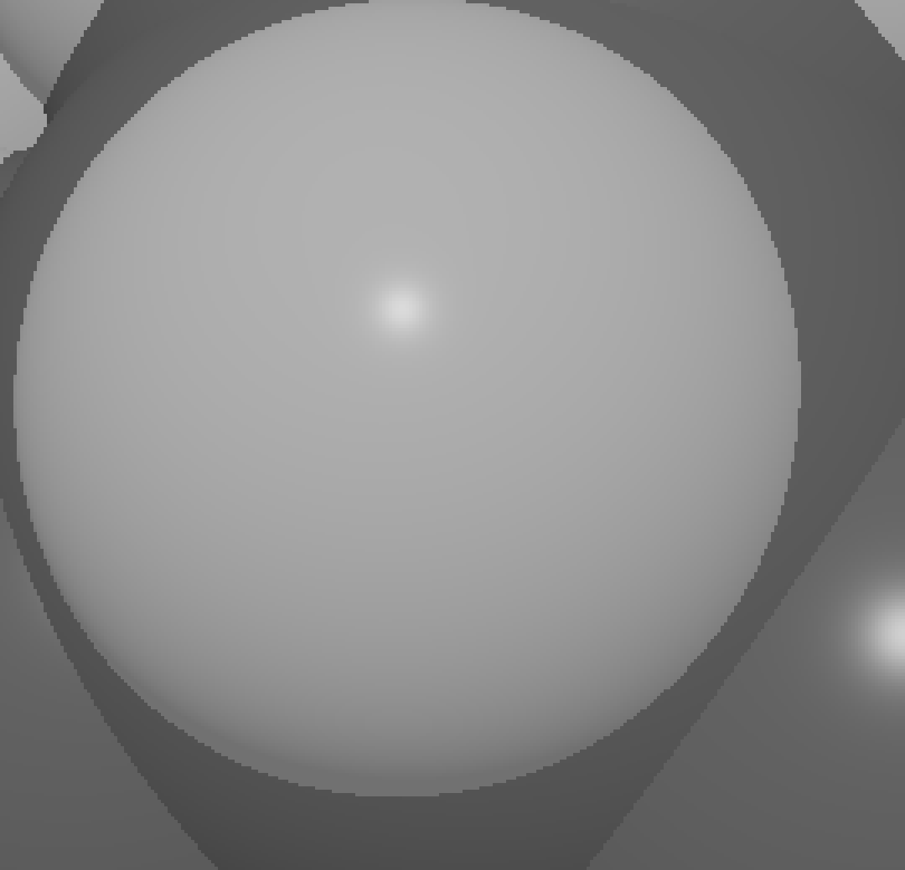 | 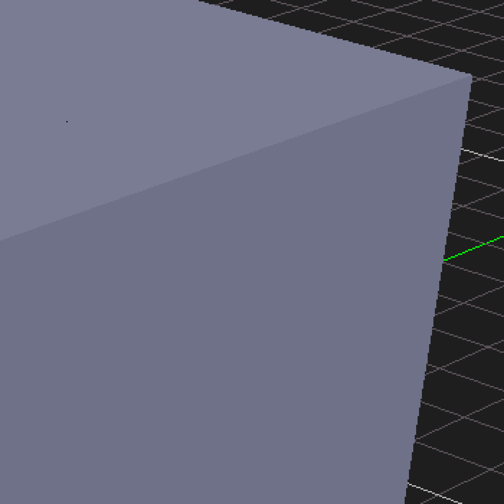 |

Far away it turns into moiré and shimmer, which is worse than jaggies because it moves when the camera moves:

| Ground grid at distance (3× crop) | Space-filling rod, far end (4× crop) | Same rod in orthographic (2× crop) |
|---|---|---|
| 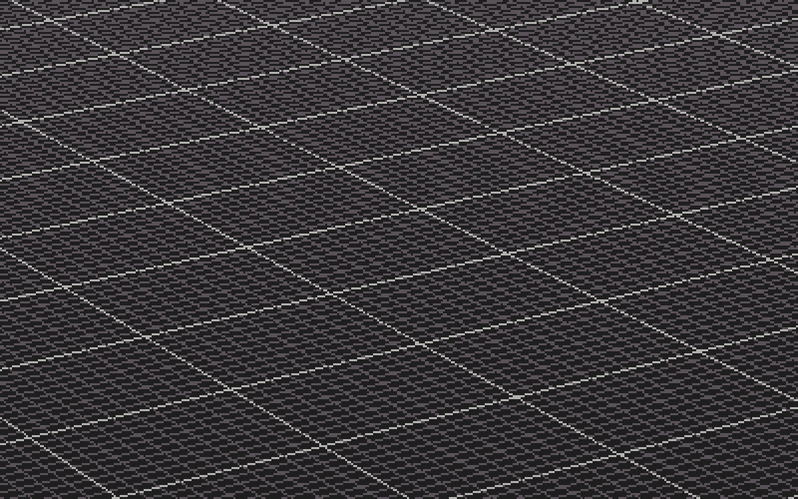 | 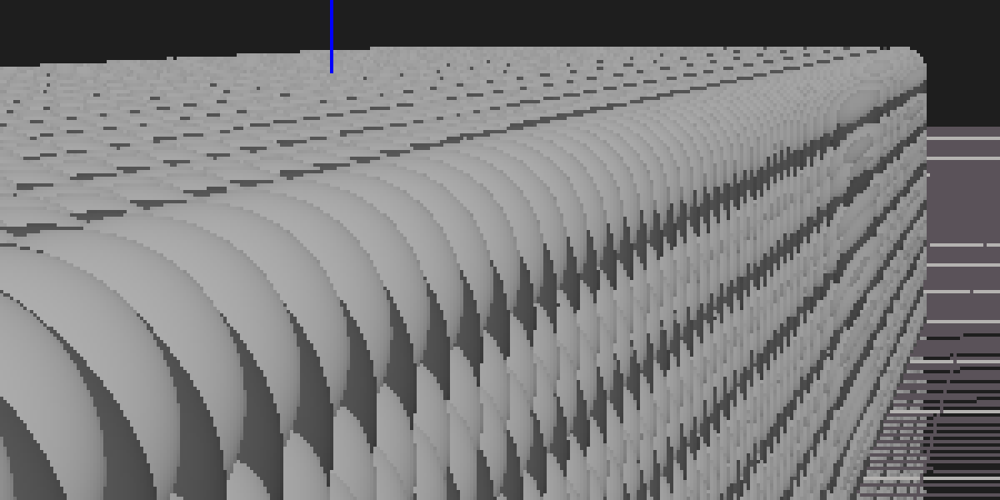 | 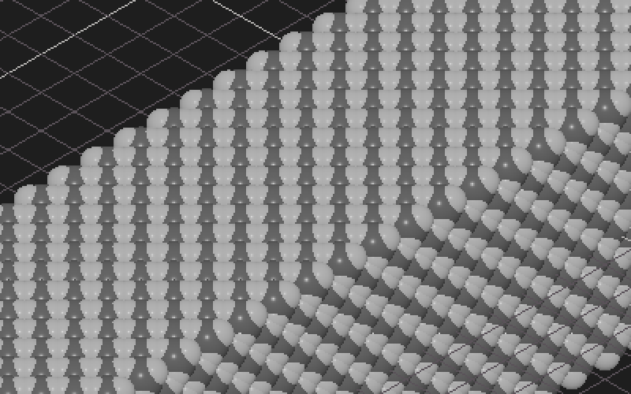 |

**What it is for.** Legibility of dense structures at any zoom, screenshots for papers, slides and investor material, and the mechanosynthesis walkthroughs where the reader has to read small features.

**Important nuance for effort.** The three kinds of edge in the scene need three different answers:

- **Lines** get their best anti-aliasing from the screen-space line pipeline in 2.2, not from MSAA. Once a line is a screen-space quad, its fragment shader knows the exact distance to the line's centre and writes an SDF-style coverage alpha, which gives smooth lines at any width and angle, including the thin grid at grazing angles. MSAA on a hardware 1-pixel line only ever averages up to four samples and still shimmers.
- **Meshes** (CSG solids, isosurfaces, gizmo arrows) are where classic MSAA is the right tool: their edges are real triangle edges, and hardware coverage resolves them cleanly. This is the reason MSAA stays on the list even after lines move to SDF coverage.
- **Impostor silhouettes** are fixed by neither. The sphere edge is produced by `discard` in the fragment shader, and MSAA resolves coverage per primitive, not per fragment. Impostors need one of: analytic coverage at the silhouette written into alpha (with alpha-to-coverage or blending), per-sample shading, a post-process AA, or plain supersampling.

| Capability | Effort | Notes |
|---|---|---|
| MSAA ×4 on all 9 pipelines (multisampled colour and depth, resolve into the readback texture) | 2–3 d | Needed for meshes (CSG, isosurfaces, gizmos). Impostors unchanged at the silhouette. Lines are better served by the SDF-coverage line pipeline in 2.2. Gadget pass needs the same treatment. |
| SDF-coverage anti-aliasing of lines | included in 2.2 | Falls out of the screen-space line pipeline; listed here so the AA picture is complete. |
| Analytic silhouette AA for atom and bond impostors (coverage from the ray–sphere miss distance, blended edge) | 2–3 d | The cheapest good fix for atoms. Interacts with the depth write at the edge; needs the transparent pipelines too. |
| Supersampled screenshots (render at 2×–4×, box downsample before PNG) | 1 d | Pure win for exported images, no runtime cost. Needs only the screenshot API and a CPU or compute downsample. Also removes far-field moiré in stills. |
| Post-process AA (FXAA or SMAA) | 1–2 d on top of the post-process infrastructure in 2.6 | Cheap, helps everything, softens text slightly. |

Recommendation: supersampled screenshots first (one day, immediate payoff for all material that leaves the app), then analytic impostor AA for atoms, screen-space SDF lines for the grid and wireframes (2.2), and MSAA for the meshes in the live view.

### 2.2 Screen-space lines: the grid, axes, wireframes and cages are 1 px, unlit, undashable

Every line primitive is a hardware 1-pixel line. Consequences seen in the captures:

- Grid and axes vanish into a dashed shimmer at grazing angles and at distance (crop of the horizon below).
- Wireframe geometry has no hidden-line distinction and no weight, so a CSG wireframe is an unreadable red tangle.
- Dashed lattice vectors are dashed in Ångström, so the dash pattern changes with zoom.
- There is no way to give a line a colour with alpha, a width, or a per-pixel AA edge.

| Horizon shimmer (2× crop) | CSG wireframe mode (2× crop) |
|---|---|
| 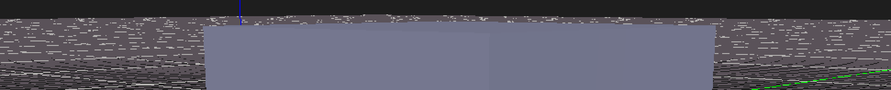 | 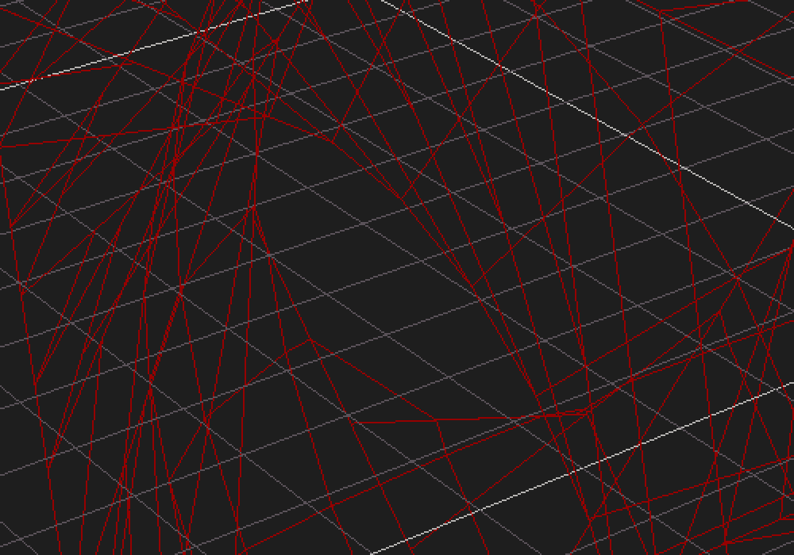 |

**What it is for.** Reading the grid and lattice basis while navigating, the unit-cell box, the tool-envelope cages in mechanosynthesis scenes, blueprint wireframes over atoms, and anything that must survive being scaled down in a document.

| Capability | Effort | Notes |
|---|---|---|
| Screen-space width lines (instanced segment quads expanded in the vertex shader, width in pixels, SDF-antialiased edge, alpha) | 3–5 d | One new pipeline plus converting all producers (grid, axes, drawing-plane grid, unit cell, wireframe, cages, guided-placement rings). |
| Screen-space dashes and stipple | +0.5–1 d | Trivial once distance along the segment is in the fragment shader. |
| Hidden-line wireframe (depth-only mesh prepass so wireframe edges behind faces dim or disappear) | 1 d | The `always_on_top` triangle pipeline variant already exists but is unused. |
| Grid quality: distance fade, major/minor level-of-detail by pixel density, fade near the horizon | 1–2 d | Best done in the line fragment shader once lines are screen-space. Kills the moiré in `c13`. |

### 2.3 Depth perception: no ambient occlusion, no shadows, no fog

Impostor shading is a single headlight plus constant ambient. In a dense lattice every atom is lit the same way, so depth is only conveyed by occlusion and perspective. Crevices between hydrogens are as bright as their tops, and a long rod gives no cue for how far away its far end is.

| Space-filling, no occlusion in crevices (2× crop) | Ball-and-stick, near and far atoms identical (2× crop) | Rod along its axis, no depth cue |
|---|---|---|
| 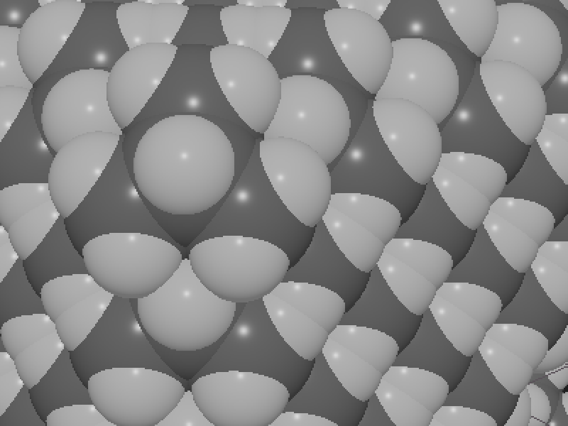 | 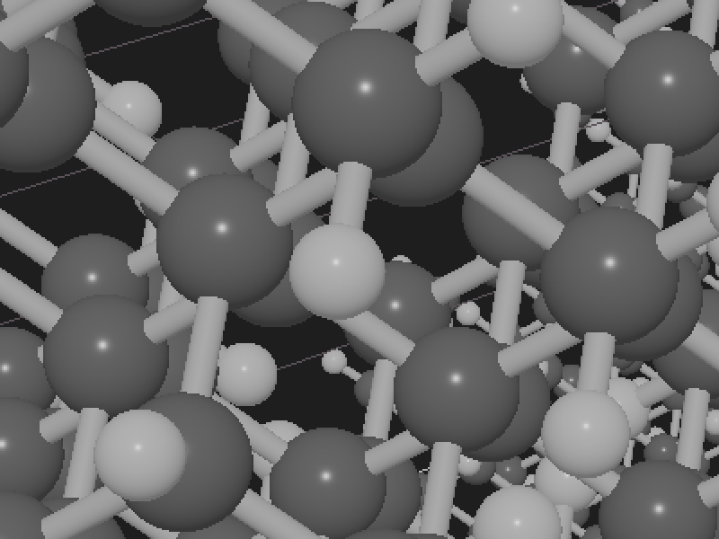 | 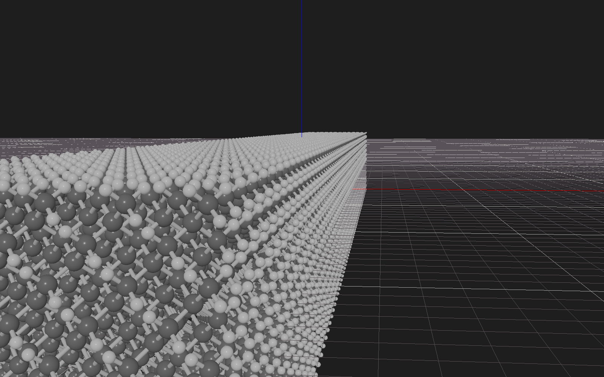 |

**What it is for.** Reading the shape of a surface reconstruction, spotting a vacancy or an adatom on a terrace, telling a tool tip from the workpiece behind it, and every "hero" screenshot. Ambient occlusion is the single change that makes molecular renders look like the ones in publications (QuteMol, VMD's ambient occlusion, Blender molecular renders all rely on it).

| Capability | Effort | Notes |
|---|---|---|
| Depth cue / fog (linear or exponential blend to background by view depth, per-scene toggle) | 0.5–1 d | One uniform, four shaders. Weak but immediate. |
| Per-atom baked occlusion (CPU: neighbour-count or crystal-depth darkening written into the impostor vertex as an ambient factor) | 1–2 d | No G-buffer needed. Gives 70 % of the AO look for lattice-filled crystals. Recomputed when the structure changes, which already happens on retessellation. |
| Screen-space AO (SSAO / HBAO) | 4–6 d | Needs a normal target from the impostors (multi-render-target) plus the post-process infrastructure in 2.6. Correct for arbitrary molecules and isosurfaces, not only crystals. |
| Directional shadow map, single map fitted to the visible scene (see the note below) | 4–6 d | Strong depth cue; in mechanosynthesis scenes a tool's shadow on the surface shows the gap, which nothing else conveys. Requires a key light offset from the view direction. |
| Second "focus" shadow map around the camera target | +1–2 d | Only needed for close-ups on large structures with a deep view. |
| Lighting rig: key + fill + rim, or a hemisphere ambient, exposed in preferences | 1–2 d | Also fixes the flat look of CSG meshes where the front faces of a cube are nearly the same shade (see `01_geo_solid.png`). |

**Which shadow technique.** atomCAD is an easier case than a game: the scene is bounded and its AABB is known, the light direction is ours, and the user is almost always looking at a compact object or a small region of one. So cascaded shadow maps, PCSS, variance or exponential maps are not warranted. The recommendation:

- One directional key light, camera-relative (about 35° above and 30° to the side of the view direction) so the shadowing pattern stays constant while orbiting. The shadow attenuates only the key light's direct term; ambient stays, and probably rises from 0.2 to about 0.3.
- One orthographic map, 2048² (4096² as a preference and for screenshots), fitted per frame to the bounding sphere of frustum ∩ scene AABB. Sphere rather than box so the footprint does not change size under rotation. The depth range comes from the whole scene AABB along the light direction, so off-screen casters still cast. The light-space origin is snapped to texel multiples so shadows do not crawl as the camera moves. With this fit the shadow texel size tracks the screen pixel size for both a water molecule and a whole nanobeam.
- Casters are opaque atom and bond impostors and opaque meshes; ghosts, transparent isosurfaces, lines, labels and gadgets do not cast. The impostor shaders already have an orthographic branch, so the shadow depth pass is that code with the light as the camera and no colour output. Meshes get a depth-only triangle pipeline.
- Normal-offset bias of about one texel plus a small constant; skip the lookup where N·L ≤ 0. Filtering is plain PCF (3×3 or an 8-tap Poisson disk, radius about 1.5 texels) through a hardware comparison sampler. Soft and low-contrast is the target look; sharp shadows on a lattice read as noise.
- The one case a single map fails is a close-up on a large structure with the rest of it receding behind: the fit spans hundreds of Å and the texel becomes a smear on a 100-pixel atom. The fix is a second map fitted to a box around the camera target, sized to the screen's world footprint at the target depth times about 1.5, selected per pixel with a small blend band. This is a two-cascade scheme with an app-informed split and no split-distance heuristics.
- A world-fixed light option would allow caching the wide map across camera moves on million-atom scenes; otherwise the shadow pass re-renders whenever the camera moves, at roughly a third to a half of the main pass cost.

### 2.4 Highlighting: colour is the only emphasis channel, and it does not pop

Atoms can be recoloured, ghosted, restyled and labelled through style rules, and selection/frozen/marked states draw a rim band on the impostor. What is missing is anything that reads as "look here" when the scene is dense: a glow, an outline that survives occlusion, an emissive material, or a screen-space halo.

| Style-rule highlight of six dopants (orange, space-filling, labelled) | Same, close up: the highlight is a flat colour, no glow, ghost lattice draws over it |
|---|---|
| 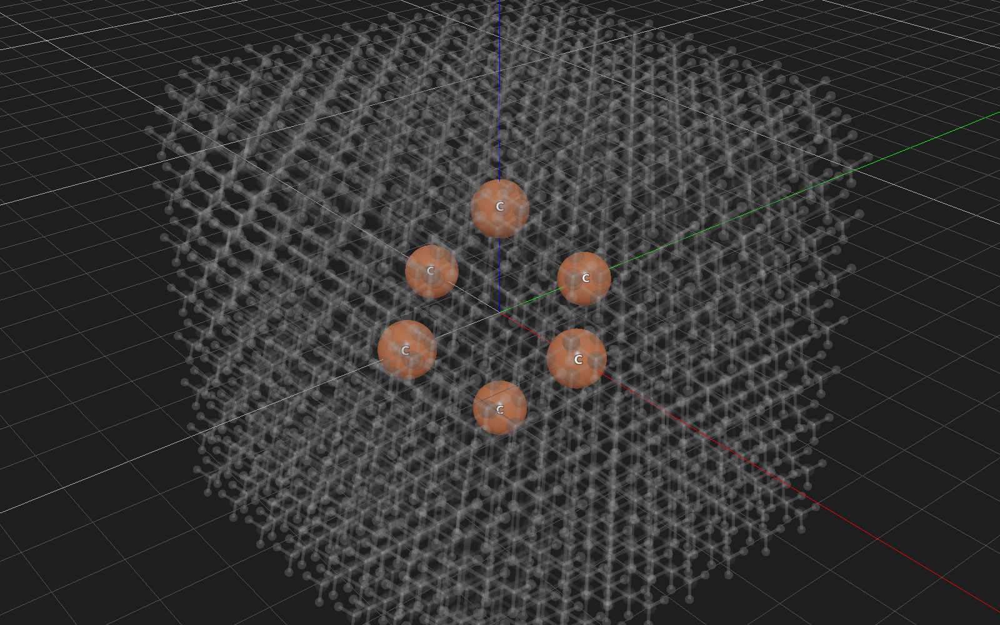 | 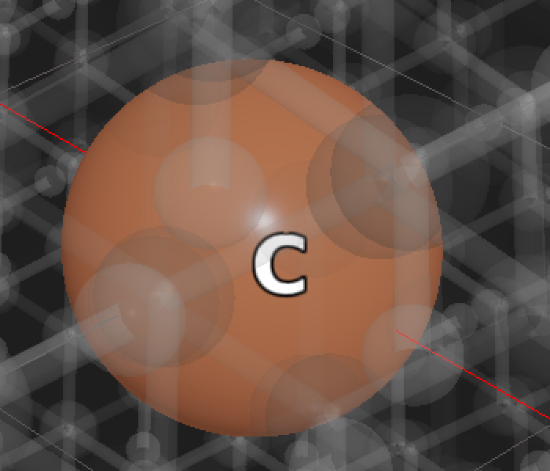 |

| Frozen rim on ball-and-stick: reads as rings | Frozen rim on space-filling: the band covers most of the sphere |
|---|---|
| 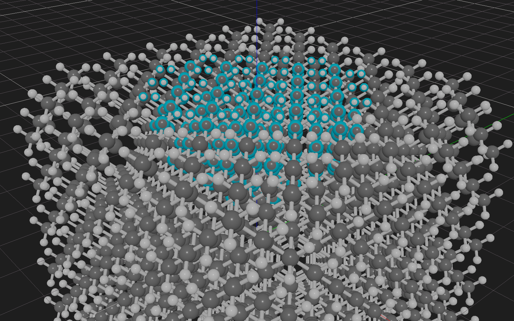 | 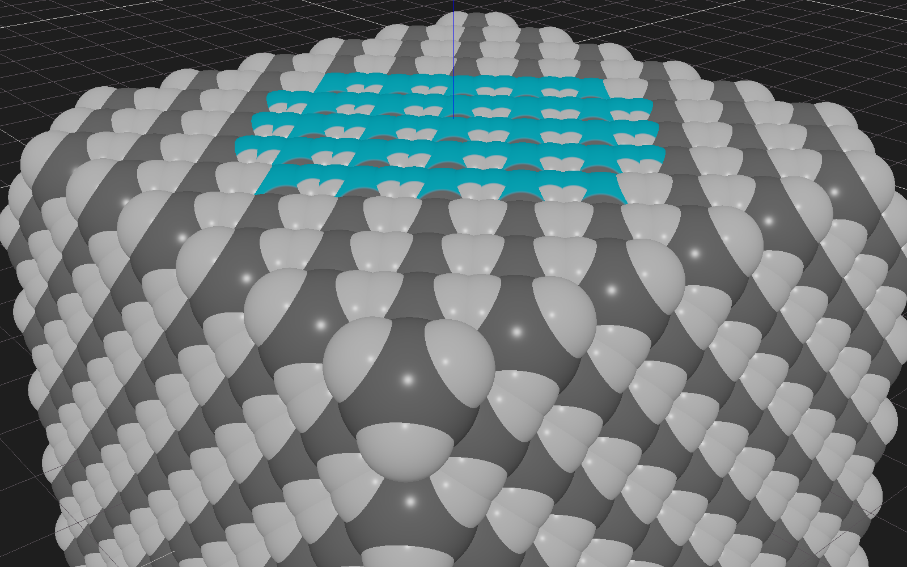 |

**What it is for.** Selection feedback in `atom_edit`, "where is the dopant / T-centre / reaction site" in a 10 000-atom crystal, distinguishing the tool from the workpiece in mechanosynthesis steps, showing a diff (added / removed / moved atoms) without recolouring everything, and marketing renders where a feature must glow.

| Capability | Effort | Notes |
|---|---|---|
| `emissive` style-rule field carried through decorator → vertex → shader, rendered as an additive term (LDR, no bloom) | 2–3 d | Works today without a float target. Emissive atoms stay bright in shadow and fog, which is the point. |
| HDR float colour target + one tone-mapping pass (remove the 4 inline copies) | 1–2 d on top of 2.6 | Prerequisite for real glow. Also gives proper sRGB output. |
| Bloom (threshold, mip-chain blur, composite) | 2–3 d on top of HDR | Turns emissive into a glow. Should be a preference; it is a presentation feature, not an editing one. |
| Screen-space selection outline (edge detect on an id or depth+normal target, constant pixel width, visible through occluders as a dimmed line) | 3–5 d | Needs an id target from the impostor pass, which is also the first step towards GPU picking. Replaces the rim band as the selection cue. |
| Rim band tuning (width in screen space instead of NdotV, so it does not swallow a space-filling sphere) | 0.5 d | Cheap fix for the `71` capture. |
| Diff visualisation styles (added / removed / moved as distinct shading, not only colour) | 1–2 d | Depends on emissive or outline. |

### 2.5 Labels: world-space size only, one colour, no decluttering

Labels are readable up close and become an illegible smear at distance; overlapping labels blend in draw order; there is no per-label colour and no way to say "only label what is bigger than N pixels".

| Every atom labelled, close | Same scene, far (3× crop) |
|---|---|
| 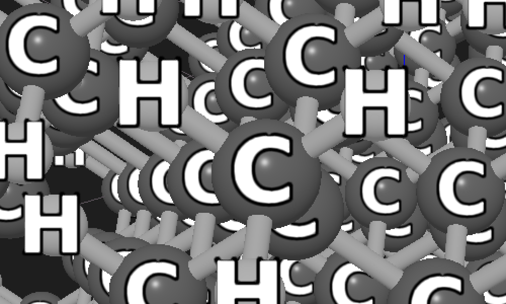 | 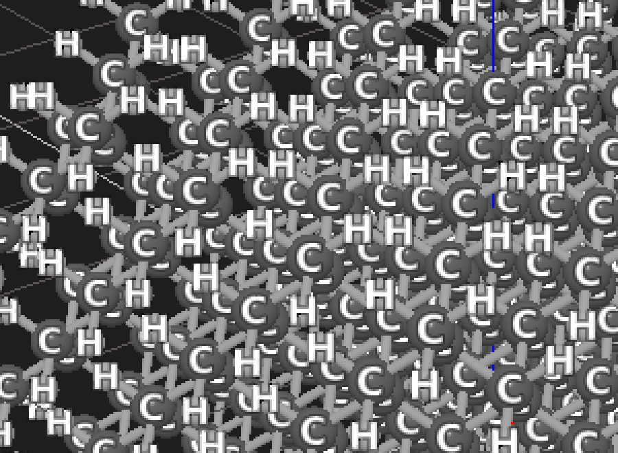 |

**What it is for.** Annotating a handful of atoms in a walkthrough (step numbers, site names), element labels on a small molecule, tag names for the ops libraries, figures for the reference guide.

| Capability | Effort | Notes |
|---|---|---|
| Per-label colour (add a colour attribute to the label vertex and a `label_color` style field) | 1 d | Already noted as planned in the label mesh. |
| Screen-space (constant pixel) size as an alternative to world-space size | 1 d | Same billboard basis, different scale source. |
| Declutter: skip labels whose projected size is below a pixel threshold; optional fade over a range | 1 d | Fixes the far-field smear. |
| Occlusion-aware labels (draw dimmed when the atom is behind something, instead of hidden) | 1–2 d | Needs a second depth-compare draw. |
| Non-ASCII glyphs (subscripts, Greek letters) | 1–2 d | Atlas regeneration plus glyph lookup. Currently draws `?`. |

### 2.6 Post-processing infrastructure: the enabling step for half of this list

There is no fullscreen pass at all. HDR tone mapping, bloom, FXAA, SSAO, outlines and depth-of-field all need "render to an intermediate, then run one or more fullscreen shaders, then write the readback texture". This is a one-time investment.

| Capability | Effort | Notes |
|---|---|---|
| Post-process chain: intermediate colour (and optionally normal/id) targets, a fullscreen-triangle pass helper, final blit into the BGRA readback texture | 1–2 d | After this, each effect above is its own small shader. |
| sRGB-correct output (render linear into an sRGB view, drop the manual `pow`) | 0.5 d | Fold into the above. |
| Reversed-Z and a fix for the GL-convention projection matrix on a 0..1 clip API | 0.5 d | Worth verifying: with `perspective_rh_gl` the effective near plane is roughly twice the configured 1.5 Å, and depth precision is spent on the wrong half of the range. Matters when zooming into a single bond with a 2400 Å far plane. |

### 2.7 Geometry (CSG mesh) presentation

The solid CSG view is a flat grey with no edges, so a cube's faces barely separate and the boundary of a hole is hard to read. Wireframe mode has no hidden-line logic. Circles are tessellated coarsely. Surface splatting draws sparse little cuboids with gaps between them.

| Solid: no edges, faces almost the same shade | Circle tessellation (3× crop) | Surface splatting (2× crop) |
|---|---|---|
| 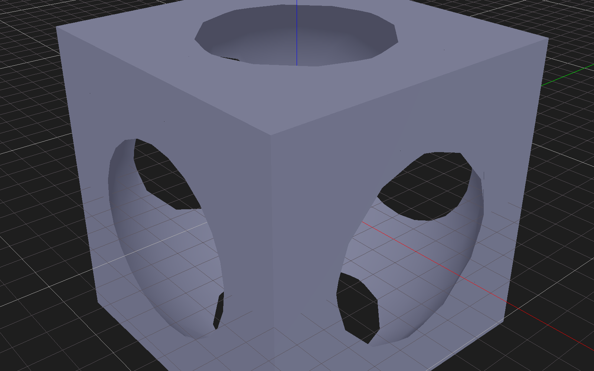 | 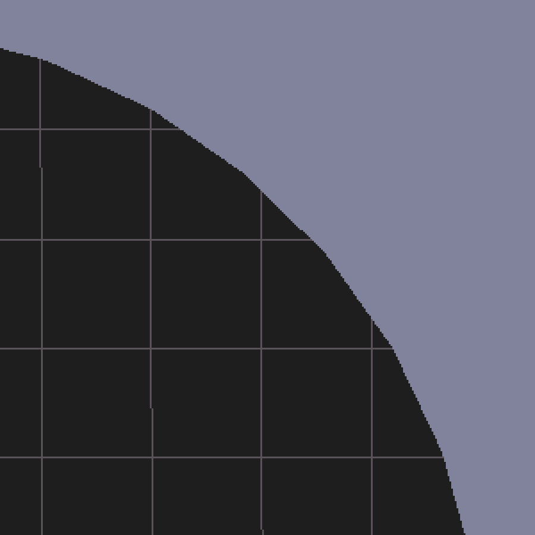 | 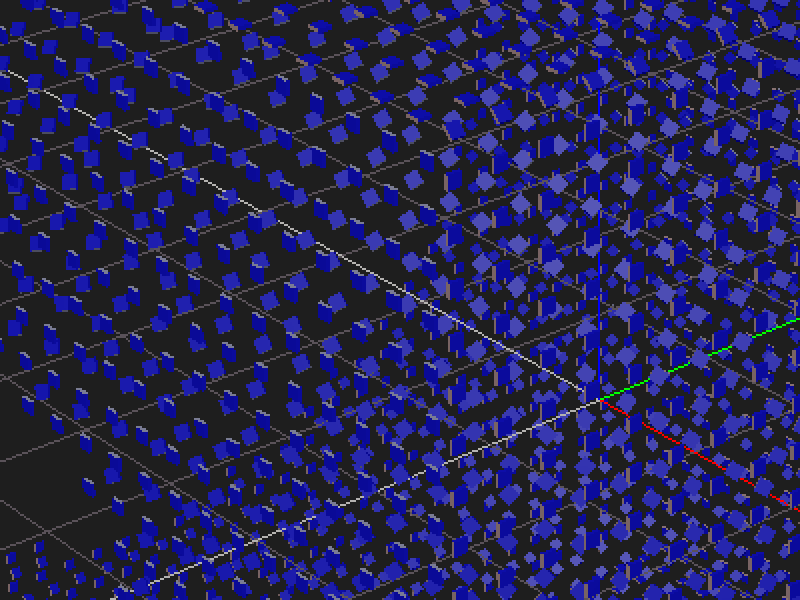 |

**What it is for.** Blueprint editing: seeing where the cut is going before materialising, checking a 2D sketch on the drawing plane, communicating a design intent in the reference guide.

| Capability | Effort | Notes |
|---|---|---|
| Feature-edge overlay on solid geometry (solid + edges where faces are not coplanar) | 0.5–1 d | The coplanar-edge filter already exists for wireframe mode; this is a combined mode plus a darker edge colour. Much better with 2.2 lines. |
| Hemisphere or three-light shading for meshes | included in 2.3 lighting rig | |
| Circle / sphere tessellation density from screen size or a preference | 0.5 d | |
| Surface splats as blended oriented discs (point-sprite impostors) instead of cuboids | 2–3 d | Gives a continuous surface preview. |
| Outline of the 2D sketch on the drawing plane | 0.5 d with 2.2 lines | Currently the filled polygon has no edge. |

### 2.8 Transparency

Ghosting through `xray` and style rules works and is sorted, but overlapping ghost layers show per-sphere seams and a deep ghosted block turns into fog. Isosurfaces intersecting each other or the atoms show the usual sorted-blending artefacts. This is a known and documented limitation.

| Ghosted block, space-filling | Isosurface over the molecule (2× crop) |
|---|---|
| 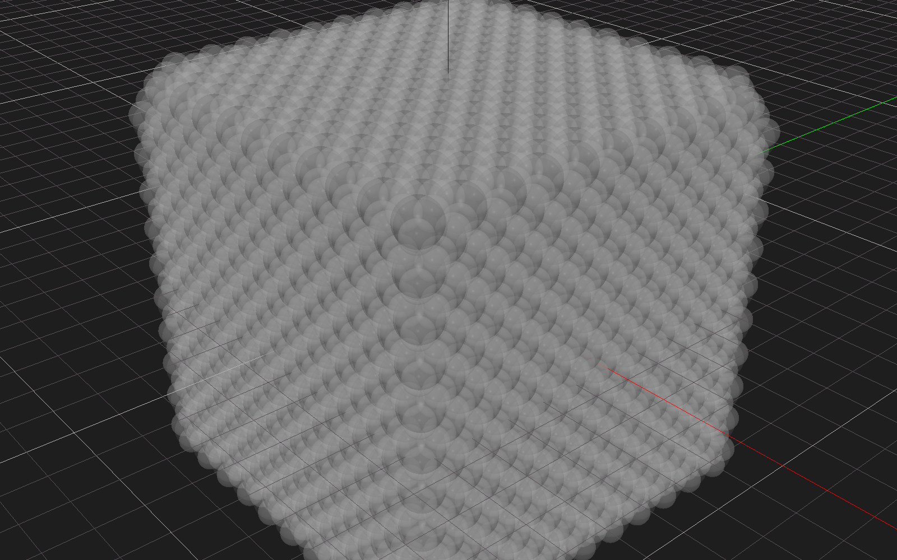 | 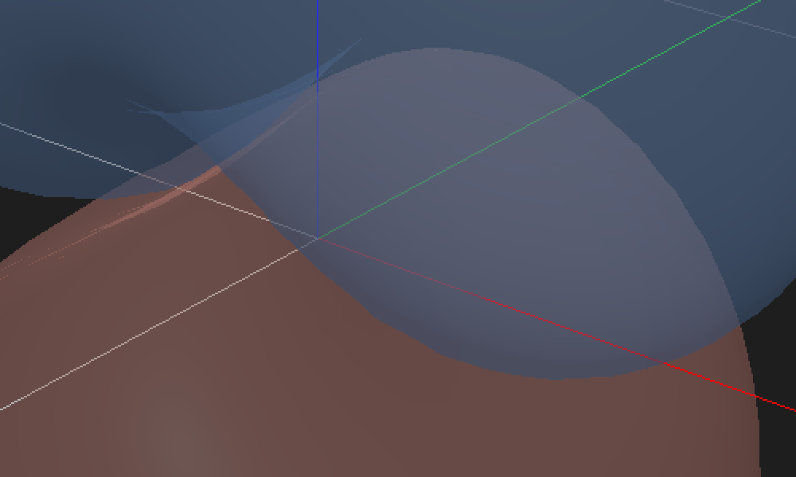 |

| Capability | Effort | Notes |
|---|---|---|
| Weighted-blended OIT for impostors and isosurfaces | 2–3 d | Removes the seams and the sort. Approximate but robust; cheap. |
| Depth peeling (2–4 layers) | 3–5 d | Exact, more expensive. Probably not needed for this app. |
| Fresnel rim on isosurfaces (brighter at grazing angles) | 0.5 d | Makes orbital lobes read as volumes. |

### 2.9 Grid and axes intersect the model

Not a bug, but worth a line: the ground grid is drawn at z = 0 and the model usually straddles it, so the near half of the grid is drawn over the front faces of the model, which is confusing at first sight (see `20_depth_grid_vs_geometry.png` and `21_depth_grid_vs_atoms_cpk.png`). I verified pixel-exactly that the grid respects depth; it really is in front. Options: draw the grid with alpha and fade it inside the model's bounding box, or offer "grid below model" placement. About 0.5–1 d with screen-space lines.

### 2.10 HiDPI

The 3D texture is allocated at logical-pixel size and upscaled by Flutter on high-DPI displays, so on a 200 % laptop panel the viewport is effectively rendered at half resolution and then blurred. Fix: multiply the viewport size by the device pixel ratio and keep the pick-ray construction in logical coordinates. 0.5–1 d. This compounds with the missing AA: on such displays the user sees both the jaggies and a blur.

## 3. Priority view by purpose

If the question is "which of these first", grouped by who benefits:

**Everyday editing (the maintainer, the sims team using the ops libraries):**
1. Analytic impostor silhouette AA + MSAA for lines (2.1)
2. Per-atom baked occlusion + depth cue (2.3)
3. Screen-space lines with grid level-of-detail (2.2)
4. Emissive style field, rim-band fix (2.4)
5. HiDPI (2.10)

**Screenshots and documentation (reference guide, walkthroughs, investor material):**
1. Supersampled screenshots (2.1) — one day, immediate
2. Post-process chain + HDR + tone map (2.6)
3. SSAO or shadows (2.3)
4. Bloom on emissive (2.4)
5. Label colour, size and declutter (2.5)

**Large-structure navigation (million-atom nanobeam, long trajectories):**
1. Grid level-of-detail and far-field AA (2.1, 2.2)
2. Fog (2.3)
3. Screen-space selection outline (2.4)

## 4. Rough totals

| Bundle | Effort |
|---|---|
| "Crisp": supersampled screenshots, impostor AA, MSAA, HiDPI | 6–8 d |
| "Depth": fog, baked AO, lighting rig | 3–5 d |
| "Lines": screen-space lines, dashes, grid LOD, hidden-line, feature edges | 6–9 d |
| "Glow": post-process chain, HDR, emissive, bloom, sRGB | 6–10 d |
| "Highlight": id target, screen-space outline, diff styles | 5–8 d |
| "Labels": colour, pixel size, declutter, occlusion | 4–6 d |
| "Full AO and shadows" (on top of Glow; includes the focus shadow map) | 9–14 d |

Everything above is independent of the node-network and evaluation layers; nothing here touches the language layer.

## 5. Things I could not capture and would like from the GUI

The CLI cannot select, hover or drag, so these were not photographed. Two or three screenshots would complete the picture for the highlight section:

1. `atom_edit` with several atoms **selected** (orange rim) on a dense ball-and-stick structure, and the same with space-filling.
2. The **translate/rotate gizmo** on a selection, at a zoom where the arrows are small on screen, and at a zoom where they are large.
3. A **guided-placement** wireframe sphere or ring, if convenient.

## Appendix: scene inventory

| File | Scene |
|---|---|
| `01`–`07` | CSG cube minus sphere minus bar: solid, wireframe, splatting, close-up, white background; 2D rect minus circle, top and oblique |
| `10`–`16` | Same CSG materialised (6356 atoms), ball-and-stick and space-filling at three distances |
| `20`–`24` | Controlled grid-vs-model depth test, cube and atoms, three resolutions |
| `30`–`32` | `xray` ghosting, uniform and with `fade_depth` |
| `40` | Isosurface of the water ESP sample with the molecule |
| `50`–`53` | `apply_style`: faded lattice with six highlighted, labelled, space-filled dopants; all-atom labels near and far |
| `60`–`62` | 80-cell rod (33 445 atoms) along its axis, perspective and orthographic |
| `70`–`72` | `freeze` rim highlight; `atom_edit` diff with anchor arrows |
