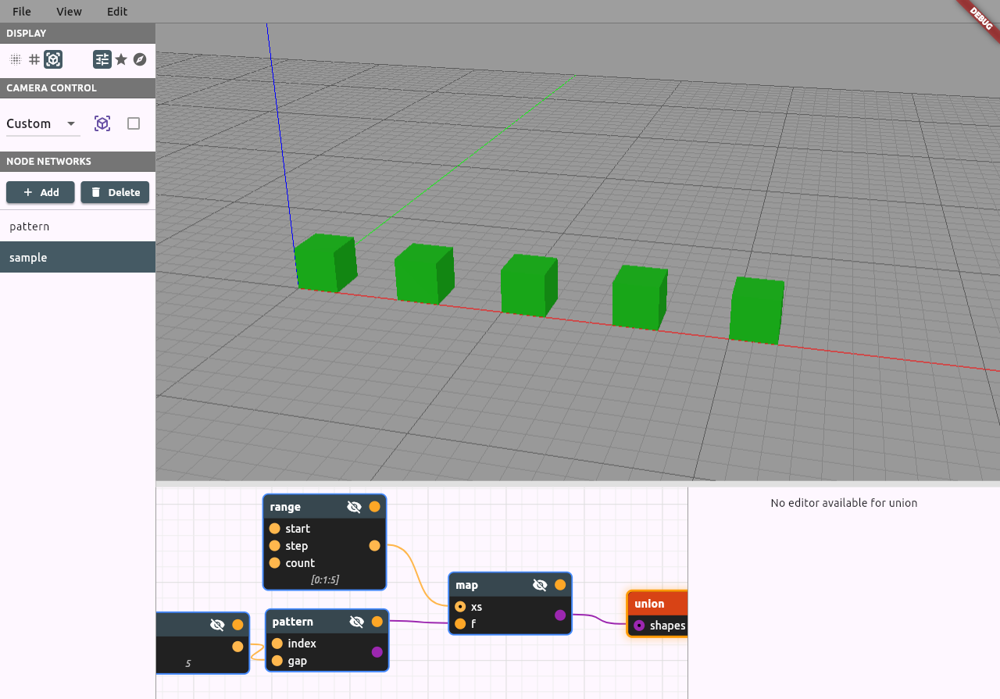
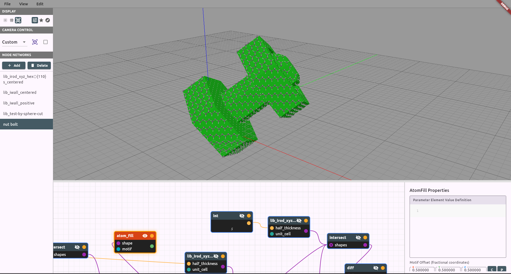
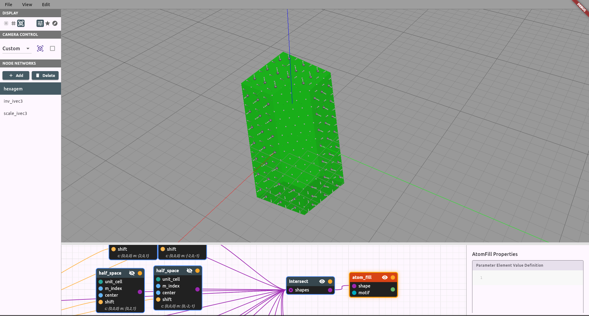
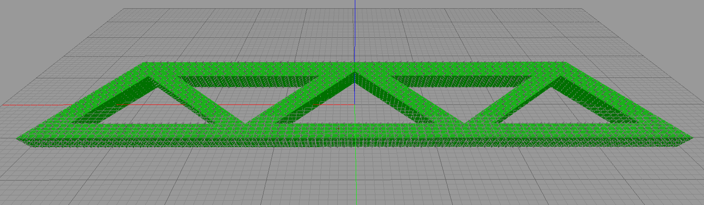
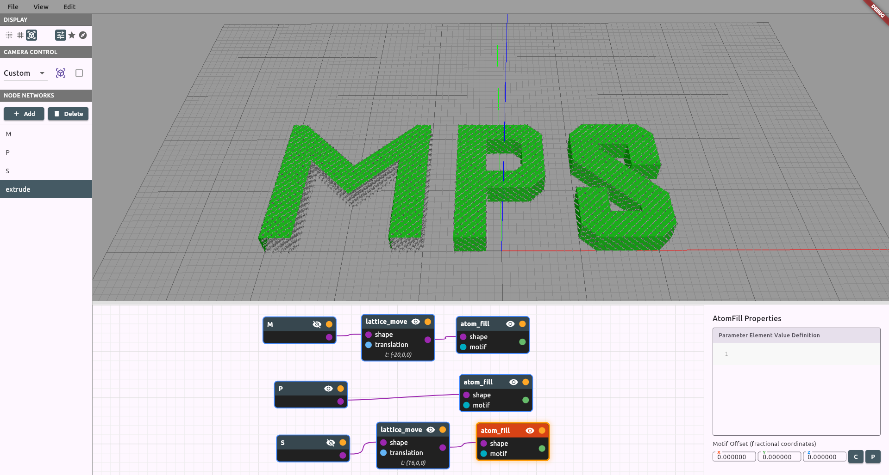
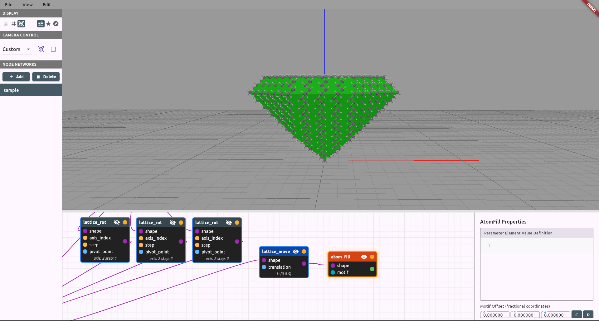
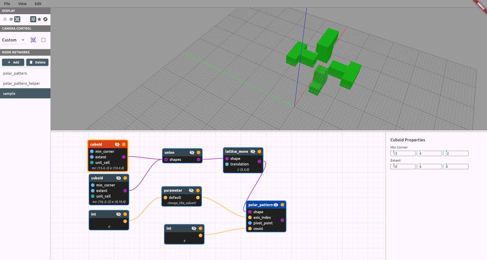
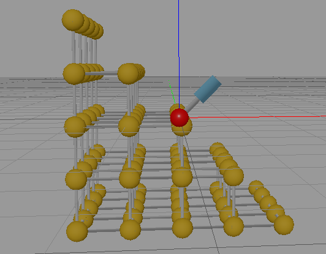
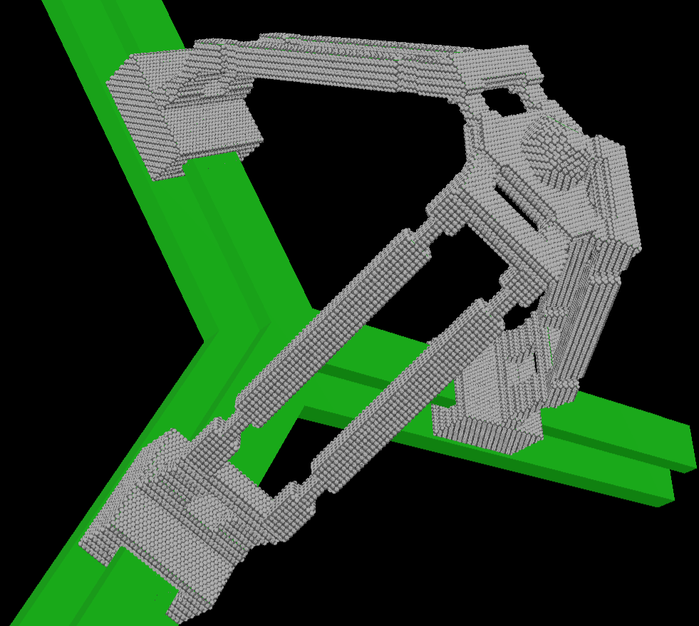
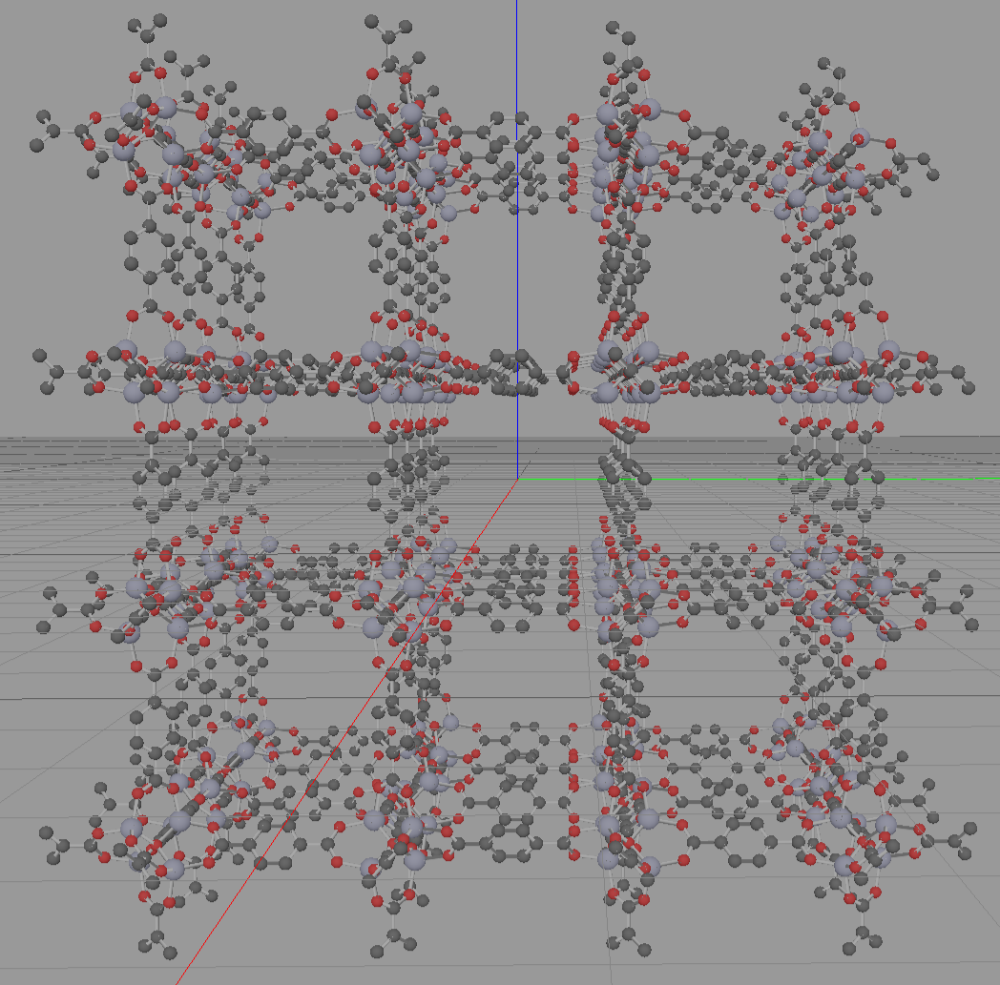

# Demo Descriptions

## Pattern

**file:** [pattern.cnnd](pattern.cnnd)\
**node network:** sample\
example of a how to make parametric pattern using map

## Nut-Bolt

**file:** [nut-bolt.cnnd](nut-bolt.cnnd)\
**node network:** nut bolt\
example part consisting of a nut and bolt like structure aligned with <111>. Includes demonstration of some library functions

## Hexagem

**file:** [hexagem.cnnd](hexagem.cnnd)\
**node network:** hexagem\
example part consisting of a gem like structure aligned with <111>. Includes examples("inv_ivec3" and "scale_ivec3") of how one can define reusable expression as node networks

## Truss

**file:** [truss-011.cnnd](truss-011.cnnd)\
**node network:** sample\
example of a truss structure that is aligned with <011>

## 2D Extrusion Demo

**file:** [extrude-demo.cnnd](extrude-demo.cnnd)\
**node network:** Demo_Extrusion\
example of using polygons to make letters, extruding these polygons to make 3d geometry, and moving the geometry around to spell "MPS"

## Diamond

**file:** [diamond.cnnd](diamond.cnnd)\
**node network:** sample\
example of a "diamond-like" shape made of diamond

## Rotation Demo

**file:** [rotation-demo.cnnd](rotation-demo.cnnd)\
**node network:** sample\
Demonstrates how to make a repeating rotary pattern and the different axes available for rotation in atomCAD. Change the value of the integer connected to the parameter "change_this_value" to change the axis of rotation.

## Miller Index and Half Space Demo
\
**file:** [half-space-and-miller-index-demo.cnnd](half-space-and-miller-index-demo.cnnd)\
**node network:** half_space_demo\
Educational example to help build intuition on how Miller Indices work. Contains a half space that slices a cuboid made of the alpha form of polonium. This is the only known material that has a single element primitive cubic lattice.(We do not recommend building structures from polonium). Try changing the x,y, and z values of the ivec3 connected to the parameter "change_this." This file also contains other education node networks "monoclinic_demo" and "half_lattice_spacing." The node network "monoclinic_demo" demonstrates how using a monoclinic unit cell deforms geometry. The node network "half_lattice_spacing" demonstrates how to place half spaces at fractional distances. 

## Rutile Motif
\
**file:** [rutile-motif.cnnd](rutile-motif.cnnd)\
**node network:** sample\
Example of how to make and use a motif to make a custom crystal structure. In this example the crystal structure of the TiO2 mineral rutile is modeled.

## Flexure Delta Robot 

**file:** [flexure-delta-robot.cnnd](flexure-delta-robot.cnnd)\
**node network:** flexure-delta-robot\
Example of a complicated part made using atomCAD. A delta robot is a type of parallel robot that can be used for XYZ positioning. This design has been modified from the classical delta robot in that linear actuators are intended to be used rather than rotary actuators and flexure joints are used rather than ball and revolute joints. This allows the entire structure to be made from unstrained diamond. Provided as an example part only, may not function as intended. Actuators are not included in the model at present. Running

## MOF-5 Motif

**file:** [MOF5-motif.cnnd](MOF5-motif.cnnd)\
**node network:** sample\
Example of a complicated motif. Shows how a partial crystal of the Metal Organic Framework(MOF) MOF-5 can be made using atomCAD. Depth culling needs to be set to 0.0 to properly visualize the structure. 